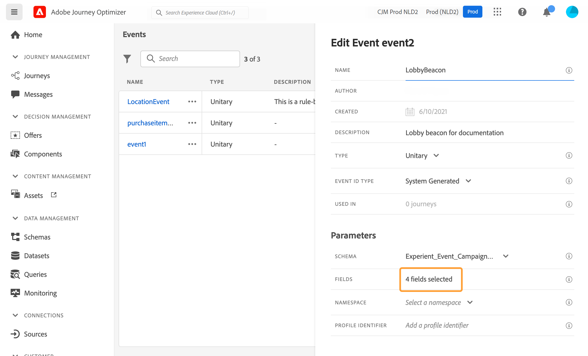
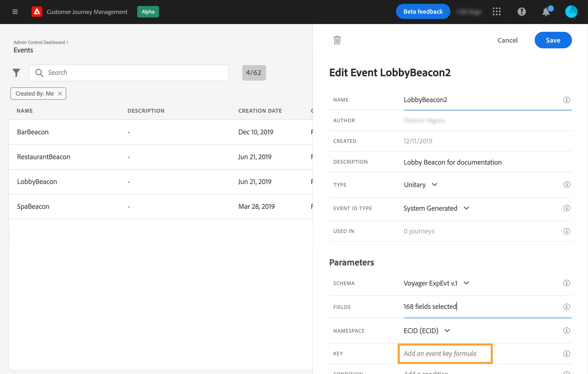

# Configuración de un evento unitario {#configure-an-event}

Los eventos unitarios están vinculados a un perfil específico. Pueden basarse en reglas o generarse en el sistema.  Lea más sobre el evento unitario [esta sección](../event/about-events.md).

Estos son los primeros pasos para configurar un nuevo evento:

1. En la sección del menú ADMINISTRACIÓN, seleccione **[!UICONTROL Configurations]**. En la sección **[!UICONTROL Events]**, haga clic en **[!UICONTROL Manage]**. Se muestra la lista de eventos.

   

1. Haga clic en **[!UICONTROL Create Event]** para crear un nuevo evento. El panel de configuración de evento se abre en el lado derecho de la pantalla.

   

1. Introduzca el nombre del evento. También puede agregar una descripción.

   

   >[!NOTE]
   >
   >No utilice espacios ni caracteres especiales. No utilice más de 30 caracteres.

1. En el campo **[!UICONTROL Type]**, elija **Unitary**.

   

1. En el campo **[!UICONTROL Event ID type]**, seleccione el tipo de ID de evento que desee utilizar: **Basado en reglas** o **Sistema generado**. Obtenga más información sobre los tipos de ID de evento en [esta sección](../event/about-events.md#event-id-type).

   

1. El número de recorridos que utiliza este evento se muestra en el campo **[!UICONTROL Used in]**. Puede hacer clic en el icono **[!UICONTROL View journeys]** para mostrar la lista de los recorridos con este evento.

1. Defina los campos esquema y carga útil: aquí es donde selecciona la información de evento (generalmente denominada carga útil) que los recorridos esperan recibir. Podrá utilizar esta información en su recorrido. Consulte [esta sección](../event/about-creating.md#define-the-payload-fields).

   

   >[!NOTE]
   >
   >Al seleccionar el tipo **[!UICONTROL System Generated]** , solo están disponibles los esquemas que tienen el campo eventID . Al seleccionar el tipo **[!UICONTROL Rule Based]**, están disponibles todos los esquemas de eventos de experiencia.

1. Para eventos basados en reglas, haga clic dentro del campo **[!UICONTROL Event ID condition]**. Con el editor de expresiones simple, defina la condición que utilizará el sistema para identificar los eventos que van a almacenar en déclencheur el recorrido.
   

   En nuestro ejemplo, escribimos una condición basada en la ciudad del perfil. Esto significa que, cada vez que el sistema recibe un evento que coincide con esta condición (campo **[!UICONTROL City]** y valor **[!UICONTROL Paris]**), lo pasa a recorrido.

   >[!NOTE]
   >
   >El editor de expresiones avanzadas no está disponible al definir **[!UICONTROL Event ID condition]**.

1. Añada un área de nombres. Este paso es opcional, pero se recomienda, ya que la adición de un área de nombres le permite aprovechar la información almacenada en el servicio de Perfil del cliente en tiempo real. Define el tipo de clave que tiene el evento. Consulte [esta sección](../event/about-creating.md#select-the-namespace).
1. Defina el identificador de perfil: elija un campo de los campos de carga útil o defina una fórmula para identificar la persona asociada al evento. Esta clave se configura automáticamente (pero aún puede editarse) si selecciona un Área de nombres. De hecho, recorrido selecciona la clave que debe corresponder al área de nombres (por ejemplo, si selecciona un área de nombres de correo electrónico, se seleccionará la clave de correo electrónico). Consulte [esta sección](../event/about-creating.md#define-the-event-key).

   

1. Para los eventos generados por el sistema, puede agregar una condición. Este paso es opcional. Esto permite al sistema procesar únicamente los eventos que cumplen la condición. La condición solo puede basarse en la información contenida en el evento. Consulte [esta sección](../event/about-creating.md#add-a-condition).
1. Haga clic en **[!UICONTROL Save]**.

   El evento está ahora configurado y listo para añadirse a un recorrido. Se requieren pasos de configuración adicionales para recibir eventos. Consulte [esta página](../event/additional-steps-to-send-events-to-journey-orchestration.md).

## Definición de los campos de carga útil {#define-the-payload-fields}

La definición de carga útil permite elegir la información que el sistema espera recibir del evento en el recorrido y la clave para identificar qué persona está asociada al evento. La carga útil se basa en la definición del campo XDM del Experience Cloud. Para obtener más información sobre XDM, consulte [Documentación de Adobe Experience Platform](https://experienceleague.adobe.com/docs/experience-platform/xdm/home.html?lang=es){target=&quot;_blank&quot;}.

1. Seleccione un esquema XDM de la lista y haga clic en el campo **[!UICONTROL Fields]** o en el icono **[!UICONTROL Edit]**.

   

   Se muestran todos los campos definidos en el esquema . La lista de campos varía de un esquema a otro. Puede buscar un campo específico o utilizar los filtros para mostrar todos los nodos y campos o solo los campos seleccionados. Según la definición del esquema, algunos campos pueden ser obligatorios y estar preseleccionados. No puede desseleccionarlos. Todos los campos obligatorios para que los recorridos reciban el evento correctamente están seleccionados de forma predeterminada.

   >[!NOTE]
   >
   >En el caso de eventos generados por el sistema, asegúrese de que ha añadido el grupo de campos &quot;orquestación&quot; al esquema XDM. Esto garantizará que el esquema contenga toda la información necesaria para trabajar con [!DNL Journey Optimizer].

   

1. Seleccione los campos que espera recibir del evento. Estos son los campos que el usuario empresarial aprovechará en el recorrido. También deben incluir la clave que se utilizará para identificar a la persona asociada al evento (consulte [esta sección](../event/about-creating.md#define-the-event-key)).

   >[!NOTE]
   >
   >Para los eventos generados por el sistema, el campo **[!UICONTROL eventID]** se añade automáticamente en la lista de campos seleccionados para que [!DNL Journey Optimizer] pueda identificar el evento. El sistema que impulsa el evento no debe generar un ID, debe utilizar el disponible en la previsualización de carga útil. Consulte [esta sección](../event/about-creating.md#preview-the-payload).

1. Cuando haya terminado de seleccionar los campos necesarios, haga clic en **[!UICONTROL Ok]** o presione **[!UICONTROL Enter]**.

   El número de campos seleccionados aparece en el campo **[!UICONTROL Fields]**.

   

## Seleccione el área de nombres {#select-the-namespace}

El espacio de nombres permite definir el tipo de clave utilizada para identificar a la persona asociada al evento. Su configuración es opcional. Es necesario si desea recuperar, en sus recorridos, información adicional proveniente del [Perfil del cliente en tiempo real](https://experienceleague.adobe.com/docs/experience-platform/profile/home.html){target=&quot;_blank&quot;}. La definición del área de nombres no es necesaria si solo utiliza datos procedentes de un sistema de terceros a través de una fuente de datos personalizada.

Puede utilizar uno de los predefinidos o crear uno nuevo mediante el servicio Área de nombres de identidad . Consulte la [documentación de Adobe Experience Platform](https://experienceleague.adobe.com/docs/experience-platform/identity/home.html){target=&quot;_blank&quot;}.

Si selecciona un esquema que tiene una identidad principal, los campos **[!UICONTROL Profiler identifier]** y **[!UICONTROL Namespace]** se rellenan previamente. Si no hay ninguna identidad definida, seleccione _identityMap > id_ como clave principal. A continuación, debe seleccionar un área de nombres y la clave se rellenará previamente (debajo del campo **[!UICONTROL Namespace]**) mediante _identityMap > id_.

Al seleccionar campos, los campos de identidad principales se etiquetan.

Seleccione un área de nombres en la lista desplegable.

Solo se permite un espacio de nombres por recorrido. Si utiliza varios eventos en el mismo recorrido, deben utilizar el mismo espacio de nombres. Consulte [esta página](../building-journeys/journey.md).

## Definición del identificador de perfil {#define-the-event-key}

La clave es el campo o la combinación de campos que forma parte de los datos de carga útil del evento y que permite al sistema identificar a la persona asociada al evento. La clave puede ser, por ejemplo, el ID de Experience Cloud, un ID de CRM o una dirección de correo electrónico.

Si planea aprovechar los datos almacenados en la base de datos del perfil del cliente en tiempo real, debe seleccionar, como clave de evento, información que haya definido como la identidad de un perfil en el [Servicio de perfil del cliente en tiempo real](https://experienceleague.adobe.com/docs/experience-platform/profile/home.html){target=&quot;_blank&quot;}.

Permitirá que el sistema realice la reconciliación entre el evento y el perfil del individuo. Si selecciona un esquema que tiene una identidad principal, los campos **[!UICONTROL Profile identifier]** y **[!UICONTROL Namespace]** se rellenan previamente. Si no hay ninguna identidad definida, seleccione _identityMap > id_ como clave principal. A continuación, debe seleccionar un área de nombres y la clave se rellenará previamente (debajo del campo **[!UICONTROL Namespace]**) mediante _identityMap > id_.

Al seleccionar campos, los campos de identidad principales se etiquetan.

Si necesita utilizar una clave diferente, como un ID de CRM o una dirección de correo electrónico, debe agregarla manualmente:

1. Haga clic dentro del campo **[!UICONTROL Profile identifier]** o en el icono de lápiz.

   

1. Seleccione el campo elegido como clave en la lista de campos de carga útil. También puede cambiar al editor de expresiones avanzadas para crear claves más complejas (por ejemplo, una concatenación de dos campos de los eventos). Consulte a continuación, en esta sección.

   

Cuando se recibe el evento, el valor de la clave permite que el sistema identifique a la persona asociada al evento. Asociada a un área de nombres (consulte [esta sección](../event/about-creating.md#select-the-namespace)), la clave se puede utilizar para realizar consultas en Adobe Experience Platform. Consulte [esta página](../building-journeys/about-journey-activities.md#orchestration-activities).
La clave también se utiliza para comprobar que una persona está en un recorrido. De hecho, una persona no puede estar en dos lugares diferentes en el mismo recorrido. Como resultado, el sistema no permite que la misma clave, por ejemplo la clave CRMID=3224, esté en diferentes lugares en el mismo recorrido.

También tiene acceso a las funciones de expresión avanzadas (**[!UICONTROL Advanced mode]**) si desea realizar manipulaciones adicionales. Estas funciones permiten manipular los valores utilizados para realizar consultas específicas, como cambiar formatos, realizar concatenaciones de campos, teniendo en cuenta solo una parte de un campo (por ejemplo, los 10 primeros caracteres). Consulte [documentación del Journey Orchestration](https://experienceleague.adobe.com/docs/journeys/using/building-advanced-conditions-journeys/expressionadvanced.html?lang=es){target=&quot;_blank&quot;}.

## Añada una condición {#add-a-condition}

La condición solo está disponible para eventos generados por el sistema. Puede definir una condición de evento que permita al sistema filtrar el procesamiento de eventos. Si la condición es verdadera, se procesa el evento. Si la condición no es verdadera, se ignora el evento.

La condición de los eventos solo se puede basar en los datos pasados en la carga útil del evento. Un especialista en marketing no puede cambiar la condición definida en el nivel de evento en el lienzo. El propósito es endurecer esta condición cuando se utiliza este evento. Por ejemplo: si nunca desea que los especialistas en marketing utilicen eventos de abandono del carro de compras si el valor del carro de compras es demasiado pequeño, puede crear una condición en el campo de evento &quot;valor del carro de compras&quot; e imponer un valor superior a 100 dólares.

Puede utilizar el editor de expresiones simple o el editor de expresiones avanzadas para configurar las condiciones en los eventos. Consulte [documentación del Journey Orchestration](https://experienceleague.adobe.com/docs/journeys/using/building-advanced-conditions-journeys/expressionadvanced.html){target=&quot;_blank&quot;}.

Por ejemplo, puede definir una condición para procesar solo los eventos de un tipo de evento específico e ignorar los demás tipos. O si el evento es un abandono del carro de compras y la carga útil incluye el campo valor del carro de compras, puede definir una condición de evento para procesar los eventos solo si el valor del carro de compras es bueno a más de 100 dólares.

## Vista previa de la carga útil {#preview-the-payload}

La previsualización de carga útil permite validar la definición de carga útil.

>[!NOTE]
>
>En el caso de los eventos generados por el sistema, cuando cree un evento, antes de ver la previsualización de la carga útil, guarde el evento y vuelva a abrirlo. Este paso es necesario para generar un ID de evento en la carga útil.

1. Haga clic en el icono **[!UICONTROL View Payload]** para previsualizar la carga útil esperada por el sistema.

   

   Puede observar que se muestran los campos seleccionados.

   

1. Compruebe la previsualización para validar la definición de carga útil.

1. A continuación, puede compartir la previsualización de la carga útil con la persona responsable del envío del evento. Esta carga útil puede ayudarle a diseñar la configuración de un evento que se dirija a [!DNL Journey Optimizer]. Consulte [esta página](../event/additional-steps-to-send-events-to-journey-orchestration.md).
