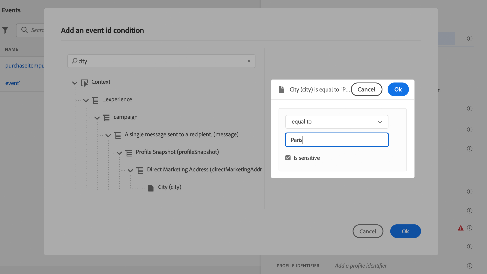

# Configuración de un evento unitario {#configure-an-event}

>[!CONTEXTUALHELP]
>id="ajo_journey_event_unitary"
>title="Eventos unitarios"
>abstract="La configuración de evento permite definir la información que Journey Optimizer recibirá como eventos. Puede utilizar varios eventos (en diferentes pasos de un recorrido) y varios recorridos pueden utilizar el mismo evento. Los eventos unitarios están vinculados a un perfil específico. Pueden basarse en reglas o generarse en el sistema."

>[!CONTEXTUALHELP]
>id="ajo_journey_event_parameters"
>title="Parámetros"
>abstract="Defina los parámetros del evento, como los campos de esquema y carga útil. Para los eventos basados en reglas, use el campo **[!UICONTROL condición de ID de evento]** para definir la condición que el sistema usará para identificar los eventos que activarán su recorrido. Añada un tipo de identidad y un identificador de perfil para usar en el evento."

>[!CONTEXTUALHELP]
>id="ajo_journey_parameters_supplemental_identifier"
>title="Usar identificador suplementario"
>abstract="El identificador suplementario es un identificador secundario que proporciona contexto adicional para la ejecución de un recorrido. Para definirlo, seleccione el campo que desea utilizar como identificador suplementario y elija un espacio de nombres al que asociarlo."

Los eventos unitarios están vinculados a un perfil específico. Pueden basarse en reglas o en sistemas generados.  Más información sobre el evento unitario [esta sección](../event/about-events.md).

A continuación se muestran los primeros pasos para configurar un nuevo evento:

1. En la sección del menú ADMINISTRACIÓN, vaya a **[!UICONTROL Configuraciones]** y, en la sección **[!UICONTROL Eventos]**, haga clic en **[!UICONTROL Administrar]**. Se muestra la lista de eventos.

   

1. Haga clic en **[!UICONTROL Crear evento]** para crear un nuevo evento. El panel de configuración de evento se abre en el lado derecho de la pantalla.

   

1. Introduzca el nombre del evento. También puede añadir una descripción.

   

   >[!NOTE]
   >
   >Solo se permiten caracteres alfanuméricos y guiones bajos. La longitud máxima es de 30 caracteres.

1. En el campo **[!UICONTROL Tipo]**, elija **Unitario**.

   

1. En el campo **[!UICONTROL Tipo de ID de evento]**, seleccione el tipo de ID de evento que desee usar: **Basado en reglas** o **Generado por el sistema**. Obtenga más información sobre los tipos de id. de evento en [esta sección](../event/about-events.md#event-id-type).

   

1. El número de recorridos que usa este evento se muestra en el campo **[!UICONTROL Utilizado en]**. Puede hacer clic en el icono **[!UICONTROL Ver recorridos]** para mostrar la lista de recorridos con este evento.

1. Defina los campos esquema y carga útil: aquí es donde selecciona la información de evento (generalmente denominada carga útil) que recorrido espera recibir. Podrá utilizar esta información en su recorrido. Consulte [esta sección](../event/about-creating.md#define-the-payload-fields).

   

   >[!NOTE]
   >
   >Al seleccionar el tipo **[!UICONTROL Generado por el sistema]**, solo están disponibles los esquemas que tienen el campo de tipo eventID. Al seleccionar el tipo **[!UICONTROL Basado en reglas]**, están disponibles todos los esquemas de Experience Event.

1. Para los eventos basados en reglas, haga clic dentro del campo **[!UICONTROL Condición de ID de evento]**. Con el editor de expresiones simples o avanzadas, defina la condición que el sistema utilizará para identificar los eventos que almacenarán en déclencheur el recorrido.

   

   En nuestro ejemplo, escribimos una condición basada en la ciudad del perfil. Esto significa que cada vez que el sistema reciba un evento que coincida con esta condición (campo **[!UICONTROL Ciudad]** y valor **[!UICONTROL París]**), lo pasará a los recorridos.

   >[!NOTE]
   >
   >En el editor de expresiones simple, no todos los operadores están disponibles, sino que dependen del tipo de datos. Por ejemplo, para un tipo de cadena de campo, puede utilizar &quot;contiene&quot; o &quot;es igual a&quot;.
   >
   >Si modifica el esquema con nuevos valores de enumeración después de crear el evento, debe seguir estos pasos para aplicar los cambios al evento existente: anule la selección del campo de enumeración de los campos de evento, confirme la selección y, a continuación, seleccione de nuevo el campo de enumeración. Ahora se muestra el nuevo valor de enumeración.

1. Añada un tipo de identidad. Este paso es opcional, pero se recomienda, ya que la adición de un tipo de identidad le permite aprovechar la información almacenada en el servicio Perfil del cliente en tiempo real. Define el tipo de clave que tiene el evento. Obtenga más información en [esta sección](../event/about-creating.md#select-the-namespace).

1. Defina el identificador de perfil: elija un campo de los campos de carga útil o defina una fórmula para identificar a la persona asociada al evento. Esta clave se configura automáticamente (pero aún se puede editar) si selecciona un tipo de identidad. De hecho, recorrido selecciona la clave que debe corresponder al tipo de identidad (por ejemplo, si selecciona un tipo de identidad de correo electrónico, se seleccionará la clave de correo electrónico). Obtenga más información en [esta sección](../event/about-creating.md#define-the-event-key).

   

1. Haga clic en **[!UICONTROL Guardar]**.

   El evento está ahora configurado y listo para añadirse a un recorrido. Se requieren pasos de configuración adicionales para recibir eventos. Consulte [esta página](../event/additional-steps-to-send-events-to-journey.md).

## Definición de los campos de carga útil {#define-the-payload-fields}

La definición de carga útil permite elegir la información que el sistema espera recibir del evento en su recorrido y la clave para identificar a qué persona está asociada al evento. La carga útil se basa en la definición del campo XDM de Experience Cloud. Para obtener más información sobre XDM, consulte [Documentación de Adobe Experience Platform](https://experienceleague.adobe.com/docs/experience-platform/xdm/home.html?lang=es){target="_blank"}.

1. Seleccione un esquema XDM de la lista y haga clic en el campo **[!UICONTROL Campos]** o en el icono **[!UICONTROL Editar]**.

   

   Se muestran todos los campos definidos en el esquema. La lista de campos varía según el esquema. Puede buscar un campo específico o utilizar los filtros para mostrar todos los nodos y campos o solo los campos seleccionados. Según la definición del esquema, algunos campos pueden ser obligatorios y preseleccionados. No puede anular su selección. Todos los campos obligatorios para que los recorridos reciban el evento correctamente están seleccionados de forma predeterminada.

   >[!NOTE]
   >
   >Para los eventos generados por el sistema, asegúrese de haber agregado el grupo de campos &quot;orquestación&quot; al esquema XDM. Esto garantizará que el esquema contenga toda la información necesaria para trabajar con [!DNL Journey Optimizer].

   

1. Seleccione los campos que espera recibir del evento. Estos son los campos que el usuario empresarial aprovechará en el recorrido. También deben incluir la clave que se utilizará para identificar a la persona asociada al evento (consulte [esta sección](../event/about-creating.md#define-the-event-key)).

   >[!NOTE]
   >
   >Para los eventos generados por el sistema, el campo **[!UICONTROL eventID]** se agrega automáticamente a la lista de campos seleccionados para que [!DNL Journey Optimizer] pueda identificar el evento. El sistema que impulsa el evento no debe generar un ID, debe utilizar el que está disponible en la previsualización de carga útil. Consulte [esta sección](../event/about-creating.md#preview-the-payload).

1. Cuando termine de seleccionar los campos necesarios, haga clic en **[!UICONTROL Aceptar]** o presione **[!UICONTROL Entrar]**.

   El número de campos seleccionados aparece en el campo **[!UICONTROL Campos]**.

   

## Selección del tipo de identidad {#select-the-namespace}

>[!CONTEXTUALHELP]
>id="ajo_journey_namespace"
>title="Tipo de identidad"
>abstract="Seleccione la clave para identificar el perfil del cliente asociado al evento."

El tipo de identidad (anteriormente conocido como &quot;área de nombres&quot;) le permite definir el tipo de clave utilizada para identificar a la persona asociada al evento. Su configuración es opcional. Es necesario si desea recuperar, en sus recorridos, información adicional proveniente de [Perfil del cliente en tiempo real](https://experienceleague.adobe.com/docs/experience-platform/profile/home.html?lang=es){target="_blank"}. La definición del tipo de identidad no es necesaria si solo utiliza datos procedentes de un sistema de terceros a través de una fuente de datos personalizada.

Puede crear un tipo de identidad existente o crear uno nuevo mediante el servicio de identidad de Adobe Experience Platform. Obtenga más información en la [documentación de Adobe Experience Platform](https://experienceleague.adobe.com/docs/experience-platform/identity/home.html?lang=es){target="_blank"}.

Si selecciona un esquema que tiene una identidad principal, los campos **[!UICONTROL Identificador de generador de perfiles]** e **[!UICONTROL Tipo de identidad]** se rellenan previamente. Si no se ha definido ninguna identidad, se selecciona _identityMap > id_ como clave principal. A continuación, debe seleccionar un tipo de identidad y la clave se rellenará previamente (debajo del campo **[!UICONTROL Tipo de identidad]**) con _identityMap > id_.

Al seleccionar campos, los campos de identidad principales se etiquetan.

Seleccione un tipo de identidad en la lista desplegable.

Solo se permite un tipo de identidad por recorrido. Si utiliza varios eventos en el mismo recorrido, deben utilizar el mismo tipo de identidad. Consulte [esta página](../building-journeys/journey.md).

>[!NOTE]
>
>Solo puede seleccionar un tipo de identidad basado en personas. Si ha definido un tipo de identidad para una tabla de búsqueda (por ejemplo, el tipo de identidad ProductID para una búsqueda de productos), no estará disponible en la lista desplegable **Tipo de identidad**.

## Definición del identificador de perfil {#define-the-event-key}

La clave es el campo o la combinación de campos que forma parte de los datos de carga útil de evento y que permite al sistema identificar a la persona asociada al evento. La clave puede ser, por ejemplo, el Experience Cloud ID, un ID de CRM o una dirección de correo electrónico.

Para utilizar datos almacenados en la base de datos del perfil del cliente en tiempo real de Adobe, la clave de evento debe ser la información que definió como identidad de perfil en el [servicio del perfil del cliente en tiempo real](https://experienceleague.adobe.com/docs/experience-platform/profile/home.html?lang=es){target="_blank"}.

El identificador de perfil permite al sistema realizar la reconciliación entre el evento y el perfil del individuo. Si selecciona un esquema que tiene una identidad principal, los campos **[!UICONTROL Identificador de perfil]** e **[!UICONTROL Tipo de identidad]** se rellenan previamente. Si no se ha definido ninguna identidad, _identityMap > id_ es la clave principal. A continuación, debe seleccionar un tipo de identidad y la clave se rellenará automáticamente previamente usando _identityMap > id_.

Al seleccionar campos, los campos de identidad principales se etiquetan.

Si necesita utilizar una clave diferente, como un ID de CRM o una dirección de correo electrónico, debe añadirla manualmente, tal y como se explica a continuación:

1. Haga clic dentro del campo **[!UICONTROL Identificador de perfil]** o en el icono de lápiz.

   

1. Seleccione el campo elegido como clave en la lista de campos de carga útil.

Cuando se recibe el evento, el valor de la clave permite al sistema identificar a la persona asociada al evento. Asociada a un [tipo de identidad](../event/about-creating.md#select-the-namespace), la clave se puede usar para realizar consultas en Adobe Experience Platform. Ver [esta página](../building-journeys/about-journey-activities.md#orchestration-activities).
La clave también se utiliza para comprobar que una persona está en un recorrido. De hecho, una persona no puede estar en dos lugares diferentes en el mismo recorrido. Como resultado, el sistema no permite que la misma clave, por ejemplo la clave CRMID=3224, esté en diferentes lugares del mismo recorrido.

## Editor de expresiones avanzadas {#adv-exp-editor}

Al definir la condición ID de evento o el identificador de perfil, puede cambiar al editor de expresiones avanzadas para crear claves más complejas (por ejemplo, una concatenación de dos campos de los eventos).

Tiene acceso a las funciones de expresiones avanzadas desde el botón **[!UICONTROL Modo avanzado]** si desea realizar manipulaciones adicionales. Estas funciones permiten manipular los valores utilizados para llevar a cabo consultas específicas, como cambiar de formato, o realizar concatenaciones de campos, teniendo en cuenta solo una parte de un campo (por ejemplo, los 10 primeros caracteres). Consulte esta [página](../building-journeys/expression/expressionadvanced.md).

## Previsualización de la carga útil {#preview-the-payload}

La previsualización de carga útil permite validar la definición de carga útil.

>[!NOTE]
>
>En el caso de los eventos generados por el sistema, al crear un evento, antes de ver la previsualización de carga útil, guarde el evento y vuelva a abrirlo. Este paso es necesario para generar un ID de evento en la carga útil.

1. Haga clic en el icono **[!UICONTROL Ver carga útil]** para previsualizar la carga útil esperada por el sistema.

   

   Puede observar que se muestran los campos seleccionados.

   

1. Compruebe la previsualización para validar la definición de carga útil.

1. A continuación, puede compartir la previsualización de carga útil con la persona responsable del envío del evento. Esta carga útil puede ayudarles a diseñar la configuración de un evento que inserte [!DNL Journey Optimizer]. Consulte [esta página](../event/additional-steps-to-send-events-to-journey.md).
