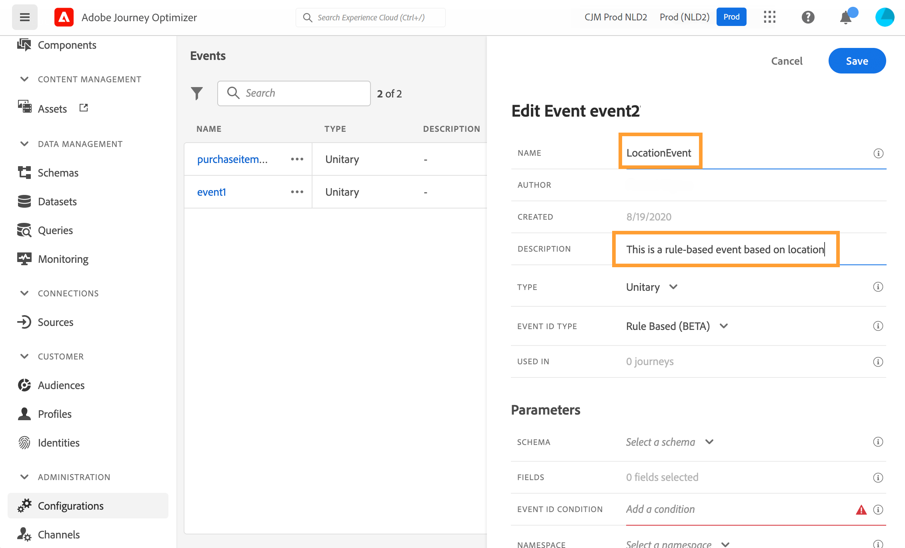
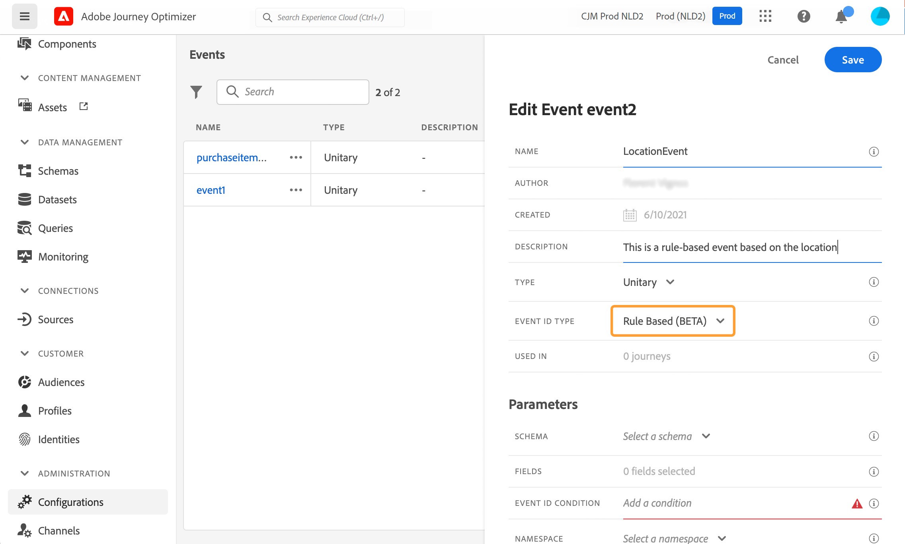
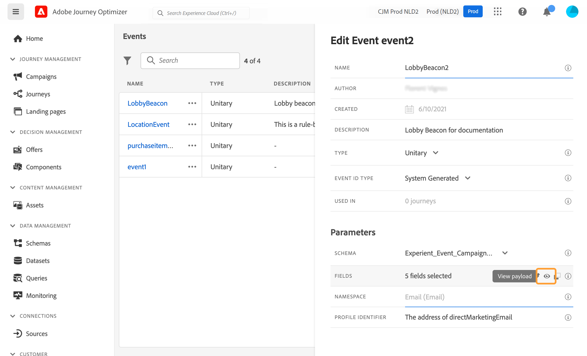

# Configuración de un evento unitario {#configure-an-event}

>[!CONTEXTUALHELP]
>id="ajo_journey_event_unitary"
>title="Eventos unitarios"
>abstract="La configuración de evento permite definir la información que Journey Optimizer recibirá como eventos. Puede utilizar varios eventos (en diferentes pasos de un recorrido) y varios recorridos pueden utilizar el mismo evento. Los eventos unitarios están vinculados a un perfil específico. Pueden basarse en reglas o generarse en el sistema."

Los eventos unitarios están vinculados a un perfil específico. Pueden basarse en reglas o en sistemas generados.  Más información sobre el evento unitario [esta sección](../event/about-events.md).

Estos son los primeros pasos para configurar un nuevo evento:

1. En la sección del menú ADMINISTRACIÓN, seleccione **[!UICONTROL Configuraciones]**. En el  **[!UICONTROL Eventos]** , haga clic en **[!UICONTROL Administrar]**. Se muestra la lista de eventos.

   

1. Clic **[!UICONTROL Crear evento]** para crear un nuevo evento. El panel de configuración de evento se abre en el lado derecho de la pantalla.

   

1. Introduzca el nombre del evento. También puede añadir una descripción.

   

   >[!NOTE]
   >
   >Solo se permiten caracteres alfanuméricos y guiones bajos. La longitud máxima es de 30 caracteres.

1. En el **[!UICONTROL Tipo]** , elija **Unitario**.

   

1. En el **[!UICONTROL Tipo de ID de evento]** , seleccione el tipo de ID de evento que desee utilizar: **Basado en reglas** o **Sistema generado**. Obtenga más información sobre los tipos de ID de evento en [esta sección](../event/about-events.md#event-id-type).

   

1. El número de recorridos que utilizan este evento se muestra en la variable **[!UICONTROL Utilizado en]** field. Puede hacer clic en **[!UICONTROL Ver recorridos]** para mostrar la lista de recorridos con este evento.

1. Defina los campos esquema y carga útil: aquí es donde selecciona la información de evento (generalmente denominada carga útil) que recorrido espera recibir. Podrá utilizar esta información en su recorrido. Consulte [esta sección](../event/about-creating.md#define-the-payload-fields).

   

   >[!NOTE]
   >
   >Al seleccionar la variable **[!UICONTROL Sistema generado]** Tipo, solo están disponibles los esquemas que tienen el campo de tipo eventID. Al seleccionar la variable **[!UICONTROL Basado en reglas]** Tipo, todos los esquemas de Evento de experiencia están disponibles.

1. Para los eventos basados en reglas, haga clic dentro de **[!UICONTROL Condición de ID de evento]** field. Con el editor de expresiones simple, defina la condición que el sistema utilizará para identificar los eventos que almacenarán en déclencheur el recorrido.
   

   En nuestro ejemplo, escribimos una condición basada en la ciudad del perfil. Esto significa que siempre que el sistema reciba un evento que coincida con esta condición (**[!UICONTROL Ciudad]** field y **[!UICONTROL París]** ), se lo transmitirá a los recorridos.

   >[!NOTE]
   >
   >El editor de expresiones avanzadas no está disponible al definir el **[!UICONTROL Condición de ID de evento]**. En el editor de expresiones simple, no todos los operadores están disponibles, sino que dependen del tipo de datos. Por ejemplo, para un tipo de cadena de campo, puede utilizar &quot;contiene&quot; o &quot;es igual a&quot;.
   >
   >Si modifica el esquema con nuevos valores de enumeración después de crear el evento, debe seguir estos pasos para aplicar los cambios al evento existente: anule la selección del campo de enumeración de los campos de evento, confirme la selección y, a continuación, seleccione de nuevo el campo de enumeración. Ahora se muestra el nuevo valor de enumeración.

1. Añada un área de nombres. Este paso es opcional, pero se recomienda, ya que la adición de un área de nombres le permite aprovechar la información almacenada en el servicio de Perfil del cliente en tiempo real. Define el tipo de clave que tiene el evento. Consulte [esta sección](../event/about-creating.md#select-the-namespace).

1. Defina el identificador de perfil: elija un campo de los campos de carga útil o defina una fórmula para identificar a la persona asociada al evento. Esta clave se configura automáticamente (pero aún puede editarse) si selecciona un Área de nombres. De hecho, recorrido selecciona la clave que debe corresponder al área de nombres (por ejemplo, si selecciona un área de nombres de correo electrónico, se seleccionará la clave de correo electrónico). Consulte [esta sección](../event/about-creating.md#define-the-event-key).

   

1. Haga clic en **[!UICONTROL Guardar]**.

   El evento está ahora configurado y listo para añadirse a un recorrido. Se requieren pasos de configuración adicionales para recibir eventos. Consulte [esta página](../event/additional-steps-to-send-events-to-journey.md).

## Definición de los campos de carga útil {#define-the-payload-fields}

La definición de carga útil permite elegir la información que el sistema espera recibir del evento en su recorrido y la clave para identificar a qué persona está asociada al evento. La carga útil se basa en la definición del campo XDM del Experience Cloud. Para obtener más información sobre XDM, consulte [Documentación de Adobe Experience Platform](https://experienceleague.adobe.com/docs/experience-platform/xdm/home.html?lang=es){target="_blank"}.

1. Seleccione un esquema XDM de la lista y haga clic en **[!UICONTROL Campos]** o en el campo **[!UICONTROL Editar]** icono.

   

   Se muestran todos los campos definidos en el esquema. La lista de campos varía según el esquema. Puede buscar un campo específico o utilizar los filtros para mostrar todos los nodos y campos o solo los campos seleccionados. Según la definición del esquema, algunos campos pueden ser obligatorios y preseleccionados. No puede anular su selección. Todos los campos obligatorios para que los recorridos reciban el evento correctamente están seleccionados de forma predeterminada.

   >[!NOTE]
   >
   >Para los eventos generados por el sistema, asegúrese de haber agregado el grupo de campos &quot;orquestación&quot; al esquema XDM. Esto garantizará que el esquema contenga toda la información necesaria para trabajar con [!DNL Journey Optimizer].

   

1. Seleccione los campos que espera recibir del evento. Estos son los campos que el usuario empresarial aprovechará en el recorrido. También deben incluir la clave que se utilizará para identificar a la persona asociada al evento (consulte [esta sección](../event/about-creating.md#define-the-event-key)).

   >[!NOTE]
   >
   >Para los eventos generados por el sistema, la variable **[!UICONTROL eventID]** El campo se añade automáticamente a la lista de campos seleccionados de modo que [!DNL Journey Optimizer] puede identificar el evento. El sistema que impulsa el evento no debe generar un ID, debe utilizar el que está disponible en la previsualización de carga útil. Consulte [esta sección](../event/about-creating.md#preview-the-payload).

1. Cuando haya terminado de seleccionar los campos necesarios, haga clic en **[!UICONTROL Ok]** o pulse **[!UICONTROL Entrar]**.

   El número de campos seleccionados aparece en la variable **[!UICONTROL Campos]** field.

   

## Seleccione el área de nombres {#select-the-namespace}

>[!CONTEXTUALHELP]
>id="ajo_journey_namespace"
>title="Área de nombres de identidad"
>abstract="Seleccione la clave para identificar el perfil del cliente asociado al evento."

El área de nombres permite definir el tipo de clave utilizada para identificar a la persona asociada al evento. Su configuración es opcional. Es necesario si desea recuperar, en sus recorridos, información adicional proveniente de [Perfil del cliente en tiempo real](https://experienceleague.adobe.com/docs/experience-platform/profile/home.html?lang=es){target="_blank"}. La definición del área de nombres no es necesaria si solo utiliza datos procedentes de un sistema de terceros a través de una fuente de datos personalizada.

Puede utilizar uno de los predefinidos o crear uno nuevo mediante el servicio Área de nombres de identidad. Consulte [Documentación de Adobe Experience Platform](https://experienceleague.adobe.com/docs/experience-platform/identity/home.html?lang=es){target="_blank"}.

Si selecciona un esquema que tiene una identidad principal, la variable **[!UICONTROL Identificador del generador de perfiles]** y **[!UICONTROL Área de nombres]** los campos están rellenados previamente. Si no se ha definido ninguna identidad, se selecciona _identityMap > id_ como clave principal. A continuación, debe seleccionar un área de nombres y la clave se rellenará previamente (debajo de la etiqueta **[!UICONTROL Área de nombres]** field) utilizando _identityMap > id_.

Al seleccionar campos, los campos de identidad principales se etiquetan.

Seleccione un área de nombres de la lista desplegable.

Solo se permite un área de nombres por recorrido. Si utiliza varios eventos en el mismo recorrido, deben utilizar el mismo área de nombres. Consulte [esta página](../building-journeys/journey.md).

>[!NOTE]
>
>Solo puede seleccionar un área de nombres de identidad basada en personas. Si ha definido un área de nombres para una tabla de búsqueda (por ejemplo: área de nombres ProductID para una búsqueda Product), no estará disponible en la **Área de nombres** lista desplegable.

## Definición del identificador de perfil {#define-the-event-key}

La clave es el campo o la combinación de campos que forma parte de los datos de carga útil de evento y que permite al sistema identificar a la persona asociada al evento. La clave puede ser, por ejemplo, el ID del Experience Cloud, un ID de CRM o una dirección de correo electrónico.

Para utilizar datos almacenados en la base de datos Perfil del cliente en tiempo real de Adobe, la clave del evento debe ser la información definida como la identidad de un perfil en la [Servicio de perfil del cliente en tiempo real](https://experienceleague.adobe.com/docs/experience-platform/profile/home.html?lang=es){target="_blank"}.

El identificador de perfil permite al sistema realizar la reconciliación entre el evento y el perfil del individuo. Si selecciona un esquema que tiene una identidad principal, la variable **[!UICONTROL Identificador de perfil]** y **[!UICONTROL Área de nombres]** los campos están rellenados previamente. Si no hay ninguna identidad definida, la variable _identityMap > id_ es la clave principal. A continuación, debe seleccionar un área de nombres y la clave se rellena automáticamente previamente mediante _identityMap > id_.

Al seleccionar campos, los campos de identidad principales se etiquetan.

Si necesita utilizar una clave diferente, como un ID de CRM o una dirección de correo electrónico, debe añadirla manualmente, tal y como se explica a continuación:

1. Haga clic dentro de **[!UICONTROL Identificador de perfil]** o en el icono de lápiz.

   

1. Seleccione el campo elegido como clave en la lista de campos de carga útil. También puede cambiar al editor de expresiones avanzadas para crear claves más complejas (por ejemplo, una concatenación de dos campos de los eventos).

   

Cuando se recibe el evento, el valor de la clave permite al sistema identificar a la persona asociada al evento. Asociado a un área de nombres (consulte [esta sección](../event/about-creating.md#select-the-namespace)), la clave se puede utilizar para realizar consultas en Adobe Experience Platform. Consulte [esta página](../building-journeys/about-journey-activities.md#orchestration-activities).
La clave también se utiliza para comprobar que una persona está en un recorrido. De hecho, una persona no puede estar en dos lugares diferentes en el mismo recorrido. Como resultado, el sistema no permite que la misma clave, por ejemplo la clave CRMID=3224, esté en diferentes lugares del mismo recorrido.

También tiene acceso a las funciones de expresión avanzadas (**[!UICONTROL Modo avanzado]**) si desea realizar manipulaciones adicionales. Estas funciones permiten manipular los valores utilizados para llevar a cabo consultas específicas, como cambiar de formato, o realizar concatenaciones de campos, teniendo en cuenta solo una parte de un campo (por ejemplo, los 10 primeros caracteres). Consulte esta [página](../building-journeys/expression/expressionadvanced.md).

## Previsualización de la carga útil {#preview-the-payload}

La previsualización de carga útil permite validar la definición de carga útil.

>[!NOTE]
>
>En el caso de los eventos generados por el sistema, al crear un evento, antes de ver la previsualización de carga útil, guarde el evento y vuelva a abrirlo. Este paso es necesario para generar un ID de evento en la carga útil.

1. Haga clic en **[!UICONTROL Ver carga útil]** para previsualizar la carga útil esperada por el sistema.

   

   Puede observar que se muestran los campos seleccionados.

   

1. Compruebe la previsualización para validar la definición de carga útil.

1. A continuación, puede compartir la previsualización de carga útil con la persona responsable del envío del evento. Esta carga útil puede ayudarles a diseñar la configuración de un evento que se inserte en [!DNL Journey Optimizer]. Consulte [esta página](../event/additional-steps-to-send-events-to-journey.md).
