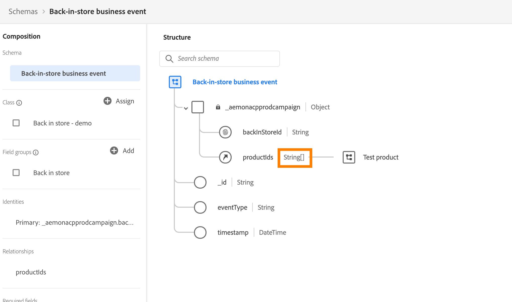

# Esquemas de ExperienceEvent para [!DNL Journey Optimizer] eventos {#about-experienceevent-schemas}

[!DNL Journey Optimizer] eventos son eventos de experiencia XDM que se envían a Adobe Experience Platform a través de la ingesta de transmisión.

Por lo tanto, un requisito previo importante para configurar eventos para [!DNL Journey Optimizer] es que esté familiarizado con el Experience Data Model (o XDM) de Adobe Experience Platform y cómo componer esquemas de Experience Event de XDM, así como con cómo transmitir datos con formato XDM a Adobe Experience Platform.

>[!CAUTION]
>
>Ya no se admiten las búsquedas de eventos de experiencia en condiciones de recorrido. Consulte las prácticas recomendadas alternativas aquí. Si tiene un caso de uso de recorrido activado por evento que aún necesita la búsqueda de eventos de Experience y no se puede admitir a través de ninguna de las alternativas enumeradas, póngase en contacto con su representante de Adobe y le ayudaremos a alcanzar su objetivo.
>
>El acceso al contexto desde el evento de inicio de un recorrido no se ve afectado.

## Requisitos de esquema para [!DNL Journey Optimizer] eventos  {#schema-requirements}

El primer paso para configurar un evento para [!DNL Journey Optimizer] es asegurarse de que tiene un esquema XDM definido para representar el evento y un conjunto de datos creado para registrar instancias del evento en Adobe Experience Platform. Tener un conjunto de datos para los eventos no es estrictamente necesario, pero enviar los eventos a un conjunto de datos específico le permitirá mantener el historial de eventos de los usuarios para referencias y análisis futuros, por lo que siempre es una buena idea. Si aún no tiene un esquema y un conjunto de datos adecuados para su evento, ambas tareas se pueden realizar en la interfaz web de Adobe Experience Platform.

Cualquier esquema XDM que se vaya a utilizar para [!DNL Journey Optimizer] eventos debe cumplir los siguientes requisitos:

* El esquema debe ser de la clase XDM ExperienceEvent.

  

* Para los eventos generados por el sistema, el esquema debe incluir el grupo de campos eventID de orquestación. [!DNL Journey Optimizer] utiliza este campo para identificar eventos utilizados en recorridos.

  

* Declare un campo de identidad para identificar perfiles individuales en el evento. Si no se especifica ninguna identidad, se puede utilizar un mapa de identidad. Este proceso no es recomendable.

  

* Si desea que estos datos estén disponibles para el perfil, marque el esquema y el conjunto de datos para el perfil. [Más información](../data/lookup-aep-data.md)

  

  

* No dude en incluir campos de datos para capturar cualquier otro dato de contexto que desee incluir en el evento, como información sobre el usuario, el dispositivo desde el que se generó el evento, la ubicación o cualquier otra circunstancia significativa relacionada con el evento.

  

  

<!--
## Leverage schema relationships{#leverage_schema_relationships}

Adobe Experience Platform allows you to define relationships between schemas in order to use one dataset as a lookup table for another. 

Let's say your brand data model has a schema capturing purchases. You also have a schema for the product catalog. You can capture the product ID in the purchase schema and use a relationship to look up more complete product details from the product catalog. This allows you to create an audience for all customers who bought a laptop, for example, without having to explicitly list out all laptop IDs or capture every single product details in transactional systems.

To define a relationship, you need to have a dedicated field in the source schema, in this case the product ID field in the purchase schema. This field needs to reference the product ID field in the destination schema. The source and destination tables must be enabled for profiles and the destination schema must have that common field defined as its primary identity. 

Here is the product catalog schema enabled for profile with the product ID defined as the primary identity. 

Here is the purchase schema with the relationship defined on the product ID field.

>[!NOTE]
>
>Learn more about schema relationships in the [Experience Platform documentation](https://experienceleague.adobe.com/docs/platform-learn/tutorials/schemas/configure-relationships-between-schemas.html).

In Journey Optimizer, you can then leverage all the fields from the linked tables:

* when configuring a business or unitary event, [Read more](../event/experience-event-schema.md#unitary_event_configuration) 
* when using conditions in a journey, [Read more](../event/experience-event-schema.md#journey_conditions_using_event_context) 
* in message personalization, [Read more](../event/experience-event-schema.md#message_personalization) 
* in custom action personalization, [Read more](../event/experience-event-schema.md#custom_action_personalization_with_journey_event_context) 

### Arrays{#relationships_limitations}

You can define a schema relationship on an array of strings, for example, a list of product IDs.

You can also define a schema relationship with an attribute inside of an array of objects, for example a list of purchase information (product ID, product name, price, discount). The lookup values will be available in journeys (conditions, custom actions, etc.) and message personalization. 

### Event configuration{#unitary_event_configuration}

The linked schema fields are available in unitary and business event configuration:

* when browsing through the event schema fields in the event configuration screen.
* when defining a condition for system-generated events.

The linked fields are not available:

* in the event key formula
* in event id condition (rule-based events)

To learn how to configure a unitary event, refer to this [page](../event/about-creating.md).

### Journey conditions using event context{#journey_conditions_using_event_context}

You can use data from a lookup table linked to an event used in a journey for condition building (expression editor).

Add a condition in a journey, edit the expression and unfold the event node in the expression editor. 

To learn how to define journey conditions, refer to this [page](../building-journeys/condition-activity.md).

### Message personalization{#message_personalization}

The linked fields are available when personalizing a message. The related fields are displayed in the context passed from the journey to the message.

To learn how to personalize a message with contextual journey information, refer to this [page](../personalization/personalization-use-case.md).

### Custom action personalization with journey event context{#custom_action_personalization_with_journey_event_context}

The linked fields are available when configuring the action parameters of a journey custom action activity. 

To learn how to use custom actions, refer to this [page](../building-journeys/using-custom-actions.md).
-->
