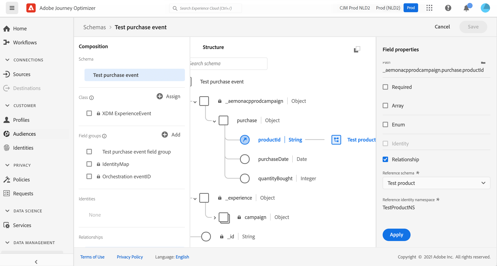
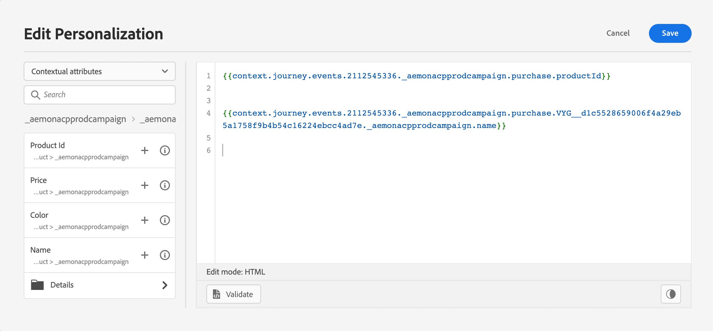

# Esquemas de ExperienceEvent para [!DNL Journey Optimizer] Eventos {#about-experienceevent-schemas}

[!DNL Journey Optimizer] los eventos son eventos de experiencia XDM que se envían a Adobe Experience Platform mediante la ingesta de flujo.

Como tal, un requisito previo importante para configurar eventos para [!DNL Journey Optimizer] es que está familiarizado con el Modelo de datos de experiencia (o XDM) de Adobe Experience Platform y con cómo componer esquemas de eventos de experiencia XDM, así como con cómo transmitir datos con formato XDM a Adobe Experience Platform.

## Requisitos de esquema para [!DNL Journey Optimizer] Eventos  {#schema-requirements}

El primer paso para configurar un evento para [!DNL Journey Optimizer] es para asegurarse de que tiene un esquema XDM definido para representar el evento y un conjunto de datos creado para registrar instancias del evento en Adobe Experience Platform. Tener un conjunto de datos para sus eventos no es estrictamente necesario, pero enviar los eventos a un conjunto de datos específico le permitirá mantener el historial de eventos de los usuarios para futuras referencias y análisis, por lo que siempre es una buena idea. Si aún no tiene un esquema y un conjunto de datos adecuados para el evento, ambas tareas se pueden realizar en la interfaz web de Adobe Experience Platform.

Cualquier esquema XDM que se utilice para [!DNL Journey Optimizer] los eventos deben cumplir los siguientes requisitos:

* El esquema debe pertenecer a la clase XDM ExperienceEvent .

   

* Para los eventos generados por el sistema, el esquema debe incluir el grupo de campos ID de evento de organización . [!DNL Journey Optimizer] utiliza este campo para identificar eventos utilizados en recorridos.

   

* Declare un campo de identidad para identificar el asunto del evento. Si no se especifica ninguna identidad, se puede utilizar un mapa de identidad. Este proceso no es recomendable.

   

* Si desea que estos datos estén disponibles para la búsqueda más adelante en un Recorrido, marque el esquema y el conjunto de datos para el perfil.

   

   

* No dude en incluir campos de datos para capturar cualquier otro dato de contexto que desee incluir con el evento, como información sobre el usuario, el dispositivo desde el cual se generó el evento, la ubicación o cualquier otra circunstancia significativa relacionada con el evento.

   

   

## Aprovechamiento de las relaciones de esquema{#leverage_schema_relationships}

Adobe Experience Platform le permite definir relaciones entre esquemas para utilizar un conjunto de datos como una tabla de búsqueda para otro.

Supongamos que el modelo de datos de marca tiene un esquema que captura las compras. También tiene un esquema para el catálogo de productos. Puede capturar el ID del producto en el esquema de compra y utilizar una relación para buscar detalles de producto más completos en el catálogo de productos. Esto le permite crear un segmento para todos los clientes que compraron un portátil, por ejemplo, sin tener que enumerar explícitamente todos los ID de un portátil ni capturar todos los detalles de producto en sistemas transaccionales.

Para definir una relación, debe tener un campo dedicado en el esquema de origen, en este caso el campo ID del producto en el esquema de compra. Este campo debe hacer referencia al campo ID del producto en el esquema de destino. Las tablas de origen y destino deben estar habilitadas para perfiles y el esquema de destino debe tener ese campo común definido como su identidad principal.

Este es el esquema de catálogo de productos habilitado para perfil con el ID de producto definido como identidad principal.

Este es el esquema de compra con la relación definida en el campo ID del producto.

>[!NOTE]
>
>Obtenga más información sobre las relaciones de esquema en la [documentación del Experience Platform](https://experienceleague.adobe.com/docs/platform-learn/tutorials/schemas/configure-relationships-between-schemas.html?lang=en).

En Journey Optimizer, puede aprovechar todos los campos de las tablas vinculadas:

* al configurar un evento empresarial o unitario, [Más información](../event/experience-event-schema.md#unitary_event_configuration)
* cuando se utilizan condiciones en un recorrido, [Más información](../event/experience-event-schema.md#journey_conditions_using_event_context)
* en la personalización de mensajes, [Más información](../event/experience-event-schema.md#message_personalization)
* en personalización de acciones personalizadas, [Más información](../event/experience-event-schema.md#custom_action_personalization_with_journey_event_context)

### Configuración de eventos{#unitary_event_configuration}

Los campos de esquema vinculados están disponibles en la configuración unitaria y de evento empresarial:

* al navegar por los campos de esquema de evento en la pantalla de configuración de evento.
* al definir una condición para eventos generados por el sistema.

Los campos vinculados no están disponibles:

* en la fórmula de clave de evento
* en la condición de id de evento (eventos basados en reglas)

Para aprender a configurar un evento unitario, consulte esta [página](../event/about-creating.md).

### condiciones de recorrido mediante el contexto del evento{#journey_conditions_using_event_context}

Puede utilizar datos de una tabla de consulta vinculada a un evento utilizado en un recorrido para la creación de condiciones (editor de expresiones).

Añada una condición en un recorrido, edite la expresión y despliegue el nodo de evento en el editor de expresiones.

Para aprender a definir las condiciones de recorrido, consulte esta [página](../building-journeys/condition-activity.md).

### Personalización de mensajes{#message_personalization}

Los campos vinculados están disponibles al personalizar un mensaje. Los campos relacionados se muestran en el contexto pasado del recorrido al mensaje.

Para aprender a personalizar un mensaje con información contextual del recorrido, consulte esta [página](../personalization/personalization-use-case.md).

### Personalización de acciones personalizadas con contexto de evento de recorrido{#custom_action_personalization_with_journey_event_context}

Los campos vinculados están disponibles al configurar los parámetros de acción de una actividad de acción personalizada de recorrido.

Para aprender a utilizar acciones personalizadas, consulte esta [página](../building-journeys/using-custom-actions.md).
