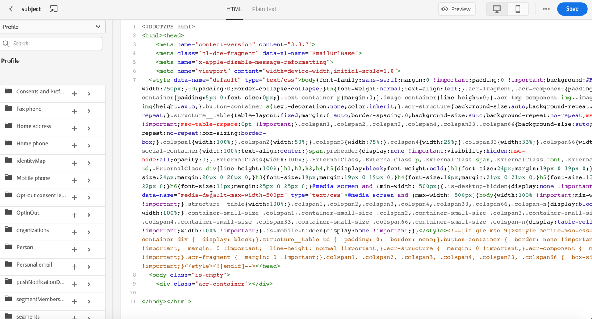
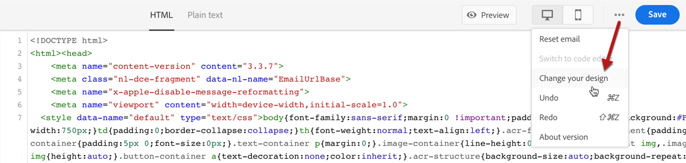

# Importación o codificación del contenido del correo electrónico {#existing-content}

Journey Optimizer le permite importar contenido HTML existente para diseñar sus correos electrónicos. Este contenido puede ser código HTML sin procesar o contenido de un archivo HTML existente o una carpeta zip.

Para codificar contenido HTML o importar contenido existente, siga los pasos a continuación:

1. [Creación de un mensaje ](create-message.md)

1. Abra **[!UICONTROL Email Designer]** en la sección **[!UICONTROL Edit Content]**.

   

1. Seleccione **[!UICONTROL Code your own]** o **[!UICONTROL Import HTML]**. Consulte las secciones a continuación para ver los pasos siguientes.

## Codifique su propio {#import-raw-html-code}

Utilice el modo **[!UICONTROL Code your own]** para importar HTML sin procesar o codificar el contenido del correo electrónico. Este método requiere habilidades HTML.

>[!CAUTION]
>
> No se puede hacer referencia a imágenes de [Adobe Experience Manager Assets Essentials](assets-essentials.md) al utilizar este método. Las imágenes a las que se hace referencia en el código HTML deben almacenarse en una ubicación pública.

1. En la página de inicio del Diseñador de correo electrónico, seleccione **[!UICONTROL Code your own]**.

   

1. Introduzca o pegue su código HTML sin procesar.

1. Utilice el panel izquierdo para aprovechar las capacidades de personalización [!DNL Journey Optimizer]. Para obtener más información, consulte [esta sección](personalization/personalize.md).

   

1. Si desea abrir el Diseñador de correo electrónico para iniciar el correo electrónico desde un nuevo diseño, seleccione **[!UICONTROL Change your design]** en el menú de opciones.

   

1. Haga clic en el botón **[!UICONTROL Preview]** para comprobar el diseño y la personalización de los mensajes mediante perfiles de prueba. Para obtener más información, consulte [esta sección](preview.md).

   

1. Una vez que el código esté listo, haga clic en **[!UICONTROL Save]** y vuelva a la pantalla de creación de mensajes para finalizar el mensaje.

   

## Importar HTML {#import-html-content-from-file}

Puede importar contenido HTML en el diseñador de correo electrónico. Este contenido puede ser:

* Un **archivo HTML** con una hoja de estilo incorporada,
* Una **.zip folder** con el archivo HTML, la hoja de estilo (.css) e imágenes.

   >[!NOTE]
   >
   >No hay restricciones en la estructura de archivos .zip. Sin embargo, las referencias deben ser relativas y ajustarse a la estructura de árbol de la carpeta .zip.

Para importar un archivo con contenido HTML, siga los pasos a continuación:

1. En la página de inicio del Diseñador de correo electrónico, seleccione **[!UICONTROL Import HTML]**.

   

1. Arrastre y suelte el archivo HTML o .zip que contiene el contenido HTML.

1. Una vez cargado el contenido HTML, puede aprovechar las capacidades del Diseñador de correo electrónico para editar y previsualizar el correo electrónico. [Obtenga más información en esta sección](create-email-content.md).

   
