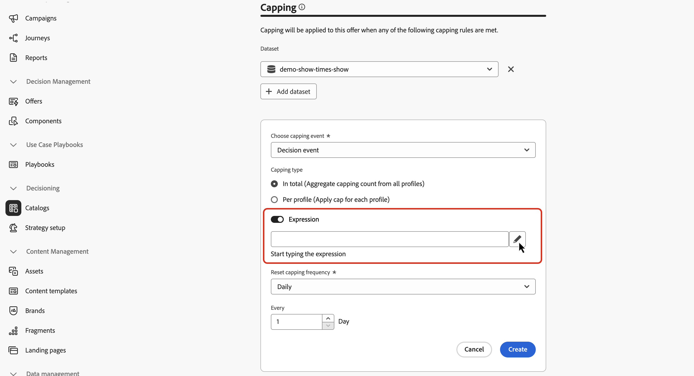

# Uso de datos de Adobe Experience Platform para decisiones {#aep-data}

>[!CONTEXTUALHELP]
>id="ajo_exd_catalogs_dataset"
>title="Búsqueda de conjuntos de datos"
>abstract="Para utilizar atributos de Adobe Experience Platform para la toma de decisiones, debe crear una asignación para definir cómo se une el conjunto de datos de Adobe Experience Platform con los datos de [!DNL Journey Optimizer]."

>[!CONTEXTUALHELP]
>id="ajo_exd_catalogs_dataset_create"
>title="Búsqueda de conjuntos de datos"
>abstract="Seleccione el conjunto de datos con los atributos que necesita entre todos los conjuntos de datos de Adobe Experience Platform que se hayan habilitado para la búsqueda y, a continuación, seleccione una clave de asignación (por ejemplo, número de vuelo o ID de cliente) que exista tanto en los atributos del elemento de decisión como en el conjunto de datos."

>[!CONTEXTUALHELP]
>id="ajo_exd_rules_dataset_lookup"
>title="Búsqueda de conjuntos de datos"
>abstract="Seleccione el conjunto de datos de Adobe Experience Platform con los atributos que necesite. Si el conjunto de datos no se muestra en la lista, asegúrese de que lo ha habilitado para la búsqueda y de que ha creado una asignación de búsqueda de conjunto de datos."

>[!CONTEXTUALHELP]
>id="ajo_exd_formula_dataset_lookup"
>title="Búsqueda de conjuntos de datos"
>abstract="Mediante los atributos del conjunto de datos de [!DNL Adobe Experience Platform], puede ajustar dinámicamente la lógica de clasificación para reflejar las condiciones reales. Haga clic en **[!UICONTROL Agregar conjunto de datos]** para seleccionar el conjunto de datos de Adobe Experience Platform con los atributos que necesita. Si el conjunto de datos no se muestra en la lista, asegúrese de que lo ha habilitado para la búsqueda y de que ha creado una asignación de búsqueda de conjunto de datos."

>[!CONTEXTUALHELP]
>id="ajo_exd_item_capping_dataset"
>title="Agregar conjunto de datos"
>abstract="Use los atributos de conjuntos de datos de [!DNL Adobe Experience Platform] para definir criterios de límite basados en atributos externos dinámicos. Haga clic en **[!UICONTROL Agregar conjunto de datos]** para seleccionar el conjunto de datos de Adobe Experience Platform con los atributos que necesita. Si el conjunto de datos no se muestra en la lista, asegúrese de que lo ha habilitado para la búsqueda y de que ha creado una asignación de búsqueda de conjunto de datos."

[!DNL Journey Optimizer] le permite aprovechar los datos de [!DNL Adobe Experience Platform] para la toma de decisiones. Esto le permite ampliar la definición de los atributos de decisión a datos adicionales en conjuntos de datos para actualizaciones masivas que cambian periódicamente sin tener que actualizar manualmente los atributos de uno en uno. Por ejemplo, disponibilidad, tiempos de espera, etc.

>[!AVAILABILITY]
>
>Actualmente, esta función está disponible para todos los clientes como una versión de disponibilidad limitada.

## Protecciones y limitaciones {#guardrails}

* **Canales admitidos**: la búsqueda de conjuntos de datos con toma de decisiones actualmente funciona para acciones personalizadas de correo electrónico y Recorrido. <!--Support for code-based experience channels is coming soon.-->
* **Uso de atributos**: la funcionalidad de búsqueda del conjunto de datos para la toma de decisiones amplía las definiciones de elementos de decisión con atributos adicionales, no extiende atributos a perfiles
* **Límites de búsqueda**: [!DNL Journey Optimizer] admite hasta 1000 búsquedas por directiva de decisión única.

## Requisitos previos

### Habilitar conjuntos de datos para la búsqueda

Antes de empezar, los conjuntos de datos necesarios para la toma de decisiones deben habilitarse primero para la búsqueda. Siga los pasos detallados en esta sección: [Usar datos de Adobe Experience Platform](../data/lookup-aep-data.md).

### Creación de asignaciones

Para utilizar atributos de Adobe Experience Platform para la toma de decisiones, debe crear una asignación para definir cómo se une el conjunto de datos de Adobe Experience Platform con los datos de [!DNL Journey Optimizer]. Para ello, siga estos pasos:

1. Vaya a **[!UICONTROL Catálogos]** / **[!UICONTROL Búsqueda de conjuntos de datos]** y haga clic en **[!UICONTROL Crear]**.

   

1. Configure la asignación:

   1. Haga clic en **[!UICONTROL Seleccionar conjunto de datos]** para mostrar todos los conjuntos de datos de Adobe Experience Platform que se han habilitado para la búsqueda. Seleccione el conjunto de datos con los atributos que necesite.

   1. Haga clic en **[!UICONTROL Seleccionar clave]** para elegir una clave de unión (por ejemplo, número de vuelo o ID de cliente) que exista tanto en los atributos del elemento de decisión como en el conjunto de datos.

   

1. Haga clic en **[!UICONTROL Guardar]**.

## Aprovechamiento de datos de Adobe Experience Platform {#leverage-aep-data}

Una vez que un conjunto de datos está habilitado para la búsqueda y se han creado asignaciones, puede utilizar los datos para enriquecer la lógica de decisión con datos externos. Esto resulta especialmente útil para atributos que cambian con frecuencia, como la disponibilidad del producto o los precios en tiempo real.

Los atributos de los conjuntos de datos de Adobe Experience Platform se pueden utilizar en dos partes de la lógica de decisión:

* **Reglas de decisión**: defina si un elemento de decisión es elegible para mostrarse.
* **Fórmulas de clasificación**: dé prioridad a los elementos de decisión según los datos externos.
* **Reglas de límite**: utilice datos externos para calcular el umbral de las reglas de límite.

En las siguientes secciones se explica cómo utilizar los datos de Adobe Experience Platform en estos contextos.

### Reglas de decisión {#rules}

El uso de datos de Adobe Experience Platform en reglas de decisión permite definir criterios de idoneidad basados en atributos externos dinámicos, lo que garantiza que los elementos de decisión solo se muestren cuando corresponda.

Por ejemplo, supongamos que un retailer en línea desea promocionar las recomendaciones de productos en función del inventario de la tienda local. Un producto solo debe ser apto para la recomendación si está disponible en la ubicación más cercana. Se carga en Adobe Experience Platform un conjunto de datos que contiene actualizaciones diarias del inventario. La lógica de regla comprueba si el `inventory_count` de un producto determinado es mayor que 0 en la tienda preferida del cliente. Si es así, el elemento de decisión es elegible.

Para utilizar datos de Adobe Experience Platform en reglas de decisión, siga estos pasos:

1. Vaya al menú **[!UICONTROL Configuración de estrategia]** / **[!UICONTROL Reglas de decisión]** y seleccione **[!UICONTROL Crear regla con el conjunto de datos]**.

   

1. Haga clic en **[!UICONTROL Agregar conjunto de datos]** y, a continuación, seleccione el conjunto de datos con los atributos que necesite.

   

1. Haga clic en **[!UICONTROL Continuar]**. Ahora puede acceder a los atributos del conjunto de datos en el menú **[!UICONTROL Búsqueda de conjuntos de datos]** y utilizarlos en las condiciones de regla. [Aprenda a crear una regla de decisión](../experience-decisioning/rules.md#create)

   

### Fórmulas de clasificación {#ranking-formulas}

Las fórmulas de clasificación definen la prioridad de los elementos de decisión. Mediante [!DNL Adobe Experience Platform] atributos del conjunto de datos, puede ajustar dinámicamente la lógica de clasificación para reflejar las condiciones reales.

Por ejemplo, supongamos que una aerolínea utiliza una fórmula de clasificación para priorizar las ofertas de actualización. Si un cliente tiene un nivel de lealtad alto y la disponibilidad de puestos actual es baja (según un conjunto de datos actualizado cada hora), se le da una prioridad más alta. El conjunto de datos incluye campos como `flight_number`, `available_seats` y `loyalty_score`.

Para utilizar datos de Adobe Experience Platform en fórmulas de clasificación, siga estos pasos:

1. Cree o edite una fórmula de clasificación.

1. En la sección **[!UICONTROL Búsqueda de conjuntos de datos]**, haga clic en **[!UICONTROL Agregar conjunto de datos]**.

1. Seleccione el conjunto de datos adecuado.

   

   >[!NOTE]
   >
   >Si el conjunto de datos que busca no se muestra en la lista, asegúrese de que lo ha habilitado para la búsqueda y de que ha creado una asignación de búsqueda de conjunto de datos. Para obtener más información, consulte la sección [Requisitos previos](#prerequisites).

1. Utilice los campos del conjunto de datos para crear la fórmula de clasificación como de costumbre. [Aprenda a crear una fórmula de clasificación](ranking/ranking-formulas.md#create-ranking-formula)

   

### Reglas de límite {#capping-rules}

Las reglas de límite se utilizan como restricciones para definir el número máximo de veces que se puede presentar un elemento de decisión. El uso de datos de Adobe Experience Platform en reglas de límite le permite definir criterios de límite basados en atributos externos dinámicos. Para ello, utilice una expresión en la regla de límite para calcular el umbral de límite deseado.

Por ejemplo, una retailer puede querer limitar una oferta en función del inventario de productos en tiempo real. En lugar de establecer un umbral fijo de 500, utilizan una expresión que hace referencia al campo `inventory_count` de un conjunto de datos de Adobe Experience Platform. Si el conjunto de datos muestra que quedan 275 artículos en stock, la oferta solo se entregará hasta ese número.

>[!NOTE]
>
>Actualmente, las expresiones de regla de límite **están disponibles como capacidad de disponibilidad limitada para todos los usuarios y solo son compatibles con el tipo de límite** En total **[!UICONTROL .]**

Para utilizar datos de Adobe Experience Platform en expresiones de reglas de límite, siga estos pasos:

1. Crear o editar un elemento de decisión.

1. Al definir la idoneidad del elemento, haga clic en **[!UICONTROL Agregar conjunto de datos]** y seleccione el conjunto de datos adecuado.

   

   >[!NOTE]
   >
   >Si el conjunto de datos que busca no se muestra en la lista, asegúrese de que lo ha habilitado para la búsqueda y de que ha creado una asignación de búsqueda de conjunto de datos. Para obtener más información, consulte la sección [Requisitos previos](#prerequisites).

1. Seleccione el tipo de límite **[!UICONTROL In total]** y, a continuación, habilite la opción **[!UICONTROL Expression]**.

   

   >[!NOTE]
   >
   >Si el conjunto de datos que busca no se muestra en la lista, asegúrese de que lo ha habilitado para la búsqueda y de que ha creado una asignación de búsqueda de conjunto de datos. Para obtener más información, consulte la sección [Requisitos previos](#prerequisites).

1. Edite la expresión y utilice los campos del conjunto de datos para crear la expresión.

   

1. Complete la configuración del límite y el elemento de decisión de regla como de costumbre. [Obtenga información sobre cómo establecer reglas de límite](../experience-decisioning/items.md#capping)
