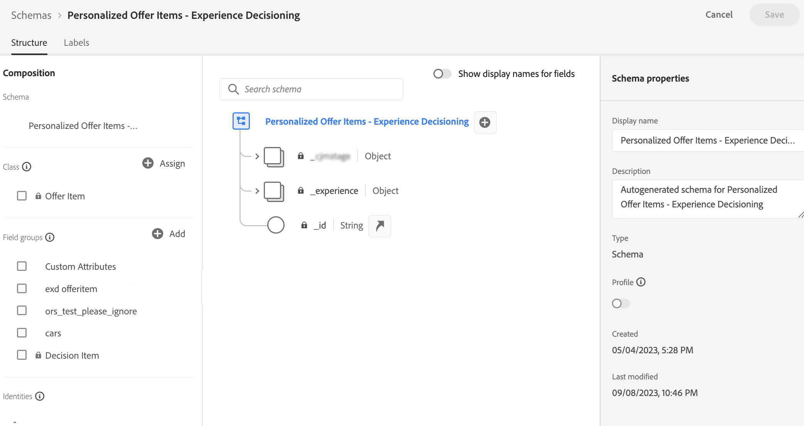

# Configuración del catálogo de elementos {#catalog}

>[!CONTEXTUALHELP]
>id="ajo_exd_item_custom_attributes"
>title="Definición de los atributos personalizados"
>abstract="Los atributos personalizados son atributos específicos adaptados a sus necesidades que puede asignar a un elemento de decisión. Se crean en el esquema de catálogo de los elementos de decisión."

En Decisioning, los catálogos sirven como contenedores centrales para organizar los elementos de decisión. Cada catálogo está vinculado a un esquema [!DNL Adobe Experience Platform], que incluye todos los atributos asignables a un elemento de decisión.

Por ahora, todos los elementos de decisión creados se consolidan dentro de un único catálogo &quot;Ofertas&quot;, al que se puede acceder mediante el menú **[!UICONTROL Catálogos]**.

## Protecciones y limitaciones

Para garantizar un rendimiento y una coherencia óptimos, Decisioning aplica las siguientes barreras y limitaciones:

* **Tipos de datos compatibles**

  Por ahora, Decisioning admite exclusivamente los siguientes tipos de datos: String, Integer, Boolean, Date, DateTime, Decisioning Asset y Object. Cualquier campo que no pertenezca a estos tipos de datos no estará disponible para su uso durante la creación de un elemento de decisión o un catálogo.

* **Límite de atributo personalizado**

  Cada elemento de decisión puede incluir hasta 100 atributos personalizados.

* **Restricciones de anidamiento**

  Se admite un máximo de cuatro niveles de anidación. Las imágenes no se admiten en el último nivel.

## Acceso y edición del esquema del catálogo {#access-catalog-schema}

Para acceder al esquema del catálogo donde se almacenan los atributos de los elementos de decisión, siga estos pasos:

1. En la lista de elementos, haga clic en el botón **[!UICONTROL Editar esquema]** ubicado junto al botón **[!UICONTROL Crear elemento]**.

1. El esquema del catálogo se abre en una nueva pestaña, que sigue la estructura siguiente:

   * El nodo **`_experience`** incluye atributos de elementos de decisión estándar como nombre, fecha de inicio y finalización y descripción.
   * El nodo **`_<imsOrg>`** aloja atributos de elementos de decisión personalizados, donde `<imsOrg>` se reemplaza con el nombre de su organización (por ejemplo, `_luma` para la compañía de Luma). De forma predeterminada, no se configuran atributos personalizados, pero puede agregar tantos como sea necesario para adaptarlos a sus necesidades. Una vez finalizado, los atributos personalizados aparecen en la pantalla de creación de elementos de decisión junto con los atributos estándar.

   

1. Para agregar un atributo personalizado al esquema, expanda el nodo de su organización (por ejemplo, **`_luma`**) y haga clic en el botón &quot;+&quot; en la ubicación deseada en la estructura.

   

1. Rellene los campos necesarios para el atributo agregado y haga clic en **[!UICONTROL Aplicar]**.

   El valor que se introduce en un atributo con un atributo de recurso de toma de decisiones es una URL pública. La mayoría de las veces, esto apuntaría a una imagen. Encontrará información detallada sobre cómo trabajar con [!DNL Adobe Experience Platform] esquemas en la [documentación del sistema XDM](https://experienceleague.adobe.com/docs/experience-platform/xdm/ui/overview.html?lang=es).

1. Una vez añadidos los atributos personalizados deseados, guarde el esquema. El nuevo campo ya está disponible en la pantalla de creación de elementos de decisión, en la sección **[!UICONTROL Atributos personalizados]**.

   El ejemplo siguiente muestra una pantalla de creación de elementos con atributos personalizados como objetos definidos en el esquema.

   
