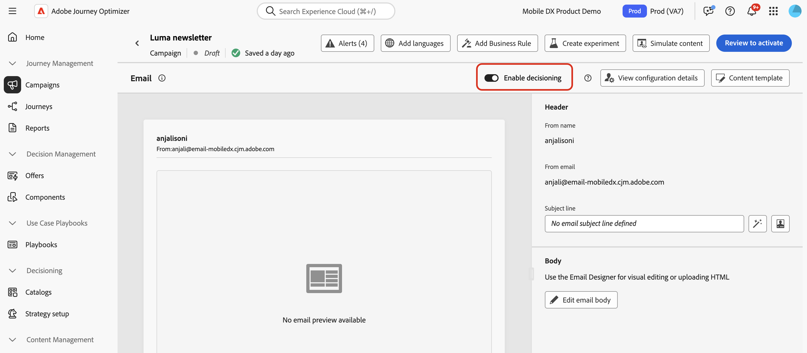

# Creación de políticas de decisión {#create-decision}

>[!CONTEXTUALHELP]
>id="ajo_code_based_item_number"
>title="Definición del número de elementos que desea devolver"
>abstract="Seleccione el número de elementos de decisión que desea que se devuelvan. Por ejemplo, si selecciona 2, se presentarán las dos mejores ofertas aptas para la configuración actual."

>[!CONTEXTUALHELP]
>id="ajo_code_based_fallback"
>title="Selección de una reserva"
>abstract="Un elemento de reserva se muestra al usuario cuando no se cumple ninguna de las estrategias de selección definidas para esa política de decisión."

>[!CONTEXTUALHELP]
>id="ajo_code_based_strategy"
>title="¿Qué es una estrategia?"
>abstract="La secuencia de la estrategia de selección determina qué estrategia se evaluará primero. Se requiere al menos una estrategia. Los elementos de decisión de las estrategias combinadas se evaluarán juntos."
>additional-url="https://experienceleague.adobe.com/es/docs/journey-optimizer/using/decisioning/offer-decisioning/get-started-decision/starting-offer-decisioning" text="Creación de estrategias"

Para presentar la mejor oferta dinámica y experiencia a sus clientes, agregue una política de decisión al contenido de una campaña o recorrido y, a continuación, configure los elementos que desea devolver y la estrategia de selección que desea utilizar. Para ello, siga los pasos que aparecen a continuación.

>[!AVAILABILITY]
>
>Por ahora, las directivas de decisión están disponibles para todos los clientes del canal **Experiencia basada en código**. Están disponibles para el canal **Email** como disponibilidad limitada. Póngase en contacto con su representante de Adobe para obtener acceso.

## Agregar una política de decisión {#add}

1. Abra un recorrido o una campaña, seleccione una [acción de canal](../building-journeys/journeys-message.md) y edite el contenido del mensaje.

1. Para los mensajes de correo electrónico, alterne la opción **[!UICONTROL Enable Decisioning]**.

   

   >[!IMPORTANT]
   >
   >Al habilitar la toma de decisiones, se borra el contenido de correo electrónico existente. Si ya ha diseñado el correo electrónico, asegúrese de guardar el contenido como una plantilla de antemano.
   >
   >Tenga en cuenta que cualquier política de decisión configurada dentro del correo electrónico no se guardará en la plantilla. Si aplica la plantilla a otro correo electrónico, debe volver a configurar la directiva.

1. Abra el editor de personalización para crear la política de decisión.

   Para los correos electrónicos, también puede utilizar un menú dedicado en el Diseñador de correo electrónico para crear una política de decisión. Expanda las secciones siguientes para explorar los dos métodos.

   +++Cree una política de decisión desde el editor de Personalization

   1. Abra el editor de personalización y seleccione **[!UICONTROL Directiva de decisión]**.
   1. Haga clic en el botón **[!UICONTROL Agregar directiva de decisión]** para crear una directiva nueva.

      

   +++

   +++Creación de una política de decisión desde el Designer de correo electrónico

   Seleccione un componente en el contenido del correo electrónico, haga clic en el icono **[!UICONTROL Decisioning]** de la barra de herramientas o del panel de propiedades y, a continuación, seleccione **[!UICONTROL Agregar nueva directiva]**.

   El **[!UICONTROL resultado de reutilización de decisión]** le permite reutilizar una directiva de decisión que ya se ha creado en este correo electrónico.

   

   +++

## Configurar los detalles de la política de decisión {#configure}

Después de agregar una nueva política de decisión al contenido, se abre la pantalla de configuración de la política de decisión.

1. Proporcione un nombre para la política de decisión y seleccione un catálogo (actualmente limitado al catálogo predeterminado de **[!UICONTROL Ofertas]**).

1. Seleccione el número de elementos que desea devolver. Por ejemplo, si selecciona 2, se presentarán las dos mejores ofertas aptas para la configuración actual.

   

   Si desea devolver varios elementos en un mensaje de correo electrónico, debe utilizar un componente de contenido **[!UICONTROL Repetir cuadrícula]**. Expanda la sección siguiente para obtener más detalles:

   +++ Devolver varios elementos de decisión en correos electrónicos

   1. Arrastre un componente **[!UICONTROL Repetir cuadrícula]** en el correo electrónico y configúrelo como desee mediante el panel **[!UICONTROL Configuración]**.

      

   1. Haga clic en el icono **[!UICONTROL Decisioning]** en la barra de herramientas del lienzo o abra el panel **[!UICONTROL Decisioning]** y seleccione **[!UICONTROL Agregar directiva de decisión]**.

   1. Especifique el número de elementos que desea devolver en el campo **[!UICONTROL Número de elementos]** y, a continuación, configure la directiva de decisión como se documenta a continuación. El número máximo de elementos que puede seleccionar está limitado por el número de mosaicos definidos en el componente **[!UICONTROL Repetir cuadrícula]**.

   

   +++

1. Haga clic en **[!UICONTROL Next]**.

## Seleccionar elementos y configurar estrategias de selección {#select}

La sección **[!UICONTROL Secuencia de estrategia]** le permite seleccionar los elementos de decisión y configurar estrategias de selección para presentar con la directiva de decisión.

1. Haga clic en **[!UICONTROL Agregar]** y elija el tipo de objeto que desea incluir en la directiva:

   

   * **[!UICONTROL Estrategia de selección]**: las estrategias de decisión aprovechan las colecciones asociadas con las restricciones de elegibilidad y los métodos de clasificación para determinar los elementos que se mostrarán.

     Puede seleccionar una o varias estrategias de selección existentes, o crear una nueva mediante el botón **[!UICONTROL Crear estrategia de selección]**. [Aprenda a crear estrategias de selección](selection-strategies.md)

   * **[!UICONTROL Elemento de decisión]**: seleccione elementos de decisión únicos sin tener que ejecutar una estrategia de selección.

     Solo puede seleccionar un elemento de decisión a la vez. Se aplicarán todas las restricciones de aceptación establecidas para el artículo.

   >[!NOTE]
   >
   >Una política de decisión admite hasta 10 estrategias de selección y elementos de decisión combinados. [Más información sobre las limitaciones y protecciones de decisiones](gs-experience-decisioning.md#guardrails)

1. Al agregar varios elementos de decisión o estrategias, se evaluarán en un orden específico. El primer objeto añadido a la secuencia se evaluará primero, y así sucesivamente. Para cambiar la secuencia predeterminada, arrastre y suelte los objetos o los grupos para reordenarlos como desee. Expanda la sección siguiente para obtener más detalles.

   +++Administrar el orden de evaluación en una política de decisión

   Una vez que haya agregado elementos de decisión y estrategias de selección a la directiva, puede organizar su orden para determinar el orden de evaluación y combinar estrategias de selección para evaluarlos juntos.

   El **orden secuencial** en el que se evaluarán los elementos y las estrategias se indica con números a la izquierda de cada objeto o grupo de objetos. Para mover la posición de una estrategia de selección (o un grupo de estrategias) dentro de la secuencia, arrástrela y suéltela en otra posición.

   

   >[!NOTE]
   >
   >Solo se pueden arrastrar y soltar estrategias de selección dentro de una secuencia. Para cambiar la posición de un elemento de decisión, debe eliminarlo y volver a agregarlo usando el botón **[!UICONTROL Agregar]** después de agregar los demás elementos que desea evaluar antes.

   También puede **combinar** múltiples estrategias de selección en grupos para que se evalúen juntos y no por separado. Para ello, haga clic en el botón **`+`** de una estrategia de selección para combinarlo con otra. También puede arrastrar y soltar una estrategia de selección en otra para agrupar las dos estrategias en un grupo.

   >[!NOTE]
   >
   >Los elementos de decisión no se pueden agrupar con otros elementos o estrategias de selección.

   Varias estrategias y su agrupación determinan la prioridad de las estrategias y la clasificación de las ofertas aptas. La primera estrategia tiene la máxima prioridad y las estrategias combinadas dentro del mismo grupo tienen la misma prioridad.

   Por ejemplo, tiene dos colecciones, una en la estrategia A y otra en la estrategia B. La solicitud es para que se devuelvan dos elementos de decisión. Digamos que hay dos ofertas elegibles de la estrategia A y tres ofertas elegibles de la estrategia B.

   * Si las dos estrategias están **sin combinar** o en orden secuencial (1 y 2), las dos ofertas principales elegibles de la primera estrategia se devolverán en la primera fila. Si no hay dos ofertas aptas para la primera estrategia, el motor de decisión pasará a la siguiente estrategia en secuencia para encontrar tantas ofertas que aún se necesitan y, finalmente, devolverá una reserva si es necesario.

     

   * Si las dos colecciones se **evalúan al mismo tiempo**, ya que hay dos ofertas elegibles de la estrategia A y tres ofertas elegibles de la estrategia B, las cinco ofertas se apilarán todas juntas en función del valor determinado por los métodos de clasificación respectivos. Se solicitan dos ofertas, por lo que se devolverán las dos ofertas aptas principales de estas cinco ofertas.

     

   **Ejemplo con varias estrategias**

   Veamos un ejemplo en el que tiene varias estrategias divididas en diferentes grupos. Usted definió tres estrategias. La Estrategia 1 y la Estrategia 2 se combinan en el Grupo 1 y la Estrategia 3 es independiente (Grupo 2). Las ofertas elegibles para cada estrategia y su prioridad (utilizadas en la evaluación de la función de clasificación) son las siguientes:

   * Grupo 1:
      * Estrategia 1 - (Oferta 1, Oferta 2, Oferta 3) - Prioridad 1
      * Estrategia 2 - (Oferta 3, Oferta 4, Oferta 5) - Prioridad 1

   * Grupo 2:
      * Estrategia 3 - (Oferta 5, Oferta 6) - Prioridad 0

   Las ofertas de estrategia de mayor prioridad se evalúan primero y se añaden a la lista de ofertas clasificadas.

   * **Iteración 1:**

     Las ofertas de Estrategia 1 y Estrategia 2 se evalúan juntas (Oferta 1, Oferta 2, Oferta 3, Oferta 4, Oferta 5). Digamos que el resultado es:

     Oferta 1 - 10
Oferta 2 - 20
Oferta 3 - 30 de Estrategia 1, 45 de Estrategia 2. Se tendrá en cuenta el más alto de ambos, por lo que se tienen en cuenta 45.
Oferta 4 - 40
Oferta 5 - 50

     Las ofertas clasificadas ahora son las siguientes: Oferta 5, Oferta 3, Oferta 4, Oferta 2, Oferta 1.

   * **Iteración 2:**

     Se evalúan las ofertas de Estrategia 3 (oferta 5, oferta 6). Digamos que el resultado es:

      * Oferta 5: no se evaluará porque ya existe en el resultado anterior.
      * Oferta 6 - 60

     Las ofertas clasificadas ahora son las siguientes: Oferta 5 , Oferta 3, Oferta 4, Oferta 2, Oferta 1, Oferta 6.

   +++

1. Cuando la estrategia de selección esté lista, haga clic en **[!UICONTROL Siguiente]**.

## Añadir ofertas de reserva {#fallback}

Una vez que haya seleccionado elementos de decisión o estrategias de selección, puede añadir ofertas de reserva para mostrar si ninguno de los elementos o estrategias de selección anteriores está cualificado.

Puede seleccionar cualquier elemento de la lista, que muestra todos los elementos de decisión creados en la zona protegida actual. Si no se califica ninguna estrategia de selección, la reserva se mostrará al usuario independientemente de las fechas y restricciones de elegibilidad aplicadas al elemento seleccionado<!--nor frequency capping when available - TO CLARIFY-->.

>[!NOTE]
> Las retrospectivas son opcionales. Se puede seleccionar hasta el número de elementos solicitados. Si ninguno es elegible y no se establece ninguna reserva, no se mostrará nada.

## Revisar y guardar la directiva de decisión {#save}

Después de configurar una estrategia de selección y agregar ofertas de reserva, haga clic en **[!UICONTROL Siguiente]** para revisar y guardar la directiva de decisión y, a continuación, haga clic en **[!UICONTROL Crear]** para confirmar la creación de la directiva.

Puede editar o eliminar una directiva de decisión en cualquier momento mediante el botón de puntos suspensivos del editor de personalización o en el menú **[!UICONTROL Decisioning]** del panel de propiedades del componente.

>[!BEGINTABS]

>[!TAB Editar o eliminar una directiva del editor de personalización]

>[!TAB Editar o eliminar una directiva de las propiedades del componente]

>[!ENDTABS]

## Asignar una ubicación (correo electrónico) {#placement}

Para los correos electrónicos, debe definir una ubicación para el componente asociado a la política de decisión.

Para ello, haga clic en el botón **[!UICONTROL Decisioning]** del panel de propiedades del componente y seleccione **[!UICONTROL Asignar ubicación]**. [Aprenda a trabajar con ubicaciones](../experience-decisioning/placements.md)

## Próximos pasos {#next-steps}

Ahora que sabe cómo crear una directiva de decisión, está listo para usarlo en [!DNL Journey Optimizer] canales para entregar ofertas.

➡️ [Aprenda a utilizar las directivas de decisión en los mensajes](../experience-decisioning/use-decision-policy.md)

