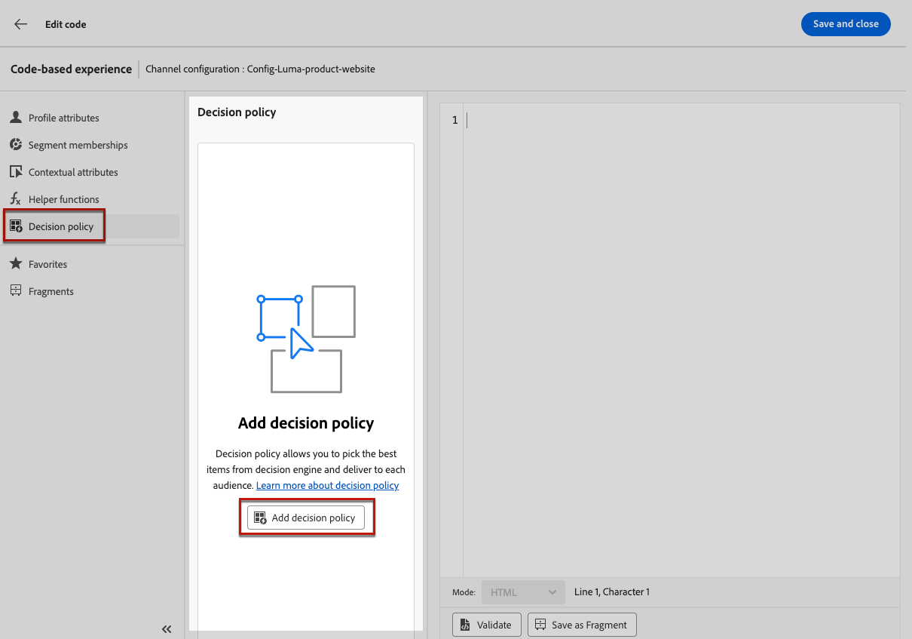
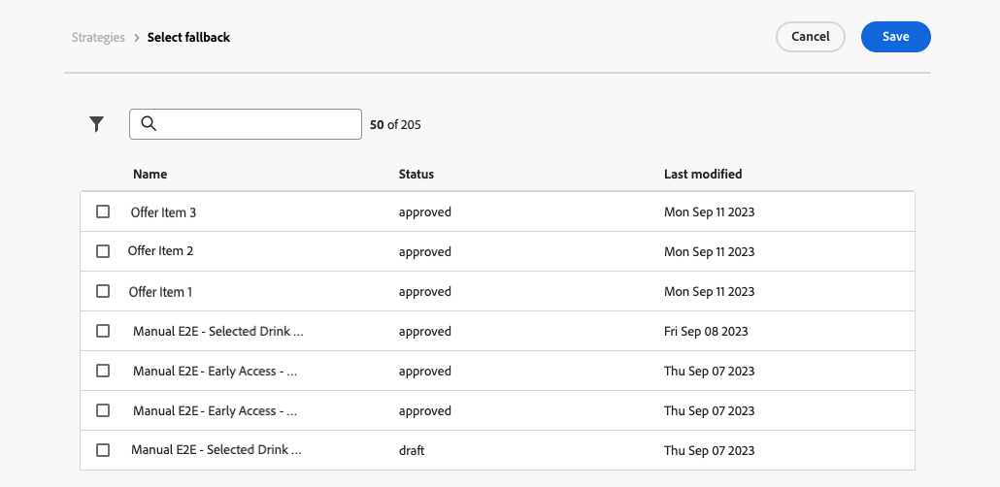

# Creación de políticas de decisión {#create-decision}

>[!CONTEXTUALHELP]
>id="ajo_code_based_decision"
>title="¿Qué es una decisión?"
>abstract="Las políticas de decisión contienen toda la lógica de selección para que el motor de decisión elija el mejor contenido. Las políticas de decisión son específicas de la campaña. Su meta es seleccionar las mejores ofertas para cada perfil, mientras que la creación de campañas le permite indicar cómo se deben presentar los elementos de decisión seleccionados, incluidos los atributos de elemento que se deben incluir en el mensaje."
>additional-url="https://experienceleague.adobe.com/es/docs/journey-optimizer/using/decisioning/offer-decisioning/get-started-decision/starting-offer-decisioning" text="Acerca de la toma de decisiones"

>[!CONTEXTUALHELP]
>id="ajo_journey_decision_policy"
>title="Definición de una política de decisión"
>abstract="Una política de decisión le permite elegir los mejores elementos del motor de decisión y enviarlos al público adecuado."
>additional-url="https://experienceleague.adobe.com/es/docs/journey-optimizer/using/decisioning/offer-decisioning/get-started-decision/starting-offer-decisioning" text="Acerca de la toma de decisiones"

>[!CONTEXTUALHELP]
>id="ajo_exd_decision_policy"
>title="Política de decisión"
>abstract="Una política de decisión permite elegir los mejores elementos del motor de decisión y enviarlos a cada público."

>[!CONTEXTUALHELP]
>id="ajo_exd_placements"
>title="Ubicación"
>abstract="Una ubicación determina dónde aparecen los elementos devueltos por el motor de decisión en un mensaje. Puede realizar un seguimiento de su rendimiento en diferentes ubicaciones en la creación de informes."

Las políticas de decisión son contenedores para sus ofertas que aprovechan el motor de decisión para elegir el mejor contenido que se ofrece, según la audiencia.

<!--Decision policies contain all of the selection logic for the decisioning engine to pick the best content. Decision policies are campaign specific. -->Su objetivo es seleccionar las mejores ofertas para cada perfil, mientras que la creación de campañas/recorridos le permite indicar cómo se deben presentar los elementos de decisión seleccionados, incluidos los atributos de elemento que se deben incluir en el mensaje.

>[!NOTE]
>
>En la interfaz de usuario [!DNL Journey Optimizer], las directivas de decisión se etiquetan como decisiones<!--but they are decision policies. TBC if this note is needed-->.

Los pasos principales para aprovechar las políticas de decisión en sus campañas basadas en código son los siguientes:

1. [Añadir una política de decisión a una experiencia basada en código](#add-decision)
1. [Usar la directiva de decisión](#use-decision-policy)
1. [Creación de paneles de informes de Customer Journey Analytics personalizados](cja-reporting.md)

## Añadir una política de decisión a una experiencia basada en código {#add-decision}

>[!CONTEXTUALHELP]
>id="ajo_code_based_item_number"
>title="Definición del número de elementos que desea devolver"
>abstract="Seleccione el número de elementos de decisión que desea que se devuelvan. Por ejemplo, si selecciona 2, se presentarán las dos mejores ofertas aptas para la configuración actual."

>[!CONTEXTUALHELP]
>id="ajo_code_based_fallback"
>title="Selección de una reserva"
>abstract="Un elemento de reserva se muestra al usuario cuando no se cumple ninguna de las estrategias de selección definidas para esa política de decisión."

>[!CONTEXTUALHELP]
>id="ajo_code_based_strategy"
>title="¿Qué es una estrategia?"
>abstract="La secuencia de la estrategia de selección determina qué estrategia se evaluará primero. Se requiere al menos una estrategia. Los elementos de decisión de las estrategias combinadas se evaluarán juntos."
>additional-url="https://experienceleague.adobe.com/es/docs/journey-optimizer/using/decisioning/offer-decisioning/get-started-decision/starting-offer-decisioning" text="Creación de estrategias"

Para presentar la mejor oferta dinámica y experiencia a los visitantes de su sitio web o aplicación móvil, agregue una política de decisión a una campaña o recorrido basado en código. Para ello, siga los pasos que aparecen a continuación.

### Creación de la política de decisión {#add}

1. Cree una campaña y seleccione la acción **[!UICONTROL Experiencia basada en código]**. [Más información](../code-based/create-code-based.md)

1. En el [editor de código](../code-based/create-code-based.md#edit-code), seleccione **[!UICONTROL directiva de decisión]** y haga clic en **[!UICONTROL Agregar directiva de decisión]**.

   

   Desde la pantalla de edición de recorrido o campaña, también puede añadir directamente una política de decisión sin abrir el editor de personalización. Utilice el icono dedicado en el carril derecho para mostrar la sección **[!UICONTROL Decisioning]**.

   

1. De forma predeterminada, cree una nueva directiva.

   >[!NOTE]
   >
   >También puede elegir seleccionar una política existente.

1. Complete los detalles de la política de decisión: añada un nombre y seleccione un catálogo.

   >[!NOTE]
   >
   >Actualmente solo está disponible el catálogo predeterminado **[!UICONTROL Ofertas]**.

1. Seleccione el número de elementos que desea que se devuelvan. Por ejemplo, si selecciona 2, se presentarán las 2 mejores ofertas aptas para la configuración actual. Haga clic en **[!UICONTROL Next]**.

   

### Seleccionar elementos y estrategias de selección {#select}

La sección **[!UICONTROL Secuencia de estrategia]** le permite seleccionar los elementos de decisión y las estrategias de selección que se presentarán con la directiva de decisión.

1. Haga clic en el botón **[!UICONTROL Add]**.

1. Elija el tipo de objeto que desea incluir en la directiva:

   * **[!UICONTROL Estrategia de selección]**: agregue una o varias estrategias de selección. Las estrategias de decisión aprovechan las colecciones asociadas con las restricciones de elegibilidad y los métodos de clasificación para determinar los elementos que se van a mostrar. Puede seleccionar una estrategia de selección existente o crear una nueva mediante el botón **[!UICONTROL Crear estrategia de selección]**. [Aprenda a crear estrategias de selección](selection-strategies.md)

   * **[!UICONTROL elemento de decisión]**: agregue elementos de decisión únicos para presentar sin tener que ejecutar una estrategia de selección. Solo puede seleccionar un elemento de decisión a la vez. Se aplicarán todas las restricciones de aceptación establecidas para el artículo.

   

   >[!NOTE]
   >
   >Una política de decisión admite hasta 10 estrategias de selección y elementos de decisión combinados. [Más información sobre las limitaciones y protecciones de decisiones](gs-experience-decisioning.md#guardrails)

1. Al agregar varios elementos de decisión o estrategias, se evaluarán en un orden específico. El primer objeto añadido a la secuencia se evaluará primero, y así sucesivamente.

   Para cambiar la secuencia predeterminada, puede arrastrar y soltar los objetos o los grupos para reordenarlos como desee. [Más información](#evaluation-order)

### Administrar el orden de evaluación en una política de decisión {#evaluation-order}

Una vez que haya agregado elementos de decisión y estrategias de selección a la directiva, puede organizar su orden para determinar el orden de evaluación y combinar estrategias de selección para evaluarlos juntos.

El **orden secuencial** en el que se evaluarán los elementos y las estrategias se indica con números a la izquierda de cada objeto o grupo de objetos. Para mover la posición de una estrategia de selección (o un grupo de estrategias) dentro de la secuencia, arrástrela y suéltela en otra posición.

>[!NOTE]
>
>Solo se pueden arrastrar y soltar estrategias de selección dentro de una secuencia. Para cambiar la posición de un elemento de decisión, debe eliminarlo y volver a agregarlo usando el botón **[!UICONTROL Agregar]** después de agregar los demás elementos que desea evaluar antes.

También puede **combinar** múltiples estrategias de selección en grupos para que se evalúen juntos y no por separado. Para ello, haga clic en el botón **`+`** de una estrategia de selección para combinarlo con otra. También puede arrastrar y soltar una estrategia de selección en otra para agrupar las dos estrategias en un grupo.

>[!NOTE]
>
>Los elementos de decisión no se pueden agrupar con otros elementos o estrategias de selección.

Varias estrategias y su agrupación determinan la prioridad de las estrategias y la clasificación de las ofertas aptas. La primera estrategia tiene la máxima prioridad y las estrategias combinadas dentro del mismo grupo tienen la misma prioridad.

Por ejemplo, tiene dos colecciones, una en la estrategia A y otra en la estrategia B. La solicitud es para que se devuelvan dos elementos de decisión. Digamos que hay dos ofertas elegibles de la estrategia A y tres ofertas elegibles de la estrategia B.

* Si las dos estrategias están **sin combinar** o en orden secuencial (1 y 2), las dos ofertas principales elegibles de la primera estrategia se devolverán en la primera fila. Si no hay dos ofertas aptas para la primera estrategia, el motor de decisión pasará a la siguiente estrategia en secuencia para encontrar tantas ofertas que aún se necesitan y, finalmente, devolverá una reserva si es necesario.

  

* Si las dos colecciones se **evalúan al mismo tiempo**, ya que hay dos ofertas elegibles de la estrategia A y tres ofertas elegibles de la estrategia B, las cinco ofertas se apilarán todas juntas en función del valor determinado por los métodos de clasificación respectivos. Se solicitan dos ofertas, por lo que se devolverán las dos ofertas aptas principales de estas cinco ofertas.

  

+++ **Ejemplo con varias estrategias**

Veamos un ejemplo en el que tiene varias estrategias divididas en diferentes grupos.

Usted definió tres estrategias. La Estrategia 1 y la Estrategia 2 se combinan en el Grupo 1 y la Estrategia 3 es independiente (Grupo 2).

Las ofertas elegibles para cada estrategia y su prioridad (utilizadas en la evaluación de la función de clasificación) son las siguientes:

* Grupo 1:
   * Estrategia 1 - (Oferta 1, Oferta 2, Oferta 3) - Prioridad 1
   * Estrategia 2 - (Oferta 3, Oferta 4, Oferta 5) - Prioridad 1

* Grupo 2:
   * Estrategia 3 - (Oferta 5, Oferta 6) - Prioridad 0

Las ofertas de estrategia de mayor prioridad se evalúan primero y se añaden a la lista de ofertas clasificadas.

**Iteración 1:**

Las ofertas de Estrategia 1 y Estrategia 2 se evalúan juntas (Oferta 1, Oferta 2, Oferta 3, Oferta 4, Oferta 5). Digamos que el resultado es:

Oferta 1 - 10
Oferta 2 - 20
Oferta 3 - 30 de Estrategia 1, 45 de Estrategia 2. Se tendrá en cuenta el más alto de ambos, por lo que se tienen en cuenta 45.
Oferta 4 - 40
Oferta 5 - 50

Las ofertas clasificadas ahora son las siguientes: Oferta 5, Oferta 3, Oferta 4, Oferta 2, Oferta 1.

**Iteración 2:**

Se evalúan las ofertas de Estrategia 3 (oferta 5, oferta 6). Digamos que el resultado es:

* Oferta 5: no se evaluará porque ya existe en el resultado anterior.
* Oferta 6 - 60

Las ofertas clasificadas ahora son las siguientes: Oferta 5 , Oferta 3, Oferta 4, Oferta 2, Oferta 1, Oferta 6.

+++

### Añadir ofertas de reserva {#fallback}

Una vez que haya seleccionado elementos de decisión o estrategias de selección, puede agregar ofertas de reserva que se mostrarán a los usuarios si no se clasifica ninguno de los elementos o estrategias de selección anteriores.

Puede seleccionar cualquier elemento de la lista, que muestra todos los elementos de decisión creados en la zona protegida actual. Si no se califica ninguna estrategia de selección, la reserva se mostrará al usuario independientemente de las fechas y restricciones de elegibilidad aplicadas al elemento seleccionado<!--nor frequency capping when available - TO CLARIFY-->.

>[!NOTE]
>
>Una alternativa es opcional. Si no se selecciona ninguna reserva y no se califica ninguna estrategia, [!DNL Journey Optimizer] no mostrará nada. Puede añadir hasta el número de elementos que solicita la política de decisión. Esto garantiza que se devuelva un determinado número de elementos si se desea para el caso de uso.

Cuando la directiva de decisión esté lista, guárdela y haga clic en **[!UICONTROL Crear]**. Ahora que se ha creado la política de decisión, puede utilizar los atributos de decisión dentro del contenido de la experiencia basado en código. [Más información](#use-decision-policy)

## Uso de la política de decisión en el editor de código {#use-decision-policy}

Una vez creada, la directiva de decisión se puede usar en el [editor de personalización](../code-based/create-code-based.md#edit-code). Para ello, siga los pasos que aparecen a continuación.

>[!NOTE]
>
>La experiencia basada en código aprovecha el editor de personalización [!DNL Journey Optimizer] con todas sus capacidades de personalización y creación. [Más información](../personalization/personalization-build-expressions.md)

1. Haga clic en el botón **[!UICONTROL Insertar directiva]**. Se agrega el código correspondiente a la política de decisión.

   

   >[!NOTE]
   >
   >Esta secuencia se repetirá el número de veces que desee que se devuelva la política de decisión. Por ejemplo, si eligió devolver 2 elementos al [crear la decisión](#add-decision), la misma secuencia se repetirá dos veces.

1. Ahora puede agregar todos los atributos de decisión que desee dentro de ese código. Los atributos disponibles se almacenan en el esquema del catálogo **[!UICONTROL Ofertas]**. Los atributos personalizados se almacenan en la carpeta **`_<imsOrg`>** y los atributos estándar en la carpeta **`_experience`**. [Más información sobre el esquema del catálogo de ofertas](catalogs.md)

   

   >[!NOTE]
   >
   >Para el seguimiento de elementos de la directiva de decisión, el atributo `trackingToken` debe agregarse de la siguiente manera para el contenido de la directiva de decisión:
   >`trackingToken: {{item._experience.decisioning.decisionitem.trackingToken}}`

1. Haga clic en cada carpeta para expandirla. Coloque el cursor del ratón en la ubicación deseada y haga clic en el icono + situado junto al atributo que desee añadir. Puede agregar todos los atributos que desee al código.

   

1. Asegúrese de envolver el bucle `#each` dentro de un par de corchetes `[ ]` y agregue una coma justo antes de cerrar `/each`.

   

1. También puede añadir cualquier otro atributo disponible en el editor de personalización, como atributos de perfil.

   

1. Haga clic en **[!UICONTROL Guardar y cerrar]** para confirmar los cambios.

1. Revise y publique su campaña o recorrido de experiencias basado en código. [Descubra cómo](../code-based/publish-code-based.md)

   Ahora, tan pronto como el desarrollador realice una API o una llamada de SDK para recuperar contenido para la superficie definida en la configuración de canal, los cambios se aplicarán a su página web o aplicación.

   >[!NOTE]
   >
   >Actualmente no puedes simular contenido desde la interfaz de usuario en una campaña o recorrido de [experiencia basada en código](../code-based/create-code-based.md) usando decisiones. Hay una solución disponible en [esta sección](../code-based/code-based-decisioning-implementations.md).

1. Para ver el rendimiento de sus decisiones, puede crear [paneles personalizados de informes de Customer Journey Analytics](cja-reporting.md).

