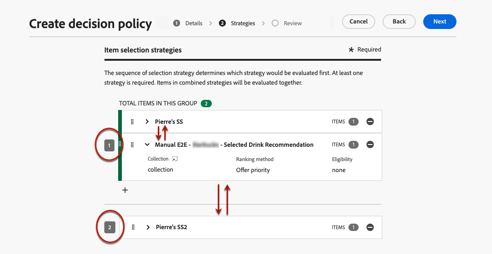

# Creación de políticas de decisión {#create-decision}

>[!CONTEXTUALHELP]
>id="ajo_code_based_decision"
>title="¿Qué es una decisón?"
>abstract="Las políticas de decisión contienen toda la lógica de selección para que el motor de decisión elija el mejor contenido. Las políticas de decisión son específicas de la campaña. Su objetivo es seleccionar las mejores ofertas para cada perfil, mientras que la creación de campañas le permite indicar cómo se deben presentar los elementos de decisión seleccionados, incluidos los atributos de elemento que se deben incluir en el mensaje."
>additional-url="https://experienceleague.adobe.com/es/docs/journey-optimizer/using/decisioning/offer-decisioning/get-started-decision/starting-offer-decisioning" text="Acerca de Experience Decisioning"

Las políticas de decisión son contenedores para sus ofertas que aprovechan el motor de decisión de experiencias para elegir el mejor contenido que se ofrece, según la audiencia.

Las políticas de decisión contienen toda la lógica de selección para que el motor de decisión elija el mejor contenido. Las políticas de decisión son específicas de la campaña. Su objetivo es seleccionar las mejores ofertas para cada perfil, mientras que la creación de campañas le permite indicar cómo se deben presentar los elementos de decisión seleccionados, incluidos los atributos de elemento que se deben incluir en el mensaje.

>[!NOTE]
>
>En el [!DNL Journey Optimizer] interfaz de usuario, las políticas de decisión se etiquetan como decisiones<!--but they are decision policies. TBC if this note is needed-->.

## Añadir una política de decisión a una campaña basada en código {#add-decision}

>[!CONTEXTUALHELP]
>id="ajo_code_based_item_number"
>title="Defina el número de elementos que desea devolver"
>abstract="Seleccione el número de elementos de decisión que desea que se devuelvan. Por ejemplo, si selecciona 2, se presentarán las dos mejores ofertas aptas para la superficie actual."

>[!CONTEXTUALHELP]
>id="ajo_code_based_fallback"
>title="Seleccionar una reserva"
>abstract="Un elemento de reserva se muestra al usuario cuando no se cumple ninguna de las estrategias de selección definidas para esa directiva de decisión."

>[!CONTEXTUALHELP]
>id="ajo_code_based_strategy"
>title="¿Qué es una estrategia?"
>abstract="La secuencia de la estrategia de selección determina qué estrategia se evaluará primero. Se requiere al menos una estrategia. Los elementos de decisión de las estrategias combinadas se evaluarán juntos."
>additional-url="https://experienceleague.adobe.com/es/docs/journey-optimizer/using/decisioning/offer-decisioning/get-started-decision/starting-offer-decisioning" text="Creación de estrategias"
>additional-url="https://experienceleague.adobe.com/es/docs/journey-optimizer/using/decisioning/offer-decisioning/get-started-decision/starting-offer-decisioning" text="Orden de evaluación"

Para presentar la mejor oferta dinámica y experiencia a los visitantes de su sitio web o aplicación móvil, agregue una política de decisión a una campaña basada en código. Para ello, siga los pasos que aparecen a continuación.

1. Cree una campaña y seleccione **[!UICONTROL Experiencia basada en código]** acción. [Más información](../code-based/create-code-based.md)

1. Desde el [editor de código](../code-based/create-code-based.md#edit-code), seleccione la **[!UICONTROL Política de decisión]** y haga clic en **[!UICONTROL Agregar directiva de decisión]**.

   

1. Complete los detalles de la política de decisión: añada un nombre y seleccione un catálogo.

   >[!NOTE]
   >
   >Actualmente solo es el valor predeterminado **[!UICONTROL Ofertas]** catálogo disponible.

   

1. Seleccione el número de elementos que desea que se devuelvan. Por ejemplo, si selecciona 2, se presentarán las dos mejores ofertas aptas para la superficie actual. Clic **[!UICONTROL Siguiente]**

1. Utilice el **[!UICONTROL Agregar estrategia]** para definir las estrategias de selección de la política de decisión. Cada estrategia consiste en una colección de ofertas asociada con una restricción de elegibilidad y un método de clasificación para determinar las ofertas que se van a mostrar. [Más información](selection-strategies.md)

   

   >[!NOTE]
   >
   >Se requiere al menos una estrategia. No se pueden agregar más de 10 estrategias.

1. Desde el **[!UICONTROL Agregar estrategia]** , también puede crear una estrategia. El **[!UICONTROL Crear estrategia de selección]** botón le redirige a **[!UICONTROL Experience Decisioning]** > **[!UICONTROL Configuración de estrategia]** menú. [Más información](selection-strategies.md)

   

1. Al añadir varias estrategias, se evalúan en un orden específico. La primera estrategia que se añadió a la secuencia se evaluará primero, y así sucesivamente. [Más información](#evaluation-order)

   Para cambiar la secuencia predeterminada, puede arrastrar y soltar las estrategias o los grupos para reordenarlos como desee.

   

1. Agregar una reserva. Se mostrará un elemento de reserva al usuario si no se cumple ninguna de las estrategias de selección anteriores.

   

   Puede seleccionar cualquier elemento de la lista, que muestra todos los elementos de decisión creados en la zona protegida actual. Si no se cualifica ninguna estrategia de selección, se muestra la reserva al usuario independientemente de las fechas y restricciones de idoneidad aplicadas al elemento seleccionado<!--nor frequency capping when available - TO CLARIFY-->.

   >[!NOTE]
   >
   >Una alternativa es opcional. Si no se selecciona ninguna alternativa y no se cualifica ninguna estrategia, no se muestra nada [!DNL Journey Optimizer].

1. Guarde la selección y haga clic en **[!UICONTROL Crear]**. Ahora que se ha creado la política de decisión, puede utilizar los atributos de decisión dentro del contenido de la experiencia basado en código. [Más información](#use-decision-policy)

   

## Orden de evaluación {#evaluation-order}

Como se ha descrito anteriormente, una estrategia consta de una colección, un método de clasificación y restricciones de elegibilidad.

Puede hacer lo siguiente:

* Establezca el orden secuencial que desea para que se evalúen las estrategias,
* Combine varias estrategias para que se evalúen juntas y no por separado.

Varias estrategias y su agrupación determinan la prioridad de las estrategias y la clasificación de las ofertas aptas. La primera estrategia tiene la máxima prioridad y las estrategias combinadas dentro del mismo grupo tienen la misma prioridad.

Por ejemplo, tiene dos colecciones, una en la estrategia A y otra en la estrategia B. La solicitud es para que se devuelvan dos elementos de decisión. Digamos que hay dos ofertas elegibles de la estrategia A y tres ofertas elegibles de la estrategia B.

* Si las dos estrategias son **sin combinar** o en orden secuencial (1 y 2), las dos ofertas aptas principales de la primera estrategia se devuelven en la primera fila. Si no hay dos ofertas aptas para la primera estrategia, el motor de decisión pasará a la siguiente estrategia en secuencia para encontrar tantas ofertas que aún se necesitan y, finalmente, devolverá una reserva si es necesario.

  

* Si las dos colecciones son **evaluado al mismo tiempo**, ya que hay dos ofertas elegibles de la estrategia A y tres ofertas elegibles de la estrategia B, las cinco ofertas se apilarán todas juntas en función del valor determinado por los métodos de clasificación respectivos. Se solicitan dos ofertas, por lo que se devolverán las dos ofertas aptas principales de estas cinco ofertas.

  

+++ **Ejemplo con varias estrategias**

Veamos un ejemplo en el que tiene varias estrategias divididas en diferentes grupos.

Usted definió tres estrategias. La Estrategia 1 y la Estrategia 2 se combinan en el Grupo 1 y la Estrategia 3 es independiente (Grupo 2).

Las ofertas elegibles para cada estrategia y su prioridad (utilizadas en la evaluación de la función de clasificación) son las siguientes:

* Grupo 1:
   * Estrategia 1 - (Oferta 1, Oferta 2, Oferta 3) - Prioridad 1
   * Estrategia 2 - (Oferta 3, Oferta 4, Oferta 5) - Prioridad 1

* Grupo 2:
   * Estrategia 3 - (Oferta 5, Oferta 6) - Prioridad 0

Las ofertas de estrategia de mayor prioridad se evalúan primero y se añaden a la lista de ofertas clasificadas.

**Iteración 1:**

Las ofertas de Estrategia 1 y Estrategia 2 se evalúan juntas (Oferta 1, Oferta 2, Oferta 3, Oferta 4, Oferta 5). Digamos que el resultado es:

Oferta 1 - 10 Oferta 2 - 20 Oferta 3 - 30 de Estrategia 1, 45 de Estrategia 2. Se tendrá en cuenta el más alto de ambos, por lo que se tienen en cuenta 45.
Oferta 4 - 40 Oferta 5 - 50

Las ofertas clasificadas ahora son las siguientes: Oferta 5, Oferta 3, Oferta 4, Oferta 2, Oferta 1.

**Iteración 2:**

Se evalúan las ofertas de Estrategia 3 (oferta 5, oferta 6). Digamos que el resultado es:

* Oferta 5: no se evaluará porque ya existe en el resultado anterior.
* Oferta 6 - 60

Las ofertas clasificadas ahora son las siguientes: Oferta 5 , Oferta 3, Oferta 4, Oferta 2, Oferta 1, Oferta 6.

+++

## Uso de la política de decisión en el editor de código {#use-decision-policy}

Una vez creada, la política de decisión se puede utilizar en el [editor de personalización](../code-based/create-code-based.md#edit-code). Para ello, siga los pasos que aparecen a continuación.

>[!NOTE]
>
>La experiencia basada en código aprovecha las [!DNL Journey Optimizer] editor de personalización con todas sus funcionalidades de personalización y creación. [Más información](../personalization/personalization-build-expressions.md)

1. Haga clic en **[!UICONTROL Insertar política]** botón. Se agrega el código correspondiente a la política de decisión.

   

   >[!NOTE]
   >
   >Esta secuencia se repetirá el número de veces que desee que se devuelva la política de decisión. Por ejemplo, si elige devolver 2 elementos cuando [creación de la decisión](#add-decision), la misma secuencia se repetirá dos veces.

1. Ahora puede agregar todos los atributos de decisión que desee dentro de ese código. Los atributos disponibles se almacenan en **[!UICONTROL Ofertas]** esquema del catálogo. Los atributos personalizados se almacenan en **`_<imsOrg`>** carpeta y atributos estándar en la **`_experience`** carpeta. [Más información sobre el esquema del catálogo de ofertas](catalogs.md)

   

   >[!NOTE]
   >
   >Para el seguimiento de elementos de la política de decisión, la variable `trackingToken`debe agregarse el atributo como se indica a continuación para el contenido de la directiva de decisión:
   >`trackingToken: {{item._experience.decisioning.decisionitem.trackingToken}}`

1. Haga clic en cada carpeta para expandirla. Coloque el cursor del ratón en la ubicación deseada y haga clic en el icono + situado junto al atributo que desee añadir. Puede agregar todos los atributos que desee al código.

   

1. También puede añadir cualquier otro atributo disponible en el editor de personalización, como atributos de perfil.

   

## Creación de informes en Customer Journey Analytics {#cja}

Si trabaja con Customer Journey Analytics, puede crear paneles de informes personalizados para sus campañas basadas en código aprovechando Experience Decisioning.

A continuación se enumeran los pasos principales. Encontrará información detallada sobre cómo trabajar con un Customer Journey Analytics en la [Documentación del Customer Journey Analytics](https://experienceleague.adobe.com/en/docs/analytics-platform/using/cja-landing){target="_blank"}.

1. Creación y configuración de un **conexión** en Customer Journey Analytics. Esto le permite conectarse al conjunto de datos para el que desea crear informes. [Obtenga información sobre cómo crear una conexión](https://experienceleague.adobe.com/en/docs/analytics-platform/using/cja-connections/create-connection){target="_blank"}

1. Crear un **vista de datos** y asociarlo a la conexión creada anteriormente. En el **[!UICONTROL Componentes]** pestaña, elija los campos de esquema relevantes que desea mostrar en los informes. Para Experience Decisioning, asegúrese de incluir la variable **propositioninteraction** y **visualización de propuestas** campos. [Obtenga información sobre cómo crear y configurar vistas de datos](https://experienceleague.adobe.com/en/docs/analytics-platform/using/cja-dataviews/create-dataview){target="_blank"}

1. Combinación de componentes de datos, tablas y visualizaciones en **proyectos de workspace** para crear y compartir informes para su campaña basada en código.[Obtenga información sobre cómo crear proyectos de Workspace](https://experienceleague.adobe.com/en/docs/analytics-platform/using/cja-workspace/build-workspace-project/create-projects){target="_blank"}
