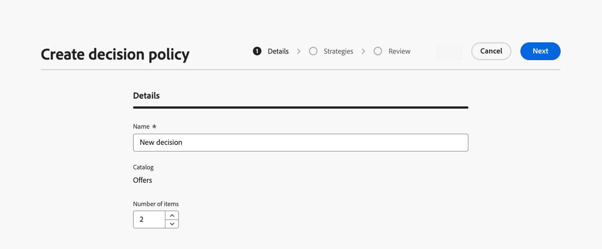

# Creación de políticas de decisión {#create-decision}

>[!CONTEXTUALHELP]
>id="ajo_code_based_decision"
>title="¿Qué es una decisión?"
>abstract="Las políticas de decisión contienen toda la lógica de selección para que el motor de decisión elija el mejor contenido. Las políticas de decisión son específicas de la campaña. Su meta es seleccionar las mejores ofertas para cada perfil, mientras que la creación de campañas le permite indicar cómo se deben presentar los elementos de decisión seleccionados, incluidos los atributos de elemento que se deben incluir en el mensaje."
>additional-url="https://experienceleague.adobe.com/es/docs/journey-optimizer/using/decisioning/offer-decisioning/get-started-decision/starting-offer-decisioning" text="Acerca de la toma de decisiones"

>[!CONTEXTUALHELP]
>id="ajo_journey_decision_policy"
>title="Definición de una política de decisión"
>abstract="Una política de decisión le permite elegir los mejores elementos del motor de decisión y enviarlos al público adecuado."
>additional-url="https://experienceleague.adobe.com/es/docs/journey-optimizer/using/decisioning/offer-decisioning/get-started-decision/starting-offer-decisioning" text="Acerca de la toma de decisiones"

>[!CONTEXTUALHELP]
>id="ajo_exd_decision_policy"
>title="Política de decisión"
>abstract="Una política de decisión permite elegir los mejores elementos del motor de decisión y enviarlos a cada público."

>[!CONTEXTUALHELP]
>id="ajo_exd_placements"
>title="Ubicación"
>abstract="Una ubicación determina dónde aparecen los elementos devueltos por el motor de decisión en un mensaje. Puede realizar un seguimiento de su rendimiento en diferentes ubicaciones en la creación de informes."

>[!CONTEXTUALHELP]
>id="ajo_exd_decision_attribute"
>title="Seleccionar atributos de decisión del catálogo"
>abstract="Los atributos de decisión se almacenan en el esquema del catálogo. Seleccione un atributo que desee utilizar aquí desde el catálogo seleccionado."

Las políticas de decisión son contenedores para sus ofertas que aprovechan el motor de decisión para devolver dinámicamente el mejor contenido para entregar a cada miembro de la audiencia. Su objetivo es seleccionar las mejores ofertas para cada perfil, mientras que la creación de campañas/recorridos le permite indicar cómo se deben presentar los elementos de decisión seleccionados, incluidos los atributos de elemento que se deben incluir en el mensaje.

## Pasos clave {#key}

Los pasos principales para aprovechar las políticas de decisión en sus mensajes son los siguientes:

1. [Cree una política de decisión en un correo electrónico o una experiencia basada en código](#add-decision)

   Configure una política de decisión en el correo electrónico o la experiencia basada en código eligiendo el número de elementos que desea devolver, configurando las estrategias de selección, las opciones de reserva y el orden de evaluación.

1. [Uso de la política de decisión en el contenido](#use-decision-policy)

   Personalice el contenido con el resultado y los atributos de la política de decisión de los elementos de decisión que desee mostrar en el mensaje.

1. [Creación de paneles de informes](cja-reporting.md)

   Cree paneles personalizados de Customer Journey Analytics para medir el rendimiento y obtener información sobre cómo se entregan las políticas de decisión y las ofertas y cómo se interactúa con ellas.

## Mecanismos de protección y limitaciones

* **Disponibilidad limitada - Política de decisiones en correos electrónicos** - Por ahora, la creación de políticas de decisiones en correos electrónicos está disponible en Disponibilidad limitada. Póngase en contacto con su representante de Adobe para obtener acceso.
* **Páginas espejo**: por ahora, los elementos de decisión no se representan en las páginas espejo de los correos electrónicos.
* **Tipo de seguimiento y vínculos**: para realizar el seguimiento de los vínculos generados por la toma de decisiones, defina estos vínculos en el esquema como &quot;Decisioning Assets&quot;. Los vínculos basados en atributos no se pueden rastrear.
* **Anidado de directivas de decisión en correos electrónicos**: no puede anidar varias directivas de decisión dentro de un componente de correo electrónico principal que ya tenga asociada una directiva de decisión.
* **recorridos/campañas duplicados con toma de decisiones**: si duplica un recorrido o una campaña que incluye una directiva de decisión, la versión duplicada hace referencia al correo electrónico o la experiencia basada en código original, lo que provoca errores. Siempre vuelva a configurar la política de decisión después de la duplicación.
* **Políticas de consentimiento**: las actualizaciones de las políticas de consentimiento tardan hasta 48 horas en surtir efecto. Si una directiva de decisión hace referencia a un atributo vinculado a una directiva de consentimiento actualizada recientemente, los cambios no se aplican inmediatamente.

  Del mismo modo, si se añaden nuevos atributos de perfil sujetos a una directiva de consentimiento a una directiva de decisión, se pueden utilizar, pero la directiva de consentimiento asociada a ellos no se aplicará hasta que haya pasado el retraso.

  Las políticas de consentimiento solo están disponibles para las organizaciones con el complemento Adobe Healthcare Shield o Privacy and Security Shield.

* **Clasificación de IA**: por ahora, la clasificación de IA no es compatible con el canal de correo electrónico en recorridos con toma de decisiones.

## Cree una política de decisión en un correo electrónico o una experiencia basada en código {#add-decision}

>[!CONTEXTUALHELP]
>id="ajo_code_based_item_number"
>title="Definición del número de elementos que desea devolver"
>abstract="Seleccione el número de elementos de decisión que desea que se devuelvan. Por ejemplo, si selecciona 2, se presentarán las dos mejores ofertas aptas para la configuración actual."

>[!CONTEXTUALHELP]
>id="ajo_code_based_fallback"
>title="Selección de una reserva"
>abstract="Un elemento de reserva se muestra al usuario cuando no se cumple ninguna de las estrategias de selección definidas para esa política de decisión."

>[!CONTEXTUALHELP]
>id="ajo_code_based_strategy"
>title="¿Qué es una estrategia?"
>abstract="La secuencia de la estrategia de selección determina qué estrategia se evaluará primero. Se requiere al menos una estrategia. Los elementos de decisión de las estrategias combinadas se evaluarán juntos."
>additional-url="https://experienceleague.adobe.com/es/docs/journey-optimizer/using/decisioning/offer-decisioning/get-started-decision/starting-offer-decisioning" text="Creación de estrategias"

Para presentar la mejor oferta dinámica y experiencia a los destinatarios y visitantes de los correos electrónicos en su sitio web o aplicación móvil, agregue una política de decisión a un correo electrónico o a una campaña o recorrido basados en código. Para ello, siga los pasos que aparecen a continuación.

### Crear una política de decisión {#add}

1. En un recorrido o campaña, agrega una acción **[!UICONTROL Correo electrónico]** o **[!UICONTROL Experiencia basada en código]**.

1. Para los mensajes de correo electrónico, cambie **[!UICONTROL Enable Decisioning]** en la pantalla de configuración.

   

   >[!IMPORTANT]
   >
   >Al habilitar la toma de decisiones, se borra el contenido de correo electrónico existente. Si ya ha diseñado el correo electrónico, asegúrese de guardar el contenido como una plantilla de antemano.
   >
   >Tenga en cuenta que cualquier política de decisión configurada dentro del correo electrónico no se guardará en la plantilla. Si aplica la plantilla a otro correo electrónico, debe volver a configurar la directiva.

1. Las políticas se pueden crear en experiencias basadas en correo electrónico y código mediante el editor de personalización. También pueden crearse en correos electrónicos desde un menú específico en el Designer de correo electrónico. Expanda las secciones siguientes para obtener más detalles.

   +++editor de Personalization

   1. Abra el editor de personalización y seleccione **[!UICONTROL Directiva de decisión]**.
   1. Haga clic en el botón **[!UICONTROL Agregar directiva de decisión]** para crear una directiva nueva.

      

   +++

   +++Enviar correo electrónico al menú de Designer **[!UICONTROL Decisioning]**

   1. Seleccione un componente, haga clic en el icono **[!UICONTROL Decisioning]** de la barra de herramientas o del panel de propiedades y, a continuación, seleccione **[!UICONTROL Agregar nueva directiva]**.

   1. Seleccione **[!UICONTROL Reutilizar resultado de decisión]** para reutilizar una directiva de decisión que ya se ha creado en este correo electrónico.

      

   +++

1. Proporcione un nombre y seleccione un catálogo (actualmente limitado al catálogo predeterminado de **[!UICONTROL Ofertas]**).

1. Seleccione el número de elementos que desea devolver. Por ejemplo, si selecciona 2, se presentarán las dos mejores ofertas aptas para la configuración actual.

   

   En el caso de los correos electrónicos, solo se pueden devolver varios elementos en un componente de contenido **[!UICONTROL Repetir cuadrícula]**. Expanda la sección siguiente para obtener más detalles:

   +++ Devolver varios elementos de decisión en correos electrónicos

   1. Arrastre un componente **[!UICONTROL Cuadrícula repetida]** al lienzo y configúrelo como desee mediante el panel **[!UICONTROL Configuración]**.

      

   1. Haga clic en el icono **[!UICONTROL Decisioning]** en la barra de herramientas del lienzo o abra el panel **[!UICONTROL Decisioning]** y seleccione **[!UICONTROL Agregar directiva de decisión]**.

   1. Especifique el número de elementos que desea devolver en el campo **[!UICONTROL Número de elementos]** y, a continuación, configure la directiva de decisión como se documenta a continuación. El número máximo de elementos que puede seleccionar está limitado por el número de mosaicos definidos en el componente **[!UICONTROL Repetir cuadrícula]**.

   

   +++

1. Haga clic en **[!UICONTROL Next]**.

### Seleccionar elementos y estrategias de selección {#select}

La sección **[!UICONTROL Secuencia de estrategia]** le permite seleccionar los elementos de decisión y las estrategias de selección que se presentarán con la directiva de decisión.

1. Haga clic en **[!UICONTROL Agregar]** y elija el tipo de objeto que desea incluir en la directiva:

   * **[!UICONTROL Estrategia de selección]**: agregue una o varias estrategias de selección. Las estrategias de decisión aprovechan las colecciones asociadas con las restricciones de elegibilidad y los métodos de clasificación para determinar los elementos que se van a mostrar. Puede seleccionar una estrategia de selección existente o crear una nueva mediante el botón **[!UICONTROL Crear estrategia de selección]**. [Aprenda a crear estrategias de selección](selection-strategies.md)

   * **[!UICONTROL elemento de decisión]**: agregue elementos de decisión únicos para presentar sin tener que ejecutar una estrategia de selección. Solo puede seleccionar un elemento de decisión a la vez. Se aplicarán todas las restricciones de aceptación establecidas para el artículo.

   

   >[!NOTE]
   >
   >Una política de decisión admite hasta 10 estrategias de selección y elementos de decisión combinados. [Más información sobre las limitaciones y protecciones de decisiones](gs-experience-decisioning.md#guardrails)

1. Al agregar varios elementos de decisión o estrategias, se evaluarán en un orden específico. El primer objeto añadido a la secuencia se evaluará primero, y así sucesivamente. Para cambiar la secuencia predeterminada, arrastre y suelte los objetos o los grupos para reordenarlos como desee. Expanda la sección siguiente para obtener más información.

   +++Administrar el orden de evaluación en una política de decisión

   Una vez que haya agregado elementos de decisión y estrategias de selección a la directiva, puede organizar su orden para determinar el orden de evaluación y combinar estrategias de selección para evaluarlos juntos.

   El **orden secuencial** en el que se evaluarán los elementos y las estrategias se indica con números a la izquierda de cada objeto o grupo de objetos. Para mover la posición de una estrategia de selección (o un grupo de estrategias) dentro de la secuencia, arrástrela y suéltela en otra posición.

   

   >[!NOTE]
   >
   >Solo se pueden arrastrar y soltar estrategias de selección dentro de una secuencia. Para cambiar la posición de un elemento de decisión, debe eliminarlo y volver a agregarlo usando el botón **[!UICONTROL Agregar]** después de agregar los demás elementos que desea evaluar antes.

   También puede **combinar** múltiples estrategias de selección en grupos para que se evalúen juntos y no por separado. Para ello, haga clic en el botón **`+`** de una estrategia de selección para combinarlo con otra. También puede arrastrar y soltar una estrategia de selección en otra para agrupar las dos estrategias en un grupo.

   >[!NOTE]
   >
   >Los elementos de decisión no se pueden agrupar con otros elementos o estrategias de selección.

   Varias estrategias y su agrupación determinan la prioridad de las estrategias y la clasificación de las ofertas aptas. La primera estrategia tiene la máxima prioridad y las estrategias combinadas dentro del mismo grupo tienen la misma prioridad.

   Por ejemplo, tiene dos colecciones, una en la estrategia A y otra en la estrategia B. La solicitud es para que se devuelvan dos elementos de decisión. Digamos que hay dos ofertas elegibles de la estrategia A y tres ofertas elegibles de la estrategia B.

   * Si las dos estrategias están **sin combinar** o en orden secuencial (1 y 2), las dos ofertas principales elegibles de la primera estrategia se devolverán en la primera fila. Si no hay dos ofertas aptas para la primera estrategia, el motor de decisión pasará a la siguiente estrategia en secuencia para encontrar tantas ofertas que aún se necesitan y, finalmente, devolverá una reserva si es necesario.

     

   * Si las dos colecciones se **evalúan al mismo tiempo**, ya que hay dos ofertas elegibles de la estrategia A y tres ofertas elegibles de la estrategia B, las cinco ofertas se apilarán todas juntas en función del valor determinado por los métodos de clasificación respectivos. Se solicitan dos ofertas, por lo que se devolverán las dos ofertas aptas principales de estas cinco ofertas.

     

   **Ejemplo con varias estrategias**

   Veamos un ejemplo en el que tiene varias estrategias divididas en diferentes grupos. Usted definió tres estrategias. La Estrategia 1 y la Estrategia 2 se combinan en el Grupo 1 y la Estrategia 3 es independiente (Grupo 2). Las ofertas elegibles para cada estrategia y su prioridad (utilizadas en la evaluación de la función de clasificación) son las siguientes:

   * Grupo 1:
      * Estrategia 1 - (Oferta 1, Oferta 2, Oferta 3) - Prioridad 1
      * Estrategia 2 - (Oferta 3, Oferta 4, Oferta 5) - Prioridad 1

   * Grupo 2:
      * Estrategia 3 - (Oferta 5, Oferta 6) - Prioridad 0

   Las ofertas de estrategia de mayor prioridad se evalúan primero y se añaden a la lista de ofertas clasificadas.

   * **Iteración 1:**

     Las ofertas de Estrategia 1 y Estrategia 2 se evalúan juntas (Oferta 1, Oferta 2, Oferta 3, Oferta 4, Oferta 5). Digamos que el resultado es:

     Oferta 1 - 10
Oferta 2 - 20
Oferta 3 - 30 de Estrategia 1, 45 de Estrategia 2. Se tendrá en cuenta el más alto de ambos, por lo que se tienen en cuenta 45.
Oferta 4 - 40
Oferta 5 - 50

     Las ofertas clasificadas ahora son las siguientes: Oferta 5, Oferta 3, Oferta 4, Oferta 2, Oferta 1.

   * **Iteración 2:**

     Se evalúan las ofertas de Estrategia 3 (oferta 5, oferta 6). Digamos que el resultado es:

      * Oferta 5: no se evaluará porque ya existe en el resultado anterior.
      * Oferta 6 - 60

     Las ofertas clasificadas ahora son las siguientes: Oferta 5 , Oferta 3, Oferta 4, Oferta 2, Oferta 1, Oferta 6.

   +++

1. Haga clic en **[!UICONTROL Siguiente]**

### Añadir ofertas de reserva {#fallback}

Una vez que haya seleccionado elementos de decisión o estrategias de selección, puede añadir ofertas de reserva para mostrar si ninguno de los elementos o estrategias de selección anteriores está cualificado.

Puede seleccionar cualquier elemento de la lista, que muestra todos los elementos de decisión creados en la zona protegida actual. Si no se califica ninguna estrategia de selección, la reserva se mostrará al usuario independientemente de las fechas y restricciones de elegibilidad aplicadas al elemento seleccionado<!--nor frequency capping when available - TO CLARIFY-->.


>[!NOTE]
> Las retrospectivas son opcionales. Se puede seleccionar hasta el número de elementos solicitados. Si ninguno es elegible y no se establece ninguna reserva, no se mostrará nada.

### Guardar y administrar directivas de decisión {#save}

Cuando la directiva de decisión esté lista, guárdela y haga clic en **[!UICONTROL Crear]**.

Para los correos electrónicos, debe definir una ubicación para el componente asociado a la política de decisión. Para ello, haga clic en el botón **[!UICONTROL Decisioning]** del panel de propiedades del componente y seleccione **[!UICONTROL Asignar ubicación]**. [Aprenda a trabajar con ubicaciones](../experience-decisioning/placements.md)


Puede editar o eliminar una directiva de decisión en cualquier momento mediante el botón de puntos suspensivos del editor de personalización o en el menú **[!UICONTROL Decisioning]** del panel de propiedades del componente.

>[!BEGINTABS]

>[!TAB Editar o eliminar una directiva del editor de personalización]


>[!TAB Editar o eliminar una directiva de las propiedades del componente]


>[!ENDTABS]

## Uso de una política de decisión en el contenido {#use-decision-policy}

Una vez creada, la política de decisión y los atributos vinculados a los elementos de decisión devueltos se pueden utilizar en el contenido para personalizar el contenido. Para ello, siga estos pasos.

### Inserción del código de la política de decisión {#insert-code}

1. Abra el editor de personalización y acceda al menú **[!UICONTROL Directiva de decisión]**.

1. Para los mensajes de correo electrónico, haga clic en **[!UICONTROL Insertar sintaxis]** para agregar el código correspondiente a la directiva de decisión. Para experiencias basadas en código, haga clic en **[!UICONTROL Insertar directiva]**.

   +++Insertar código de política de decisión en correos electrónicos

   

   En el caso de los correos electrónicos, si no se ha asociado ninguna ubicación al componente de antemano, seleccione una de la lista y haga clic en **[!UICONTROL Asignar]**.

   

   +++

   +++Insertar código de política de decisión en una experiencia basada en código

   

   +++

   >[!NOTE]
   >
   >Si no aparece el botón de inserción de código, es posible que ya se haya configurado una directiva de decisión para el componente principal.

1. Se agrega el código para la directiva de decisión. Esta secuencia se repetirá el número de veces que desee que se devuelva la política de decisión. Por ejemplo, si eligió devolver 2 elementos al [crear la decisión](#add-decision), la misma secuencia se repetirá dos veces.

### Aprovechamiento de atributos de elementos de decisión {#attributes}

Ahora puede agregar todos los atributos de decisión que desee dentro de ese código. Los atributos disponibles se almacenan en el esquema del catálogo **[!UICONTROL Ofertas]**. Los atributos personalizados se almacenan en la carpeta **`_<imsOrg`>** y los atributos estándar en la carpeta **`_experience`**. [Más información sobre el esquema del catálogo de ofertas](catalogs.md)


>[!NOTE]
>
>Para el seguimiento de elementos de la directiva de decisión, el atributo `trackingToken` debe agregarse de la siguiente manera para el contenido de la directiva de decisión:
>&#x200B;>`trackingToken: {{item._experience.decisioning.decisionitem.trackingToken}}`

1. Haga clic en cada carpeta para expandirla. Coloque el cursor del ratón en la ubicación deseada y haga clic en el icono + situado junto al atributo que desee añadir. Puede agregar todos los atributos que desee al código.

   

1. Asegúrese de envolver el bucle `#each` dentro de un par de corchetes `[ ]` y agregue una coma justo antes de cerrar `/each`.

   

1. También puede añadir cualquier otro atributo disponible en el editor de personalización, como atributos de perfil.

   

### Aprovechamiento de fragmentos {#fragments}

Si la política de decisión contiene elementos de decisión, incluidos fragmentos, puede aprovechar estos fragmentos en el código de la política de decisión. [Más información sobre fragmentos](../content-management/fragments.md)

>[!AVAILABILITY]
>
>Actualmente, esta capacidad solo está disponible para un conjunto de organizaciones (disponibilidad limitada). Para obtener más información, contacte con su representante de Adobe.

Por ejemplo, supongamos que desea mostrar contenido diferente para varios modelos de dispositivos móviles. Asegúrese de agregar los fragmentos correspondientes a esos dispositivos al elemento de decisión que está utilizando en la directiva de decisión. [Más información](items.md#attributes).

{width=70%}

Una vez finalizado, puede utilizar cualquiera de los siguientes métodos:

>[!BEGINTABS]

>[!TAB Inserte directamente el código]

Simplemente copie y pegue el bloque de código siguiente en el código de la política de decisión. Reemplazar `variable` por el ID de fragmento y `placement` por la clave de referencia de fragmento:

```

{{fragment id = variable}}
```

>[!TAB Siga los pasos detallados]

1. Vaya a las **[!UICONTROL funciones de ayuda]** y agregue la función **Permitir** ` {{variable}}` al panel de código, donde puede declarar la variable para el fragmento.

   

1. Use la función **Map** > **Get** `` para generar su expresión. El mapa es el fragmento al que se hace referencia en el elemento de decisión y la cadena puede ser el modelo de dispositivo que especificó en el elemento de decisión como **[!UICONTROL clave de referencia de fragmento]**.

   

1. También puede utilizar un atributo contextual que contenga este ID de modelo de dispositivo.

   

1. Agregue la variable que eligió para el fragmento como ID de este.

   

>[!ENDTABS]

El ID de fragmento y la clave de referencia se seleccionarán de la sección **[!UICONTROL Fragmentos]** del elemento de decisión.

>[!WARNING]
>
>Si la clave del fragmento es incorrecta o si el contenido del fragmento no es válido, el procesamiento fallará y provocará un error en la llamada de Edge.

#### Protecciones al usar fragmentos {#fragments-guardrails}

**Elemento de decisión y atributos de contexto**

Los atributos de elemento de decisión y los atributos contextuales no son compatibles de forma predeterminada en los fragmentos de [!DNL Journey Optimizer]. Sin embargo, puede utilizar variables globales en su lugar, como se describe a continuación.

Supongamos que desea utilizar la variable *sport* en el fragmento.

1. Cite esta variable en el fragmento, por ejemplo:

   ```
   Elevate your practice with new {{sport}} gear!
   ```

1. Defina la variable con la función **Let** dentro del bloque de directivas de decisión. En el ejemplo siguiente, *sport* se define con el atributo de elemento de decisión:

   ```
   {#each decisionPolicy.13e1d23d-b8a7-4f71-a32e-d833c51361e0.items as |item|}}
   
   {{fragment id = get(item._experience.decisioning.offeritem.contentReferencesMap, "placement1").id }}
   {{/each}}
   ```

**Validación del contenido de fragmentos de elementos de decisión**

* Debido a la naturaleza dinámica de estos fragmentos, cuando se utilizan en una campaña, la validación del mensaje durante la creación del contenido de la campaña se omite para los fragmentos a los que se hace referencia en los elementos de decisión.

* La validación del contenido del fragmento solo se produce durante la creación y publicación del fragmento.

* En el caso de los fragmentos JSON, no se garantiza la validez del objeto JSON. Asegúrese de que el contenido del fragmento de expresión sea un JSON válido para que pueda utilizarse en elementos de decisión.

En tiempo de ejecución, se valida el contenido de la campaña (incluido el contenido de fragmento de los elementos de decisión). En caso de error de validación, la campaña no se procesará.

## Pasos finales {#final-steps}

Una vez que el contenido esté listo, revise y publique la campaña o el recorrido:

* [Publicación de un recorrido](../building-journeys/publishing-the-journey.md)
* [Revisar y activar una campaña](../campaigns/review-activate-campaign.md)
* [Publicación y activación de una experiencia basada en código](../code-based/publish-code-based.md)

En el caso de las experiencias basadas en código, tan pronto como el desarrollador realice una llamada de API o SDK para recuperar contenido para la superficie definida en la configuración de canal, los cambios se aplicarán a su página web o aplicación.

>[!NOTE]
>
>Actualmente no puedes simular contenido desde la interfaz de usuario en una campaña o recorrido de [experiencia basada en código](../code-based/create-code-based.md) usando decisiones. Hay una solución disponible en [esta sección](../code-based/code-based-decisioning-implementations.md).

Para ver el rendimiento de sus decisiones, puede crear [paneles personalizados de informes de Customer Journey Analytics](cja-reporting.md).
