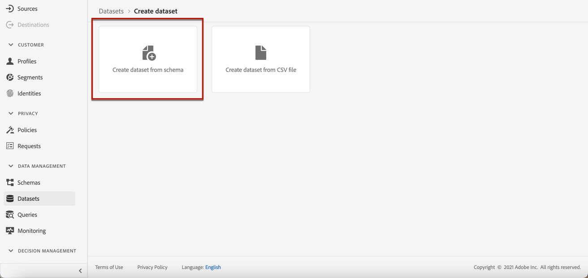

# Crear un conjunto de datos para recopilar eventos {#create-dataset}

Para recopilar eventos de experiencia, primero debe crear un conjunto de datos al que se envíen estos eventos.

Comience creando el esquema que se utilizará en el conjunto de datos:

1. En el menú **[!UICONTROL Administración de datos]**, seleccione **[!UICONTROL Esquema]**.

1. Haga clic en **[!UICONTROL Crear esquema]**, en la esquina superior derecha, seleccione **[!UICONTROL Evento de experiencia]** y haga clic en **Siguiente**.

   

   >[!NOTE]
   >
   >Obtenga más información acerca de esquemas XDM y grupos de campos en la [documentación de información general del sistema XDM](https://experienceleague.adobe.com/docs/experience-platform/xdm/home.html?lang=es){target="_blank"}.

1. Escriba un nombre y una descripción para el esquema y haga clic en **Finalizar**.
   

1. En la sección **[!UICONTROL Grupos de campos]** de la izquierda, seleccione **[!UICONTROL Agregar]**.

   

1. En el campo **[!UICONTROL Buscar]**, escriba &quot;interacción de propuesta&quot;.

1. Seleccione el grupo de campos **[!UICONTROL Evento de experiencia - Interacciones de propuesta]** y haga clic en **[!UICONTROL Agregar grupos de campos]**.

   

   >[!CAUTION]
   >
   >El esquema que se usará en su conjunto de datos debe tener asociado el grupo de campos **[!UICONTROL Evento de experiencia - Interacciones de propuesta]**. De lo contrario, no podrá utilizarlo en su modelo de IA.

1. Guarde el esquema.

>[!NOTE]
>
>Obtenga más información acerca de la creación de esquemas en [Aspectos básicos de la composición de esquemas](https://experienceleague.adobe.com/docs/experience-platform/xdm/schema/composition.html#understanding-schemas){target="_blank"}.

Ya está listo para crear un conjunto de datos con este esquema. Para realizar esto, siga los pasos a continuación:

1. En el menú **[!UICONTROL Administración de datos]**, seleccione **[!UICONTROL Conjuntos de datos]** y vaya a la pestaña **[!UICONTROL Examinar]**.

1. Haga clic en **[!UICONTROL Crear conjunto de datos]** y seleccione **[!UICONTROL Crear conjunto de datos a partir del esquema]**.

   

1. Seleccione el esquema que acaba de crear en la lista y haga clic en **[!UICONTROL Siguiente]**.

1. Proporcione un nombre único para el conjunto de datos en el campo **[!UICONTROL Nombre]** y haga clic en **[!UICONTROL Finalizar]**.

   

>[!NOTE]
>
>Ahora se puede seleccionar este conjunto de datos para recopilar datos de evento al crear un [modelo de IA](../ranking/create-ai-models.md).
