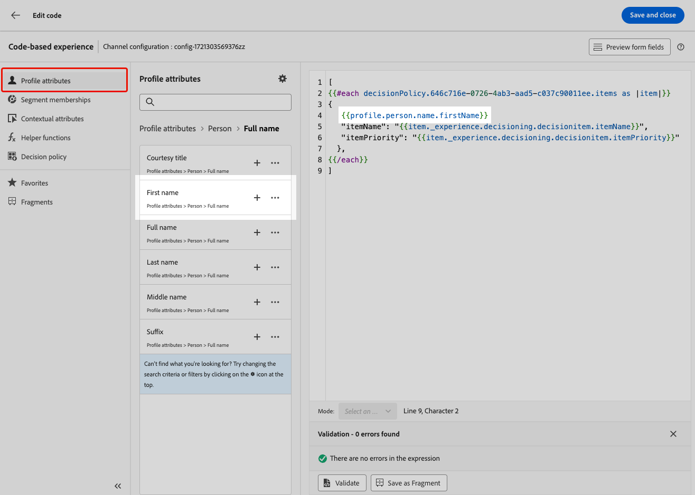

# Caso de uso sobre la toma de decisiones {#experience-decisioning-uc}

Este caso de uso presenta todos los pasos necesarios para utilizar Decisioning con el canal basado en código [!DNL Journey Optimizer].

En este ejemplo, no está seguro de si una fórmula de clasificación específica tendrá un mejor rendimiento que las prioridades de oferta preasignadas.

Para medir cuál ofrece el mejor rendimiento para la audiencia objetivo, cree una campaña con [Experimento de contenido](../content-management/content-experiment.md) en la que defina dos tratamientos de entrega:

* El primer tratamiento utiliza la prioridad como método de clasificación.
* El segundo tratamiento utiliza una fórmula es el método de clasificación.

## Creación de estrategias de selección

En primer lugar, debe crear dos estrategias de selección: una con prioridad como método de clasificación y otra con una fórmula como método de clasificación.

### Creación de la primera estrategia de selección

Para crear la primera estrategia de selección con la prioridad como método de clasificación, siga los pasos a continuación.

1. Cree un elemento de decisión. [Descubra cómo](items.md)

1. Establezca la **[!UICONTROL Prioridad]** del elemento de decisión en comparación con otros. Si un perfil cumple los requisitos para varios elementos, una prioridad mayor otorga al elemento prioridad sobre otros.

   

   >[!NOTE]
   >
   >La prioridad es un tipo de datos entero. Todos los atributos que son tipos de datos enteros deben contener valores enteros (sin decimales).

1. Establezca la idoneidad del elemento de decisión:

   * Defina audiencias o reglas para restringir el elemento solo a perfiles específicos. [Más información](items.md#eligibility)

   * Defina las reglas de límite para definir el número máximo de veces que se puede presentar una oferta. [Más información](items.md#capping)

1. Si es necesario, repita los pasos anteriores para crear elementos de decisión adicionales.

1. Cree una **colección** en la que se incluirán los elementos de decisión. [Más información](collections.md)

1. Cree una [estrategia de selección](selection-strategies.md#create-selection-strategy) y seleccione la [colección](collections.md) que contiene las ofertas que deben tenerse en cuenta.

1. [Elija el método de clasificación](#select-ranking-method) que se usará para seleccionar la mejor oferta para cada perfil. En este caso, seleccione **[!UICONTROL Prioridad de ofertas]**: si varias ofertas cumplen los requisitos para esta estrategia, el motor de decisión utiliza el valor establecido como **[!UICONTROL Prioridad]** en las ofertas. [Más información](selection-strategies.md#offer-priority)

   

### Creación de la segunda estrategia de selección

Para crear la segunda estrategia de selección con seleccione una fórmula como método de clasificación, siga los pasos a continuación.

1. Cree un elemento de decisión. [Descubra cómo](items.md)

   <!--1. Set the same **[!UICONTROL Priority]** as for the first decision item. TBC?-->

1. Establezca la idoneidad del elemento de decisión:

   * Defina audiencias o reglas para restringir el elemento solo a perfiles específicos. [Más información](items.md#eligibility)

   * Defina las reglas de límite para definir el número máximo de veces que se puede presentar una oferta. [Más información](items.md#capping)

1. Si es necesario, repita los pasos anteriores para crear elementos de decisión adicionales.

1. Cree una **colección** en la que se incluirán los elementos de decisión. [Más información](collections.md)

1. Cree una [estrategia de selección](selection-strategies.md#create-selection-strategy) y seleccione la [colección](collections.md) que contiene las ofertas que deben tenerse en cuenta.

1. [Elige el método de clasificación](#select-ranking-method) que quieras usar para seleccionar la mejor oferta para cada perfil. En este caso, seleccione **[!UICONTROL Fórmula]** para usar una puntuación calculada específica a fin de determinar qué oferta apta para entregar. [Más información](selection-strategies.md#ranking-formula)

   

## Creación de una campaña de experiencia basada en código

<!--To present the best dynamic offer and experience to your visitors on your website or mobile app, add a decision policy to a code-based campaign.

Define two delivery treatments each containing a different decision policy.-->

Una vez configuradas las dos estrategias de selección, cree una campaña de experiencia basada en código en la que defina un tratamiento diferente para cada estrategia para comparar cuál de ellas tiene el mejor rendimiento.

1. Cree una campaña y seleccione la acción **[!UICONTROL Experiencia basada en código]**. [Más información](../code-based/create-code-based.md)

1. En la página de resumen de la campaña, haga clic en **[!UICONTROL Crear experimento]** para comenzar a configurar el experimento de contenido. [Más información](../content-management/content-experiment.md)

   

1. En la página de resumen de la campaña, seleccione o cree una configuración basada en código y haga clic en **[!UICONTROL Editar contenido]**.

   

<!--1. Sart personalizing **Treatment A** by clicking **[!UICONTROL Create]**.

    -->

1. Desde la ventana de edición de contenido, empieza a personalizar **Tratamiento A** haciendo clic en **[!UICONTROL Editar código]**.

   

1. Seleccione **[!UICONTROL Directiva de decisión]**, haga clic en **[!UICONTROL Agregar directiva de decisión]** y complete los detalles de la decisión. [Más información](create-decision.md)

   

1. Seleccione la primera estrategia que ha creado. Haga clic en **[!UICONTROL Agregar estrategia]**.

1. Haga clic en **[!UICONTROL Crear]**. La nueva decisión se agregó en **[!UICONTROL Decisiones]**.

   

1. Haga clic en el icono de más acciones (tres puntos) y seleccione **[!UICONTROL Agregar]**. Ahora puede agregar todos los atributos de decisión que desee dentro de esto.

   

1. También puede añadir cualquier otro atributo disponible en el editor de personalización, como atributos de perfil.

   

1. En la ventana de edición de contenido, seleccione **Tratamiento B** y repita los pasos anteriores para crear otra directiva de decisión y seleccione la segunda estrategia de selección que ha creado.

   

1. Guarde el contenido.
