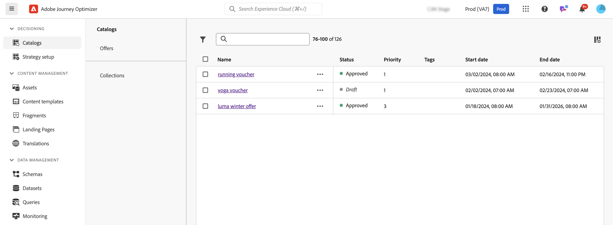

# Introducción a las capacidades de decisión en [!DNL Journey Optimizer] {#gs-decision}

Las capacidades de decisión de [!DNL Journey Optimizer] le permiten ofrecer las mejores ofertas y experiencias personalizadas a sus clientes en todos los puntos de contacto, en los momentos precisos. Estas funciones simplifican la personalización mediante un catálogo centralizado de ofertas de marketing y un motor de decisión avanzado, que utiliza reglas y criterios de clasificación para ofrecer el contenido más relevante para cada persona.

Ventajas principales:

* Se ha mejorado el rendimiento de las campañas al ofrecer ofertas personalizadas en varios canales,
* Flujos de trabajo mejorados: En lugar de crear varios envíos o campañas, los equipos de marketing pueden mejorar los flujos de trabajo creando un único envío y variar las ofertas en diferentes partes de la plantilla,
* Controle la cantidad de veces que se muestra una oferta entre campañas y clientes.

Actualmente, [!DNL Journey Optimizer] proporciona las dos soluciones principales que se detallan a continuación.

## Toma de decisiones {#decisioning}

Nuestro marco de decisión de próxima generación, diseñado para unificar los flujos de trabajo de Journey Optimizer existentes y sentar las bases para administrar catálogos de contenido adicionales. Ofertas de Decisioning:

* Administración del catálogo de artículos basado en esquemas: aumente la flexibilidad asociando metadatos personalizados con cada oferta
* Reglas de recopilación flexibles: agrupe fácilmente ofertas para evaluaciones futuras basadas en varios criterios
* Configuración actualizada de la política de decisión y la estrategia de selección: Permitir la reutilización de componentes de decisión
* Funcionalidades de experimentación: pruebe la lógica de decisión con otros componentes de contenido para medir el rendimiento

La toma de decisiones está disponible para todos los clientes para los canales **Experiencia basada en código**, **Correo electrónico**, **Notificación push** y **SMS**. Para obtener información detallada acerca del ciclo de lanzamiento y las fases de disponibilidad, consulte [Ciclo de lanzamiento de Journey Optimizer](../rn/releases.md).

➡️ [Introducción a la toma de decisiones](../experience-decisioning/gs-experience-decisioning.md)

>[!NOTE]
>
>Para migrar de Administración de decisiones a Decisiones, consulte la [documentación de migración](../experience-decisioning/migrate-to-decisioning.md) y la [guía de API de migración](../experience-decisioning/decisioning-migration-api.md).

## Gestión de decisiones {#decision-management}

Nuestra función consolidada en Journey Optimizer, Gestión de decisiones, utiliza una biblioteca central de ofertas de marketing y un motor de decisión que aplica reglas y restricciones a los perfiles de clientes en tiempo real, aprovechando los datos de Adobe Experience Platform para ofrecer la oferta correcta en el momento adecuado.

Gestión de decisiones admite los siguientes canales: correo electrónico, mensajería en la aplicación, notificaciones push, SMS y correo directo.

➡️ [Introducción a Administración de decisiones](../offers/get-started/starting-offer-decisioning.md)
