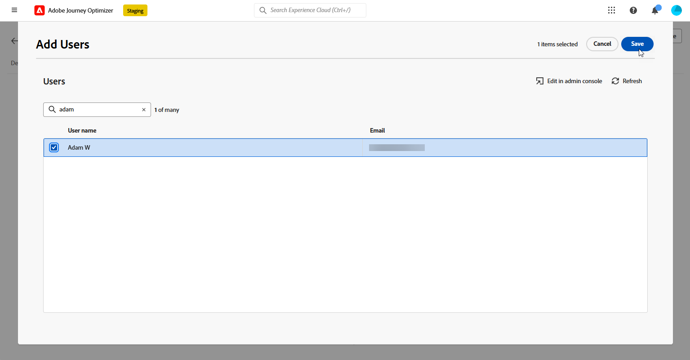

# Introducción a la toma de decisiones {#get-started-experience-decisioning}

>[!CONTEXTUALHELP]
>id="ajo_email_enable_experience_decisioning"
>title="¿Qué es la toma de decisiones?"
>abstract="La toma de decisiones es una nueva herramienta, además de la gestión de decisiones, para elegir los mejores elementos del motor de decisión y entregarlos a cada individuo. Requiere una configuración adicional para poderla utilizar."

## Qué es Decisioning {#about}

Decisioning simplifica la personalización al ofrecer un catálogo centralizado de ofertas de marketing conocidas como “elementos de decisión” y un motor de decisión sofisticado. Este motor aprovecha las reglas y los criterios de clasificación para seleccionar y presentar a cada persona los elementos de decisión más relevantes.

Estos elementos de decisión se integran perfectamente en una amplia gama de superficies de entrada a través del [nuevo canal de experiencia basado en código](../code-based/get-started-code-based.md), al que se puede acceder desde las campañas de Journey Optimizer.

>[!IMPORTANT]
>
>Las políticas de decisión solo están disponibles para su uso en campañas de experiencia basadas en código.

➡️ En [esta sección](experience-decisioning-uc.md) se presenta un caso de uso de extremo a extremo que muestra cómo crear decisiones y utilizarlas en experimentos de contenido con el canal de experiencia basado en código.

## Pasos clave de decisiones {#steps}

Los pasos principales para trabajar con Decisioning son los siguientes:

1. **Asigne los permisos adecuados**. La toma de decisiones solo está disponible para los usuarios con acceso a un **[!UICONTROL rol]** relacionado con la toma de decisiones, como los administradores de decisiones. Si no puede acceder a Decisioning, debe ampliar los permisos.

   +++Obtenga información sobre cómo asignar la función Administradores de decisiones

   1. Para asignar una función a un usuario en el producto [!DNL Permissions], vaya a la pestaña **[!UICONTROL Funciones]** y seleccione Administradores de decisiones.

      

   1. En la pestaña **[!UICONTROL Usuarios]**, haga clic en **[!UICONTROL Añadir usuario]**.

      

   1. Introduzca el nombre o la dirección de correo electrónico del usuario o selecciónelo de la lista y haga clic en **[!UICONTROL Guardar]**.

      Si el usuario no se ha creado previamente, consulte la [documentación de Añadir usuarios](https://experienceleague.adobe.com/es/docs/experience-platform/access-control/ui/users).

      

   El usuario debería recibir entonces un correo electrónico que le redirija a su instancia.

   +++

1. **Configurar atributos personalizados**: adapte el catálogo de artículos a sus necesidades específicas configurando atributos personalizados en el esquema del catálogo.

   ➡️ [Aprenda a configurar el catálogo de artículos](catalogs.md)

1. **Cree elementos de decisión** para mostrarlos a la audiencia de destino.

   ➡️ [Aprenda a crear elementos de decisión](items.md) en la interfaz de usuario (y en la [documentación de API](api-reference/decisions-items/create.md))

1. **Organizar con colecciones**: Use colecciones para categorizar los elementos de decisión según las reglas basadas en atributos. Incorpore colecciones en las estrategias de selección para determinar qué colección de elementos de decisión se debe tener en cuenta.

   ➡️ [Obtenga información sobre cómo administrar colecciones de elementos](collections.md) en la interfaz de usuario (y en la [documentación de API](api-reference/items-collections/create.md))

1. **Crear reglas de decisión**: Las reglas de decisión se utilizan en elementos de decisión o estrategias de selección para determinar a quién se puede mostrar un elemento de decisión.

   ➡️ [Obtenga información sobre cómo crear reglas de decisión](rules.md)

1. **Implementar métodos de clasificación**: Cree métodos de clasificación y aplíquelos dentro de las estrategias de selección para determinar el orden de prioridad para seleccionar elementos de decisión.

   ➡️ [Aprenda a crear métodos de clasificación](ranking/ranking.md)

1. **Crear estrategias de selección**: genere estrategias de selección que aprovechen colecciones, reglas de decisión y métodos de clasificación para identificar los elementos de decisión adecuados para mostrarlos a los perfiles.

   ➡️ [Aprenda a crear estrategias de selección en la interfaz de usuario](selection-strategies.md) en la interfaz de usuario (y en la [documentación de API](api-reference/selection-strategies/create.md))

1. **Cree una política de decisión e incrústela en su recorrido/campaña de correo electrónico o basado en código**: las políticas de decisión combinan varias estrategias de selección para determinar los elementos de decisión aptos que se mostrarán a la audiencia deseada.

   ➡️ [Aprenda a trabajar con directivas de decisión](create-decision.md)
➡️ Para entregar correctamente la oferta a través del canal de experiencia basado en código, siga los pasos de implementación de [esta sección](../code-based/code-based-implementation-samples.md).

