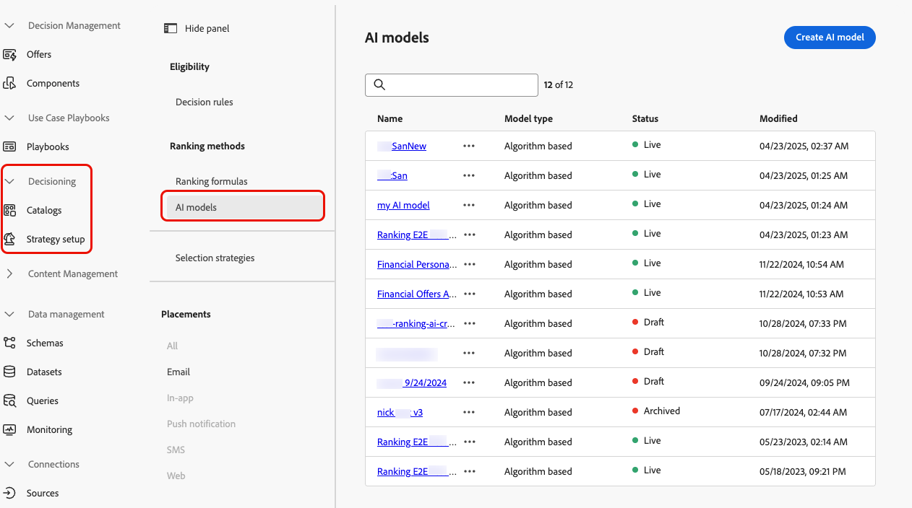
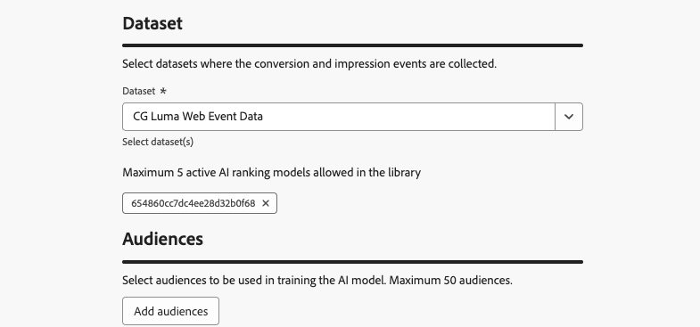

# Creación de modelos de IA {#create-ai-models}

[!DNL Journey Optimizer] le permite crear **modelos de IA** para clasificar ofertas según sus objetivos comerciales.

>[!CAUTION]
>
>Para crear, editar o eliminar modelos de IA, debe tener el permiso **Administrar estrategias de clasificación**. [Más información](../../administration/high-low-permissions.md#manage-ranking-strategies)

## Creación de un modelo de IA {#create-ranking-strategy}

>[!CONTEXTUALHELP]
>id="ajo_exd_ai_model_metric"
>title="Métrica de optimización"
>abstract="[!DNL Journey Optimizer] clasifica ofertas según la **tasa de conversión** (la tasa de conversión es igual al número total de eventos de conversión/número total de eventos de impresión). La tasa de conversión se calcula usando dos tipos de métricas: **Eventos de impresión** (ofertas que se muestran) y **Eventos de conversión** (ofertas que se generan por clics de correos electrónicos o por la web). Estos eventos se capturan automáticamente mediante el SDK web o el SDK móvil proporcionado."

Para crear un modelo de IA, siga los pasos a continuación:

1. Cree un conjunto de datos donde se recopilen los eventos de conversión. [Descubra cómo](../data-collection/create-dataset.md)

1. Vaya al menú **[!UICONTROL Decisioning]** > **[!UICONTROL Strategy setup]** y seleccione **[!UICONTROL modelos de IA]**.

   

   Se muestran todos los modelos de IA creados hasta el momento.

1. Haga clic en el botón **[!UICONTROL Crear modelo de IA]**.

1. Especifique un nombre único y, si es necesario, una descripción para el modelo de IA.

1. Seleccione el tipo de modelo de IA que desea crear:

   * **[!UICONTROL Optimización automática]** optimiza las ofertas basándose en el rendimiento de las ofertas anteriores. [Más información](auto-optimization-model.md)
   * **[!UICONTROL Optimización personalizada]** optimiza y personaliza ofertas basadas en audiencias y rendimiento de ofertas. [Más información](personalized-optimization-model.md)

   

1. La sección **[!UICONTROL Métrica de optimización]** proporciona información sobre el evento de conversión utilizado por el modelo de IA para calcular la clasificación de las ofertas.

   [!DNL Journey Optimizer] clasifica ofertas según la **tasa de conversión** (la tasa de conversión es igual al número total de eventos de conversión/número total de eventos de impresión). La tasa de conversión se calcula mediante dos tipos de métricas:
   * **Eventos de impresión** (ofertas que se muestran)
   * **Eventos de conversión** (ofertas que generan clics por correo electrónico o web).

   Estos eventos se capturan automáticamente mediante el Web SDK o el Mobile SDK que se ha proporcionado. Obtenga más información en la descripción general de [Adobe Experience Platform Web SDK](https://experienceleague.adobe.com/docs/experience-platform/edge/home.html?lang=es).

   +++ Optimizando modelos en métricas [!DNL Customer Journey Analytics] personalizadas

   >[!NOTE]
   >
   >Esta capacidad solo está disponible para [!DNL Customer Journey Analytics] clientes con derechos de administrador.
   >
   >Antes de empezar, asegúrese de que ha integrado Journey Optimizer con Customer Journey Analytics para exportar los conjuntos de datos de Journey Optimizer a sus vistas de datos predeterminadas. [Aprenda a aprovechar [!DNL Journey Optmizer] los datos en [!DNL Customer Journey Analytics]](../../reports/cja-ajo.md)

   Los modelos de **[!UICONTROL optimización personalizada]** son un tipo de modelo de IA que le permite definir los objetivos comerciales y utiliza los datos de los clientes para entrenar modelos orientados a negocios a fin de ofrecer ofertas personalizadas y maximizar los KPI.

   De forma predeterminada, los modelos de optimización personalizados utilizan **clics en ofertas** como métrica de optimización. Si está trabajando con [!DNL Customer Journey Analytics], [!DNL Decisioning] le permite aprovechar sus propias métricas personalizadas para optimizar su modelo en.

   Para ello, seleccione el tipo de modelo **[!UICONTROL Optimización personalizada]** y expanda la lista desplegable **[!UICONTROL Evento de conversión]**. Todas las métricas de su [!DNL Customer Journey Analytics] [vista de datos](https://experienceleague.adobe.com/es/docs/analytics-platform/using/cja-dataviews/data-views){target="_blank"} predeterminada se muestran en la lista. Seleccione la métrica en la que desea optimizar el modelo.

   {width=85%}

   >[!NOTE]
   >
   >De manera predeterminada, las métricas de [!DNL Customer Journey Analytics] utilizan un modelo de atribución &quot;Último contacto&quot;, que asigna el 100% del crédito al punto de contacto que se produce más recientemente antes de la conversión.
   >
   >Aunque es posible modificar el modelo de atribución, no todos los modelos de atribución son ideales para la optimización del modelo de IA. Recomendamos seleccionar cuidadosamente un modelo de atribución que se ajuste a sus objetivos de optimización para garantizar la precisión y el rendimiento del modelo.
   >
   >Para obtener más información sobre los modelos de atribución disponibles y las instrucciones de uso, consulte la [[!DNL Customer Journey Analytics] documentación](https://experienceleague.adobe.com/es/docs/analytics-platform/using/cja-dataviews/component-settings/attribution){target="_blank"}

   +++

1. Seleccione los conjuntos de datos donde se recopilan los eventos de conversión e impresión. Aprenda a crear estos conjuntos de datos en [esta sección](../data-collection/create-dataset.md).

   {width=85%}

   >[!CAUTION]
   >
   >En la lista desplegable solo se muestran los conjuntos de datos creados a partir de esquemas asociados con el grupo de campos **[!UICONTROL Evento de experiencia: interacciones de propuesta]** (anteriormente conocido como mixin).

1. Si está creando un modelo de IA de **[!UICONTROL optimización personalizada]**, seleccione los segmentos que se usarán para entrenar el modelo de IA.

   <!--➡️ [Discover this feature in video](#video)-->

   >[!NOTE]
   >
   >Puede seleccionar hasta cinco audiencias.

1. Guarde y active el modelo de IA.

<!--At this point, you must have:

* created the AI model,
* defined which type of event you want to capture - offer displayed (impression) and/or offer clicked (conversion),
* and in which dataset you want to collect the event data.-->

Ahora, cada vez que se muestra una oferta o se hace clic en ella, desea que el grupo de campos **[!UICONTROL Evento de experiencia - Interacciones de propuesta]** capture automáticamente el evento correspondiente mediante [Adobe Experience Platform Web SDK](https://experienceleague.adobe.com/docs/experience-platform/edge/web-sdk-faq.html?lang=es#what-is-adobe-experience-platform-web-sdk%3F){target="_blank"} o Mobile SDK.

Para poder enviar tipos de eventos (oferta mostrada u oferta seleccionada), debe establecer el valor correcto para cada tipo de evento en un evento de experiencia que se envíe a Adobe Experience Platform. [Descubra cómo](../data-collection/schema-requirement.md)

<!--
## How-to video {#video}

Learn how to create a personalized optimization model and how to apply it to a decision.

>[!VIDEO](https://video.tv.adobe.com/v/3445954?captions=spa&quality=12)-->
