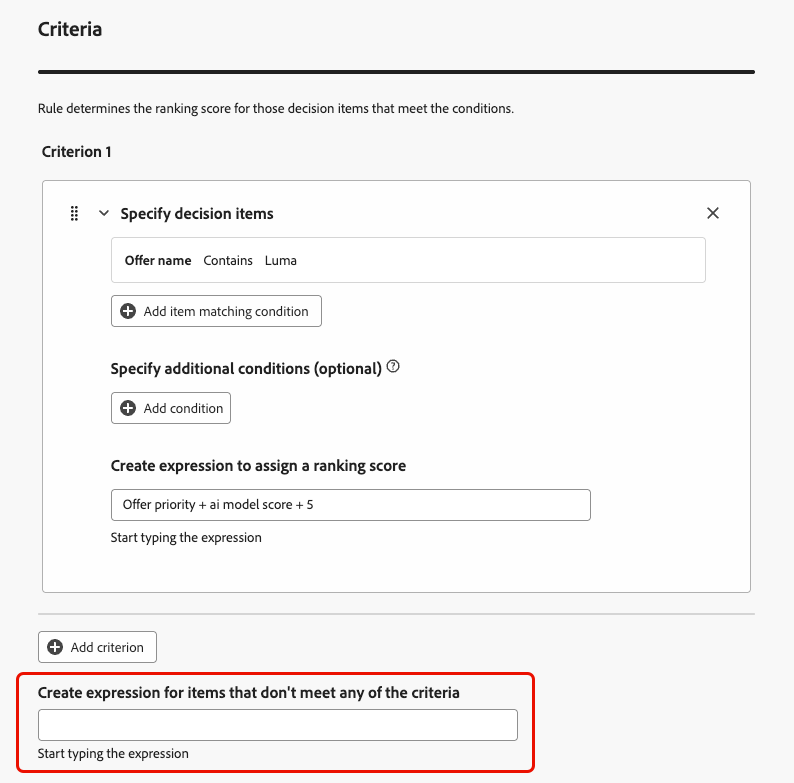

# Uso del generador de fórmulas de IA {#create-ranking-formulas}

**Las fórmulas de clasificación** le permiten definir reglas que determinan qué oferta se debe presentar primero, en lugar de tener en cuenta las puntuaciones de prioridad.

Para crear estas reglas, el generador de fórmulas de IA de **[!UICONTROL Adobe Journey Optimizer]** proporciona mayor flexibilidad y control en la clasificación de las ofertas. En lugar de depender únicamente de una prioridad de oferta estática, ahora puede definir fórmulas de clasificación personalizadas que combinen puntuaciones del modelo de IA, prioridades de oferta, atributos de perfil, atributos de oferta y señales contextuales a través de una interfaz guiada.

Este enfoque le permite ajustar dinámicamente la clasificación de la oferta en función de cualquier combinación de tendencia impulsada por IA, valor empresarial y contexto en tiempo real, lo que facilita la alineación de la toma de decisiones con los objetivos de marketing y las necesidades del cliente. El generador de fórmulas de IA admite fórmulas simples o avanzadas en función del control que desee aplicar.

Una vez creada una fórmula de clasificación, puede asignarla a una [estrategia de selección](../selection-strategies.md). Si se pueden presentar varias ofertas al utilizar esta estrategia de selección, el motor de decisión utilizará la fórmula seleccionada para calcular qué oferta se ofrece primero.

➡️ [Descubra esta funcionalidad en vídeo](#video)

## Crear fórmula de clasificación {#create-ranking-formula}

>[!CONTEXTUALHELP]
>id="ajo_exd_config_formulas"
>title="Crear fórmulas de clasificación"
>abstract="Las fórmulas le permiten definir reglas que determinarán qué elemento decisión se debe presentar primero, en lugar de tener en cuenta las puntuaciones de prioridad del elemento. Una vez creada una fórmula de clasificación, puede asignarla a una estrategia de selección."

Para crear una fórmula de clasificación, siga los pasos a continuación.

1. Acceda al menú **[!UICONTROL Configuración de estrategia]** y, a continuación, seleccione la ficha **[!UICONTROL Fórmulas de clasificación]**. Se muestra la lista de fórmulas creadas anteriormente.

   

1. Haga clic en **[!UICONTROL Crear fórmula]**.

1. Especifique el nombre de la fórmula y añada una descripción si lo desea.

   {width="80%"}

1. Si lo desea, haga clic en **[!UICONTROL Seleccionar modelo de IA]** para establecer el modelo que se utilizará como referencia para generar la fórmula de clasificación.

   >[!NOTE]
   >
   >[Los modelos de optimización personalizados](personalized-optimization-model.md) que usan métricas continuas no son compatibles con el generador de fórmulas de IA.

   Cada vez que haga referencia a una puntuación de modelo al definir la fórmula a continuación, se utilizará el modelo de IA seleccionado.

   >[!CAUTION]
   >
   >Cuando se usa un modelo de IA incorporado a una fórmula de clasificación, los datos no se reflejan en el informe [Tasa de conversión de tráfico controlado por modelo y Holdout](../../reports/campaign-global-report-cja-code.md#conversion-rate).

1. Defina las condiciones que determinarán la puntuación de clasificación para los elementos de decisión coincidentes. Puede hacer lo siguiente

   * rellene la sección **[!UICONTROL Criterios]** de la [interfaz de usuario](#ranking-select-criteria),
   * o cambie al [editor de código](#ranking-code-editor).

   >[!NOTE]
   >
   >La profundidad de anidación en una fórmula de clasificación está limitada a 30 niveles. Esto se mide contando los `)` paréntesis de cierre en la cadena de PQL. Una cadena de regla puede tener un tamaño máximo de 8 KB para caracteres codificados con UTF-8. Esto equivale a 8.000 caracteres ASCII (1 byte cada uno) o a 2.000-4.000 caracteres no ASCII (2-4 bytes cada uno). [Más información sobre las limitaciones y protecciones de decisiones](../decisioning-guardrails.md#ranking-formulas)

1. También puede utilizar los datos de Adobe Experience Platform para ajustar dinámicamente la lógica de clasificación y reflejar las condiciones reales. Esto resulta especialmente útil para atributos que cambian con frecuencia, como la disponibilidad del producto o los precios en tiempo real.

   Esta funcionalidad está actualmente disponible para todos los clientes en beta pública. Póngase en contacto con el representante de su cuenta si desea acceder. [Aprenda a utilizar los datos de Adobe Experience Platform para la toma de decisiones](../aep-data-exd.md)

<!--## Select an ELS dataset {#els-dataset}

Journey Optimizer allows you to leverage data from Adobe Experience Platform. [Learn more](../data/aep-data-perso.md)

To leverage data from an AEP dataset, follow the steps below.

1. From the **[!UICONTROL ELS settings]** section, select an ELS dataset from the list.

1. Select a decision attribute.

    >[!NOTE]
    >
    >This action is mandatory.

{width="80%"-->

## Definir criterios con el generador de fórmulas {#ranking-select-criteria}

Con una interfaz intuitiva, puede ajustar la toma de decisiones ajustando las puntuaciones de IA (tendencia), el valor de oferta (prioridad), las palancas contextuales y las tendencias de perfil externo (individualmente o en combinación) para optimizar cada interacción. <!--Whether you are maximizing revenue, promoting strategic offers, or balancing business goals with real-time context, the formula builder gives you total control in defining ranking strategies.-->

Para definir criterios directamente desde la interfaz, siga los pasos a continuación.

<!--{width="80%"}-->

1. En la sección **[!UICONTROL Criterio 1]**, especifique los elementos de decisión a los que desea aplicar una puntuación de clasificación haciendo lo siguiente:
   * seleccione un [atributo de elemento de decisión](../items.md#attributes)
   * seleccionar un operador lógico
   * agregar una condición coincidente: puede escribir un valor o seleccionar un atributo de perfil o [datos de contexto](../context-data.md)

   {width="70%"}

1. De forma opcional, puede especificar elementos adicionales para restringir las condiciones de coincidencia para que los criterios sean verdaderos.

   {width="80%"}

   Por ejemplo, ha definido el criterio 1, como el atributo personalizado *Weather* *Equals* para la condición *warm*. Además, puede agregar otra condición como, por ejemplo, si se cumple la primera condición y si la temperatura supera los 75 grados en el momento de la solicitud, el criterio 1 es verdadero.<!--Add a screenshot with the example-->

1. Cree una expresión que asigne una puntuación de clasificación a los elementos de decisión que cumplan la condición definida anteriormente. Puede hacer referencia a cualquiera de las siguientes opciones:

   * la puntuación que salió del modelo de IA que seleccionó opcionalmente en la sección **[!UICONTROL Detalles]** [anterior](#create-ranking-formula);
   * prioridad del elemento de decisión, que es un valor asignado manualmente al [crear un elemento de decisión](../items.md#attributes); <!--If a profile qualifies for multiple decision items, a higher priority grants the item precedence over others.-->
   * cualquier atributo que pueda residir en el perfil, como cualquier puntuación de tendencia derivada externamente;
   * un valor estático que se puede asignar en formato libre;
   * cualquier combinación de todos los anteriores.

   {width="70%"}

   >[!NOTE]
   >
   >Haga clic en el icono situado junto al campo para añadir variables predefinidas.

1. Haga clic en **[!UICONTROL Agregar criterio]** para agregar uno o más criterios tantas veces como sea necesario. La lógica es la siguiente:
   * Si el primer criterio es verdadero para un elemento de decisión determinado, tiene prioridad sobre los siguientes.
   * Si no es true, el motor de decisión pasa al segundo criterio, y así sucesivamente.

1. En el último campo, se puede generar una expresión que se asigna a todos los elementos de decisión que no cumplan los criterios anteriores.

   {width="70%"}

1. Haga clic en **[!UICONTROL Crear]** para completar la fórmula de clasificación. Ahora puede seleccionarlo en la lista para ver sus detalles y editarlo o eliminarlo. Está listo para usarse en una [estrategia de selección](../selection-strategies.md) para clasificar los elementos de decisión elegibles.

### Ejemplo de fórmula de clasificación

Consideremos el ejemplo siguiente:

{width="80%"}

Si la región del elemento de decisión (atributo personalizado) es igual a la etiqueta geográfica del perfil (atributo de perfil), la puntuación de clasificación expresada aquí (que es una combinación de la prioridad del elemento de decisión, la puntuación del modelo de IA y un valor estático) se aplicará a todos los elementos de decisión que cumplan esa condición.

## Utilizar el editor de código {#ranking-code-editor}

Para expresar fórmulas de clasificación en **sintaxis de PQL**, cambie al editor de código con el botón específico en la parte superior derecha de la pantalla. Para obtener más información sobre cómo usar la sintaxis de PQL, consulte la [documentación específica](https://experienceleague.adobe.com/docs/experience-platform/segmentation/pql/overview.html?lang=es).

>[!CAUTION]
>
>Esta acción evitará que vuelva a la vista predeterminada del generador para esta fórmula.

A continuación, puede aprovechar atributos de perfil, [datos de contexto](../context-data.md) y [atributos de elemento de decisión](../items.md#attributes).

Por ejemplo, desea aumentar la prioridad de todas las ofertas con el atributo &quot;hot&quot; si el tiempo real es caluroso. Para ello, se pasó **contextData.weather=hot** en la llamada de toma de decisiones. <!--[Learn how to work with context data](context-data.md)-->

{width="80%"}

>[!IMPORTANT]
>
>Al crear una fórmula de clasificación, no se admite retroceder a un período de tiempo anterior, como agregar un evento de experiencia que se produjo durante el último mes como componente de la fórmula. Cualquier intento de incluir un período retroactivo durante la creación de la fórmula generará un déclencheur de error al guardarla.

Para aprovechar los atributos relacionados con los elementos de decisión en las fórmulas, asegúrese de seguir la sintaxis correcta en el código de la fórmula de clasificación. Expanda cada sección para obtener más información:

+++Aprovechamiento de atributos estándar de elementos de decisión


+++

+++Aprovechamiento de atributos personalizados de elementos de decisión


+++

### Ejemplos de PQL de fórmulas de clasificación {#ranking-formula-examples}

Puede crear muchas fórmulas de clasificación diferentes según sus necesidades. A continuación se muestran algunos ejemplos.

+++Aumente las ofertas con ciertos atributos de oferta según el atributo del perfil

Si el perfil vive en la ciudad correspondiente a la oferta, duplique la prioridad para todas las ofertas de esa ciudad.

**Fórmula de clasificación:**

```
if( offer.characteristics.get("city") = homeAddress.city, offer.rank.priority * 2, offer.rank.priority)
```

+++

+++Ampliar ofertas en las que la fecha de finalización sea en menos de 24 horas a partir de ahora

**Fórmula de clasificación:**

```
if( offer.selectionConstraint.endDate occurs <= 24 hours after now, offer.rank.priority * 3, offer.rank.priority)
```

+++

+++Aumente las ofertas en función de la tendencia de los clientes a comprar el producto ofrecido

Puede aumentar la puntuación de una oferta en función de una puntuación de tendencia del cliente.

En este ejemplo, el inquilino de instancia es *_salesvelocity* y el esquema de perfil contiene un rango de puntuaciones almacenadas en una matriz:


Teniendo en cuenta esto, para un perfil como:

```
{"_salesvelocity": {"individualScoring": [
                    {"core": {
                            "category":"insurance",
                            "propensityScore": 96.9
                        }},
                    {"core": {
                            "category":"personalLoan",
                            "propensityScore": 45.3
                        }},
                    {"core": {
                            "category":"creditCard",
                            "propensityScore": 78.1
                        }}
                    ]}
}
```

+++

+++Aumente las ofertas en función del código postal y los ingresos anuales de un perfil

En este ejemplo, el sistema siempre intenta mostrar primero una oferta que coincida con el código postal y vuelve a una oferta general si no se encuentra ninguna coincidencia, evitando mostrar ofertas destinadas a otros códigos postales.

```pql
if( offer._luma.offerDetails.zipCode = _luma.zipCode,luma.annualIncome / 1000 + 10000, if( not offer.luma.offerDetails.zipCode,_luma.annualIncome / 1000, -9999) )
```

Lo que hace la fórmula:

* Si la oferta tiene el mismo código postal que el usuario, asígnele una puntuación muy alta para que se seleccione primero.
* Si la oferta no tiene código postal (se trata de una oferta general), asígnele una puntuación normal basada en los ingresos del usuario.
* Si la oferta tiene un código postal diferente al del usuario, asígnele una puntuación muy baja para que no esté seleccionada.

+++

+++Ampliar ofertas según los datos de contexto

[!DNL Journey Optimizer] le permite impulsar ciertas ofertas según los datos de contexto que se pasan en la llamada. Por ejemplo, si se pasa `contextData.weather=hot`, se debe aumentar la prioridad de todas las ofertas con `attribute=hot`.

>[!NOTE]
>
>Para obtener información detallada sobre cómo pasar datos de contexto <!-- using the **Edge Decisioning** and **Decisioning** APIs-->, consulte [esta sección](../context-data.md).

Tenga en cuenta que al usar la API **Decisioning**, los datos de contexto se agregan al elemento de perfil en el cuerpo de la solicitud, como en el ejemplo siguiente:

```
"xdm:profiles": [
{
    "xdm:identityMap": {
        "crmid": [
            {
            "xdm:id": "CRMID1"
            }
        ]
    },
    "xdm:contextData": [
        {
            "@type":"_xdm.context.additionalParameters;version=1",
            "xdm:data":{
                "xdm:weather":"hot"
            }
        }
    ]
    
}],
```

+++

## Vídeo práctico {#video}

Aprenda a utilizar el Generador de fórmulas de IA en Adobe Journey Optimizer para crear estrategias de clasificación de ofertas personalizadas.

>[!VIDEO](https://video.tv.adobe.com/v/3464446/?learn=on&enablevpops)
