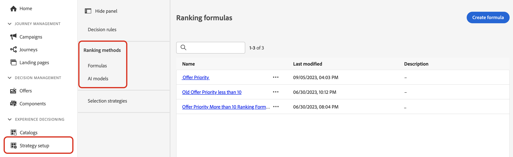

# Métodos de clasificación {#rankings}

Los métodos de clasificación permiten clasificar los elementos que se muestran en un perfil determinado. Una vez creado un método de clasificación, puede asignarlo a una estrategia de selección para definir qué elementos se deben seleccionar primero.

Hay dos tipos de métodos de clasificación disponibles:

* **Las fórmulas** le permiten definir reglas que determinan qué elemento se debe presentar primero, en lugar de tener en cuenta las puntuaciones de prioridad del elemento.

* **modelos de IA** le permiten usar sistemas de modelos entrenados que aprovecharán varios puntos de datos para determinar qué elemento se debe presentar primero.

## Creación de métodos de clasificación {#create}

Para crear un método de clasificación, siga estos pasos:

1. Vaya al menú **[!UICONTROL Configuración de estrategia]** y, a continuación, seleccione el menú **[!UICONTROL Fórmulas]** o **[!UICONTROL Modelos de IA]** según el tipo de clasificación que desee utilizar.

   

1. Haga clic en el botón **[!UICONTROL Crear fórmula]** o **[!UICONTROL Crear modelo de IA]** en la esquina superior derecha de la pantalla.

   Encontrará información detallada sobre cómo crear fórmulas de clasificación y modelos de IA en las siguientes secciones:

   * [Fórmulas de clasificación](ranking-formulas.md)
   * [Modelos de IA](ai-models.md)

1. Configure la fórmula o el modelo de IA para adaptarlo a sus necesidades y, a continuación, guárdelo.

El método de clasificación ya está listo para usarse en una [estrategia de selección](../selection-strategies.md) para clasificar los elementos de decisión elegibles.

