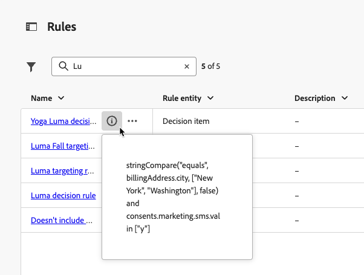

# Generar reglas {#rules}

>[!CONTEXTUALHELP]
>id="ajo_exd_config_rules"
>title="Creación de reglas"
>abstract="Puede crear dos tipos de reglas: **reglas de decisión** que se pueden usar en elementos de decisión o estrategias de selección, para controlar qué elementos se deben presentar a qué audiencia o **reglas de segmentación** para determinar segmentos de audiencia específicos aptos para recibir contenido personalizado o para especificar una ruta de recorrido específica.  Al crear una regla de decisión, puede seleccionar **[!UICONTROL Habilitar la búsqueda del conjunto de datos]** para usar datos de Adobe Experience Platform. Esto le permite definir criterios de idoneidad basados en atributos dinámicos y externos, lo que garantiza que los elementos de decisión solo se muestren cuando sean relevantes. "

## Acerca de las reglas {#about}

En [!DNL Journey Optimizer], puede crear dos tipos de reglas reutilizables:

* [Reglas de decisión](#decision-rules)
* [Reglas de segmentación](#targeting-rules)

### Reglas de decisión {#decision-rules}

Las reglas de decisión permiten definir la audiencia de los elementos de decisión mediante la aplicación de restricciones, ya sea directamente en el nivel del elemento de decisión o dentro de una estrategia de selección específica. Esto le permite controlar con precisión qué elementos se deben presentar y a quién se deben presentar.

Por ejemplo, consideremos un escenario en el que tenga elementos de decisión que presenten productos relacionados con el yoga diseñados para mujeres. Con las reglas de decisión, puede especificar que estos elementos solo deben mostrarse a perfiles cuyo sexo sea &quot;Mujer&quot; y que hayan indicado un &quot;Punto de interés&quot; en &quot;Yoga&quot;.

>[!NOTE]
>
>Además de las reglas de decisión a nivel de elemento y de estrategia de selección, también puede definir la audiencia a nivel de campaña. [Más información](../campaigns/create-campaign.md#audience)

### Reglas de segmentación {#targeting-rules}

>[!AVAILABILITY]
>
>Actualmente, las reglas de segmentación están en disponibilidad limitada. Póngase en contacto con su representante de Adobe para obtener acceso.
>
>Tenga en cuenta que esta funcionalidad solo está disponible para las organizaciones que han comprado el complemento **Decisioning**. Se implementará progresivamente para todos los clientes.

Las reglas de segmentación permiten determinar cualificaciones específicas que deben cumplirse para que un cliente pueda recibir contenido personalizado o introducir una ruta de recorrido específica, según segmentos de audiencia específicos, lo que le permite segmentar subaudiencias en sus recorridos y campañas.

En muchas ocasiones, son una combinación de varios atributos, además de eventos de comportamiento del cliente y datos de contexto. Para ahorrarle tiempo y esfuerzo, puede crear reglas de segmentación una vez y reutilizarlas en sus recorridos y campañas, con la capacidad de modificarlas rápidamente en línea en el momento de la creación.

Puede utilizar estas reglas:

* Al crear [segmentación de optimización de contenido](../content-management/optimization-targeting.md) en recorridos o campañas;
* Al generar [optimización de ruta de recorrido](../building-journeys/optimize.md#targeting).

➡️ [Descubra esta funcionalidad en vídeo](#video)

## Reglas de acceso {#access}

Se puede acceder a la lista de reglas en el menú **[!UICONTROL Decisioning]** > **[!UICONTROL Strategy setup]**.

Estas son las acciones disponibles:

* Puede filtrar en la entidad de regla (**[!UICONTROL Elemento de decisión]** o **[!UICONTROL Segmentación]** - [Más información](#about)).

* Seleccione una regla haciendo clic en su nombre y edítela con el generador de reglas. [Descubra cómo](#create)

* Desde el botón **[!UICONTROL Más acciones]** ubicado junto a cada elemento, puede:

   * Si seleccionó la entidad **[!UICONTROL Elemento de decisión]**, agregue la regla a un paquete para exportarla a otra zona protegida. Obtenga información sobre cómo [exportar objetos a otra zona protegida](../configuration/copy-objects-to-sandbox.md).
   * Duplique una regla.
   * Eliminar una regla.

{width=100%}

* Haga clic en el icono **[!UICONTROL Más información]** para mostrar la fórmula que conforma la regla.

{width=60%}

## Crear una regla {#create}

Para crear una regla, siga estos pasos:

1. Vaya a **[!UICONTROL Decisioning]** > **[!UICONTROL Strategy setup]** > **[!UICONTROL Rules]** y, a continuación, haga clic en el botón **[!UICONTROL Crear regla]**.

1. Seleccione la entidad de regla para especificar el tipo de objeto para el que se crea la regla.

   {width=90%}

   * **[!UICONTROL Elemento de decisión]** - La regla se puede aplicar en un [elemento de decisión](#decision-rules) en el contexto de Decisioning;
   * **[!UICONTROL Segmentación]**: la regla se puede usar al generar reglas de [segmentación](#targeting-rules), ya sea como parte de [optimización de contenido](../content-management/optimization-targeting.md) en una campaña o un recorrido, ya sea en la [actividad Optimizar recorrido](../building-journeys/optimize.md#targeting).

1. Si crea una regla de **[!UICONTROL elemento de decisión]**, puede seleccionar **[!UICONTROL Habilitar la búsqueda del conjunto de datos]** para usar datos de Adobe Experience Platform a fin de enriquecer la lógica de decisión con datos externos. Esto resulta especialmente útil para atributos que cambian con frecuencia, como la disponibilidad del producto o los precios en tiempo real. [Aprenda a utilizar los datos de Adobe Experience Platform para la toma de decisiones](../experience-decisioning/aep-data-exd.md)

1. Se abre la pantalla de creación de reglas. Especifique un nombre para la regla y una descripción.

1. Genere la regla para adaptarla a sus necesidades con el Generador de segmentos de Adobe Experience Platform. Para ello, puede aprovechar varias fuentes de datos, como:
   * Atributos de perfil;
   * Atributos del elemento de decisión: solo disponible al crear una regla de **[!UICONTROL elemento de decisión]**;
   * Audiencias;
   * Datos de contexto procedentes de Adobe Experience Platform. [Aprenda a aprovechar los datos de contexto](context-data.md)

   {width=85%}

   >[!NOTE]
   >
   >El Generador de segmentos que se proporciona para crear reglas presenta algunas características específicas en comparación con el que se utiliza con el servicio de segmentación de Adobe Experience Platform. Sin embargo, el proceso global descrito en la documentación es válido para generar reglas en [!DNL Journey Optimizer]. [Obtenga información sobre cómo generar definiciones de segmentos](../audience/creating-a-segment-definition.md)

1. A medida que agrega y configura nuevos campos en el área de trabajo, el panel **[!UICONTROL Propiedades de la audiencia]** muestra información sobre los perfiles estimados que pertenecen a la audiencia. Haga clic en **[!UICONTROL Actualizar estimación]** para actualizar los datos.

   {width=85%}

   >[!NOTE]
   >
   >Las estimaciones de perfil no están disponibles cuando los parámetros de regla incluyen datos que no están almacenados en el perfil, como datos de contexto.

1. Una vez que la regla esté lista, haga clic en **[!UICONTROL Crear]**. La regla creada aparece en la lista y, según la entidad que haya creado, está disponible para su uso:

   * En **elementos de decisión** y **estrategias de selección** para regular la presentación de elementos de decisión a perfiles;
   * O al generar **targeting** en la optimización de contenido o de rutas.

>[!NOTE]
>
>La profundidad de anidación de una regla está limitada a 30 niveles. Esto se mide contando los paréntesis de cierre `)` en la cadena de PQL.
>
>Una cadena de regla puede tener un tamaño máximo de 15 KB para caracteres codificados en UTF-8. Esto equivale a 15 000 caracteres ASCII (1 byte cada uno) o a 3 750-7 500 caracteres no ASCII (2-4 bytes cada uno).
>
>[Más información sobre las limitaciones y protecciones de las reglas de elegibilidad](decisioning-guardrails.md#eligibility-rules)

## Vídeo práctico {#video}

Aprenda a crear, duplicar y aplicar **reglas de segmentación** reutilizables en Adobe Journey Optimizer para personalizar de forma eficaz las campañas basadas en atributos del cliente como la región, el idioma y el comportamiento, ahorrando tiempo y mejorando la precisión de la audiencia.

>[!VIDEO](https://video.tv.adobe.com/v/3476130/?captions=spa&quality=12)
