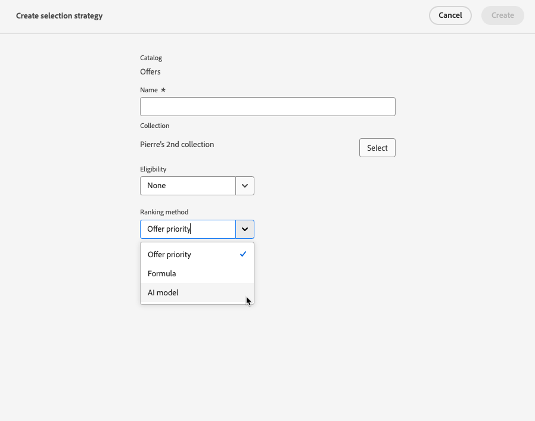

# Creación de estrategias de selección {#selection-strategies}

>[!CONTEXTUALHELP]
>id="ajo_exd_config_strategies"
>title="Definición de las estrategias de selección"
>abstract="Una estrategia de selección es reutilizable y consiste en una colección asociada con una restricción de idoneidad y un método de clasificación para determinar las ofertas que se mostrarán cuando se seleccionen en una política de decisión."
>additional-url="https://experienceleague.adobe.com/en/docs/journey-optimizer/using/decisioning/experience-decisioning/decision-policies/create-decision" text="Creación de políticas de decisión"

>[!CONTEXTUALHELP]
>id="ajo_exd_strategy_eligibility"
>title="Restricción de los perfiles aptos"
>abstract="Puede restringir la selección de ofertas para esta estrategia de selección. De forma predeterminada, todos los perfiles son aptos, pero puede utilizar públicos o reglas para limitar la selección de ofertas solo a perfiles específicos."
>additional-url="https://experienceleague.adobe.com/es/docs/journey-optimizer/using/audiences-profiles-identities/audiences/about-audiences" text="Uso de públicos"
>additional-url="https://experienceleague.adobe.com/es/docs/journey-optimizer/using/decisioning/experience-decisioning/rules" text="Uso de reglas de decisión"

Una estrategia de selección es reutilizable y consiste en una colección asociada con una restricción de elegibilidad y un método de clasificación para determinar las ofertas que se mostrarán cuando se seleccionen en una [política de decisión](create-decision.md).

## Acceso y administración de estrategias de selección

1. Vaya a **[!UICONTROL Decisiones]** > **[!UICONTROL Configuración de estrategia]** > **[!UICONTROL Estrategias de selección]**.

1. Se muestran todas las estrategias de selección creadas hasta el momento. Hay filtros disponibles para ayudarle a recuperar estrategias según el método de clasificación.

   

1. Haga clic en el nombre de una estrategia de selección para editarla.

1. También se muestran la recopilación, el método de clasificación y la idoneidad seleccionada para cada estrategia. Puede hacer clic en el icono situado junto al nombre de cada colección para editar directamente una colección.

   

## Crear una estrategia de selección {#create-selection-strategy}

Para crear una estrategia de selección, siga los pasos a continuación.

1. En el inventario **[!UICONTROL Estrategias de selección]**, haga clic en **[!UICONTROL Crear estrategia de selección]**.

   

1. Añada un nombre para la estrategia.

   >[!NOTE]
   >
   >Actualmente solo está disponible el catálogo predeterminado **[!UICONTROL Ofertas]**.

1. Complete los detalles de la estrategia de selección, empezando por el nombre.

   

1. Seleccione la [colección](collections.md) que contiene las ofertas que se deben tener en cuenta.

1. Utilice el campo **[!UICONTROL Elegibilidad]** para restringir la selección de ofertas para esta estrategia de selección.

   

   * Para restringir la selección de ofertas a los miembros de una audiencia de Experience Platform, selecciona **[!UICONTROL Audiencias]** y elige una audiencia de la lista. [Descubra cómo trabajar con públicos](../audience/about-audiences.md)

   * Si desea agregar una restricción de selección con una regla de decisión, use la opción **[!UICONTROL Regla de decisión]** y seleccione la regla que desee. [Aprenda a crear una regla](rules.md)

1. Defina el método de clasificación que desee utilizar para seleccionar la mejor oferta para cada perfil. [Más información](#select-ranking-method)

   

   * De manera predeterminada, si se pueden utilizar varias ofertas para esta estrategia, el método [Prioridad de ofertas](#offer-priority) usa el valor definido en las ofertas.

   * Si desea usar una puntuación calculada específica para elegir qué oferta apta para entregar, seleccione [Fórmula](#ranking-formula) o [modelo de IA](#ai-ranking).

1. Haga clic en **[!UICONTROL Crear]**. Ahora está listo para utilizarse en [directiva de decisión](create-decision.md)

## Seleccione un método de clasificación {#select-ranking-method}

>[!CONTEXTUALHELP]
>id="ajo_exd_strategy_ranking"
>title="Definición de cómo clasificar ofertas"
>abstract="Si se pueden seleccionar varias ofertas para una estrategia de selección determinada, elija el método que seleccionará la mejor oferta para cada perfil a la hora de crear una estrategia de selección: fórmula de prioridad o clasificación."
>additional-url="https://experienceleague.adobe.com/docs/journey-optimizer/using/decisioning/experience-decisioning/decision-policies/create-decision.html" text="Creación de políticas de decisión"

Si se pueden seleccionar varias ofertas para una estrategia de selección determinada, se puede elegir el método que seleccione la mejor oferta para cada perfil al crear una estrategia de selección. Puede clasificar ofertas por:

* [Prioridad de ofertas](#offer-priority)
* [Fórmula](#ranking-formula)
* [Clasificación de IA](#ai-ranking)

### Prioridad de ofertas {#offer-priority}

De manera predeterminada, cuando se admiten varias ofertas en una directiva de decisión, los artículos con la mayor **prioridad** se entregarán primero a los clientes.

{width=85%}

Las puntuaciones de prioridad de las ofertas se asignan al crear [elemento de decisión](items.md).

### Fórmula de clasificación {#ranking-formula}

Además de la prioridad de ofertas, Journey Optimizer permite crear **fórmulas de clasificación**. Son fórmulas que determinan qué oferta debe presentarse primero para una ubicación determinada, en lugar de tener en cuenta las puntuaciones de prioridad de las ofertas.

Por ejemplo, puede aumentar la prioridad de todas las ofertas en las que la fecha de finalización sea inferior a 24 horas a partir de ahora o aumentar las ofertas de la categoría &quot;en ejecución&quot; si el punto de interés del perfil es &quot;en ejecución&quot;. Aprenda a crear una fórmula de clasificación en [esta sección](ranking/ranking-formulas.md).

Una vez creada, puede utilizar esta fórmula en una estrategia de selección. Si se pueden presentar varias ofertas al utilizar esta estrategia de selección, la decisión utilizará la fórmula seleccionada para calcular qué oferta se ofrece primero.

### Clasificación de IA {#ai-ranking}

También puede utilizar un sistema de modelos entrenado que clasifique automáticamente las ofertas para un perfil determinado seleccionando un modelo de IA. Aprenda a crear un modelo de IA en [esta sección](ranking/create-ai-models.md).

Una vez creado un modelo de IA, puede utilizarlo en una estrategia de selección. Si se admiten varias ofertas, el sistema de modelos entrenado determinará qué oferta debe presentarse primero para esta estrategia de selección.

>[!NOTE]
>
>Actualmente, el informe [Medición de alza](ranking/auto-optimization-model.md#lift) solo está disponible para el modelo de IA de [Optimización personalizada](ranking/personalized-optimization-model.md).

