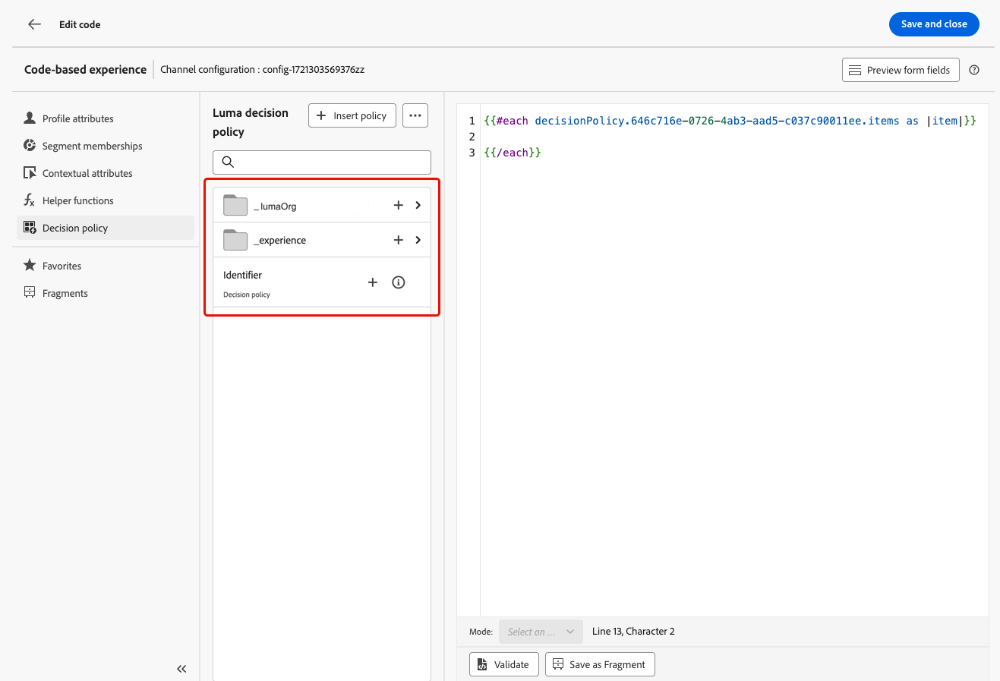
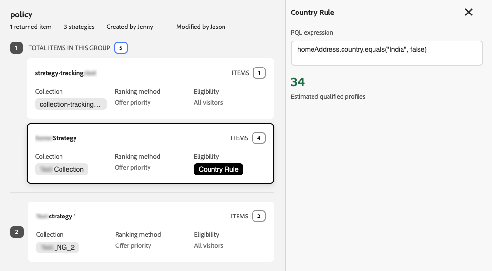

# Uso de políticas de decisión en mensajes {#create-decision}

Una vez que haya agregado una política de decisión al contenido, puede utilizar atributos de los elementos de decisión devueltos para la personalización. Para ello, inserte primero el código de la directiva de decisión en el contenido.

>[!CAUTION]
>
>Las directivas de decisión están disponibles para todos los clientes para los canales **Experiencia basada en código**, **SMS**, **Notificación push** y **Correo electrónico**.

## Inserción del código de la política de decisión {#insert}

>[!BEGINTABS]

>[!TAB Experiencia basada en código]

1. Edite su experiencia basada en código y vaya a **[!UICONTROL Directiva de decisiones]**.

2. Seleccione **[!UICONTROL Insertar directiva]** para agregar el código de la directiva de decisión.

   

>[!NOTE]
>
>En el caso de las experiencias basadas en código, si la política de decisión contiene elementos de decisión, incluidos fragmentos, puede aprovechar estos fragmentos en el código de la política de decisión. [Aprenda a aprovechar fragmentos](fragments-decision-policies.md)

>[!TAB Correo electrónico]

1. Abra **Personalization Editor** y vaya a **[!UICONTROL Directivas de decisión]**.

2. Seleccione **[!UICONTROL Insertar sintaxis]** para agregar el código para la directiva de decisión.

   

   >[!NOTE]
   >
   >Si no aparece la opción de inserción, es posible que ya se haya configurado una directiva de decisión para el componente principal.

3. Si todavía no se ha asignado ninguna ubicación al componente, seleccione una en la lista y haga clic en **[!UICONTROL Asignar]**.

   

   >[!NOTE]
   >
   >Si utiliza varias políticas de decisión en el mismo correo electrónico (por ejemplo, una para el encabezado y otra para el pie de página), la misma oferta se deduplica en todas las ubicaciones: no se procesa dos veces. La segunda directiva de decisión no devolverá ningún contenido y mostrará un espacio en blanco, a menos que haya configurado una oferta de reserva, en cuyo caso se mostrará la reserva en su lugar.

También puede insertar el código de directiva de decisión al usar el modo **[!UICONTROL Codifique su propio]** en el Designer de correo electrónico. Vaya a **[!UICONTROL Directivas de decisión]** y seleccione **[!UICONTROL Insertar sintaxis]**; aparecerá la interfaz de usuario de selección de ubicación para que pueda asignar una ubicación directamente. [Aprenda a codificar su propio contenido de correo electrónico](../email/code-content.md).

>[!AVAILABILITY]
>
>La inserción de directivas de decisión en el modo **[!UICONTROL Code your own]** está en disponibilidad limitada.

>[!NOTE]
>
>En el modo **[!UICONTROL Codifique su propio]**, solo se puede devolver un elemento de decisión por directiva, ya que el componente **[!UICONTROL Cuadrícula de repetición]** no está disponible.

>[!TAB SMS]

1. Abra **Personalization Editor** y vaya a **[!UICONTROL Directivas de decisión]**.

2. Seleccione **[!UICONTROL Insertar sintaxis]** para agregar el código para la directiva de decisión.

   

>[!TAB Push]

1. Abra **Personalization Editor** y vaya a **[!UICONTROL Directivas de decisión]**.

2. Seleccione **[!UICONTROL Insertar sintaxis]** para agregar el código para la directiva de decisión.

   

>[!IMPORTANT]
>
>Experience Decisioning con notificaciones push requiere una versión específica de Mobile SDK. Antes de implementar esta característica, compruebe [las notas de la versión](https://developer.adobe.com/client-sdks/home/release-notes){target="_blank"} para identificar la versión requerida y asegúrese de haber actualizado según corresponda. También puede ver todas las versiones de SDK disponibles para su plataforma en [esta sección](https://developer.adobe.com/client-sdks/home/current-sdk-versions){target="_blank"}.

>[!ENDTABS]

Se agrega el código de la política de decisión. Ahora puede utilizar atributos de los elementos de decisión devueltos para personalizar el contenido.

>[!NOTE]
>
>Para los canales de correo electrónico y de experiencia basados en código, repita esta secuencia una vez por cada elemento de decisión que desee devolver. Por ejemplo, si eligió devolver 2 elementos al [crear la decisión](create-decision-policy.md), repita la secuencia dos veces. Para los canales SMS y Push, solo se puede devolver un elemento de decisión.

## Personalizar con atributos de elementos de decisión {#attributes}

Después de agregar el código para una directiva de decisión en el contenido, todos los atributos de los elementos de decisión devueltos quedan disponibles para la personalización. [Aprenda a trabajar con la personalización](../personalization/personalize.md).

Los atributos se almacenan en el [esquema de catálogo](catalogs.md) &quot;Ofertas&quot;. Se muestran en las siguientes carpetas desde el editor de personalización:
* **Atributos personalizados**: carpeta `_\<imsOrg\>`
* **Atributos estándar**: carpeta `_experience`

Los atributos de elemento de decisión y los atributos contextuales no son compatibles de forma predeterminada en [!DNL Journey Optimizer] fragmentos. Sin embargo, puede utilizar variables globales en su lugar, como se describe a continuación.

Para agregar un atributo, haga clic en el icono **`+`** junto al atributo. Puede agregar tantos atributos como sea necesario. También puede incluir otros atributos de personalización, como datos de perfil.

* Para los canales **Email** y **Code-based**, ajuste los atributos dentro del bucle `#each` usando corchetes `[ ]` y agregue una coma antes de la etiqueta de cierre `/each`.

  +++Ver ejemplo

  

  +++

* Para los canales **SMS** y **Push**, asegúrese de insertar atributos después del código de sintaxis para la directiva de decisión. Esta sintaxis siempre debe mantenerse en la línea 1.

  +++Ver ejemplo

  

  +++

  >[!NOTE]
  >Si inserta un atributo de recurso de imagen en contenido SMS o push (por ejemplo, en el título o el cuerpo), el valor del atributo se muestra como una URL. La imagen en sí no se procesa en esos campos.

* Para habilitar el seguimiento de elementos de decisión, agregue el atributo `trackingToken`: `trackingToken: {{item._experience.decisioning.decisionitem.trackingToken}}`

## Previsualización y prueba del contenido

Después de crear el contenido, previsualícelo y pruébelo antes de activar el recorrido o la campaña. Los elementos de decisión se representan en función de los perfiles seleccionados en la interfaz de simulación. [Obtenga información sobre cómo obtener una vista previa y probar contenido](../content-management/preview-test.md).

## Próximos pasos {#final-steps}

Una vez que el contenido esté listo, revise y publique la campaña o el recorrido:

* [Publicación de un recorrido](../building-journeys/publish-journey.md)
* [Revisión y activación de una campaña](../campaigns/review-activate-campaign.md)

En el caso de las experiencias basadas en código, tan pronto como el desarrollador realice una llamada de API o SDK para recuperar contenido para la superficie definida en la configuración de canal, los cambios se aplicarán a su página web o aplicación.

## Ver detalles de la política de decisión en el resumen de campaña {#decision-policy-summary}

Cuando una acción o una [campaña](../campaigns/get-started-with-campaigns.md) desencadenada por API usa directivas de decisión en su contenido, la página de resumen de la campaña muestra una sección de **[!UICONTROL directivas de decisión]** que enumera todas las directivas utilizadas en la campaña.

También puede acceder a los detalles técnicos de cada directiva de decisión y copiarlos en el portapapeles, lo que puede resultar útil para solucionar problemas con el Soporte de Adobe o su equipo de ingeniería.

Para acceder a los detalles de la política de decisión y a la información técnica, siga los pasos a continuación.

1. Abra el resumen de la campaña haciendo clic en **[!UICONTROL Revisar para activar]** durante la [configuración](../campaigns/review-activate-campaign.md#action-campaign-review) o abriendo una campaña desde la lista **[!UICONTROL Campañas]**.

1. En la sección **[!UICONTROL Directivas de decisión]**, se enumeran todas las directivas utilizadas en la campaña.

   

1. Seleccione una directiva de decisión o haga clic en **[!UICONTROL Ver todo]**. Puede revisar los detalles de cada directiva, incluidos los siguientes:

   * Las estrategias utilizadas en la política de decisión
   * El número de elementos que se van a devolver
   * La recopilación, el método de clasificación y las reglas de idoneidad utilizadas para cada estrategia de selección
   * La oferta de reserva utilizada si ningún elemento de decisión es elegible

   

1. Haga clic en una colección para mostrar todos los elementos de decisión que contiene.

1. Haga clic en un elemento de decisión para acceder a sus detalles y editarlo si es necesario; se abre en una nueva pestaña del explorador. También puede hacer clic en **[!UICONTROL Ver elemento]** para mostrar los elementos de decisión que no están en una colección.

   

1. También puede ver información sobre los métodos de clasificación y las reglas de idoneidad utilizadas para cada estrategia de selección.

   {width="80%"}

1. En el resumen de la campaña, también puede seleccionar una directiva de decisión en la sección **[!UICONTROL Acciones]** y hacer clic en el icono **Información** para acceder a los detalles técnicos de la directiva de decisión.

   

1. Haga clic en el icono **Copiar al portapapeles** para copiar una representación JSON de la directiva de decisión en el portapapeles.

   El JSON copiado incluye el nombre y el ID de su organización, el nombre de la zona protegida, el ID de la política de decisión y la estructura completa de la política de decisión. Puede compartir esta información con el Soporte de Adobe o con su equipo de ingeniería para solucionar problemas de las políticas de decisión más rápido.

## Uso de paneles de informes

Para ver el rendimiento de sus decisiones, puede ver las métricas de toma de decisiones integradas en la campaña o el informe de recorrido, o crear paneles personalizados de Customer Journey Analytics para medir el rendimiento y obtener información sobre cómo se entregan las políticas de decisión y las ofertas y cómo se relacionan con ellas. [Más información acerca de los informes de decisiones](cja-reporting.md).

