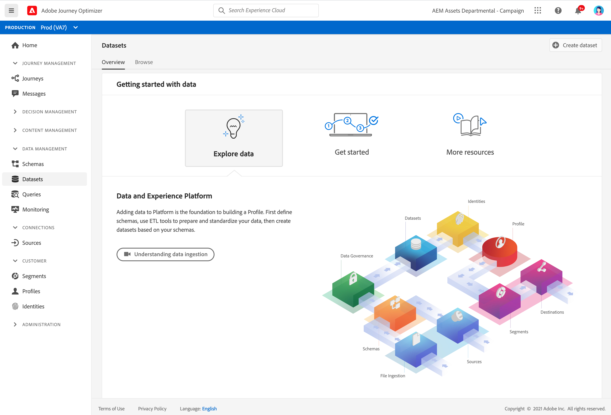

# Introducción a los conjuntos de datos {#datasets-gs}

Todos los datos que se incorporan en Adobe Experience Platform se conservan dentro del lago de datos como conjuntos de datos. Un conjunto de datos es una construcción de almacenamiento y administración para una colección de datos, normalmente una tabla, que contiene un esquema (columnas) y campos (filas).

Aprenda a crear conjuntos de datos en [esta documentación](https://experienceleague.adobe.com/docs/experience-platform/catalog/datasets/overview.html){target=&quot;_blank&quot;}.

Añadir datos a Adobe Experience Platform es la base para crear un perfil. A continuación, podrá aprovechar los perfiles en [!DNL Adobe Journey Optimizer]. En primer lugar, defina esquemas, utilice herramientas de ETL para preparar y estandarizar sus datos y, a continuación, cree conjuntos de datos basados en sus esquemas.

➡️ [Obtenga información sobre cómo crear y configurar un conjunto de datos](#video-dataset) (vídeo)

El espacio de trabajo **Datasets** en la interfaz de usuario [!DNL Adobe Journey Optimizer] le permite explorar datos y crear conjuntos de datos.

Aprenda a utilizar la interfaz de usuario de conjuntos de datos en la [Documentación general de la ingesta de datos](https://experienceleague.adobe.com/docs/experience-platform/ingestion/home.html?lang=es){target=&quot;_blank&quot;}.

La documentación paso a paso para asignar un archivo CSV a un esquema XDM está disponible en [esta documentación](https://experienceleague.adobe.com/docs/experience-platform/ingestion/tutorials/map-a-csv-file.html?lang=es){target=&quot;_blank&quot;}

## Vídeo explicativo{#video-dataset}

Obtenga información sobre cómo crear un conjunto de datos, asignarlo a un esquema, añadirle datos y confirmar que estos se han introducido.

>[!VIDEO](https://video.tv.adobe.com/v/334293?quality=12)

**Consulte también**

* [Crear un esquema, un conjunto de datos e introducir datos para añadir perfiles de prueba en Journey Optimizer](building-journeys/creating-test-profiles.md)
* [Resumen de ingesta de transmisión](https://experienceleague.adobe.com/docs/experience-platform/ingestion/streaming/overview.html?lang=es){target=&quot;_blank&quot;}
* [Ingesta de datos en Adobe Experience Platform](https://experienceleague.adobe.com/docs/experience-platform/ingestion/tutorials/ingest-batch-data.html){target=&quot;_blank&quot;}

