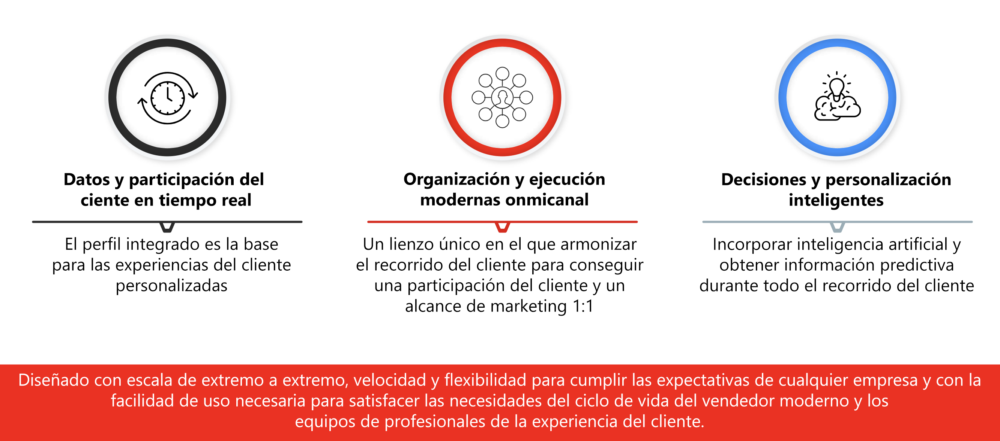

# Introducción a Journey Optimizer {#cjm-gs}

>[!CONTEXTUALHELP]
>id="test_id"
>title="Algunos contenidos de prueba"
>abstract="Probar contenido para la integración de ayuda contextual en AJO."

## ¿Qué es [!DNL Adobe Journey Optimizer]?{#about-cjm}

[!DNL Adobe Journey Optimizer] ayuda a las empresas a ofrecer a sus clientes experiencias conectadas, contextuales y personalizadas. El recorrido del cliente es todo el proceso de interacción de un cliente con la marca, desde el primer momento de contacto hasta que se marcha. Comienza con la fase de sensibilización, en la que el cliente aprende sobre la marca y comienza a interactuar. A continuación, el cliente interactuará con la marca, visitará sitios en línea y físicos y realizará compras, enviará mensajes o revisará las publicaciones.

[!DNL Adobe Journey Optimizer] se basa de forma nativa en  [!DNL Adobe Experience Platform] y combina un perfil de cliente unificado y en tiempo real, un marco de trabajo abierto con prioridad API, offer decisioning centralizado, inteligencia artificial (IA) y aprendizaje automático (ML) para la personalización y la optimización. Journey Optimizer permite que las marcas determinen de forma inteligente la siguiente mejor interacción con la escala, la velocidad y la flexibilidad en todo el recorrido del cliente. Con [!DNL Adobe Journey Optimizer], las empresas pueden crear y entregar, dentro de la misma aplicación, campañas de marketing programadas (como promociones semanales para una tienda minorista) y comunicaciones individuales personalizadas (como una notificación push para un artículo que un cliente de una aplicación de fidelidad podría haber visto antes sin existencias).

## Casos de uso

* Los especialistas en marketing pueden utilizar [!DNL Adobe Journey Optimizer] para enviar comunicaciones individualizadas y comunicaciones por lotes basadas en audiencias. Por ejemplo: una tienda de ropa suele enviar estudios posteriores a la compra a todos los clientes que han comprado productos en la última semana. Debido al clima de inclemencia, algunos envíos experimentaron retrasos. Al ver qué clientes no han recibido sus envíos, la tienda de ropa puede excluirlos del envío de satisfacción del cliente programado y, en su lugar, enviar un correo electrónico personalizado pidiendo disculpas por el retraso y ofreciendo un código de descuento con recomendaciones de productos basadas en las compras anteriores del cliente.

   Los especialistas en marketing también pueden utilizar la aplicación para enviar comunicaciones basadas en comportamientos en tiempo real. Por ejemplo, el mismo minorista podría atraer a un cliente fiel que entra en el estacionamiento de la tienda en tiempo real enviándole una notificación push sobre un suéter que vuelve a estar en existencias en el tamaño del cliente.

* Los no especialistas en marketing, como los equipos de operaciones y el servicio de asistencia al cliente que participan en la experiencia del cliente, pueden utilizar [!DNL Adobe Journey Optimizer] para administrar una variedad de tareas, como notificaciones operacionales o incluso para supervisar el proceso de incorporación. Por ejemplo, un parque de diversiones donde los visitantes del parque descargan una aplicación móvil como parte de su experiencia en el parque. El personal de mantenimiento puede utilizar [!DNL Adobe Journey Optimizer] para notificar a los visitantes del parque de los viajes que están actualmente cerrados debido al mantenimiento.

## Funcionalidades clave

[!DNL Adobe Journey Optimizer] es una aplicación ágil y escalable para crear y ofrecer experiencias de cliente personalizadas, conectadas y oportunas en cualquier aplicación, dispositivo o canal.

Las funciones clave incluyen:

* **Perspectivas y participación del cliente en tiempo real** : un perfil integrado fusiona los datos en tiempo real de todas las fuentes en distintos puntos de contacto del cliente, incluidos los datos de comportamiento, transaccionales, financieros y operativos para optimizar las experiencias personales y contextuales para los clientes en su tiempo.

* **Organización y ejecución modernas**  omnicanal: un lienzo único en el que armonizar y optimizar el recorrido del cliente para la participación del cliente y el alcance de marketing 1:1 para ayudar a las marcas a proporcionar más valor a lo largo del ciclo de vida del cliente. Los recorridos de cliente diseñados en [!DNL Adobe Journey Optimizer] pueden ser dinámicos y estar basados en eventos para ayudar a las marcas a reaccionar a las señales en tiempo real, así como a conectar esas interacciones con campañas programadas, de modo que se puedan tomar las decisiones correctas sobre qué comunicaciones enviar a un cliente, cuándo y a través de qué canales.

* **Intelligent Decisioning &amp; Personalization** : las marcas pueden aplicar decisiones centralizadas e incorporar inteligencia artificial y aprendizaje automático para obtener perspectivas predictivas a través de la experiencia del cliente, lo que facilita la automatización de decisiones y la optimización de la experiencia a escala. El offer decisioning alimenta las ofertas centralizadas entre canales a escala a través de [!DNL Adobe Journey Optimizer].

>[!NOTE]
>
> Los procedimientos y directrices generales de privacidad de Adobe Experience Cloud se aplican a [!DNL Journey Optimizer]. [Obtenga más información sobre la privacidad de Adobe Experience Cloud](https://www.adobe.com/es/privacy/experience-cloud.html).
> También debe tener en cuenta los [protecciones para los datos del perfil del cliente en tiempo real antes de iniciar](https://experienceleague.adobe.com/docs/experience-platform/profile/guardrails.html).

**Consulte también**

* [Pasos clave para comenzar](quick-start.md)
* [Creación de su primer mensaje](get-started-content.md)
* [Diseño de recorridos y envío de mensajes](building-journeys/journey-gs.md)
* [Informes en directo](reports/live-report.md)
* [Preguntas frecuentes sobre Journey Optimizer](assets/do-not-localize/AJO-FAQ.pdf)  (PDF)
