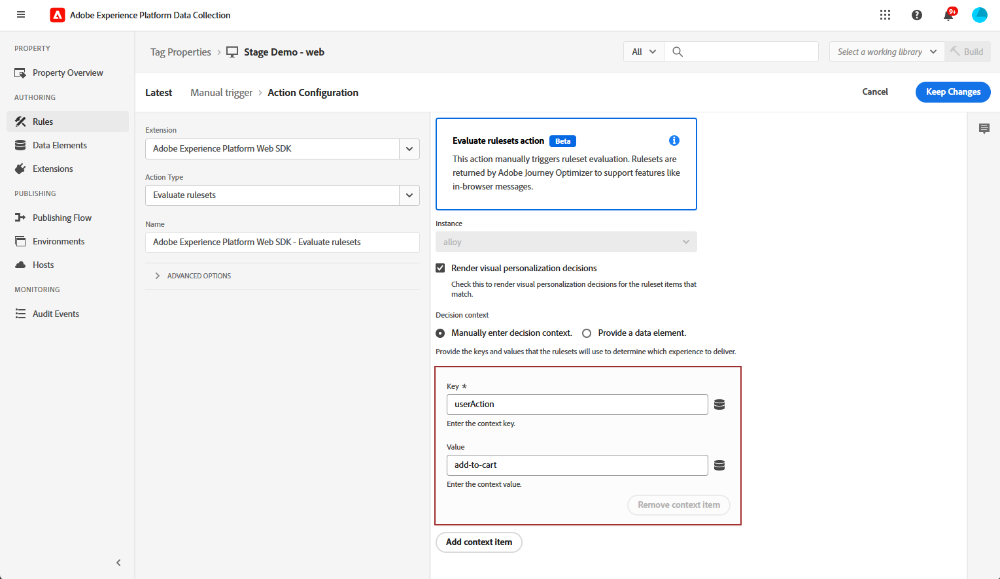

# Configuración del canal web en la aplicación {#configure-in-app-web}

## Requisitos previos {#prerequisites}

* Asegúrese de que está utilizando la versión más reciente para su extensión **Adobe Experience Platform Web SDK**.

* Instale la extensión **Adobe Experience Platform Web SDK** en sus **propiedades de etiquetas** y habilite la opción **Almacenamiento de Personalization**.

  Esta configuración es esencial para almacenar historiales de eventos en el cliente, un requisito previo para implementar Reglas de frecuencia en el Generador de reglas. [Más información](https://experienceleague.adobe.com/docs/experience-platform/tags/extensions/client/web-sdk/web-sdk-extension-configuration.html?lang=en)

  

## Configurar los datos enviados a la regla de plataforma {#configure-sent-data-trigger}

1. Acceda a su instancia de **recopilación de datos de Adobe Experience Platform** y vaya a **Propiedades de etiquetas** configuradas con la extensión **Adobe Experience Platform Web SDK**.

1. En el menú **Creación**, seleccione **Reglas** y luego **Crear nueva regla** o **Agregar regla**.

   

1. En la sección **Events**, haga clic en **Add** y configúrelo de la siguiente manera:

   * **Extensión**: Principal

   * **Tipo de evento**: Biblioteca cargada (Principio de página).

   

1. Haga clic en **Conservar cambios** para guardar la configuración del evento.

1. En la sección **Acciones**, haga clic en **Agregar** y configúrelo de la siguiente manera:

   * **Extensión**: Adobe Experience Platform Web SDK

   * **Tipo de acción**: Enviar evento

   

1. En la sección **Personalization** de su tipo **Acción**, habilite la opción **Procesar decisiones de personalización visual**.

   

1. En la sección **Contexto de decisión**, defina los pares **Clave** y **Valor** que determinan qué experiencia se ofrece.

   

1. Guarde la configuración de **Action** haciendo clic en **Conservar cambios**.

1. Vaya al menú **Flujo de publicación**. Cree una nueva **biblioteca** o seleccione una **biblioteca** existente y agréguele la **regla** recién creada. [Más información](https://experienceleague.adobe.com/docs/experience-platform/tags/publish/libraries.html?lang=en#create-a-library)

1. En su **biblioteca**, seleccione **Guardar y generar en desarrollo**.

   

## Configurar regla manual {#configure-manual-trigger}

1. Acceda a su instancia de **recopilación de datos de Adobe Experience Platform** y vaya a **Propiedades de etiquetas** configuradas con la extensión **Adobe Experience Platform Web SDK**.

1. En el menú **Creación**, seleccione **Reglas** y luego **Crear nueva regla** o **Agregar regla**.

   

1. En la sección **Events**, haga clic en **Add** y configúrelo de la siguiente manera:

   * **Extensión**: Principal

   * **Tipo de evento**: haga clic en

   

1. En la **configuración de clic**, defina el **Selector** que se evaluará.

   

1. Haga clic en **Conservar cambios** para guardar la configuración de **Evento**.

1. En la sección **Acciones**, haga clic en **Agregar** y configúrelo de la siguiente manera:

   * **Extensión**: Adobe Experience Platform Web SDK

   * **Tipo de acción**: Evaluar conjuntos de reglas

   

1. En la sección **Evaluar la acción de conjuntos de reglas** de su tipo **Acción**, habilite la opción **Procesar decisiones de personalización visual**.

   

1. En la sección **Contexto de decisión**, defina los pares **Clave** y **Valor** que determinan qué experiencia se ofrece.

1. Acceda al menú **Flujo de publicación**, cree una nueva **biblioteca** o seleccione una **biblioteca** existente y agregue la **regla** recién creada. [Más información](https://experienceleague.adobe.com/docs/experience-platform/tags/publish/libraries.html?lang=en#create-a-library)

1. En su **biblioteca**, seleccione **Guardar y generar en desarrollo**.

   

## Creación de una configuración web en la aplicación {#in-app-config}

1. Acceda al menú **[!UICONTROL Canales]** > **[!UICONTROL Configuración general]** > **[!UICONTROL Configuraciones de canal]** y luego haga clic en **[!UICONTROL Crear configuración de canal]**.

   

1. Introduzca un nombre y una descripción (opcional) para la configuración y, a continuación, seleccione el canal que desea configurar.

   >[!NOTE]
   >
   > Los nombres deben comenzar por una letra (A-Z). Solo puede contener caracteres alfanuméricos. También puede utilizar caracteres de guion bajo `_`, punto `.` y guion `-`.

1. Para asignar etiquetas de uso de datos principales o personalizadas a la configuración, puedes seleccionar **[!UICONTROL Administrar acceso]**. [Obtenga más información acerca del Control de acceso de nivel de objeto (OLAC)](../administration/object-based-access.md).

1. Seleccione **[!UICONTROL Acciones de marketing]** para asociar directivas de consentimiento a los mensajes que usan esta configuración. Todas las políticas de consentimiento asociadas con la acción de marketing se aprovechan para respetar las preferencias de los clientes. [Más información](../action/consent.md#surface-marketing-actions)

1. Seleccione el canal **Mensajería en la aplicación**.

1. Defina una Configuración de aplicación. Tiene dos opciones para realizar cambios:

   * Puede escribir una **[!UICONTROL URL de página]** para aplicar los cambios a una página específica.

   * Puede crear una regla para segmentar varias direcciones URL que sigan el mismo patrón.

     +++ Cómo generar una regla de coincidencia de páginas.

      1. Seleccione **[!UICONTROL Regla de coincidencia de páginas]** como Configuración de aplicación e introduzca su **[!UICONTROL URL de página]**.

      1. En la ventana **[!UICONTROL Editar regla de configuración]**, defina los criterios para los campos **[!UICONTROL Dominio]** y **[!UICONTROL Página]**.
      1. En los menús desplegables de condición, personalice aún más los criterios.

         Por ejemplo, para editar los elementos que se muestran en todas las páginas de productos de ventas del sitio web de Luma, seleccione Dominio > Empieza con > Luma y Página > Contiene > Ventas.

         

      1. Haga clic en **[!UICONTROL Agregar otra regla de página]** para crear otra regla si es necesario.

      1. Seleccione la **[!UICONTROL URL de creación y vista previa predeterminada]**.

      1. Guarde los cambios. La regla se muestra en la pantalla **[!UICONTROL Crear campaña]**.

     +++

1. Envíe la configuración web en la aplicación.

Ahora puede [crear una aplicación web](../in-app/create-in-app-web.md) dentro de una campaña.
