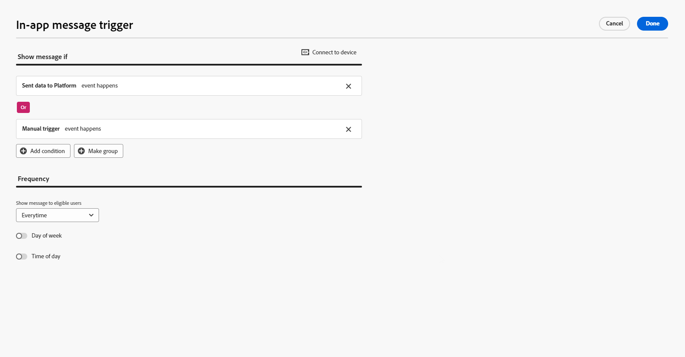

# Creación de un mensaje web en la aplicación {#create-in-app-web}

## Configuración del canal web en la aplicación {#configure-web-inapp}

Para configurar el canal web en la aplicación, siga los pasos a continuación:

* Instale la extensión de etiquetas Web SDK para admitir la mensajería en la aplicación web. [Más información](https://experienceleague.adobe.com/docs/experience-platform/tags/extensions/client/web-sdk/web-sdk-extension-configuration.html?lang=es){target="_blank"}

* Personalice sus déclencheur. La mensajería web en la aplicación admite dos tipos de déclencheur: datos enviados a la plataforma y déclencheur manuales. [Más información](https://experienceleague.adobe.com/docs/experience-platform/edge/personalization/ajo/web-in-app-messaging.html?lang=es){target="_blank"}

* Cree la configuración web en la aplicación. [Más información](inapp-configuration.md)

## Creación de la campaña de mensajes en la aplicación web {#create-inapp-web-campaign}

1. Acceda al menú **[!UICONTROL Campañas]** y haga clic en **[!UICONTROL Crear campaña]**.

1. Elija su tipo de ejecución de campaña: programada o activada por API. Más información sobre los tipos de campañas en [esta página](../campaigns/create-campaign.md#campaigntype).

1. En el menú desplegable **[!UICONTROL Acciones]**, elija **[!UICONTROL Mensaje en la aplicación]**.

   

1. Elija o cree la configuración de la aplicación. [Más información](inapp-configuration.md#channel-prerequisites)

## Definición de la campaña de mensajes en la aplicación web {#configure-inapp}

1. En la sección **[!UICONTROL Propiedades]**, escriba la descripción de **[!UICONTROL Título]** y **[!UICONTROL Descripción]**.

1. Para asignar etiquetas de uso de datos principales o personalizadas al mensaje en la aplicación, seleccione **[!UICONTROL Administrar acceso]**. [Más información](../administration/object-based-access.md).

1. Haga clic en el botón **[!UICONTROL Seleccionar audiencia]** para definir la audiencia a la que se dirigirá desde la lista de audiencias de Adobe Experience Platform disponibles. [Más información](../audience/about-audiences.md).

   

1. En el campo **[!UICONTROL Área de nombres de identidad]**, elija el área de nombres que desea usar para identificar a los individuos de la audiencia seleccionada. [Más información](../event/about-creating.md#select-the-namespace).

1. En el menú **[!UICONTROL Acción]**, puede encontrar la configuración previamente configurada como **[!UICONTROL Configuración de la aplicación]**. Si es necesario, puede hacer cambios aquí o actualizar la regla haciendo clic en **[!UICONTROL Editar regla]**.

1. Haga clic en **[!UICONTROL Crear experimento]** para comenzar a configurar el experimento de contenido y crear tratamientos para medir su rendimiento e identificar la mejor opción para la audiencia objetivo. [Más información](../content-management/content-experiment.md)

1. Haga clic en **[!UICONTROL Editar déclencheur]** para elegir los eventos y criterios que almacenarán el mensaje en déclencheur. Los creadores de reglas permiten a los usuarios especificar criterios y valores que, cuando se cumplen, almacenan en déclencheur un conjunto de acciones, como enviar un mensaje en la aplicación.

   1. Haga clic en el menú desplegable de evento para cambiar el Déclencheur si es necesario.

      +++Consulte los Déclencheur disponibles.

      | Paquete | Déclencheur | Definición |
      |---|---|---|
      | Plataforma | Datos enviados a Platform | Se activa cuando la aplicación móvil emite un evento de experiencia Edge para enviar datos a Adobe Experience Platform. Normalmente, la llamada de API [sendEvent](https://developer.adobe.com/client-sdks/documentation/edge-network/api-reference/#sendevent){target="_blank"} procede de la extensión de AEP Edge. |
      | Manual | Déclencheur manual | Dos elementos de datos asociados: una clave, que es una constante que define el conjunto de datos (por ejemplo, sexo, color, precio), y un valor, que es una variable que pertenece al conjunto (por ejemplo, hombre/mujer, verde, 100). |

      +++

   1. Haga clic en **[!UICONTROL Agregar condición]** si desea que el déclencheur tenga en cuenta varios eventos o criterios.

   1. Elija la condición **[!UICONTROL Or]** si desea agregar más **[!UICONTROL Déclencheur]** para expandir aún más la regla.

      

   1. Elija la condición **[!UICONTROL And]** si desea agregar un **[!UICONTROL rasgo]** personalizado y ajustar mejor la regla.

      +++Consulte Características disponibles.

      | Paquete | Característica | Definición |
      |---|---|---|
      | Plataforma | Tipo de evento de XDM | Se activa cuando se cumple el tipo de evento especificado. |
      | Plataforma | Valor XDM | Se activa cuando se cumple el valor XDM especificado. |

      +++

      

   1. Haga clic en **[!UICONTROL Crear grupo]** para agrupar los déclencheur.

1. Elija la frecuencia del déclencheur cuando su mensaje en la aplicación esté activo. Las opciones disponibles son las siguientes:

   * **[!UICONTROL Siempre]**: mostrar siempre el mensaje cuando se produzcan los eventos seleccionados en la lista desplegable **[!UICONTROL déclencheur de la aplicación móvil]**.
   * **[!UICONTROL Una vez]**: mostrar este mensaje solo la primera vez que se produzcan los eventos seleccionados en la lista desplegable **[!UICONTROL déclencheur de aplicaciones móviles]**.
   * **[!UICONTROL Hasta que se hace clic]**: muestra este mensaje cuando se producen los eventos seleccionados en la lista desplegable **[!UICONTROL déclencheur de la aplicación móvil]** hasta que SDK envíe un evento de interacción con la acción &quot;se hizo clic&quot;.
   * **[!UICONTROL X número de veces]**: mostrar este mensaje X vez.

1. Si es necesario, elija qué **[!UICONTROL día de la semana]** o **[!UICONTROL hora del día]** se mostrará el mensaje en la aplicación.

1. Las campañas están diseñadas para ejecutarse en una fecha específica o en una frecuencia recurrente. Aprenda a configurar la **[!UICONTROL programación]** de su campaña en [esta sección](../campaigns/create-campaign.md#schedule).

   

1. Ahora puedes empezar a diseñar tu contenido con el botón **[!UICONTROL Editar contenido]**. [Más información](design-in-app.md)

   

**Temas relacionados:**

* [Prueba y envío de un mensaje en la aplicación](send-in-app.md)
* [Informe en la aplicación](../reports/campaign-global-report-cja-inapp.md)
* [Configuración en la aplicación](inapp-configuration.md)
