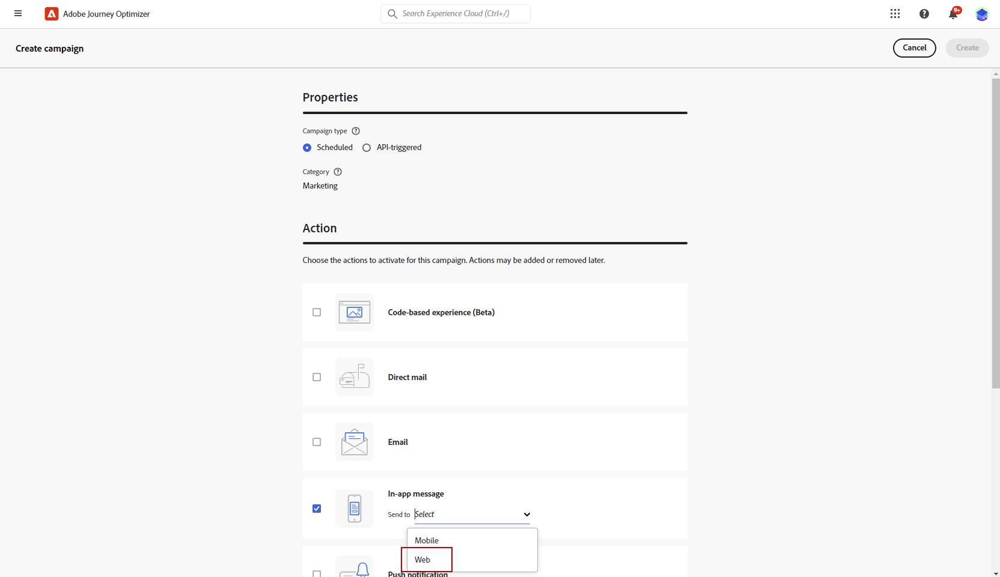

# Creación de un mensaje web en la aplicación {#create-in-app-web}

## Configuración del canal web en la aplicación {#configure-web-inapp}

Para configurar el canal web en la aplicación, siga los pasos a continuación:

* Instale la extensión de etiqueta del SDK web para admitir la mensajería en la aplicación web. [Más información](https://experienceleague.adobe.com/docs/experience-platform/tags/extensions/client/web-sdk/web-sdk-extension-configuration.html?lang=en)

* Personalice sus déclencheur. La mensajería web en la aplicación admite dos tipos de déclencheur: datos enviados a la plataforma y déclencheur manuales. [Más información](https://experienceleague.adobe.com/docs/experience-platform/edge/personalization/ajo/web-in-app-messaging.html)

## Creación de la campaña de mensajes en la aplicación web {#create-inapp-web-campaign}

1. Acceda a la **[!UICONTROL Campañas]** y haga clic en **[!UICONTROL Crear campaña]**.

1. En el **[!UICONTROL Propiedades]** , seleccione cuando el tipo de ejecución de la campaña: Programada o activada por API. Obtenga más información acerca de los tipos de campañas en [esta página](../campaigns/create-campaign.md#campaigntype).

1. En el **[!UICONTROL Acciones]** , seleccione la **[!UICONTROL Mensaje en la aplicación]**. Desde el **[!UICONTROL Enviar a]** , seleccione Web.

   

1. Defina una superficie de aplicación. Tiene dos opciones para realizar cambios:

   * Puede introducir una **[!UICONTROL URL de página]** para aplicar cambios a una página específica.

   * Puede crear una regla para segmentar varias direcciones URL que sigan el mismo patrón.

+++ Cómo generar una regla de coincidencia de páginas.

      1. Seleccionar **[!UICONTROL Regla de coincidencia de páginas]** como superficie de aplicación.
      1. Clic **[!UICONTROL Crear regla]**.

         

      1. En el **[!UICONTROL Editar regla de superficie]** , defina los criterios para la **[!UICONTROL Dominio]** y **[!UICONTROL Página]** campos.
      1. En los menús desplegables de condición, personalice aún más los criterios.

         Por ejemplo, para editar los elementos que se muestran en todas las páginas de productos de ventas del sitio web de Luma, seleccione Dominio > Empieza con > Luma y Página > Contiene > Ventas.

         

      1. Guarde los cambios. La regla se muestra en la **[!UICONTROL Crear campaña]** pantalla.

+++

   

1. Una vez seleccionada y configurada la superficie de la aplicación, haga clic en **[!UICONTROL Crear]**.

## Definición de la campaña de mensajes en la aplicación web {#configure-inapp}

1. Desde el **[!UICONTROL Propiedades]** , introduzca la **[!UICONTROL Título]** y el **[!UICONTROL Descripción]** descripción.

1. Para asignar etiquetas de uso de datos personalizadas o principales al mensaje en la aplicación, seleccione **[!UICONTROL Administrar acceso]**. [Más información](../administration/object-based-access.md).

1. Haga clic en **[!UICONTROL Seleccionar audiencia]** para definir la audiencia de destino a partir de la lista de audiencias de Adobe Experience Platform disponibles. [Más información](../audience/about-audiences.md).

   

1. En el **[!UICONTROL Área de nombres de identidad]** , elija el área de nombres que desea utilizar para identificar a los individuos de la audiencia seleccionada. [Más información](../event/about-creating.md#select-the-namespace).

1. En el **[!UICONTROL Acción]** , puede encontrar los ajustes configurados previamente como **[!UICONTROL Superficie de aplicación]**. Puede realizar cambios aquí si es necesario o actualizar la regla haciendo clic en **[!UICONTROL Editar regla]**.

1. Clic **[!UICONTROL Crear experimento]** para comenzar a configurar el experimento de contenido y crear tratamientos para medir su rendimiento e identificar la mejor opción para la audiencia de destino. [Más información](../campaigns/content-experiment.md)

1. Clic **[!UICONTROL Editar déclencheur]** para elegir los eventos y los criterios que almacenarán en déclencheur el mensaje. Los creadores de reglas permiten a los usuarios especificar criterios y valores que, cuando se cumplen, almacenan en déclencheur un conjunto de acciones, como enviar un mensaje en la aplicación.

   1. Haga clic en el menú desplegable de evento para cambiar el Déclencheur si es necesario.

      +++Consulte los Déclencheur disponibles.

      | Paquete | Activador | Definición |
      |---|---|---|
      | Plataforma | Datos enviados a Platform | Se activa cuando la aplicación móvil emite un evento de experiencia Edge para enviar datos a Adobe Experience Platform. Normalmente, la llamada de API [sendEvent](https://developer.adobe.com/client-sdks/documentation/edge-network/api-reference/#sendevent) desde la extensión AEP Edge. |
      | Manual | Déclencheur manual | Dos elementos de datos asociados: una clave, que es una constante que define el conjunto de datos (por ejemplo, sexo, color, precio), y un valor, que es una variable que pertenece al conjunto (por ejemplo, hombre/mujer, verde, 100). |

+++

   1. Clic **[!UICONTROL Añadir condición]** si desea que el déclencheur considere varios eventos o criterios.

   1. Elija la **[!UICONTROL O]** condición si desea agregar más **[!UICONTROL Déclencheur]** para ampliar aún más la regla.

      

   1. Elija la **[!UICONTROL Y]** si desea agregar una condición personalizada **[!UICONTROL Rasgo]** y mejor afina tu regla.

      +++Consulte Características disponibles.

      | Paquete | Característica | Definición |
      |---|---|---|
      | Plataforma | Tipo de evento de XDM | Se activa cuando se cumple el tipo de evento especificado. |
      | Plataforma | Valor XDM | Se activa cuando se cumple el valor XDM especificado. |
+++

      

   1. Clic **[!UICONTROL Crear grupo]** para agrupar déclencheur.

1. Elija la frecuencia del déclencheur cuando su mensaje en la aplicación esté activo. Las opciones disponibles son las siguientes:

   * **[!UICONTROL Siempre]**: Mostrar siempre el mensaje cuando los eventos seleccionados en la **[!UICONTROL Déclencheur de aplicación móvil]** se produce la lista desplegable.
   * **[!UICONTROL Una]**: Mostrar solo este mensaje la primera vez que se seleccionen los eventos en la **[!UICONTROL Déclencheur de aplicación móvil]** se produce la lista desplegable.
   * **[!UICONTROL Hasta el clic]**: Muestra este mensaje cuando los eventos seleccionados en la **[!UICONTROL Déclencheur de aplicación móvil]** se producen hasta que el SDK envía un evento de interacción con una acción de &quot;clic&quot;.
   * **[!UICONTROL X número de veces]**: muestra este mensaje X vez.

1. Si es necesario, elija cuál **[!UICONTROL Día de la semana]** o **[!UICONTROL Hora del día]** se muestra el mensaje en la aplicación.

1. Las campañas están diseñadas para ejecutarse en una fecha específica o en una frecuencia recurrente. Obtenga información sobre cómo configurar el **[!UICONTROL Programación]** de la campaña en [esta sección](../campaigns/create-campaign.md#schedule).

   

1. Ahora puede empezar a diseñar el contenido con **[!UICONTROL Editar contenido]** botón. [Más información](design-in-app.md)

   

**Temas relacionados:**

* [Prueba y envío de un mensaje en la aplicación](send-in-app.md)
* [Informe en la aplicación](../reports/campaign-global-report.md#inapp-report)
* [Configuración en la aplicación](inapp-configuration.md)
