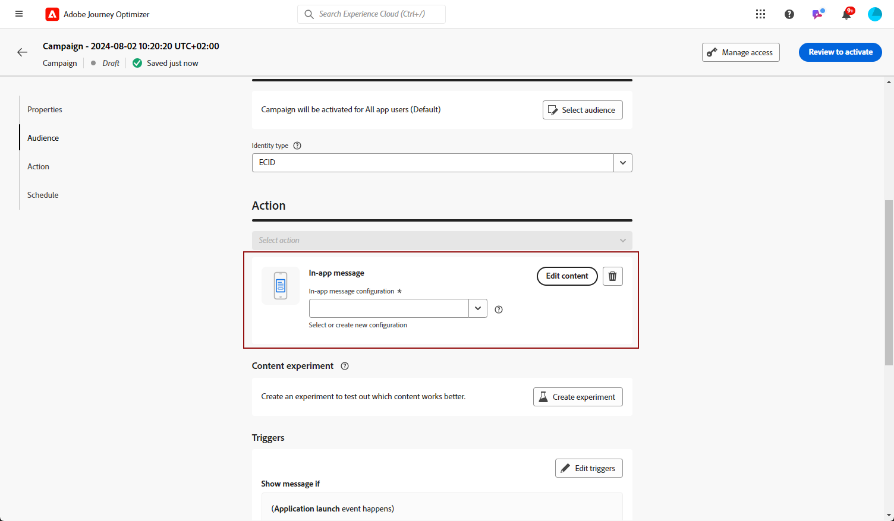

# Creación de un mensaje en la aplicación  {#create-in-app}

>[!CONTEXTUALHELP]
>id="ajo_campaigns_inapp_triggers"
>title="Activadores de administración en la aplicación"
>abstract="Controle de forma eficaz sus Activadores seleccionando los eventos y criterios específicos que activarán sus mensajes. Con el Generador de reglas, los usuarios pueden definir condiciones y valores precisos. Cuando se cumplen estas condiciones, inician una serie de acciones, incluido el envío de mensajes en la aplicación."

Puede añadir un mensaje en la aplicación en una campaña o en un recorrido. Siga los pasos detallados a continuación para crear un mensaje en la aplicación en ambos contextos.

Tenga en cuenta que los mensajes en la aplicación no se ven afectados por la opción del usuario de incluirse o excluirse de las notificaciones push en el sistema operativo.

>[!BEGINTABS]

>[!TAB Agregar un mensaje en la aplicación a un recorrido]

Para añadir un mensaje en la aplicación en un recorrido, siga estos pasos:

1. Abra el [recorrido](../building-journeys/journey-gs.md) y, a continuación, arrastre y suelte una actividad **[!UICONTROL Acción]** desde la sección **[!UICONTROL Acciones]** de la paleta. Más información sobre la [actividad de acción](../building-journeys/journey-action.md).

   >[!IMPORTANT]
   >
   >Dado que ahora se puede acceder a todos los canales nativos a través de la actividad de acción, las actividades de canal nativo heredadas quedarán obsoletas con la versión de marzo. Los recorridos existentes que incluyen acciones heredadas seguirán funcionando tal cual; no se requiere ninguna migración.

1. Seleccione **[!UICONTROL En la aplicación]** como tipo de acción.

   

   >[!NOTE]
   >
   >Cuando un perfil llega al final de su recorrido, los mensajes en la aplicación que se les muestren caducarán automáticamente. Por esa razón, se agrega automáticamente una actividad de **Espera** de 3 días después de la acción en la aplicación para garantizar un tiempo de espera adecuado. [Más información](../building-journeys/wait-activity.md#auto-wait-node)

1. Escriba una **[!UICONTROL etiqueta]** para identificar la acción en el lienzo de recorrido.

1. Haga clic en el botón **[!UICONTROL Configurar acción]**.

1. Se le dirigirá a la ficha **[!UICONTROL Acciones]**. A partir de ahí, seleccione o cree la configuración en la aplicación que desea utilizar. [Más información](inapp-configuration.md#channel-prerequisites)

   

1. Seleccione el botón **[!UICONTROL Editar contenido]** y cree el contenido como desee. [Más información](design-in-app.md)

1. Haga clic en **[!UICONTROL Editar déclencheur]** para elegir los eventos y criterios que almacenarán el mensaje en déclencheur. Los creadores de reglas permiten a los usuarios especificar criterios y valores que, cuando se cumplen, almacenan en déclencheur un conjunto de acciones, como enviar un mensaje en la aplicación. [Más información](design-in-app.md)

   1. Haga clic en el menú desplegable de evento para cambiar el Déclencheur si es necesario.

      +++Consulte los Déclencheur disponibles.

      | Paquete | Déclencheur | Definición |
      |---|---|---|
      | Envío de datos a Platform | Datos enviados a Platform | Se activa cuando la aplicación móvil emite un evento de experiencia Edge para enviar datos a Adobe Experience Platform. Normalmente, la llamada de API [sendEvent](https://developer.adobe.com/client-sdks/documentation/edge-network/api-reference/#sendevent) procede de la extensión de AEP Edge. |
      | Seguimiento principal | Seguimiento de acciones | Se activa cuando se llama a la funcionalidad heredada ofrecida en la API de código móvil [trackAction](https://developer.adobe.com/client-sdks/documentation/mobile-core/api-reference/#trackaction). |
      | Seguimiento principal | Estado de seguimiento | Se activa cuando se llama a la funcionalidad heredada ofrecida en la API de código móvil [trackState](https://developer.adobe.com/client-sdks/documentation/mobile-core/api-reference/#trackstate). |
      | Seguimiento principal | Recopilar PII | Se activa cuando se llama a la funcionalidad heredada ofrecida en la API de código móvil [collectPII](https://developer.adobe.com/client-sdks/documentation/mobile-core/api-reference/#collectpii). |
      | Ciclo de aplicación | Inicio de aplicación | Se activa en cada ejecución, incluidos los bloqueos y las instalaciones. También se activa al reanudar desde segundo plano cuando se ha superado el tiempo de espera de la sesión de ciclo vital. |
      | Ciclo de aplicación | Instalación de aplicación | Se activa la primera vez que se ejecuta después de la instalación o reinstalación. |
      | Ciclo de aplicación | Actualización de aplicación | Se activa la primera vez que se ejecuta después de una actualización o cuando cambia el número de versión. |
      | Ciclo de aplicación | Cierre de aplicación | Se activa cuando se cierra la aplicación. |
      | Ciclo de aplicación | Bloqueo de aplicación | Se activa cuando la aplicación no se envía al segundo plano antes de cerrarse. El evento se envía cuando la aplicación se inicia después del bloqueo. Los informes de bloqueo de Adobe Mobile no implementan un controlador global de excepciones no detectadas. |
      | Places | Introducir POI | Se activa mediante la SDK de Places cuando el cliente introduce el punto de interés (PDI) que ha configurado. |
      | Places | POI de salida | Se activa mediante la SDK de Places cuando el cliente sale del punto de interés (PDI) que ha configurado. |

      +++

   1. Haga clic en **[!UICONTROL Agregar condición]** si desea que el déclencheur tenga en cuenta varios eventos o criterios.

   1. Elija la condición **[!UICONTROL Or]** si desea agregar más **[!UICONTROL Déclencheur]** para expandir aún más la regla.

      

   1. Elija la condición **[!UICONTROL And]** si desea agregar **[!UICONTROL características]** y ajustar mejor la regla.

      +++Consulte Características disponibles.

      | Paquete | Rasgos | Definición |
      |---|---|---|
      | Información del dispositivo | Nombre del operador | Se activa cuando se cumple uno de los nombres de operador de la lista. |
      | Información del dispositivo | Nombre del dispositivo | Se activa cuando se cumple uno de los nombres de dispositivo. |
      | Información del dispositivo | Configuración regional | Se activa cuando se cumple uno de los idiomas de la lista. |
      | Información del dispositivo | Versión del SO | Se activa cuando se cumple una de las versiones del sistema operativo especificadas. |
      | Información del dispositivo | Versión anterior del sistema operativo | Se activa cuando se cumple una de las versiones anteriores del sistema operativo especificadas. |
      | Información del dispositivo | Modo de ejecución | Se activa si el modo de ejecución es aplicación o extensión. |
      | Ciclo de aplicación | ID de la aplicación | Se activa cuando se cumple el ID de aplicación especificado. |
      | Ciclo de aplicación | Día de la semana | Se activa cuando se cumple el día de la semana especificado. |
      | Ciclo de aplicación | Día desde el primer uso | Se activa cuando se alcanza el número de días especificado desde que se usó por primera vez. |
      | Ciclo de aplicación | Día desde el último uso | Se activa cuando se cumple el número de días especificado desde el último uso. |
      | Ciclo de aplicación | Día desde la actualización | Se activa cuando se alcanza el número de días especificado desde la última actualización. |
      | Ciclo de aplicación | Fecha de instalación | Se activa cuando se cumple la fecha de instalación especificada. |
      | Ciclo de aplicación | Lanzamientos | Se activa cuando se alcanza el número especificado de inicios. |
      | Ciclo de aplicación | Hora del día | Se activa cuando se cumple la hora del día especificada. |
      | Places | Punto de interés actual | Se activa mediante la SDK de Places cuando el cliente introduce el punto de interés (PDI) especificado. |
      | Places | Último punto de interés | Activado por el SDK de Places en función del último punto de interés (PDI) introducido por el cliente. |
      | Places | Último PDI de salida | Se activa mediante la SDK de Places en función del último punto de interés (PDI) de salida del cliente. |

      +++

      

   1. Haga clic en **[!UICONTROL Crear grupo]** para agrupar los déclencheur.

      

   1. Elija la frecuencia del déclencheur cuando su mensaje en la aplicación esté activo:

      * **[!UICONTROL Mostrar cada vez]**: mostrar siempre el mensaje cuando se produzcan los eventos seleccionados en la lista desplegable **[!UICONTROL déclencheur de aplicaciones móviles]**.
      * **[!UICONTROL Mostrar una vez]**: este mensaje aparece solo una vez por sesión de usuario y permanece visible en todas las ventanas o actividades hasta que se cierra. Para limitarlo a una pantalla determinada o hacer que se descarte automáticamente, utilice la lógica personalizada con el delegado de mensajería.
      * **[!UICONTROL Mostrar hasta que se hace clic]**: muestra este mensaje cuando se producen los eventos seleccionados en la lista desplegable **[!UICONTROL déclencheur de la aplicación móvil]** hasta que SDK envíe un evento de interacción con la acción &quot;se hizo clic&quot;.

1. Para agregar una o más acciones entrantes al mensaje en la aplicación, haz clic en el botón **[!UICONTROL Agregar acción]**. [Más información](../building-journeys/journey-action.md#multi-action)

1. Volver al lienzo de recorrido. Si es necesario, complete el flujo de recorrido arrastrando y soltando acciones o eventos adicionales. [Más información](../building-journeys/about-journey-activities.md)

Para obtener más información sobre cómo crear, configurar y publicar un recorrido, consulte [esta página](../building-journeys/journey-gs.md).

>[!NOTE]
>
>Si desea mostrar un mensaje en la aplicación poco después de enviar una notificación push, utilice una actividad **Wait** para permitir que se propague el tiempo de carga del mensaje en la aplicación. Normalmente se recomienda una espera de 5 a 15 minutos, pero los tiempos exactos pueden variar según la complejidad de la carga útil y las necesidades de personalización.

>[!TAB Agregar un mensaje en la aplicación a una campaña]

Para añadir un mensaje en la aplicación en una campaña, siga estos pasos:

1. Acceda al menú **[!UICONTROL Campañas]** y haga clic en **[!UICONTROL Crear campaña]**.

1. Seleccione el tipo de campaña que desea ejecutar

   * **Programado - Marketing**: ejecute la campaña inmediatamente o en una fecha especificada. Las campañas programadas están destinadas a enviar mensajes de marketing. Se configuran y ejecutan desde la interfaz de usuario de.

   * **Activado por API - Marketing/Transaccional**: ejecute la campaña mediante una llamada de API. Las campañas activadas por API están destinadas a enviar mensajes de marketing o transaccionales, es decir, mensajes enviados después de una acción realizada por un individuo: restablecimiento de contraseña, compra en el carro de compras, etc.

1. En la sección **[!UICONTROL Propiedades]**, escriba la descripción de **[!UICONTROL Título]** y **[!UICONTROL Descripción]**.

1. Para asignar etiquetas de uso de datos principales o personalizadas al mensaje en la aplicación, seleccione **[!UICONTROL Administrar acceso]**. [Más información](../administration/object-based-access.md).

1. Haga clic en el botón **[!UICONTROL Seleccionar audiencia]** para definir la audiencia a la que se dirigirá desde la lista de audiencias de Adobe Experience Platform disponibles. [Más información](../audience/about-audiences.md).

   

1. En el campo **[!UICONTROL Área de nombres de identidad]**, elija el área de nombres que desea usar para identificar a los individuos de la audiencia seleccionada. [Más información](../event/about-creating.md#select-the-namespace).

1. En la sección **[!UICONTROL Acciones]**, elija **[!UICONTROL Mensaje en la aplicación]** y seleccione o cree una nueva configuración.

   Obtenga más información acerca de la configuración en la aplicación en [esta página](inapp-configuration.md).

   

1. Haga clic en **[!UICONTROL Crear experimento]** para comenzar a configurar el experimento de contenido y crear tratamientos para medir su rendimiento e identificar la mejor opción para la audiencia objetivo. [Más información](../content-management/content-experiment.md)

1. Haga clic en **[!UICONTROL Editar déclencheur]** para elegir los eventos y criterios que almacenarán el mensaje en déclencheur. Los creadores de reglas permiten a los usuarios especificar criterios y valores que, cuando se cumplen, almacenan en déclencheur un conjunto de acciones, como enviar un mensaje en la aplicación.

   1. Haga clic en el menú desplegable de evento para cambiar el Déclencheur si es necesario.

      +++Consulte los Déclencheur disponibles.

      | Paquete | Déclencheur | Definición |
      |---|---|---|
      | Envío de datos a Platform | Datos enviados a Platform | Se activa cuando la aplicación móvil emite un evento de experiencia Edge para enviar datos a Adobe Experience Platform. Normalmente, la llamada de API [sendEvent](https://developer.adobe.com/client-sdks/documentation/edge-network/api-reference/#sendevent) procede de la extensión de AEP Edge. |
      | Seguimiento principal | Seguimiento de acciones | Se activa cuando se llama a la funcionalidad heredada ofrecida en la API de código móvil [trackAction](https://developer.adobe.com/client-sdks/documentation/mobile-core/api-reference/#trackaction). |
      | Seguimiento principal | Estado de seguimiento | Se activa cuando se llama a la funcionalidad heredada ofrecida en la API de código móvil [trackState](https://developer.adobe.com/client-sdks/documentation/mobile-core/api-reference/#trackstate). |
      | Seguimiento principal | Recopilar PII | Se activa cuando se llama a la funcionalidad heredada ofrecida en la API de código móvil [collectPII](https://developer.adobe.com/client-sdks/documentation/mobile-core/api-reference/#collectpii). |
      | Ciclo de aplicación | Inicio de aplicación | Se activa en cada ejecución, incluidos los bloqueos y las instalaciones. También se activa al reanudar desde segundo plano cuando se ha superado el tiempo de espera de la sesión de ciclo vital. |
      | Ciclo de aplicación | Instalación de aplicación | Se activa la primera vez que se ejecuta después de la instalación o reinstalación. |
      | Ciclo de aplicación | Actualización de aplicación | Se activa la primera vez que se ejecuta después de una actualización o cuando cambia el número de versión. |
      | Ciclo de aplicación | Cierre de aplicación | Se activa cuando se cierra la aplicación. |
      | Ciclo de aplicación | Bloqueo de aplicación | Se activa cuando la aplicación no se envía al segundo plano antes de cerrarse. El evento se envía cuando la aplicación se inicia después del bloqueo. Los informes de bloqueo de Adobe Mobile no implementan un controlador global de excepciones no detectadas. |
      | Places | Introducir POI | Se activa mediante la SDK de Places cuando el cliente introduce el punto de interés (PDI) que ha configurado. |
      | Places | POI de salida | Se activa mediante la SDK de Places cuando el cliente sale del punto de interés (PDI) que ha configurado. |

      +++

   1. Haga clic en **[!UICONTROL Agregar condición]** si desea que el déclencheur tenga en cuenta varios eventos o criterios.

   1. Elija la condición **[!UICONTROL Or]** si desea agregar más **[!UICONTROL Déclencheur]** para expandir aún más la regla.

      

   1. Elija la condición **[!UICONTROL And]** si desea agregar **[!UICONTROL características]** y ajustar mejor la regla.

      +++Consulte Características disponibles.

      | Paquete | Rasgos | Definición |
      |---|---|---|
      | Información del dispositivo | Nombre del operador | Se activa cuando se cumple uno de los nombres de operador de la lista. |
      | Información del dispositivo | Nombre del dispositivo | Se activa cuando se cumple uno de los nombres de dispositivo. |
      | Información del dispositivo | Configuración regional | Se activa cuando se cumple uno de los idiomas de la lista. |
      | Información del dispositivo | Versión del SO | Se activa cuando se cumple una de las versiones del sistema operativo especificadas. |
      | Información del dispositivo | Versión anterior del sistema operativo | Se activa cuando se cumple una de las versiones anteriores del sistema operativo especificadas. |
      | Información del dispositivo | Modo de ejecución | Se activa si el modo de ejecución es aplicación o extensión. |
      | Ciclo de aplicación | ID de la aplicación | Se activa cuando se cumple el ID de aplicación especificado. |
      | Ciclo de aplicación | Día de la semana | Se activa cuando se cumple el día de la semana especificado. |
      | Ciclo de aplicación | Día desde el primer uso | Se activa cuando se alcanza el número de días especificado desde que se usó por primera vez. |
      | Ciclo de aplicación | Día desde el último uso | Se activa cuando se cumple el número de días especificado desde el último uso. |
      | Ciclo de aplicación | Día desde la actualización | Se activa cuando se alcanza el número de días especificado desde la última actualización. |
      | Ciclo de aplicación | Fecha de instalación | Se activa cuando se cumple la fecha de instalación especificada. |
      | Ciclo de aplicación | Lanzamientos | Se activa cuando se alcanza el número especificado de inicios. |
      | Ciclo de aplicación | Hora del día | Se activa cuando se cumple la hora del día especificada. |
      | Places | Punto de interés actual | Se activa mediante la SDK de Places cuando el cliente introduce el punto de interés (PDI) especificado. |
      | Places | Último punto de interés | Activado por el SDK de Places en función del último punto de interés (PDI) introducido por el cliente. |
      | Places | Último PDI de salida | Se activa mediante la SDK de Places en función del último punto de interés (PDI) de salida del cliente. |

      +++

      

   1. Haga clic en **[!UICONTROL Crear grupo]** para agrupar los déclencheur.

1. Elija la frecuencia del déclencheur cuando su mensaje en la aplicación esté activo. Las opciones disponibles son las siguientes:

   * **[!UICONTROL Siempre]**: mostrar siempre el mensaje cuando se produzcan los eventos seleccionados en la lista desplegable **[!UICONTROL déclencheur de la aplicación móvil]**.
   * **[!UICONTROL Una vez]**: mostrar este mensaje solo la primera vez que se produzcan los eventos seleccionados en la lista desplegable **[!UICONTROL déclencheur de aplicaciones móviles]**.
   * **[!UICONTROL Hasta que se hace clic]**: muestra este mensaje cuando se producen los eventos seleccionados en la lista desplegable **[!UICONTROL déclencheur de la aplicación móvil]** hasta que SDK envíe un evento de interacción con la acción &quot;se hizo clic&quot;.
   * **[!UICONTROL X número de veces]**: mostrar este mensaje X vez.

1. Si es necesario, elija qué **[!UICONTROL día de la semana]** o **[!UICONTROL hora del día]** se mostrará el mensaje en la aplicación.

1. Las campañas están diseñadas para ejecutarse en una fecha específica o en una frecuencia recurrente. Aprenda a configurar la **[!UICONTROL programación]** de su campaña en [esta sección](../campaigns/create-campaign.md#schedule).

   

1. Ahora puedes empezar a diseñar tu contenido con el botón **[!UICONTROL Editar contenido]**. [Más información](design-in-app.md)

   

Para obtener más información sobre cómo crear, configurar y activar una campaña, consulte [esta página](../campaigns/get-started-with-campaigns.md).

>[!ENDTABS]

## Vídeotutoriales{#video}

* El siguiente vídeo muestra cómo crear, configurar y publicar mensajes en la aplicación en sus campañas.

  +++Vea el vídeo

  >[!VIDEO](https://video.tv.adobe.com/v/3410430?quality=12&learn=on)

  +++

* El siguiente vídeo muestra cómo configurar y analizar experimentos de contenido para probar mensajes en la aplicación A/B.

  +++Vea el vídeo

  >[!VIDEO](https://video.tv.adobe.com/v/3419898/?learn=on&autoplay=true)

  +++

* El siguiente vídeo muestra cómo crear un mensaje en la aplicación en un recorrido y cómo probar y publicar el recorrido.

  +++Vea el vídeo

  >[!VIDEO](https://video.tv.adobe.com/v/3423077/?learn=on&autoplay=true)

  +++

**Temas relacionados:**

* [Diseño de un mensaje en la aplicación](design-in-app.md)
* [Prueba y envío de un mensaje en la aplicación](send-in-app.md)
* [Informe en la aplicación](../reports/campaign-global-report-cja-inapp.md)
* [Configuración en la aplicación](inapp-configuration.md)