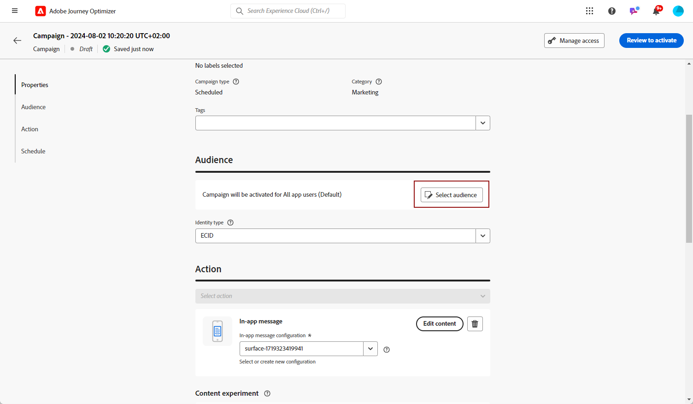

# Crear un mensaje en la aplicación {#create-in-app}

## Creación de una campaña y un mensaje en la aplicación{#create-in-app-in-a-campaign}

Para crear un mensaje en la aplicación, siga los pasos a continuación:

1. Acceda a la **[!UICONTROL Campañas]** a continuación, haga clic en **[!UICONTROL Crear campaña]**.

1. En el **[!UICONTROL Propiedades]** , especifique cuándo desea ejecutar la campaña.

1. En el **[!UICONTROL Acciones]** , seleccione **[!UICONTROL Mensaje en la aplicación]** y **[!UICONTROL Superficie de la aplicación]** previamente configurado para el mensaje en la aplicación. A continuación, haga clic en **[!UICONTROL Crear]**.

   [Obtenga más información sobre la configuración en la aplicación](inapp-configuration.md).

   

1. En el **[!UICONTROL Propiedades]** , edite la **[!UICONTROL Título]** y **[!UICONTROL Descripción]**.

1. Para asignar etiquetas de uso de datos principales o personalizadas a la página de aterrizaje, seleccione **[!UICONTROL Administrar acceso]**. [Más información](../administration/object-based-access.md).

1. Haga clic en el **[!UICONTROL Seleccionar la audiencia]** para definir la audiencia a la que se dirigirá desde la lista de segmentos de Adobe Experience Platform disponibles. [Más información](../segment/about-segments.md).

   

1. En el **[!UICONTROL Área de nombres de identidad]** , elija el área de nombres que desea utilizar para identificar a las personas del segmento seleccionado. [Más información](../event/about-creating.md#select-the-namespace).

1. Elija la frecuencia de su déclencheur cuando el mensaje en la aplicación esté activo:

   * **[!UICONTROL Mostrar cada vez]**
   * **[!UICONTROL Mostrar una vez]**
   * **[!UICONTROL Mostrar hasta pulsaciones]**

1. Elija el evento que déclencheur el mensaje desde el **[!UICONTROL Déclencheur de aplicación móvil]**
lista desplegable.

   Al elegir un déclencheur, elige qué acción del usuario hace que se muestre el mensaje en la aplicación.

   

1. Las campañas están diseñadas para ejecutarse en una fecha específica o con una frecuencia recurrente. Obtenga información sobre cómo configurar la variable **[!UICONTROL Programación]** de su campaña en [esta sección](../campaigns/create-campaign.md#schedule).

   

1. Ahora puede empezar a diseñar el contenido con la variable **[!UICONTROL Editar contenido]** botón.

   

## Enviar mensajes en la aplicación{#in-app-send}

### Vista previa en el dispositivo {#preview-device}

Puede previsualizar la notificación en la aplicación en un dispositivo específico.

1. Haga clic en **[!UICONTROL Vista previa en el dispositivo]**.

   

1. En el **[!UICONTROL Conectarse al dispositivo]** ventana, haga clic en **[!UICONTROL Inicio]**.

1. Escriba en la **[!UICONTROL Dirección URL base]** de la aplicación y haga clic en **[!UICONTROL Siguiente]**.

   

1. Analice el código QR con su dispositivo e introduzca el código PIN mostrado.

El mensaje en la aplicación ahora se puede activar directamente en el dispositivo, lo que le permite previsualizar y revisar el mensaje en un dispositivo real.

### Revise y active su notificación en la aplicación{#in-app-review}

Una vez creado el mensaje en la aplicación y definido y personalizado su contenido, puede revisarlo y activarlo.

Para ello, siga los pasos a continuación:

1. Utilice la variable **[!UICONTROL Revisar para activar]** para mostrar un resumen del mensaje.

   El resumen le permite modificar la campaña si es necesario y comprobar si algún parámetro es incorrecto o falta.

   

1. Compruebe que la campaña esté correctamente configurada y haga clic en **[!UICONTROL Activar]**.

La campaña ya está activada. La notificación en la aplicación configurada en la campaña se envía inmediatamente o en la fecha especificada.

Una vez enviados, puede medir el impacto de los mensajes en la aplicación dentro del informe de Campaign. Para obtener más información sobre la creación de informes, consulte [esta sección](inapp-report.md).

**Temas relacionados:**

* [Diseño de mensajes en la aplicación](design-in-app.md)
* [Informe en la aplicación](inapp-report.md)
* [Configuración en la aplicación](inapp-configuration.md)
