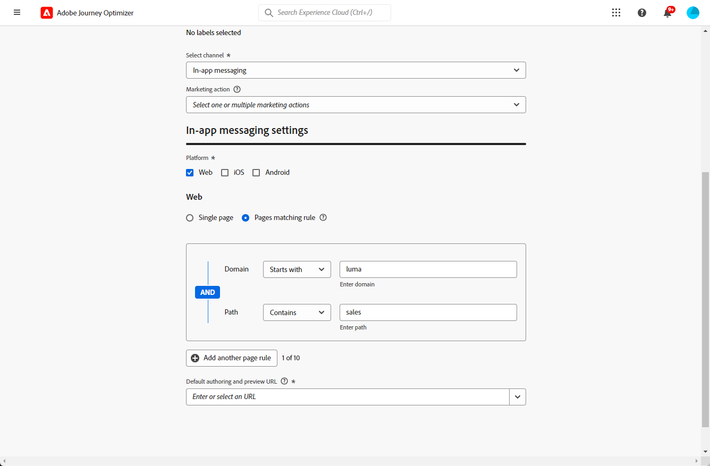

# Requisitos previos y configuración {#inapp-configuration}

## Pasos de configuración {#inapp-steps}

Para enviar mensajes en la aplicación en sus recorridos y campañas con [!DNL Journey Optimizer], debe seguir los siguientes pasos de configuración.

1. Asegúrese de tener los permisos correctos en las campañas de Journey Optimizer antes de empezar, incluso si planea usar únicamente mensajes en la aplicación en los recorridos. Los permisos de Campaign siguen siendo necesarios. [Más información](../campaigns/get-started-with-campaigns.md#campaign-prerequisites).
1. Habilite Adobe Journey Optimizer en su secuencia de datos de recopilación de datos de Adobe Experience Platform y compruebe su política de combinación predeterminada en Adobe Experience Platform, tal como se detalla en los [requisitos previos de entrega](#delivery-prerequisites) a continuación.
1. Cree una configuración de canal de mensajes en la aplicación en Administration > Channels > Channel configurations, como se detalla en [esta sección](#channel-prerequisites).
1. Si está usando experimentos de contenido, asegúrese de seguir los requisitos enumerados en [esta sección](#experiment-prerequisite).

Una vez finalizado, puede crear, configurar y enviar su primer mensaje en la aplicación. Obtenga información sobre cómo enviar mensajes en [esta sección](create-in-app.md).

## Requisitos previos de envío {#delivery-prerequisites}

Para que los mensajes en la aplicación se entreguen correctamente, se debe definir la siguiente configuración:

* En la [recopilación de datos de Adobe Experience Platform](https://experienceleague.adobe.com/docs/experience-platform/edge/datastreams/overview.html?lang=es){target="_blank"}, asegúrese de que tiene un conjunto de datos definido como en el servicio **[!UICONTROL Adobe Experience Platform]**, y que tiene habilitadas las opciones Adobe Experience Platform Edge y **[!UICONTROL Adobe Journey Optimizer]**.

  Esto garantiza que Adobe Experience Platform Edge gestione correctamente los eventos entrantes de Journey Optimizer. [Más información](https://experienceleague.adobe.com/docs/experience-platform/edge/datastreams/configure.html){target="_blank"}

  

* En [Adobe Experience Platform](https://experienceleague.adobe.com/docs/experience-platform/profile/home.html?lang=es){target="_blank"}, asegúrese de que tiene habilitada la política de combinación predeterminada con la opción **[!UICONTROL Política de combinación activa en Edge]**. Para ello, seleccione una directiva en el menú de Experience Platform **[!UICONTROL Cliente]** > **[!UICONTROL Perfiles]** > **[!UICONTROL Políticas de combinación]**. [Más información](https://experienceleague.adobe.com/docs/experience-platform/profile/merge-policies/ui-guide.html#configure){target="_blank"}

  [!DNL Journey Optimizer] canales entrantes utilizan esta política de combinación para activar y publicar correctamente campañas entrantes en el perímetro de. [Más información](https://experienceleague.adobe.com/docs/experience-platform/profile/merge-policies/ui-guide.html?lang=es){target="_blank"}

  >[!NOTE]
  >
  >Cuando use una directiva de combinación personalizada de **[!UICONTROL preferencias del conjunto de datos]**, asegúrese de agregar el conjunto de datos **[!UICONTROL Recorrido entrante]** dentro de la directiva de combinación especificada.

  

* Para solucionar problemas del envío de experiencias móviles de Journey Optimizer, puedes usar la vista de **Edge Delivery** en **Adobe Experience Platform Assurance**. Este complemento le permite inspeccionar en detalle las llamadas de solicitud, comprobar si las llamadas perimetrales esperadas se producen según lo previsto y examinar los datos de perfil, incluidos los mapas de identidad, las suscripciones a segmentos y la configuración de consentimiento. Además, puede revisar las actividades para las que la solicitud cumple los requisitos e identificar las que no.

  El uso del complemento **Edge Delivery** le ayuda a obtener la información necesaria para comprender y solucionar problemas de las implementaciones entrantes de forma eficaz.

  [Más información sobre la vista Edge Delivery](https://experienceleague.adobe.com/es/docs/experience-platform/assurance/view/edge-delivery){target="_blank"}

## Creación de una configuración en la aplicación {#channel-prerequisites}

Para crear una configuración en la aplicación en Journey Optimizer, siga estos pasos:

1. Acceda al menú **[!UICONTROL Canales]** > **[!UICONTROL Configuración general]** > **[!UICONTROL Configuraciones de canal]** y luego haga clic en **[!UICONTROL Crear configuración de canal]**.

   

1. Introduzca un nombre y una descripción (opcional) para la configuración y, a continuación, seleccione el canal que desea configurar.

   >[!NOTE]
   >
   > Los nombres deben comenzar por una letra (A-Z). Solo puede contener caracteres alfanuméricos. También puede utilizar caracteres de guion bajo `_`, punto `.` y guion `-`.

1. Para asignar etiquetas de uso de datos principales o personalizadas a la configuración, puedes seleccionar **[!UICONTROL Administrar acceso]**. [Obtenga más información acerca del Control de acceso de nivel de objeto (OLAC)](../administration/object-based-access.md).

1. Seleccione **[!UICONTROL Acciones de marketing]** para asociar directivas de consentimiento a los mensajes que usan esta configuración. Todas las políticas de consentimiento asociadas con la acción de marketing se aprovechan para respetar las preferencias de los clientes. [Más información](../action/consent.md#surface-marketing-actions)

1. Seleccione el canal **Mensajería en la aplicación**.

   

1. Seleccione la plataforma para la que desea definir la configuración. Esto le permite especificar la aplicación de destino para cada plataforma y garantiza una entrega de contenido coherente en varias plataformas.

   >[!NOTE]
   >
   >En las plataformas iOS y Android, la entrega se basa únicamente en el ID de aplicación. Si ambas aplicaciones comparten el mismo ID de aplicación, el contenido se enviará a ambas, independientemente de la plataforma seleccionada en la **[!UICONTROL configuración del canal]**.

   

1. Para la web:

   * Puede escribir una **[!UICONTROL URL de página]** para aplicar los cambios a una página específica.

   * Puede crear una regla para segmentar varias direcciones URL que sigan el mismo patrón.

     +++ Cómo generar una regla de coincidencia de páginas.

      1. Seleccione **[!UICONTROL Regla de coincidencia de páginas]** como Configuración de aplicación e introduzca su **[!UICONTROL URL de página]**.

      1. En la ventana **[!UICONTROL Editar regla de configuración]**, defina los criterios para los campos **[!UICONTROL Dominio]** y **[!UICONTROL Página]**.
      1. En los menús desplegables de condición, personalice aún más los criterios.

         Por ejemplo, para editar los elementos que se muestran en todas las páginas de productos de ventas del sitio web de Luma, seleccione Dominio > Empieza con > Luma y Página > Contiene > Ventas.

         

      1. Haga clic en **[!UICONTROL Agregar otra regla de página]** para crear otra regla si es necesario.

      1. Seleccione la **[!UICONTROL URL de creación y vista previa predeterminada]**.

      1. Guarde los cambios. La regla se muestra en la pantalla **[!UICONTROL Crear campaña]**.

     +++

1. Para iOS y Android:

   * Escriba su **[!UICONTROL ID de aplicación]**.

1. Envíe los cambios.

Ahora puede seleccionar la configuración al crear el mensaje en la aplicación.

## Requisitos previos de informes {#experiment-prerequisites}

>[!NOTE]
>
>El sistema de informes [!DNL Journey Optimizer] utiliza el conjunto de datos como de solo lectura y no afecta a la recopilación ni al consumo de datos.

Para habilitar los informes para el canal en la aplicación, debe asegurarse de que el [conjunto de datos](../data/get-started-datasets.md) utilizado en la implementación en la aplicación [secuencia de datos](https://experienceleague.adobe.com/docs/experience-platform/datastreams/overview.html){target="_blank"} también esté incluido en la configuración de los informes. Es decir, al configurar los informes, si agrega un conjunto de datos que no está presente en el conjunto de datos de la aplicación, los datos de la aplicación no se mostrarán en los informes. Aprenda a agregar conjuntos de datos para informes en [esta sección](../reports/reporting-configuration.md#add-datasets).

Si **no** usa los siguientes [grupos de campos](https://experienceleague.adobe.com/docs/experience-platform/xdm/tutorials/create-schema-ui.html?lang=es#field-group){target="_blank"} predefinidos para el esquema del conjunto de datos: `AEP Web SDK ExperienceEvent` y `Consumer Experience Event` (según se definen en [esta página](https://experienceleague.adobe.com/docs/platform-learn/implement-web-sdk/initial-configuration/configure-schemas.html#add-field-groups){target="_blank"}), asegúrese de agregar los siguientes grupos de campos: `Experience Event - Proposition Interactions`, `Application Details`, `Commerce Details` y `Web Details`. Los necesita el sistema de informes [!DNL Journey Optimizer], ya que rastrean en qué campañas y recorridos participa cada perfil.

[Más información sobre la configuración de informes](../reports/reporting-configuration.md)

>[!NOTE]
>
>Añadir estos grupos de campos no afecta a la recopilación de datos normal. Solo es aditivo para las páginas donde se ejecuta una campaña o un recorrido, dejando el resto del seguimiento intacto

**Temas relacionados:**

* [Creación de un mensaje en la aplicación ](create-in-app.md)
* [Creación de una campaña](../campaigns/create-campaign.md)
* [Diseño de un mensaje en la aplicación](design-in-app.md)
* [Informe en la aplicación](../reports/campaign-global-report-cja-inapp.md)

