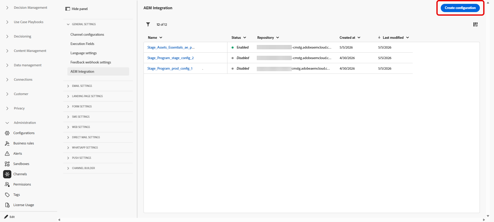

# Configuración del acceso al repositorio de Adobe Experience Manager {#aem-admin-settings}

>[!BEGINSHADEBOX]

**En esta página:** Descubra cómo los administradores conectan una zona protegida a un repositorio de Adobe Experience Manager, configurando el acceso de solo autor o publicación, los dominios personalizados y la autenticación, para que los especialistas en marketing puedan utilizar fragmentos de contenido de AEM en sus recorridos y campañas.

>[!ENDSHADEBOX]

>[!CONTEXTUALHELP]
>id="ajo_admin_aem_content_fragment_configuration"
>title="&quot;Configuración de Adobe Experience Manager"
>abstract="Conecte una zona protegida a un repositorio de Adobe Experience Manager configurando el acceso de solo autor o publicación, los dominios personalizados y la autenticación para que los especialistas en marketing puedan utilizar los fragmentos de contenido de Adobe Experience Manager en sus recorridos y campañas."

>[!CONTEXTUALHELP]
>id="ajo_admin_aem_configure_instance"
>title="Configuración de la instancia"
>abstract="Seleccione el tipo de configuración de la instancia adecuado para la instalación.  Configuración solo de autor: utilice fragmentos de contenido de la instancia de autor de AEM. No se admiten la configuración de instancias de publicación ni las actualizaciones en directo. Configuración de la instancia de publicación: configuración de los ajustes de la instancia. Si lo desea, active “Enviar token a la instancia de publicación” para suministrar las credenciales de servicio para la autenticación."

>[!CONTEXTUALHELP]
>id="ajo_admin_aem_send_token"
>title="Enviar token a la instancia de publicación"
>abstract="Cuando se habilita, las credenciales del servicio se envían para autenticar solicitudes en la instancia de publicación. Introduzca un JSON de credencial de servicio válido a continuación."

>[!CONTEXTUALHELP]
>id="ajo_admin_aem_service_credential"
>title="Pegar JSON de la credencial de servicio"
>abstract="Pegue el JSON de credencial de servicio de Adobe Experience Manager. Se formateará y se validará automáticamente."
>additional-url=""

>[!CONTEXTUALHELP]
>id="ajo_admin_aem_custom_domain"
>title="Dominio personalizado"
>abstract="Opcional. Proporcione un dominio personalizado si &quot;your-publish-instance.adobeaemcloud.com&quot; no puede recuperar contenido para su organización."

Adobe Journey Optimizer se integra con **[!DNL Adobe Experience Manager as a Cloud Service]** y **[!DNL Adobe Experience Manager Managed Service]** para que pueda usar **Fragmentos de contenido** en Recorridos y campañas. Los **fragmentos de contenido** se leen desde el repositorio de publicación de Adobe Experience Manager de forma predeterminada, los administradores pueden cambiar a solo autor o ajustar el acceso de publicación en el menú **[!UICONTROL Integración de AEM]**.

➡️ Cuando el repositorio esté configurado, continúe con [Trabajar con fragmentos de contenido de Experience Manager](../integrations/aem-fragments.md) para las tareas de creación y selección en Journey Optimizer.

## Configuración de repositorios {#configure-ui}

>[!NOTE]
>
> **[!UICONTROL La integración de AEM]** guarda la configuración del repositorio **por zona protegida**. Cada zona protegida mantiene sus propias integraciones y no se aplican a todas ellas.

Journey Optimizer almacena una integración por organización, zona protegida y repositorio de Adobe Experience Manager. Si guarda una nueva integración para esa misma combinación y reemplaza la configuración anterior, solo se conserva la configuración más reciente.

➡️ [Descubra esta característica para el servicio administrado de Adobe Experience Manager en vídeo](#video)

Para configurar el repositorio:

1. Acceda a **[!UICONTROL Administración]** > **[!UICONTROL Canales]** > **[!UICONTROL Integración de AEM]**.

1. Haga clic en **[!UICONTROL Crear configuración]**.

   

1. Elija un método de configuración:

   * Para el repositorio **[!DNL Adobe Experience Manager Managed Services]**, introduzca un nombre de host del repositorio que termine con `adobecqms.net` en el campo **[!UICONTROL nombre de host del repositorio de AMS]**.

     

   * Si usa **[!DNL Adobe Experience as a Cloud Service]**, elija qué repositorio configurar y haga clic en **[!UICONTROL Siguiente]**.

     Además, puede hacer clic en **[!UICONTROL Ver]** para obtener acceso a este repositorio.

     >[!IMPORTANT]
     >
     >Al guardar una nueva configuración para la misma organización, zona protegida y repositorio **se reemplaza** la configuración predeterminada, es decir, el repositorio **publish**.

     

1. Escriba un **[!UICONTROL Nombre]** y **[!UICONTROL Descripción]**.

1. Elija su configuración en la lista desplegable siguiente:

   +++ Configuración de solo autor

   Seleccione **[!UICONTROL Configuración de solo autor]** cuando Journey Optimizer solo deba leer fragmentos de contenido del entorno de Adobe Experience Manager **autor**. No se admite la replicación desde el autor a la publicación y las actualizaciones de publicación en directo.

   

   +++

    

   +++ Configuración de instancia de publicación

   De manera predeterminada, cada repositorio **[!DNL Adobe Experience Manager as a Cloud Service]** está configurado para usar la instancia **publish**. Puede continuar con el paso de prueba Fragmento de contenido sin cambiar esta configuración.

   Si la instancia de publicación es **autenticada** o debe usar un dominio de publicación personalizado, siga los pasos a continuación.

   1. Seleccione **[!UICONTROL Configuración de instancia de publicación]** para activar la configuración de instancia de publicación.

      

   1. Habilite **[!UICONTROL Enviar token a la instancia de publicación]** para que las credenciales del servicio se incluyan en las solicitudes a la instancia de publicación.

   1. Pegue una **[!UICONTROL credencial de servicio JSON]** válida para la autenticación.

   1. Opcionalmente, proporcione un dominio personalizado si su organización no puede alcanzar el host de publicación predeterminado de AEM (`publish-XX-XX.adobeaemcloud.com`) para recuperar contenido.

      

   +++

1. Después de finalizar la configuración de la instancia, elija un fragmento de contenido para confirmar que la integración funciona.

   

1. En la ventana **Asesor de contenido**, seleccione el fragmento que desee probar y, a continuación, haga clic en **[!UICONTROL Seleccionar]**.

1. Haga clic en **[!UICONTROL Save]**.

1. Al guardar con un fragmento de contenido de prueba seleccionado, la validación se ejecuta automáticamente. Si la validación falla, se muestra una lista de errores para que pueda corregir la configuración.

   

1. Para editar o deshabilitar esta integración del repositorio, acceda a la configuración creada anteriormente desde el menú **[!UICONTROL Integración con AEM]**.

Al guardar esta configuración, Journey Optimizer la almacena para ese repositorio en la zona protegida actual. A continuación, puede usar ese repositorio y su configuración al examinar y seleccionar contenido en el selector **Asesor de contenido**.

## Vídeo práctico {#video}

Descubra cómo los administradores configuran el repositorio de Adobe Experience Manager Managed Services en Journey Optimizer para que los especialistas en marketing puedan utilizar fragmentos de contenido en recorridos y campañas.

>[!VIDEO](https://video.tv.adobe.com/v/3492532?captions=spa&quality=12)
