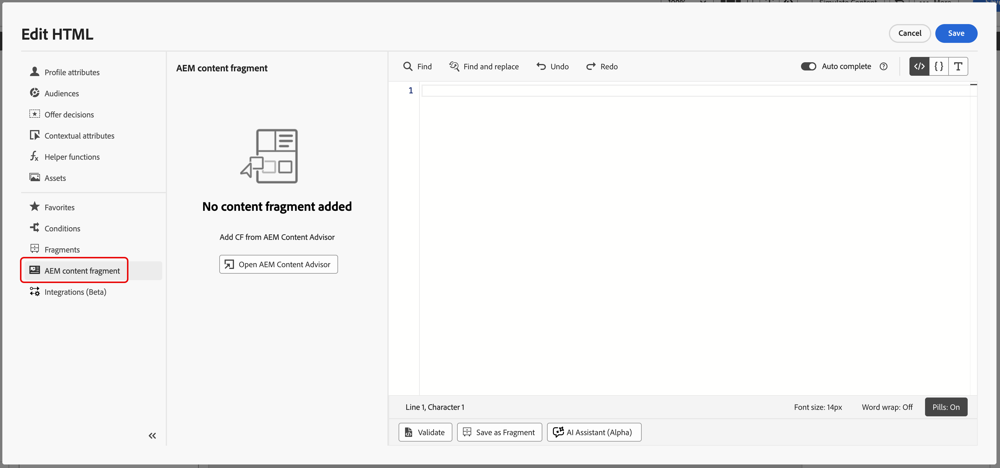

# Trabajar con el Asesor de contenido de Adobe Experience Manager {#aem-content-advisor}

>[!BEGINSHADEBOX]

**En esta página:** Obtenga información sobre cómo acceder al Asesor de contenido de Adobe Experience Manager y utilizarlo para detectar recursos, medios dinámicos y fragmentos de contenido mediante búsquedas semánticas con tecnología de IA directamente en los flujos de trabajo de creación de Journey Optimizer.

>[!ENDSHADEBOX]

El Asesor de contenido de Adobe Experience Manager sustituye la detección determinista por la detección estandarizada por intención desde una superficie unificada. Permite el descubrimiento unificado y con tecnología de IA de Assets, Dynamic Media y fragmentos de contenido directamente dentro de los flujos de trabajo de creación de Journey Optimizer, lo que mejora la productividad de los expertos en marketing y la eficacia de las campañas.

➡️ [Obtenga más información acerca del Asesor de contenido de Adobe Experience Manager en la documentación de Adobe Experience Manager](https://experienceleague.adobe.com/docs/experience-manager-cloud-service/content/assets/content-advisor/integrate-adobe-non-adobe-applications)

## Funciones disponibles

### Para Assets {#asset-features}

El Asesor de contenido de Adobe Experience Manager proporciona las siguientes funciones de recursos:

+++ Búsqueda semántica de IA

Busque recursos utilizando un lenguaje natural en lugar de palabras clave o nombres de archivo exactos. Describa lo que necesita en lenguaje sencillo, por ejemplo, &quot;café en las montañas&quot;, y la IA muestra recursos relevantes contextualmente basados en el significado y el contenido, no solo coincidencias de texto. También se admite la búsqueda multilingüe, por lo que puede realizar consultas en su idioma preferido y seguir encontrando los recursos adecuados independientemente del idioma en el que se etiquetaron o nombraron.

{zoomable="yes"}

+++

+++ Historial de búsqueda reciente

Acceda a sus búsquedas recientes para reutilizar rápidamente palabras clave y contextos. Esto ahorra tiempo al trabajar en campañas similares o cuando necesita refinar las búsquedas anteriores.

{zoomable="yes"}

+++ 

+++ Cargar informe

Cargue un documento de información de marketing para que aparezcan automáticamente los recursos que se alinean con el contexto de la campaña. La API analiza el informe y sugiere activos relevantes en función del contenido y los requisitos descritos en el documento.

{zoomable="yes"}

+++

+++ Panel de información de recursos

Vea metadatos y propiedades detallados de cualquier recurso que use el icono **Información**. Esto incluye dimensiones de recursos, tamaño de archivo, fecha de creación, etiquetas y otra información relevante para ayudarle a tomar decisiones informadas.

{zoomable="yes"}

+++

+++ Acceso al repositorio entre organizaciones

Descubra y seleccione recursos de repositorios entre organizaciones a las que tiene acceso. Esta capacidad le permite examinar y utilizar recursos almacenados en repositorios que pertenecen a diferentes organizaciones, lo que proporciona un acceso más amplio a la biblioteca de recursos disponible sin abandonar el flujo de trabajo de creación de Journey Optimizer.

+++

+++ Panel de Dynamic Media

Acceda a representaciones dinámicas, recortes inteligentes y modificaciones sobre la marcha en función de la configuración del repositorio.

{zoomable="yes"}

El panel Dynamic Media proporciona acceso a representaciones dinámicas, recortes inteligentes y modificaciones sobre la marcha. Puede introducir modificadores directamente en el panel para crear representaciones personalizadas.

**Disponibilidad**

La disponibilidad de Dynamic Media depende de la configuración del repositorio:

* **Scene7**: disponible para los recursos publicados (excepto Vídeo y PDF). [Más información sobre los modificadores de Scene7 de Dynamic Media](https://experienceleague.adobe.com/docs/dynamic-media-developer-resources/image-serving-api/image-serving-api/http-protocol-reference/command-reference/r-is-http-modifiers.html){target="_blank"}

* **OpenAPI**: disponible para recursos aprobados (excepto vídeo). [Más información sobre Dynamic Media con modificadores OpenAPI](https://experienceleague.adobe.com/docs/experience-manager-cloud-service/content/assets/dynamicmedia/image-profiles.html){target="_blank"}

* **Tanto Scene7 como OpenAPI**: disponibles cuando existen ambas configuraciones y el recurso cumple los criterios.

**Selección de pila**

Los botones que vea dependen de la configuración del repositorio:

* **Solo botón de Scene7**: El repositorio tiene la configuración de Scene7 y el recurso se ha publicado en Dynamic Media.
* **Solo botón OpenAPI**: El repositorio tiene la configuración OpenAPI y el recurso se ha aprobado.
* **Ambos botones**: El repositorio tiene ambas configuraciones y el recurso se ha publicado y aprobado.
+++

### Para fragmento de contenido {#content-fragment-features}

El Asesor de contenido de Adobe Experience Manager proporciona las siguientes funciones de fragmento de contenido:

+++ Listado de vista de plantilla 

Cambie entre las vistas de miniaturas y tablas para examinar los fragmentos de contenido en el formato que mejor se adapte a su flujo de trabajo. La vista de miniaturas proporciona un contexto visual, mientras que la vista de tabla muestra información detallada en un formato estructurado.

{zoomable="yes"}

+++

+++ Panel Información 

Haga clic en el icono **[!UICONTROL Información]** para abrir un panel derecho que muestre las variaciones de fragmentos, las propiedades y los detalles de **[!UICONTROL Referido por]**. La sección **[!UICONTROL Referido por]** muestra todas las entidades de Adobe Experience Manager donde se usa el fragmento, con vínculos para ver estas referencias directamente en Adobe Experience Manager.

{zoomable="yes"}

+++

+++ Abrir en Adobe Experience Manager

Abra rápidamente cualquier fragmento de contenido directamente en Adobe Experience Manager para editarlo mediante el icono situado junto al título. Esta integración perfecta le permite cambiar entre Journey Optimizer y Adobe Experience Manager sin perder contexto.

{zoomable="yes"}

+++

+++ Previsualización de JSON

Previsualice la estructura JSON de los fragmentos de contenido en un formato de tabla limpio y organizado. Esto le ayuda a comprender la estructura de datos del fragmento y a verificar el contenido antes de utilizarlo en sus campañas.

{zoomable="yes"}

+++

## Acceso al asesor de contenido de Adobe Experience Manager {#access}

Para acceder al Asesor de contenido de Adobe Experience Manager en Journey Optimizer, siga estos pasos:

1. Cree una campaña en Adobe Journey Optimizer y añada una acción de canal, por ejemplo, Correo electrónico.

1. Haga clic en **[!UICONTROL Editar contenido]** y, a continuación, haga clic en **[!UICONTROL Editar cuerpo del correo electrónico]** para abrir el editor de contenido.

1. Arrastre y suelte un componente HTML o Texto en el contenido del correo electrónico.

1. Pase el ratón sobre el componente y haga clic en **[!UICONTROL Mostrar el código fuente]** (para componentes de HTML) o **[!UICONTROL Agregar Personalization]** (para componentes de texto).

1. En el Editor de Personalization, elija el punto de entrada de contenido:

   * Para agregar un recurso, haz clic en **[!UICONTROL Assets]** y luego en **[!UICONTROL Abrir el Asesor de contenido de AEM]**.

     {zoomable="yes"}

   * Para agregar un fragmento de contenido de Adobe Experience Manager, haga clic en **[!UICONTROL Fragmento de contenido de AEM]** y, a continuación, en **[!UICONTROL Abrir el Asesor de contenido de AEM]**.

     {zoomable="yes"}

1. Seleccione el repositorio de Adobe Experience Manager.

   {zoomable="yes"}

1. Explore y seleccione el recurso o el fragmento de contenido que desea utilizar y, a continuación, insértelo en el contenido.
