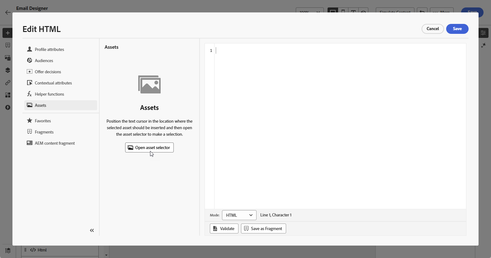
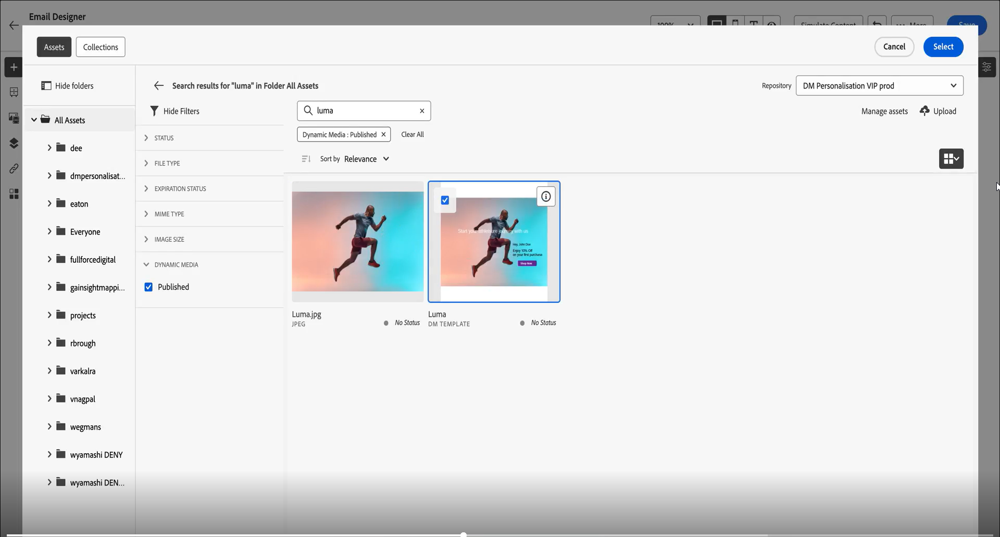
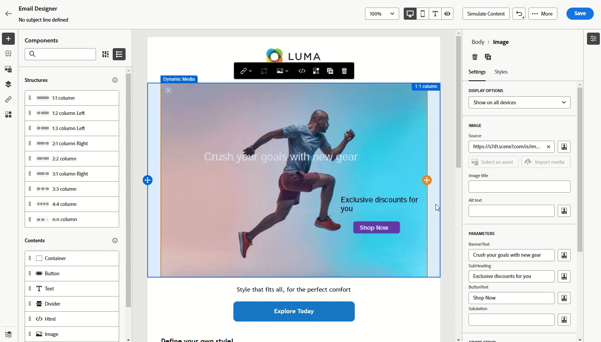

# Trabajo con medios dinámicos {#aem-dynamic}

>[!BEGINSHADEBOX]

**En esta página:** Aprenda a insertar, ajustar y personalizar medios dinámicos de Adobe Experience Manager, incluidas superposiciones de texto y plantillas de medios dinámicos, dentro del contenido de Journey Optimizer.

>[!ENDSHADEBOX]

## Introducción a los medios dinámicos {#gs-aem-dynamic}

El selector de recursos ahora es compatible con Dynamic Media, lo que le permite seleccionar y utilizar sin problemas representaciones de Dynamic Media aprobadas dentro de Journey Optimizer. Los cambios realizados en los recursos en Adobe Experience Manager se reflejan instantáneamente en el contenido de Journey Optimizer, lo que garantiza que las versiones más actualizadas siempre estén en uso sin requerir actualizaciones manuales.

Tenga en cuenta que esta integración solo está disponible para los clientes que utilizan Dynamic Media Manager as a Cloud Service.

Para obtener más información sobre Dynamic Media en Adobe Experience Manager as a Cloud Service, consulte [Documentación de Experience Manager](https://experienceleague.adobe.com/es/docs/experience-manager-cloud-service/content/assets/dynamicmedia/dynamic-media){target="_blank"}.

>[!AVAILABILITY]
>
>Para los clientes de atención sanitaria, la integración solo se activa tras obtener la licencia de las ofertas adicionales de Journey Optimizer Healthcare Shield y Adobe Experience Manager Extended Security for Healthcare.

## Consideraciones

* Asegúrese de que Dynamic Media con OpenAPI esté habilitado en Adobe Experience Manager as a Cloud Service. [Más información](https://experienceleague.adobe.com/es/docs/experience-manager-cloud-service/content/assets/dynamicmedia/dynamic-media-open-apis/dynamic-media-open-apis-overview#enable-dynamic-media-open-apis){target="_blank"}.

* La integración de Dynamic Media con Adobe Journey Optimizer está disponible tanto para Dynamic Media [modo Scene7](https://experienceleague.adobe.com/es/docs/experience-manager-65/content/assets/dynamic/config-dms7){target="_blank"} como para [con OpenAPI](https://experienceleague.adobe.com/es/docs/experience-manager-cloud-service/content/assets/dynamicmedia/dynamic-media-open-apis/dynamic-media-open-apis-overview){target="_blank"}.

* Para los recursos de Dynamic Media Scene7, Journey Optimizer agrega modificadores predeterminados (`bfc=off&fmt=png-alpha`) al principio de la dirección URL. Si el ajuste preestablecido también establece `fmt` o `bfc`, tiene prioridad, ya que Scene7 utiliza la última aparición de un parámetro repetido. Para evitar resultados inesperados, quite `fmt`/`bfc` del ajuste preestablecido o muévalo antes que los modificadores predeterminados en la dirección URL.

* Por diseño, el selector de recursos devuelve un formato de dirección URL basado en `/images`. Si desea enviar un recurso en su formato original, por ejemplo, GIF o SVG, debe actualizar manualmente la dirección URL para utilizar la ruta de acceso `/content`. Obtenga más información en [Documentación de prácticas recomendadas de Dynamic Media](https://experienceleague.adobe.com/es/docs/experience-manager-cloud-service/content/assets/dynamicmedia/dm-journey/dm-best-practices#deliver-gif-images){target="_blank"}.

## Adición y administración de medios dinámicos {#dynamic-media}

Mejore y optimice el contenido para cualquier pantalla o navegador insertando medios dinámicos de Adobe Experience Manager as a Cloud Service directamente en el contenido de Journey Optimizer.  A continuación, puede cambiar el tamaño, recortar, mejorar y realizar otros ajustes según sea necesario.

<!--
>[!AVAILABILITY]
>
>Older versions of Outlook (including 2016) do not support rendering of content with Dynamic Media.  We are actively working on a permanent fix to enhance compatibility. In the meantime, apply the following guidelines:
>
>* For Dynamic Media Scene7 URLs: Append `?bfc=on` to the image URL. This enables automatic format negotiation, ensuring the most compatible image format is delivered based on the client's capabilities.
>
>* For Dynamic Media with Open API: Use the `.avif` format. This format includes built-in fallback mechanisms to deliver a compatible format when necessary.
>
-->

Para añadir un recurso de Adobe Experience Manager al contenido de HTML, siga estos pasos:

1. Arrastre y suelte un **[!UICONTROL componente de HTML]** en el contenido.

1. Seleccione **[!UICONTROL Mostrar el código fuente]**.

   

1. En el menú **[!UICONTROL Editar HTML]**, navegue hasta **[!UICONTROL Assets]** y haga clic en **[!UICONTROL Abrir selector de recursos]**.

   También puede copiar y pegar la dirección URL del recurso.

   

1. Examine los recursos de AEM y seleccione el que desee añadir al contenido.

1. Ajuste los parámetros de la imagen (por ejemplo, altura, anchura, rotación, giro, brillo, tono, etc.) según sea necesario para que coincida con los requisitos de sus recursos.

   Para obtener una lista completa de los parámetros de imagen que se pueden agregar a la dirección URL, consulte [Documentación de Experience Manager](https://experienceleague.adobe.com/es/docs/dynamic-media-developer-resources/image-serving-api/image-serving-api/http-protocol-reference/command-reference/c-command-reference){target="_blank"}.

   

1. Haga clic en **[!UICONTROL Guardar]**.

El contenido ahora incluye medios dinámicos. Las actualizaciones que realice en Experience Manager aparecerán automáticamente en Journey Optimizer.

## Personalice la superposición de texto {#text-overlay}

Personalice fácilmente cualquier medio dinámico reemplazando la superposición de texto existente por el nuevo texto de su elección, lo que permite actualizaciones y personalización sin problemas.

Por ejemplo, con la funcionalidad de experimentación, puede actualizar la superposición de texto existente reemplazándola con un texto diferente para cada tratamiento, asegurándose de que se personalice para cada perfil cuando abran sus mensajes.

>[!AVAILABILITY]
>
>La personalización de **superposición de texto** está disponible exclusivamente en Dynamic Media [modo Scene7](https://experienceleague.adobe.com/es/docs/experience-manager-65/content/assets/dynamic/config-dms7){target="_blank"}. Dado que el modo Scene7 no es accesible para los clientes del sector sanitario, el contenido se procesa con una copia binaria de la imagen de Journey Optimizer. Si tiene alguna excepción, póngase en contacto con su representante de Adobe.

Para personalizar la superposición de texto, siga estos pasos:

1. Arrastre y suelte un **[!UICONTROL componente de HTML]** en el contenido.

1. Seleccione **[!UICONTROL Mostrar el código fuente]**.

1. Desde el menú **[!UICONTROL Editar HTML]**, accede a **[!UICONTROL Assets]** y luego a **[!UICONTROL Abrir selector de recursos]**.

   También puede copiar y pegar la dirección URL de los recursos.

1. Examine los recursos de AEM y seleccione el que desee añadir al contenido.

1. Reemplace la superposición con el texto deseado.

   

1. Actualice los parámetros de las imágenes:

   * **Capa**: escriba el elemento base donde se coloca el texto.
   * **Tamaño**: actualice el tamaño del bloque de texto.
   * **TextAttr**: ajusta el tamaño de la fuente del texto.
   * **Pos**: establece la posición del texto en la imagen.

   >[!WARNING]
   >
   >El parámetro Capa es necesario para actualizar los medios dinámicos.

   

1. Haga clic en **[!UICONTROL Guardar]**.

El contenido ahora incluye la superposición de texto actualizada.

## Adición y administración de la plantilla de Dynamic Media {#dynamic-media-template}

Agregue fácilmente su plantilla de Dynamic Media en Journey Optimizer y actualice su contenido multimedia siempre que sea necesario. Ahora puede incorporar campos de personalización en los medios, lo que le permite crear contenido más personalizado y atractivo dentro de Journey Optimizer.

Más información sobre [Plantilla de medios dinámicos](https://experienceleague.adobe.com/es/docs/dynamic-media-classic/using/template-basics/quick-start-template-basics){target="_blank"}.

>[!AVAILABILITY]
>
>**La plantilla de Dynamic Media** está disponible exclusivamente en el modo [Scene7 de Dynamic Media](https://experienceleague.adobe.com/es/docs/experience-manager-65/content/assets/dynamic/config-dms7). Dado que el modo Scene7 no es accesible para los clientes del sector sanitario, el contenido no se procesará. Para cualquier excepción, póngase en contacto con el soporte de Experience Manager.

### Con componente de imagen {#image-component}

Puede insertar la plantilla dinámica directamente en el contenido mediante el componente Imagen:

1. Abra la campaña o el recorrido y acceda al contenido.

1. Arrastre y suelte un **componente de imagen** en su diseño.

   Para obtener más información sobre el componente Imagen, consulte [esta página](../email/content-components.md).

   

1. Examine los recursos de AEM y seleccione la plantilla Dynamic media que desee añadir al contenido.

   

1. En la **configuración de imagen**, vaya a para obtener acceso a los parámetros de la plantilla de medios dinámicos.

   Los campos disponibles dependen de los parámetros agregados durante la [creación de plantillas](https://experienceleague.adobe.com/es/docs/dynamic-media-classic/using/template-basics/creating-template-parameters#creating_template_parameters){target="_blank"} en Adobe Experience Manager.

   

1. Rellene los diferentes campos y utilice el editor de personalización para añadir contenido personalizado. Puede utilizar cualquier atributo, como el nombre del perfil, la ciudad u otros detalles relevantes, para crear una experiencia más personalizada.

   Más información sobre personalización en [esta página](../personalization/personalize.md).

   

1. Se puede aplicar contenido condicional al componente Dynamic Media para generar diferentes variantes del contenido. [Más información](../personalization/dynamic-content.md)

1. Haga clic en **[!UICONTROL Guardar]**.

Una vez que haya realizado las pruebas y validado el contenido, puede enviar el mensaje a la audiencia.

### Con el componente HTML {#html-component}

Puede insertar la plantilla dinámica directamente en el contenido mediante el componente HTML:

1. Abra la campaña o el recorrido y acceda al contenido.

1. Arrastre y suelte un **componente de HTML** en su diseño.

   

1. Seleccione **[!UICONTROL Mostrar el código fuente]**.

   

1. Desde el menú **[!UICONTROL Editar HTML]**, accede a **[!UICONTROL Assets]** y luego a **[!UICONTROL Abrir selector de recursos]**.

   También puede copiar y pegar la dirección URL de los recursos.

1. Ajuste los parámetros de texto de la imagen según sea necesario para que coincidan con los requisitos de los recursos.

   

1. Haga clic en **[!UICONTROL Guardar]**.

Una vez que haya realizado las pruebas y validado el contenido, puede enviar el mensaje a la audiencia.

## Insertar temporizador de cuenta atrás {#countdown}

Cree conversiones urgentes y maximice las conversiones con los temporizadores de cuenta atrás de Dynamic Media que se actualizan en tiempo real cuando los destinatarios abren sus correos electrónicos. Esta función es ideal para ventas flash, ofertas por tiempo limitado y promociones con distinción de tiempo.

Por ejemplo, como experto en marketing de una marca minorista, realiza una venta flash de 48 horas. Usando el temporizador de cuenta atrás en sus correos electrónicos promocionales:

* Los destinatarios que abren inmediatamente ven &quot;Quedan 47 horas&quot;
* Los destinatarios que abren 24 horas después ven &quot;Quedan 23 horas&quot;
* Los destinatarios que abran después de que finalice la venta verán &quot;¡Se acabó el tiempo!&quot;

Para obtener más información sobre cómo agregar temporizadores de cuenta atrás a la plantilla de Dynamic Media en Adobe Experience Manager, consulte [este documento](assets/do-not-localize/countdown.pdf).

1. En **[!DNL Adobe Experience Manager]**, cree una plantilla de Dynamic Media y agréguele un componente de temporizador de cuenta atrás.

   

1. En **[!DNL Journey Optimizer]**, cree una nueva campaña o abra una existente y luego acceda al Designer de correo electrónico.

1. Arrastre y suelte un componente **HTML** o **Asset** en el contenido del correo electrónico.

1. Pase el ratón sobre el componente y haga clic en **[!UICONTROL Mostrar código fuente]** (para componentes de HTML) o **[!UICONTROL Examinar]** (para componentes de recursos).

   

1. En el menú **[!UICONTROL Editar HTML]**, vaya a **[!UICONTROL Assets]** y haga clic en **[!UICONTROL Abrir selector de recursos]** para examinar y seleccionar la plantilla publicada de Dynamic Media.

   

1. Active la experiencia de las píldoras cambiando Píldoras a Activado. Esto mejora la legibilidad al ocultar las rutas de atributos largas.

   

1. En el menú **[!UICONTROL Atributos personalizados]**, configure los parámetros personalizables de URL que sean necesarios para la plantilla.

   Haga clic en **[!UICONTROL Guardar]** cuando termine.

   

1. También puede acceder a los parámetros de la plantilla de Dynamic Media seleccionando el recurso en Email Designer y, a continuación, accediendo al menú **[!UICONTROL Configuración]**.

   Configure lo siguiente:

   * **Texto del titular**: El texto mostrado con el temporizador
   * **Hora de finalización**: La fecha y hora en que caduca la cuenta atrás. Introduzca la hora solo en GMT (hora del meridiano de Greenwich). El sistema no acepta otras zonas horarias.
   * **Texto alternativo**: El mensaje que aparece después de que finalice el temporizador

   

1. Haga clic en **[!UICONTROL Vista previa]** para ver el temporizador con actualizaciones de cuenta atrás en tiempo real y verificar la configuración.

Cuando los destinatarios abren el correo electrónico, ven el tiempo preciso que queda para la venta flash. Si vuelve a abrir el correo electrónico más tarde, la cuenta atrás se actualiza automáticamente para reflejar el tiempo restante actual. Después de la fecha de finalización, aparece automáticamente el mensaje predeterminado.

## Vídeo práctico {#video}

Aprenda a integrar Adobe Experience Manager Dynamic Media con Adobe Journey Optimizer para habilitar actualizaciones y personalizaciones de contenido en tiempo real.

Este tutorial explica cómo modificar imágenes directamente en AJO, añadir superposiciones de texto mediante el modo HTML, crear plantillas de medios dinámicos en AEM para hiperpersonalización y personalizar campañas adaptando el contenido para los distintos segmentos de público. Esta integración permite a los expertos en marketing crear de forma eficaz campañas atractivas y personalizadas sin cambiar entre aplicaciones.

>[!VIDEO](https://video.tv.adobe.com/v/3463785/?captions=spa&learn=on&enablevpops=&autoplay=true)

