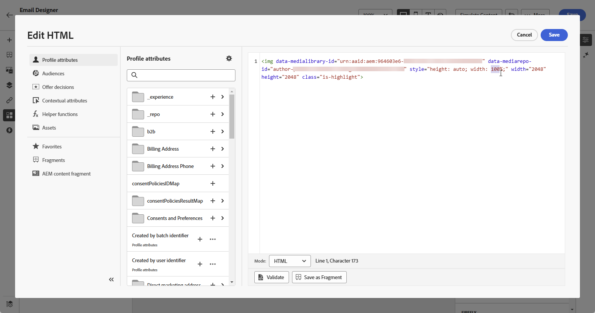

# Trabajar con Dynamic Media {#aem-dynamic}

>[!AVAILABILITY]
>
>Esta integración está disponible exclusivamente para los clientes que utilizan Dynamic Media Manager as a Cloud Service.

El selector de recursos ahora es compatible con Dynamic Media, lo que le permite seleccionar y utilizar sin problemas representaciones de Dynamic Media aprobadas dentro de Journey Optimizer. Los cambios realizados en los recursos en Adobe Experience Manager se reflejan instantáneamente en el contenido de Journey Optimizer, lo que garantiza que las versiones más actualizadas siempre estén en uso sin requerir actualizaciones manuales.

Para obtener más información sobre Dynamic Media en Adobe Experience Manager as a Cloud Service, consulte [Documentación de Experience Manager](https://experienceleague.adobe.com/en/docs/experience-manager-cloud-service/content/assets/dynamicmedia/dynamic-media).

## Adición y administración de medios dinámicos

Mejore y optimice el contenido para cualquier pantalla o navegador insertando medios dinámicos de Adobe Experience Manager as a Cloud Service directamente en el contenido de Journey Optimizer.  A continuación, puede cambiar el tamaño, recortar, mejorar y realizar otros ajustes según sea necesario.

1. Arrastre y suelte un **[!UICONTROL componente de HTML]** en el contenido.

1. Seleccione **[!UICONTROL Mostrar el código fuente]**.

   

1. En el menú **[!UICONTROL Editar HTML]**, navegue hasta **[!UICONTROL Assets]** y haga clic en **[!UICONTROL Abrir selector de recursos]**.

   También puede copiar y pegar la dirección URL del recurso.

   

1. Examine los recursos de AEM y seleccione el que desee añadir al contenido.

1. Ajuste los parámetros de la imagen (por ejemplo, altura, anchura, rotación, giro, brillo, tono, etc.) según sea necesario para que coincidan con los requisitos del recurso.

   Para obtener una lista completa de los parámetros de imagen que se pueden agregar a la dirección URL, consulte [Documentación de Experience Manager](https://experienceleague.adobe.com/en/docs/dynamic-media-developer-resources/image-serving-api/image-serving-api/http-protocol-reference/command-reference/c-command-reference).

   

1. Haga clic en **[!UICONTROL Guardar]**.

El contenido ahora incluye medios dinámicos. Las actualizaciones que realice en Experience Manager aparecerán automáticamente en Journey Optimizer.

## Personalization con superposición de texto

Personalice fácilmente cualquier medio dinámico reemplazando la superposición de texto existente por el nuevo texto de su elección, lo que permite actualizaciones y personalización sin problemas.

Por ejemplo, con la funcionalidad de experimentación, puede actualizar la superposición de texto existente reemplazándola con un texto diferente para cada tratamiento, asegurándose de que se personalice para cada perfil cuando abran sus mensajes.

1. Arrastre y suelte un **[!UICONTROL componente de HTML]** en el contenido.

1. Seleccione **[!UICONTROL Mostrar el código fuente]**.

1. Desde el menú **[!UICONTROL Editar HTML]**, accede a **[!UICONTROL Assets]** y luego a **[!UICONTROL Abrir selector de recursos]**.

   También puede copiar y pegar la dirección URL de los recursos.

1. Examine los recursos de AEM y seleccione el que desee añadir al contenido.

1. Reemplace la superposición con el texto deseado.

   

1. Actualice los parámetros de las imágenes:

   * **Capa**: escriba el elemento base donde se coloca el texto.
   * **Tamaño**: actualice el tamaño del bloque de texto.
   * **TextAttr**: ajusta el tamaño de la fuente del texto.
   * **Pos**: establece la posición del texto en la imagen.

   >[!WARNING]
   >
   >El parámetro Capa es necesario para actualizar los medios dinámicos.

   

1. Haga clic en **[!UICONTROL Guardar]**.

El contenido ahora incluye la superposición de texto actualizada.

<!--
## Personalization with Text Overlay

Easily customize any dynamic media by replacing the existing text overlay with new text of your choice, allowing for seamless updates and personalization.

In this example, our goal is to update the existing text overlay by replacing it with a new validity date and adding a personalization block, ensuring it is customized for each profile when they open their messages.

1. Drag and drop an **[!UICONTROL HTML component]** into your content.

1. Select **[!UICONTROL Show the source code]**.

1. From the **[!UICONTROL Edit HTML]** menu, access **[!UICONTROL Assets]** then **[!UICONTROL Open asset selector]**.

    You can also simply copy and paste your assets URL.

1. Browse through your AEM assets and select the one you want to add to your content.

1. Replace the overlay with the desired text.

    Here we change the validity date from 31st December 2024 to the 1st July 2025.

1. Add the required personalization fields to your image.

1. Click **[!UICONTROL Save]**.

Your content now includes your updated text overlay and personalization.

## Add Dynamic media conditional content

Enable conditional content in your dynamic media to better target your audience and deliver a more personalized experience.

1. Drag and drop an **[!UICONTROL HTML component]** into your content.

1. Select **[!UICONTROL Show the source code]**.

1. From the **[!UICONTROL Edit HTML]** menu, access **[!UICONTROL Assets]** then **[!UICONTROL Open asset selector]**.

    You can also simply copy and paste your assets URL.

1. Browse through your AEM assets and select the one you want to add to your content.

1. Once your dynamic media is inserted to your content, select **[!UICONTROL Enable conditional]** content from your HTML component toolbar to create your different user experiences. 

1. From the Variant - 1, click **[!UICONTROL Select condition]** to fine tune your audience.

1. Choose your condition or create a new one if needed and click **[!UICONTROL Select]**.

    [Learn more on conditions](../personalization/create-conditions.md)

1. Select your **[!UICONTROL Component]** and access the **[!UICONTROL Settings]** menu.

1. In the **[!UICONTROL Custom Attributes]** menu, populate the Dynamic Media text and personalization fields to customize the content for your audience.

-->
