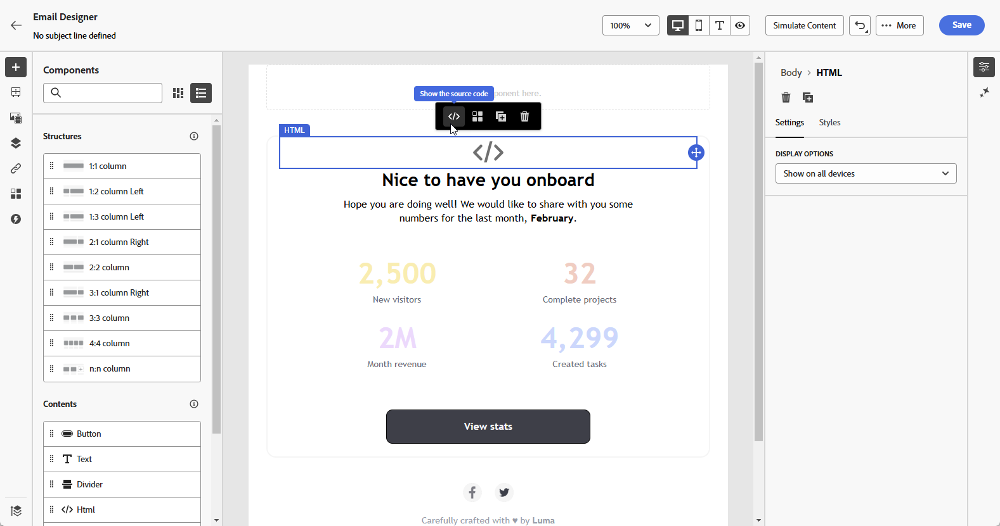

# Trabajar con Dynamic Media {#aem-dynamic}

## Introducción a Dynamic Media {#gs-aem-dynamic}

El selector de recursos ahora es compatible con Dynamic Media, lo que le permite seleccionar y utilizar sin problemas representaciones de Dynamic Media aprobadas dentro de Journey Optimizer. Los cambios realizados en los recursos en Adobe Experience Manager se reflejan instantáneamente en el contenido de Journey Optimizer, lo que garantiza que las versiones más actualizadas siempre estén en uso sin requerir actualizaciones manuales.

Tenga en cuenta que esta integración solo está disponible para los clientes que utilizan Dynamic Media Manager as a Cloud Service.

Para obtener más información sobre Dynamic Media en Adobe Experience Manager as a Cloud Service, consulte [Documentación de Experience Manager](https://experienceleague.adobe.com/es/docs/experience-manager-cloud-service/content/assets/dynamicmedia/dynamic-media){target="_blank"}.

>[!AVAILABILITY]
>
>Para los clientes del sector sanitario, la integración solo se activa tras obtener la licencia de las ofertas adicionales de Journey Optimizer Healthcare Shield y Adobe Experience Manager Enhanced Security.

## Adición y administración de medios dinámicos {#dynamic-media}

Mejore y optimice el contenido para cualquier pantalla o navegador insertando medios dinámicos de Adobe Experience Manager as a Cloud Service directamente en el contenido de Journey Optimizer.  A continuación, puede cambiar el tamaño, recortar, mejorar y realizar otros ajustes según sea necesario.

>[!IMPORTANT]
>
>Asegúrese de que Dynamic Media con OpenAPI esté habilitado en Adobe Experience Manager as a Cloud Service. [Más información](https://experienceleague.adobe.com/es/docs/experience-manager-cloud-service/content/assets/dynamicmedia/dynamic-media-open-apis/dynamic-media-open-apis-overview#enable-dynamic-media-open-apis){target="_blank"}.

La integración de Dynamic Media con Adobe Journey Optimizer está disponible tanto para Dynamic Media [modo Scene7](https://experienceleague.adobe.com/es/docs/experience-manager-65/content/assets/dynamic/config-dms7){target="_blank"} como para [con OpenAPI](https://experienceleague.adobe.com/es/docs/experience-manager-cloud-service/content/assets/dynamicmedia/dynamic-media-open-apis/dynamic-media-open-apis-overview){target="_blank"}.

>[!AVAILABILITY]
>
>Las versiones anteriores de Outlook (incluido 2016) no admiten la representación de contenido con Dynamic Media.  Estamos trabajando activamente en una solución permanente para mejorar la compatibilidad. Mientras tanto, aplique las siguientes directrices:
>
>* Para URL de Dynamic Media Scene7: Anexe `?bfc=on` a la URL de la imagen. Esto permite la negociación automática del formato, lo que garantiza que se entregue el formato de imagen más compatible en función de las capacidades del cliente.
>
>* Para Dynamic Media con API abierta: Utilice el formato `.avif`. Este formato incluye mecanismos de reserva integrados para proporcionar un formato compatible cuando sea necesario.
>

Para añadir un recurso de Adobe Experience Manager al contenido de HTML, siga estos pasos:

1. Arrastre y suelte un **[!UICONTROL componente de HTML]** en el contenido.

1. Seleccione **[!UICONTROL Mostrar el código fuente]**.

   

1. En el menú **[!UICONTROL Editar HTML]**, navegue hasta **[!UICONTROL Assets]** y haga clic en **[!UICONTROL Abrir selector de recursos]**.

   También puede copiar y pegar la dirección URL del recurso.

   

1. Examine los recursos de AEM y seleccione el que desee añadir al contenido.

1. Ajuste los parámetros de la imagen (por ejemplo, altura, anchura, rotación, giro, brillo, tono, etc.) según sea necesario para que coincidan con los requisitos del recurso.

   Para obtener una lista completa de los parámetros de imagen que se pueden agregar a la dirección URL, consulte [Documentación de Experience Manager](https://experienceleague.adobe.com/es/docs/dynamic-media-developer-resources/image-serving-api/image-serving-api/http-protocol-reference/command-reference/c-command-reference){target="_blank"}.

   

1. Haga clic en **[!UICONTROL Guardar]**.

El contenido ahora incluye medios dinámicos. Las actualizaciones que realice en Experience Manager aparecerán automáticamente en Journey Optimizer.

## Personalice la superposición de texto {#text-overlay}

Personalice fácilmente cualquier medio dinámico reemplazando la superposición de texto existente por el nuevo texto de su elección, lo que permite actualizaciones y personalización sin problemas.

Por ejemplo, con la funcionalidad de experimentación, puede actualizar la superposición de texto existente reemplazándola con un texto diferente para cada tratamiento, asegurándose de que se personalice para cada perfil cuando abran sus mensajes.

>[!AVAILABILITY]
>
>La personalización de **superposición de texto** está disponible exclusivamente en Dynamic Media [modo Scene7](https://experienceleague.adobe.com/es/docs/experience-manager-65/content/assets/dynamic/config-dms7){target="_blank"}. Dado que el modo Scene7 no es accesible para los clientes del sector sanitario, el contenido se procesa con una copia binaria de la imagen de Journey Optimizer. Si tiene alguna excepción, póngase en contacto con su representante de Adobe.

Para personalizar la superposición de texto, siga estos pasos:

1. Arrastre y suelte un **[!UICONTROL componente de HTML]** en el contenido.

1. Seleccione **[!UICONTROL Mostrar el código fuente]**.

1. Desde el menú **[!UICONTROL Editar HTML]**, accede a **[!UICONTROL Assets]** y luego a **[!UICONTROL Abrir selector de recursos]**.

   También puede copiar y pegar la dirección URL de los recursos.

1. Examine los recursos de AEM y seleccione el que desee añadir al contenido.

1. Reemplace la superposición con el texto deseado.

   

1. Actualice los parámetros de las imágenes:

   * **Capa**: escriba el elemento base donde se coloca el texto.
   * **Tamaño**: actualice el tamaño del bloque de texto.
   * **TextAttr**: ajusta el tamaño de la fuente del texto.
   * **Pos**: establece la posición del texto en la imagen.

   >[!WARNING]
   >
   >El parámetro Capa es necesario para actualizar los medios dinámicos.

   

1. Haga clic en **[!UICONTROL Guardar]**.

El contenido ahora incluye la superposición de texto actualizada.

## Adición y administración de la plantilla de Dynamic Media {#dynamic-media-template}

Agregue fácilmente su plantilla de Dynamic Media en Journey Optimizer y actualice su contenido multimedia siempre que sea necesario. Ahora puede incorporar campos de personalización en los medios, lo que le permite crear contenido más personalizado y atractivo dentro de Journey Optimizer.

Más información sobre [Plantilla de medios dinámicos](https://experienceleague.adobe.com/es/docs/dynamic-media-classic/using/template-basics/quick-start-template-basics){target="_blank"}.

>[!AVAILABILITY]
>
>**La plantilla de Dynamic Media** está disponible exclusivamente en el modo [Scene7 de Dynamic Media](https://experienceleague.adobe.com/es/docs/experience-manager-65/content/assets/dynamic/config-dms7). Dado que el modo Scene7 no es accesible para los clientes del sector sanitario, el contenido no se procesará. Para cualquier excepción, póngase en contacto con el soporte de Experience Manager.

### Con componente de imagen {#image-component}

Puede insertar la plantilla dinámica directamente en el contenido mediante el componente Imagen:

1. Abra la campaña o el recorrido y acceda al contenido.

1. Arrastre y suelte un **componente de imagen** en su diseño.

   Para obtener más información sobre el componente Imagen, consulte [esta página](../email/content-components.md).

   

1. Examine los recursos de AEM y seleccione la plantilla Dynamic media que desee añadir al contenido.

   

1. En la **configuración de imagen**, vaya a para obtener acceso a los parámetros de la plantilla de medios dinámicos.

   Los campos disponibles dependen de los parámetros agregados durante la [creación de plantillas](https://experienceleague.adobe.com/es/docs/dynamic-media-classic/using/template-basics/creating-template-parameters#creating_template_parameters){target="_blank"} en Adobe Experience Manager.

   

1. Rellene los diferentes campos y utilice el editor de personalización para añadir contenido personalizado. Puede utilizar cualquier atributo, como el nombre del perfil, la ciudad u otros detalles relevantes, para crear una experiencia más personalizada.

   Más información sobre personalización en [esta página](../personalization/personalize.md).

   

1. Se puede aplicar contenido condicional al componente Dynamic Media para generar diferentes variantes del contenido. [Más información](../personalization/dynamic-content.md)

1. Haga clic en **[!UICONTROL Guardar]**.

Una vez que haya realizado las pruebas y validado el contenido, puede enviar el mensaje a la audiencia.

### Con el componente HTML {#html-component}

Puede insertar la plantilla dinámica directamente en el contenido mediante el componente HTML:

1. Abra la campaña o el recorrido y acceda al contenido.

1. Arrastre y suelte un **componente de HTML** en su diseño.

   

1. Seleccione **[!UICONTROL Mostrar el código fuente]**.

   

1. Desde el menú **[!UICONTROL Editar HTML]**, accede a **[!UICONTROL Assets]** y luego a **[!UICONTROL Abrir selector de recursos]**.

   También puede copiar y pegar la dirección URL de los recursos.

1. Ajuste los parámetros de texto de la imagen según sea necesario para que coincidan con los requisitos de los recursos.

   

1. Haga clic en **[!UICONTROL Guardar]**.

Una vez que haya realizado las pruebas y validado el contenido, puede enviar el mensaje a la audiencia.

<!--
## Personalization with Text Overlay

Easily customize any dynamic media by replacing the existing text overlay with new text of your choice, allowing for seamless updates and personalization.

In this example, our goal is to update the existing text overlay by replacing it with a new validity date and adding a personalization block, ensuring it is customized for each profile when they open their messages.

1. Drag and drop an **[!UICONTROL HTML component]** into your content.

1. Select **[!UICONTROL Show the source code]**.

1. From the **[!UICONTROL Edit HTML]** menu, access **[!UICONTROL Assets]** then **[!UICONTROL Open asset selector]**.

    You can also simply copy and paste your assets URL.

1. Browse through your AEM assets and select the one you want to add to your content.

1. Replace the overlay with the desired text.

    Here we change the validity date from 31st December 2024 to the 1st July 2025.

1. Add the required personalization fields to your image.

1. Click **[!UICONTROL Save]**.

Your content now includes your updated text overlay and personalization.

## Add Dynamic media conditional content

Enable conditional content in your dynamic media to better target your audience and deliver a more personalized experience.

1. Drag and drop an **[!UICONTROL HTML component]** into your content.

1. Select **[!UICONTROL Show the source code]**.

1. From the **[!UICONTROL Edit HTML]** menu, access **[!UICONTROL Assets]** then **[!UICONTROL Open asset selector]**.

    You can also simply copy and paste your assets URL.

1. Browse through your AEM assets and select the one you want to add to your content.

1. Once your dynamic media is inserted to your content, select **[!UICONTROL Enable conditional]** content from your HTML component toolbar to create your different user experiences. 

1. From the Variant - 1, click **[!UICONTROL Select condition]** to fine tune your audience.

1. Choose your condition or create a new one if needed and click **[!UICONTROL Select]**.

    [Learn more about conditions](../personalization/create-conditions.md)

1. Select your **[!UICONTROL Component]** and access the **[!UICONTROL Settings]** menu.

1. In the **[!UICONTROL Custom Attributes]** menu, populate the Dynamic Media text and personalization fields to customize the content for your audience.

-->

## Vídeo práctico {#video}

Aprenda a integrar Adobe Experience Manager Dynamic Media con Adobe Journey Optimizer para permitir actualizaciones y personalización de contenido en tiempo real.

Este tutorial explica cómo modificar imágenes directamente en AJO, añadir superposiciones de texto mediante el modo HTML, crear plantillas de medios dinámicos en AEM para hiperpersonalización y personalizar campañas adaptando el contenido para los distintos segmentos de público. Esta integración permite a los expertos en marketing crear de forma eficaz campañas atractivas y personalizadas sin cambiar entre aplicaciones.

>[!VIDEO](https://video.tv.adobe.com/v/3463785/?learn=on&enablevpops=&autoplay=true&captions=spa)

