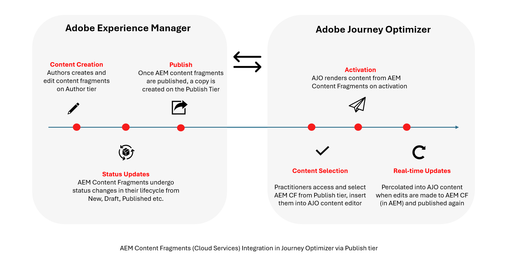

# Introducción a los fragmentos de contenido de Adobe Experience Manager {#aem-fragments}

>[!AVAILABILITY]
>
>Para los clientes del sector sanitario, la integración solo se activa tras obtener la licencia de las ofertas adicionales de Journey Optimizer Healthcare Shield y Adobe Experience Manager Enhanced Security.

Al integrar Adobe Experience Manager as a Cloud Service con Adobe Journey Optimizer, puede incorporar sin problemas los fragmentos de contenido de AEM en el contenido de Journey Optimizer. Esta conexión optimizada simplifica el proceso de acceso y uso del contenido de AEM, lo que permite crear campañas y recorridos personalizados y dinámicos.

Para obtener más información sobre los fragmentos de contenido de AEM, consulte [Trabajar con fragmentos de contenido](https://experienceleague.adobe.com/es/docs/experience-manager-cloud-service/content/sites/administering/content-fragments/content-fragments-with-journey-optimizer){target="_blank"} en la documentación de Experience Manager.

## Ciclo de fragmento de contenido

Los fragmentos de contenido siguen diferentes etapas del ciclo vital según el nivel de Adobe Experience Manager en el que existan. [Obtenga más información en la documentación de Adobe Experience Manager](https://experienceleague.adobe.com/es/docs/experience-manager-cloud-service/content/sites/authoring/author-publish)

El contenido se crea y administra en el **nivel de creación**, donde los fragmentos pueden tener estados como Nuevo, Borrador, Publicado, Modificado o No publicado. Estos estados se aplican solamente en el **nivel de creación** y admiten la creación y revisión de contenido.

Cuando se publica un fragmento de contenido, se crea una copia en el **nivel de publicación** y se expone a través de un extremo público no autenticado. Journey Optimizer se integra exclusivamente con este **nivel de publicación**.

Como resultado, Journey Optimizer muestra solo fragmentos de contenido publicados o modificados y siempre utiliza la última versión publicada. Los cambios realizados después de la publicación no se reflejarán en Journey Optimizer hasta que se vuelva a publicar el fragmento de contenido.
