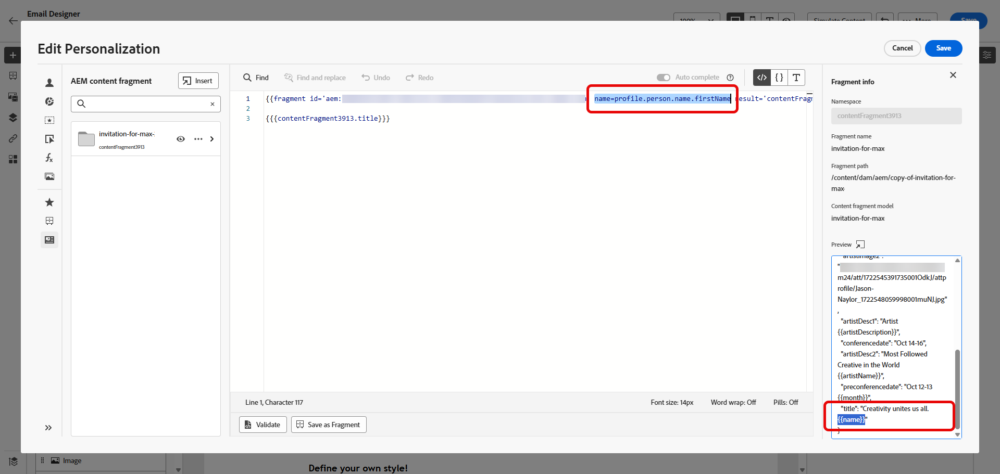

# Trabajo con fragmentos de contenido de Adobe Experience Manager {#aem-fragments}

>[!AVAILABILITY]
>
>Esta integración se aplica a **Adobe Experience Manager as a Cloud Service Sites**, solo para **fragmentos de contenido**. Journey Optimizer lee fragmentos del nivel **Publish** (no del autor).

La integración entre Adobe Experience Manager y Journey Optimizer sigue este flujo de datos:

1. **[Configurar Dispatcher](https://experienceleague.adobe.com/es/docs/experience-manager-cloud-service/content/sites/administering/content-fragments/content-fragments-with-journey-optimizer#dispatcher-configuration){target="_blank"}**: Para permitir que Journey Optimizer acceda a los fragmentos de contenido de Adobe Experience Manager a través de la API de administración de fragmentos de contenido, primero debe configurar Dispatcher. Este es un requisito previo para la integración de.

1. **[Crear y crear](https://experienceleague.adobe.com/es/docs/experience-manager-cloud-service/content/sites/administering/content-fragments/managing#creating-a-content-fragment)**: el contenido se crea y configura en Adobe Experience Manager como fragmentos de contenido.

1. **[Etiquetado](https://experienceleague.adobe.com/es/docs/experience-manager-cloud-service/content/sites/administering/content-fragments/managing#manage-tags)**: los fragmentos de contenido deben etiquetarse con la etiqueta específica de Journey Optimizer (`ajo-enabled:{OrgId}/{SandboxName}`).

1. **[Publicar](https://experienceleague.adobe.com/es/docs/experience-manager-cloud-service/content/sites/administering/content-fragments/managing#publishing-and-previewing-a-fragment)**: Los fragmentos de contenido se publican en Adobe Experience Manager, por lo que están disponibles para Journey Optimizer.

1. **[Acceso](#aem-add)**: Journey Optimizer busca y muestra en tiempo real los fragmentos de contenido disponibles en la instancia de publicación de Adobe Experience Manager.

1. **[Integración](#aem-add)**: los fragmentos de contenido se seleccionan e integran en campañas o recorridos.

Cuando se publica un fragmento de contenido en Adobe Experience Manager, se envía un evento para actualizar el contenido en Journey Optimizer. Si la actualización se realiza correctamente, el fragmento de contenido estará disponible en un plazo aproximado de 5 minutos para recorridos unitarios y en el siguiente lote de procesamiento para casos de uso por lotes. Una vez que la actualización esté disponible en Journey Optimizer, se utilizará el contenido publicado más reciente en todas las campañas y recorridos aplicables.

>[!AVAILABILITY]
>
>Para los clientes del sector sanitario, la integración solo se activa tras obtener la licencia del complemento Journey Optimizer Healthcare Shield and Adobe Experience Manager Extended Security for Healthcare.

## Creación y asignación de una etiqueta en Experience Manager

>[!IMPORTANT]
>
>Para permitir que Journey Optimizer acceda a los fragmentos de contenido de Adobe Experience Manager mediante la API de administración de fragmentos de contenido, primero debe [configurar Dispatcher](https://experienceleague.adobe.com/es/docs/experience-manager-cloud-service/content/sites/administering/content-fragments/content-fragments-with-journey-optimizer#dispatcher-configuration){target="_blank"}.

Antes de usar el fragmento de contenido en Journey Optimizer, debe crear una etiqueta específica para Journey Optimizer:

1. Acceda a su entorno de **Experience Manager**.

1. En el menú **Herramientas**, seleccione **Etiquetado**.

   

1. Haga clic en **Crear etiqueta**.

1. Asegúrese de que el identificador cumple la siguiente sintaxis: `ajo-enabled:{AJO-OrgId}/{AJO-SandboxName}`.

1. Haga clic en **Crear**.

1. Defina su modelo de fragmento de contenido como se detalla en [Documentación de Experience Manager](https://experienceleague.adobe.com/es/docs/experience-manager-cloud-service/content/sites/administering/content-fragments/content-fragment-models){target="_blank"} y asigne la etiqueta de Journey Optimizer recién creada.

Esta conexión en tiempo real garantiza que el contenido siempre esté actualizado, pero también significa que cualquier cambio en los fragmentos publicados afectará inmediatamente a las campañas y recorridos activos.

Ahora puede empezar a crear y configurar el fragmento de contenido para utilizarlo posteriormente en Journey Optimizer. Obtenga más información en [Documentación de Experience Manager](https://experienceleague.adobe.com/es/docs/experience-manager-cloud-service/content/sites/administering/content-fragments/managing){target="_blank"}.

## Añadir fragmentos de contenido de Experience Manager {#aem-add}

Después de crear y personalizar los fragmentos de contenido de AEM, ahora puede importarlos a su campaña o recorrido de Recorrido Optimizer.

1. Cree su [campaña](../campaigns/create-campaign.md) o [Recorrido](../building-journeys/journey-gs.md).

1. Para acceder a su fragmento de contenido de AEM, haga clic en  en cualquier campo de texto o abra el código fuente a través de un componente de contenido de HTML.

   

1. En el menú **[!UICONTROL Fragmento de contenido de AEM]** del panel izquierdo, haga clic en **[!UICONTROL Abrir el selector de AEM CF]**.

   

1. Examine la lista y seleccione un **[!UICONTROL Fragmento de contenido]** para importarlo en el contenido de Journey Optimizer.

   >[!NOTE]
   >
   > Si el fragmento tiene una o más variaciones **publicadas**, aparecerá un menú desplegable **[!UICONTROL Variación]** en el selector. Si no se selecciona ninguna **[!UICONTROL variación]**, la variación **Principal** se usa automáticamente. Obtenga más información en [Trabajo con variaciones de fragmentos de contenido](#aem-variations).

1. Haga clic en **[!UICONTROL Mostrar filtros]** para ajustar la lista de fragmentos de contenido.

   De forma predeterminada, el filtro Fragmento de contenido está preestablecido para mostrar solo el contenido aprobado.

   

1. Después de seleccionar su **[!UICONTROL fragmento de contenido]**, haga clic en **[!UICONTROL Seleccionar]** para agregarlo.

   

1. Haga clic en **[!UICONTROL Ver fragmento]** para mostrar la información del fragmento. Tenga en cuenta que al abrir el menú **[!UICONTROL Información del fragmento]**, el editor se colocará en modo de solo lectura.

   Seleccione **[!UICONTROL Vista previa]** en el menú de la derecha para ver su fragmento en Adobe Experience Manager.

   

1. Haga clic en  para acceder al menú avanzado del fragmento:

   * **[!UICONTROL Intercambiar fragmento]**
   * **[!UICONTROL Explorar referencias]**
   * **[!UICONTROL Abrir en AEM]**

   

1. Elija los campos que desee de su **[!UICONTROL Fragmento]** para agregarlos al contenido.

   <!--
    Note that if you choose to copy the value, any future updates to the Content Fragment will not be reflected in your campaign or journey. However, using dynamic placeholders ensures real-time updates.
-->

    

1. Para que aparezca una URL de imagen almacenada en un atributo de fragmento de contenido, por ejemplo, una ruta o un campo URL del modelo de fragmento, insértelo en la HTML con una etiqueta `` y el atributo de fragmento como origen, por ejemplo:

   ```html
   
   ```

   >[!NOTE]
   >
   >No se admiten las direcciones URL de imágenes relativas de Adobe Experience Manager; use **absolutas**.

1. Seleccione **Pastillas: de descuento** para permitir que la experiencia de las pastillas mejore la legibilidad al ocultar rutas de atributos largas.

   

1. Para usar **marcadores de posición de personalización** creados en Adobe Experience Manager dentro del texto del fragmento, defínalos en el fragmento de contenido en Adobe Experience Manager de la siguiente manera: `{{name}}`.

   En Journey Optimizer, esos tokens son marcadores de posición. Con la experiencia **pills** activada, aparecen en la sección **[!UICONTROL Fragmento de contenido de AEM]** del carril derecho junto a los campos de fragmento.

1. Para habilitar la personalización en tiempo real, el usuario debe declarar explícitamente todos los marcadores de posición utilizados en un **[!UICONTROL fragmento de contenido]** como parámetros en la etiqueta de ayuda de fragmento. Asigne esos marcadores de posición a atributos de perfil, atributos contextuales, cadenas estáticas o variables predefinidas como se indica a continuación:

   1. **Asignación de atributos contextuales o de perfil**: asigne el marcador de posición a un perfil o atributo contextual; por ejemplo, name = profile.person.name.firstName.

   1. **Asignación de cadenas estáticas**: asigne un valor de cadena fijo poniéndolo entre comillas dobles, por ejemplo name = &quot;John&quot;.

   1. **Asignación de variables**: Haga referencia a una variable declarada anteriormente en la misma HTML, por ejemplo name = &#39;variableName&#39;.
En este caso, asegúrese de que se ha declarado **_variableName_** antes de agregar el ID de fragmento, utilizando la siguiente sintaxis:

      ```html
       
      ```

   En el ejemplo siguiente, el marcador de posición **_month_** está asignado al atributo **_profile.person.birthDate_** dentro del fragmento.

   {zoomable="yes"}

1. Haga clic en **[!UICONTROL Guardar]**. Ahora puede probar y comprobar el contenido del mensaje como se detalla en [esta sección](../content-management/preview.md).

   <!--Note that the Content Fragment you selected stays active for this message. When you open the Personalization Editor in another field or content block, you can keep working with the same fragment from the **[!UICONTROL AEM Content Fragment]** section and add more fields without reopening **[!UICONTROL Open AEM CF selector]**.-->

Una vez que hayas realizado las pruebas y validado el contenido, puedes [enviar tu campaña](../campaigns/review-activate-campaign.md) o [publicar tu recorrido](../building-journeys/publish-journey.md) a tu audiencia.

Adobe Experience Manager le permite identificar las campañas o recorridos de Journey Optimizer en los que se utiliza un fragmento de contenido. Obtenga más información en [Documentación de Adobe Experience Manager](https://experienceleague.adobe.com/es/docs/experience-manager-cloud-service/content/sites/administering/content-fragments/extension-content-fragment-ajo-external-references){target="_blank"}.

## Trabajo con variaciones de fragmentos de contenido {#aem-variations}

En Adobe Experience Manager, cada fragmento de contenido consta de lo siguiente:

* **Principal**: el contenido principal del fragmento que siempre existe no se puede eliminar y es la base de todas las variaciones.
* **Variaciones**: una o más permutaciones de **Principal** que los autores crean para canales o escenarios específicos. Las variaciones se encuentran dentro del fragmento no como recursos independientes y se pueden comparar y sincronizar con **Main**.

Ejemplos de casos de uso de variaciones:

* Una versión breve de la copia para una notificación push y una versión más larga para el correo electrónico.
* Ajustes de tono regionales sin crear un fragmento independiente.
* Mensajería específica del canal (por ejemplo, web en comparación con móvil).

➡️ [Obtenga más información en la documentación de Adobe Experience Manager](https://experienceleague.adobe.com/es/docs/experience-manager-65/content/assets/content-fragments/content-fragments-variations)

Journey Optimizer le permite elegir qué variación utilizar al insertar un fragmento, de modo que diferentes campañas o recorridos pueden depender de diferentes representaciones del mismo contenido de origen en Adobe Experience Manager sin duplicar fragmentos.

Para seleccionar una variación:

1. Abra una [campaña](../campaigns/create-campaign.md) o un [recorrido](../building-journeys/journey-gs.md).

1. Haga clic en  en cualquier campo de texto o abra el origen de HTML desde un componente de contenido de HTML.

1. En **[!UICONTROL Fragmento de contenido AEM]**, haga clic en **[!UICONTROL Abrir selector CF]**.

   

1. Para seleccionar un fragmento de contenido de Adobe Experience Manager específico de la configuración regional en la vista de tabla, use **[!UICONTROL Personalizar tabla]** para agregar la columna **[!UICONTROL Idioma]**. Los valores de configuración regional se muestran en la tabla, lo que permite identificar y seleccionar el fragmento adecuado.

   

1. Seleccione su **[!UICONTROL fragmento de contenido]**.

1. Haga clic en el icono de  para abrir el menú **[!UICONTROL Detalles]**. Si el fragmento tiene una o más variaciones publicadas, aparecerá un menú desplegable **[!UICONTROL Variación]** junto a los detalles del fragmento.

   

1. En el menú **[!UICONTROL Detalles rápidos]**, haga clic en **[!UICONTROL Explorar referencias]** para abrir las opciones relacionadas en Adobe Experience Manager para obtener detalles de variación, vista previa y revisión cuando estén disponibles.

1. Elija su variación y luego haga clic en **[!UICONTROL Seleccionar]**.

   >[!NOTE]
   >
   > Si no selecciona ninguna variación o si el fragmento se agregó antes de que la compatibilidad con variaciones estuviera disponible, Journey Optimizer usará la variación **Principal** automáticamente a la hora de envío.

Después de insertar un fragmento con una variación, al volver a publicarlo en Adobe Experience Manager se actualiza cada **variación a la que se hace referencia** en campañas o recorridos activos automáticamente. Las vistas previas y las pruebas siguen utilizando la variación que haya elegido, con el contenido publicado más reciente para esa variación.
