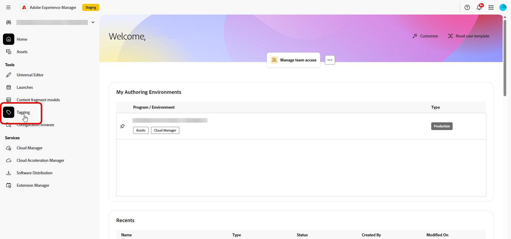
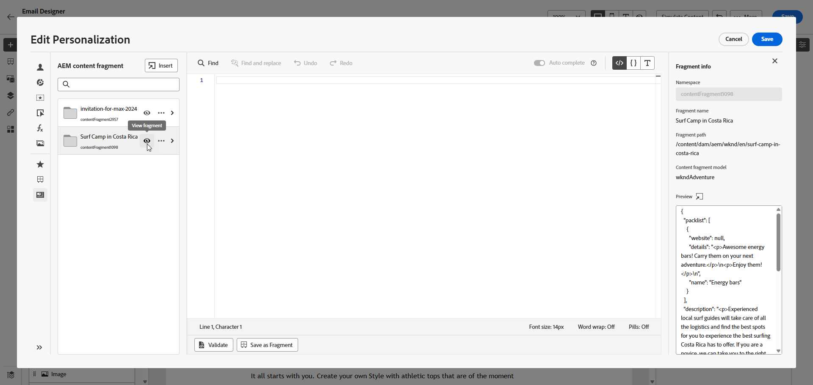

# Fragmentos de contenido de Adobe Experience Manager {#aem-fragments}

Al integrar Adobe Experience Manager as a Cloud Service con Adobe Journey Optimizer, ahora puede incorporar sin problemas los fragmentos de contenido de AEM en el contenido de Journey Optimizer. Esta conexión optimizada simplifica el proceso de acceso y uso del contenido de AEM, lo que permite crear campañas y recorridos personalizados y dinámicos.

Para obtener más información sobre los fragmentos de contenido de AEM, consulte [Trabajar con fragmentos de contenido](https://experienceleague.adobe.com/en/docs/experience-manager-cloud-service/content/sites/administering/content-fragments/content-fragments-with-journey-optimizer){target="_blank"} en la documentación de Experience Manager.

>[!AVAILABILITY]
>
>Para los clientes del sector sanitario, la integración solo se activa tras obtener la licencia de las ofertas adicionales de Journey Optimizer Healthcare Shield y Adobe Experience Manager Enhanced Security.

## Limitaciones {#limitations}

* Se recomienda limitar el número de usuarios con acceso para publicar fragmentos de contenido a fin de reducir el riesgo de errores accidentales.

* Para el contenido multilingüe, solo se admite el flujo manual.

* En este momento no se admiten variaciones.

* La prueba para la campaña y el recorrido publicados refleja los datos de la última publicación de fragmentos de contenido de Experience Manager.

## Creación y asignación de una etiqueta en Experience Manager

Antes de usar el fragmento de contenido en Journey Optimizer, debe crear una etiqueta específica para Journey Optimizer:

1. Acceda a su entorno de **Experience Manager**.

1. En el menú **Herramientas**, seleccione **Etiquetado**.

   

1. Haga clic en **Crear etiqueta**.

1. Asegúrese de que el identificador cumple la siguiente sintaxis: `ajo-enabled:{AJO-OrgId}/{AJO-SandboxName}`.

1. Haga clic en **Crear**.

1. Defina su modelo de fragmento de contenido como se detalla en [Documentación de Experience Manager](https://experienceleague.adobe.com/en/docs/experience-manager-cloud-service/content/sites/administering/content-fragments/content-fragment-models){target="_blank"} y asigne la etiqueta de Journey Optimizer recién creada.

Ahora puede empezar a crear y configurar el fragmento de contenido para utilizarlo posteriormente en Journey Optimizer. Obtenga más información en [Documentación de Experience Manager](https://experienceleague.adobe.com/en/docs/experience-manager-cloud-service/content/sites/administering/content-fragments/managing){target="_blank"}.

## Añadir fragmentos de contenido de Experience Manager {#aem-add}

Después de crear y personalizar los fragmentos de contenido de AEM, ahora puede importarlos a su campaña o recorrido de Recorrido Optimizer.

1. Cree su [campaña](../campaigns/create-campaign.md) o [Recorrido](../building-journeys/journey-gs.md).

1. Para acceder a su fragmento de contenido de AEM, haga clic en  en cualquier campo de texto o abra el código fuente a través de un componente de contenido de HTML.

   

1. En el menú **[!UICONTROL Fragmento de contenido de AEM]** del panel izquierdo, haga clic en **[!UICONTROL Abrir el selector de AEM CF]**.

   

1. Seleccione un **[!UICONTROL fragmento de contenido]** de la lista disponible para importarlo al contenido de Journey Optimizer.

1. Haga clic en **[!UICONTROL Mostrar filtros]** para ajustar la lista de fragmentos de contenido.

   De forma predeterminada, el filtro Fragmento de contenido está preestablecido para mostrar solo el contenido aprobado.

   

1. Después de seleccionar su **[!UICONTROL fragmento de contenido]**, haga clic en **[!UICONTROL Seleccionar]** para abrirlo.

   

1. Haga clic en **[!UICONTROL Ver fragmento]** para mostrar la información del fragmento. Tenga en cuenta que al abrir el menú **[!UICONTROL Información del fragmento]**, el editor se colocará en modo de solo lectura.

   Seleccione **[!UICONTROL Vista previa]** en el menú de la derecha para ver su fragmento en Adobe Experience Manager.

   

1. Haga clic en  para acceder al menú avanzado del fragmento:

   * **[!UICONTROL Intercambiar fragmento]**
   * **[!UICONTROL Explorar referencias]**
   * **[!UICONTROL Abrir en AEM]**

   

1. Elija los campos que desee de su **[!UICONTROL Fragmento]** para agregarlos al contenido.
   <!--
    Note that if you choose to copy the value, any future updates to the Content Fragment will not be reflected in your campaign or journey. However, using dynamic placeholders ensures real-time updates.-->

   

1. Para habilitar la personalización en tiempo real, el usuario debe declarar explícitamente todos los marcadores de posición utilizados en un **[!UICONTROL fragmento de contenido]** como parámetros en la etiqueta de ayuda de fragmento. Puede asignar estos marcadores de posición a atributos de perfil, atributos contextuales, cadenas estáticas o variables predefinidas mediante los siguientes métodos:

   1. **Asignación de atributos contextuales o de perfil**: asigne el marcador de posición a un perfil o atributo contextual; por ejemplo, name = profile.person.name.firstName.

   1. **Asignación de cadenas estáticas**: asigne un valor de cadena fijo poniéndolo entre comillas dobles, por ejemplo name = &quot;John&quot;.

   1. **Asignación de variables**: Haga referencia a una variable declarada anteriormente en la misma HTML, por ejemplo name = &#39;variableName&#39;.
En este caso, asegúrese de que se ha declarado **_variableName_** antes de agregar el ID de fragmento, utilizando la siguiente sintaxis:

      ```html
       
      ```

   En el ejemplo siguiente, el marcador de posición **_name_** está asignado al atributo **_profile.person.name.firstName_** dentro del fragmento.

   {zoomable="yes"}


1. Haga clic en **[!UICONTROL Guardar]**. Ahora puede probar y comprobar el contenido del mensaje como se detalla en [esta sección](../content-management/preview.md).

Una vez que hayas realizado las pruebas y validado el contenido, puedes [enviar tu campaña](../campaigns/review-activate-campaign.md) o [publicar tu recorrido](../building-journeys/publishing-the-journey.md) a tu audiencia.

Adobe Experience Manager le permite identificar las campañas o recorridos de Journey Optimizer en los que se utiliza un fragmento de contenido. Obtenga más información en [Documentación de Adobe Experience Manager](https://experienceleague.adobe.com/en/docs/experience-manager-cloud-service/content/sites/administering/content-fragments/extension-content-fragment-ajo-external-references).
