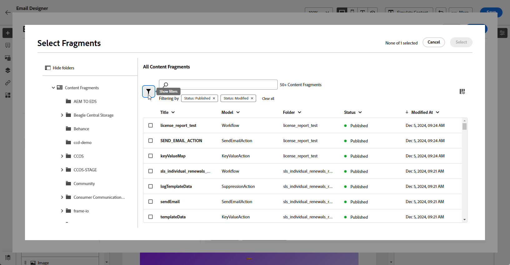

# Fragmentos de contenido de Adobe Experience Manager {#aem-fragments}

Al integrar Adobe Experience Manager con Adobe Journey Optimizer, ahora puede incorporar sin problemas los fragmentos de contenido de AEM en el contenido del correo electrónico de Journey Optimizer. Esta conexión optimizada simplifica el proceso de acceso y uso del contenido de AEM, lo que permite crear campañas y recorridos personalizados y dinámicos.

Para obtener más información sobre el fragmento de contenido de AEM, consulte [Documentación de Experience Manager](https://experienceleague.adobe.com/en/docs/experience-manager-cloud-service/content/sites/authoring/fragments/content-fragments).

## Limitaciones {#limitations}

* Solo disponible para el canal de correo electrónico.

* Actualmente, los usuarios no pueden cambiar la instancia de AEM a la que están conectados, ya que cada zona protegida está limitada a una sola instancia.

* Se recomienda limitar el número de usuarios con acceso a los fragmentos de contenido de publicación para reducir el riesgo de errores accidentales en los correos electrónicos.

* Para el contenido multilingüe, solo se admite el flujo manual.

* Actualmente no se admiten variantes.

* Debe crear una etiqueta específica para Journey Optimizer.

+++ Obtenga información sobre cómo crear su etiqueta de Journey Optimizer

   1. Acceda a su entorno de **Experience Manager**.

   1. En el menú **Herramientas**, vaya a la ficha **General** y seleccione **Etiquetado**.

   1. Haga clic en **Crear una etiqueta nueva**.

   1. Asegúrese de que el identificador cumple la siguiente sintaxis: `ajo-enabled:{AJO-OrgId}/{AJO-SandboxName}`.

   1. Haga clic en **Crear**.

  Ahora puede asignar esta etiqueta de Journey Optimizer a los fragmentos de contenido.
+++

## Añadir fragmentos de contenido de AEM {#aem-add}

Después de crear y personalizar sus [fragmentos de contenido de AEM](https://experienceleague.adobe.com/en/docs/experience-manager-cloud-service/content/sites/authoring/fragments/content-fragments), ahora puede importarlos a su campaña o recorrido de Recorrido Optimizer.

1. Después de crear tu [campaña](../email/create-email.md) o [Recorrido](../email/create-email.md) con una acción de correo electrónico, accede al diseñador de correo electrónico para configurar el contenido del correo electrónico. [Más información](../email/get-started-email-design.md)

1. Haga clic dentro de un bloque de texto o en la línea de asunto y seleccione **[!UICONTROL Agregar Personalization]** en la barra de herramientas contextual.

   

1. En el menú **[!UICONTROL Fragmento de contenido de AEM]** del panel izquierdo, haga clic en **[!UICONTROL Abrir el selector de AEM CF]**.

   

1. Seleccione un **[!UICONTROL fragmento de contenido]** de la lista disponible para importarlo al contenido de Journey Optimizer.

1. Haga clic en **[!UICONTROL Mostrar filtros]** para ajustar la lista de fragmentos de contenido.

   De forma predeterminada, el filtro Fragmento de contenido está preestablecido para mostrar solo el contenido aprobado.

   

1. Después de seleccionar su **[!UICONTROL fragmento de contenido]**, haga clic en **[!UICONTROL Seleccionar]** para abrirlo.

   

1. Elija los campos que desee de su **[!UICONTROL Fragmento de contenido]** para agregarlos al contenido. Puede añadir el contenido o copiar su valor.

   Tenga en cuenta que si decide copiar el valor, cualquier actualización futura de **[!UICONTROL Fragmento de contenido]** no se reflejará en su campaña o recorrido.

   

1. Haz clic en **[!UICONTROL Guardar]** y comprueba tu mensaje en la vista previa. Ahora puede probar y comprobar el contenido del mensaje como se detalla en [esta sección](../content-management/preview.md).

Una vez que haya realizado las pruebas y validado el contenido, puede enviar su correo electrónico a la audiencia con su [campaña](../campaigns/review-activate-campaign.md) o [Recorrido](../building-journeys/publishing-the-journey.md).
