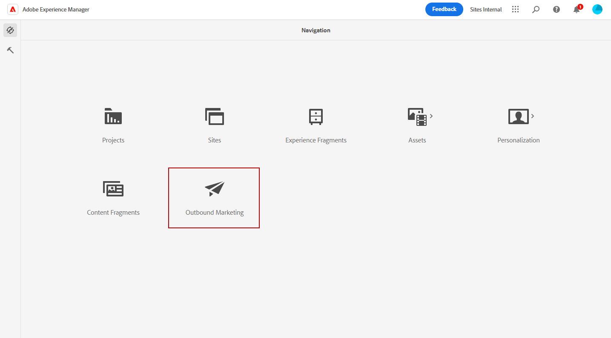
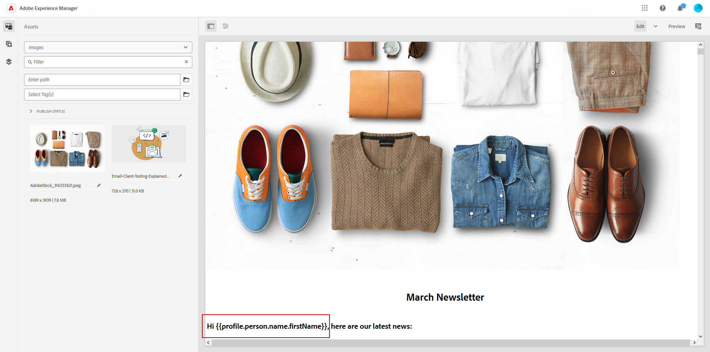
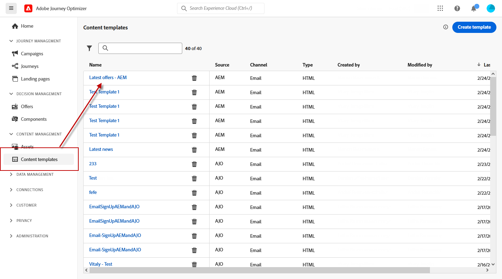
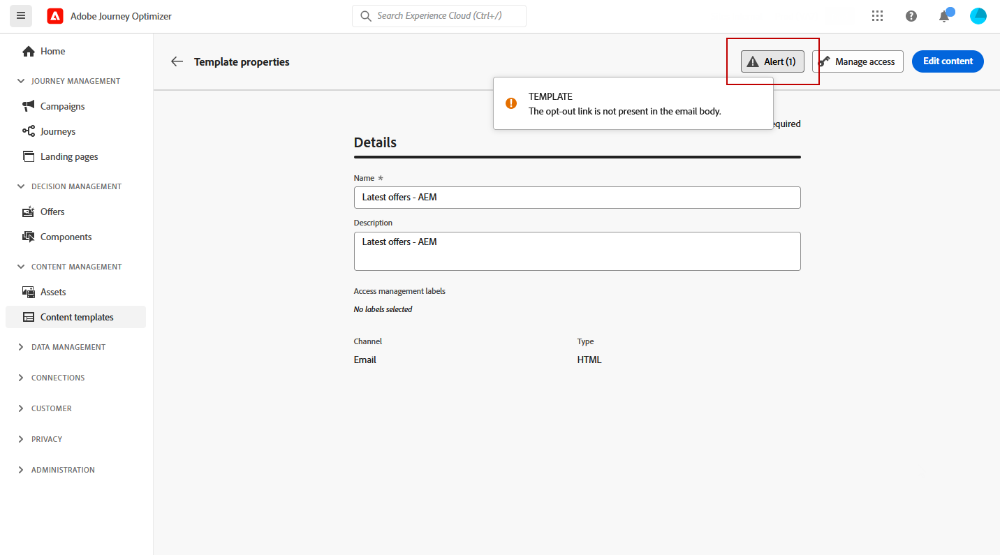
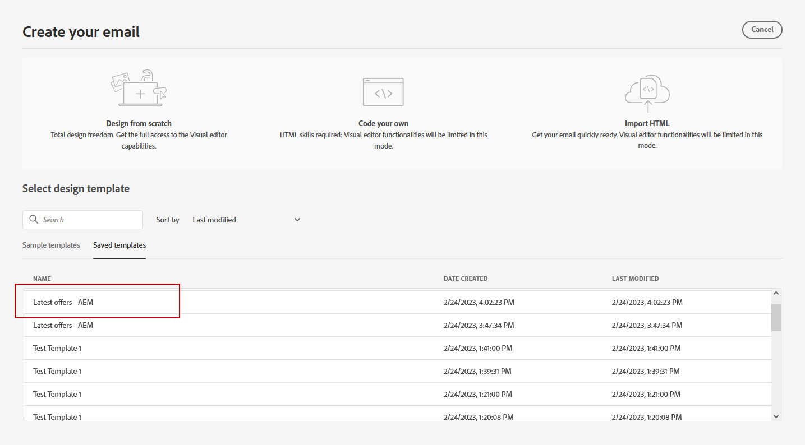

# Trabajo con plantillas de Adobe Experience Manager {#aem-templates}

## Introducción a las plantillas de Adobe Experience Manager {#gs-aem-templates}

Con Adobe Journey Optimizer, puede crear mensajes personalizados a través de los sitios de Adobe Experience Manager. Comience por diseñar las plantillas utilizando las fuentes de contenido de Adobe Experience Manager y, a continuación, envíelas a Adobe Journey Optimizer. Una vez compartidas, se puede acceder a estas plantillas en el Designer de correo electrónico de Adobe Journey Optimizer, lo que simplifica el proceso de creación y envío de mensajes a la audiencia deseada.

>[!AVAILABILITY]
>
>La integración con Adobe Experience Manager está disponible actualmente como una versión beta para usuarios seleccionados.
>&#x200B;>Como usuario beta, usa [este formulario](https://forms.office.com/pages/responsepage.aspx?id=Wht7-jR7h0OUrtLBeN7O4Wf0cbVTQ3tCpW_unE-w8-JUN1FaNlAzNkhPSUdaSkJXVFRCNTRJNVRFSy4u){target="_blank"} para compartir comentarios.

### Requisitos previos {#prerequisites}

Antes de empezar a utilizar esta capacidad, asegúrese de estar alineado con los siguientes requisitos:

* **Configuración de Experience Manager**

  Esta funcionalidad está disponible con [Adobe Experience Manager as a Cloud Service](https://experienceleague.adobe.com/docs/experience-manager-cloud-service/content/overview/introduction.html?lang=es){target="_blank"}.

  Como parte del programa beta, la configuración de Cloud Service la realiza Adobe en Adobe Experience Manager para conectarse a Adobe Journey Optimizer.

* **Permisos**

  Para crear, editar y eliminar plantillas de contenido en Adobe Journey Optimizer, debe incluir el permiso **[!DNL Manage Library Items]** en el perfil de producto **[!DNL Content Library Manager]**. [Más información](../administration/ootb-product-profiles.md#content-library-manager)

### Mecanismos de protección y limitaciones{#aem-templates-limitations}

Para optimizar aún más el uso de Adobe Experience Manager con Adobe Journey Optimizer, es importante tener en cuenta las siguientes limitaciones y protecciones adicionales:

* Se requiere una sintaxis de Journey Optimizer adecuada para que la personalización en la plantilla de Experience Manager sea eficaz. [Más información](../personalization/personalization-syntax.md)

* Actualmente no se admite la exportación masiva de plantillas, las plantillas deben exportarse individualmente.

* Actualmente no está disponible la sincronización entre Experience Manager y Journey Optimizer. Si se realizan cambios en una plantilla de Experience Manager después de enviarla a Journey Optimizer, el usuario deberá volver a exportar la plantilla y enviarla de nuevo a Journey Optimizer.

## Envío de una plantilla a Journey Optimizer{#aem-templates-send}

Para exportar una plantilla de Adobe Experience Manager a Adobe Journey Optimizer, siga los pasos a continuación:

1. En la página de inicio de Adobe Experience Manager, seleccione **[!UICONTROL Marketing saliente]**.

   

1. Desde la biblioteca de contenido, puede utilizar plantillas configuradas anteriormente o crear una desde cero. [Más información](https://experienceleague.adobe.com/docs/experience-manager-65/authoring/authoring/managing-pages.html#creating-a-new-page)

1. Al incorporar la sintaxis de personalización de Journey Optimizer en la plantilla, puede mejorar sus capacidades de personalización. [Más información](../personalization/personalization-syntax.md)

   

1. Seleccione la plantilla que desea exportar a Journey Optimizer y haga clic en **[!UICONTROL Enviar a]** en el menú avanzado.

   

1. Escriba el **[!UICONTROL Nombre]** de la plantilla de contenido y seleccione el destino **[!UICONTROL espacio aislado]**.

   

1. Después de hacer clic en el botón **[!UICONTROL Enviar]**, comenzará el proceso de exportación. Una vez completada la exportación, verá el siguiente mensaje en la interfaz de usuario: &quot;Template &quot;XX&quot; sent successfully to AJO&quot;.

La plantilla se agrega a las plantillas de contenido de Adobe Journey Optimizer de la zona protegida seleccionada.

## Uso y personalización de una plantilla de Adobe Experience Manager{#aem-templates-perso}

Una vez que la plantilla de Experience Manager esté disponible en Journey Optimizer como plantilla de contenido, puede identificar e incorporar el contenido necesario para el correo electrónico, incluida la personalización.

1. En Journey Optimizer, desde el menú **[!UICONTROL Plantilla de contenido]**, acceda a su plantilla importada.

   

1. Al hacer clic en el botón **[!UICONTROL Alerta]**, puede comprobar rápidamente si falta alguna configuración importante. Esto le ayudará a asegurarse de que sus mensajes estén correctamente configurados y a evitar posibles errores o problemas.

   

1. En la ventana **[!UICONTROL Propiedades de plantilla]**, haga clic en el botón **[!UICONTROL Administrar acceso]** para asignar etiquetas de uso de datos principales o personalizadas a su plantilla. [Más información acerca del Control de acceso de nivel de objeto (OLAC)](../administration/object-based-access.md)

1. Para personalizar aún más la plantilla de Experience Manager y agregar una personalización personalizada al contenido, haz clic en **[!UICONTROL Editar contenido]**. Esto le permitirá realizar cambios fácilmente y adaptar la plantilla a sus necesidades específicas. [Más información](../email/get-started-email-design.md)

   >[!WARNING]
   >
   > Si desea editar y personalizar la plantilla, solo podrá utilizar el modo de compatibilidad.

1. Cuando la plantilla de contenido esté lista, [pruébela y validámela](../content-management/content-templates.md#test-template).

1. Una vez definido el contenido, puede utilizarlo al crear correo electrónico nuevo explorando la colección **[!UICONTROL Plantillas guardadas]**. A continuación, seleccione **[!UICONTROL Usar esta plantilla]**.

   

1. Ahora puede editar y personalizar el contenido. Para obtener más información sobre cómo generar el contenido de su correo electrónico, consulte esta [página](../email/content-from-scratch.md).

   

1. Si agregó contenido personalizado a la plantilla de Experience Manager, haga clic en **[!UICONTROL Simular contenido]** para obtener una vista previa del aspecto que tendrá el mensaje mediante perfiles de prueba.

[Más información sobre la vista previa y los perfiles de prueba](../content-management/preview-test.md)

   

1. Al ver la vista previa del mensaje, los elementos personalizados se sustituyen automáticamente por los datos correspondientes del perfil de prueba seleccionado.

   Si es necesario, se pueden agregar perfiles de prueba adicionales mediante el botón **[!UICONTROL Administrar perfiles de prueba]**.

   

Cuando el correo electrónico esté listo, completa la configuración de tu [recorrido](../building-journeys/journey-gs.md) o [campaña](../campaigns/create-campaign.md) y actívalo para enviar el mensaje.
