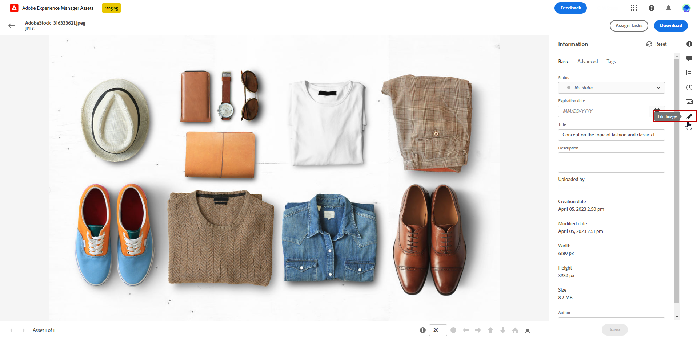
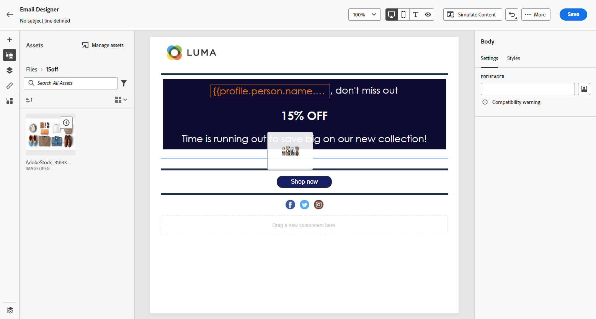

# Crear y administrar recursos con [!DNL Experience Manager Assets]{#experience-manager-assets}

## Introducción a [!DNL Experience Manager Assets] {#get-started-assets}

Una los flujos de trabajo creativos y de marketing usando **[!DNL Adobe Experience Manager Assets]**. Integrado de forma nativa con **[!DNL Adobe Journey Optimizer]**, acceda a **[!DNL Assets Essentials]** o **[!DNL Assets as a Cloud Service]** para almacenar, administrar, descubrir y distribuir recursos digitales. Proporciona un único repositorio centralizado de recursos que puede utilizar para completar los mensajes.

**[!DNL Adobe Experience Manager Assets]** ofrece dos espacios de trabajo de recursos centralizados y colaborativos que amplían su sistema creativo y unifican los recursos digitales para la entrega de experiencias:

* **[!DNL Assets as a Cloud Service]**: Adobe Experience Manager Assets as a Cloud Service ofrece una solución de nube fácil de usar para una administración eficiente de activos digitales y operaciones de Dynamic Media. Incorpora sin problemas funciones avanzadas, como inteligencia artificial y aprendizaje automático.

  Obtenga más información en [Documentación de Adobe Experience Manager as a Cloud Service](https://experienceleague.adobe.com/docs/experience-manager-cloud-service/content/assets/overview.html){target="_blank"}.

* **[!DNL Assets Essentials]**: Experience Manager Assets Essentials es la solución ligera de Assets as a Cloud Service para la colaboración y administración de recursos unificadas. Con una interfaz moderna y simplificada, permite a los equipos creativos y de marketing almacenar, descubrir y distribuir recursos digitales sin esfuerzo.

  Obtenga más información en [Documentación de Adobe Experience Manager Assets Essentials](https://experienceleague.adobe.com/docs/experience-manager-assets-essentials/help/introduction.html){target="_blank"}.

Según el contrato, se puede acceder a **[!DNL Adobe Experience Manager Assets Essentials]** o **[!DNL Adobe Experience Manager Assets as a Cloud Service]** directamente desde **[!DNL Adobe Journey Optimizer]** a través de la sección del menú izquierdo **[!UICONTROL Assets]**. También puede acceder a recursos y carpetas al [diseñar contenido de correo electrónico](../email/get-started-email-design.md).

## Requisitos previos{#assets-prerequisites}

>[!BEGINTABS]

>[!TAB Adobe Experience Manager Assets Essentials]

Antes de usar [!DNL Adobe Experience Manager Assets Essentials], debe agregar usuarios a los perfiles de producto de **Usuarios consumidores de Assets Essentials** o **Usuarios de Assets Essentials**. Obtenga más información en [Documentación de Assets Essentials](https://experienceleague.adobe.com/docs/experience-manager-assets-essentials/help/get-started-admins/deploy-administer.html#add-user-groups){target="_blank"}.

>[!NOTE]
>Para los productos de Journey Optimizer obtenidos antes del 6 de enero de 2022, debe implementar **[!DNL Adobe Experience Manager Assets Essentials]** para su organización. Obtenga más información en la sección [Implementar Assets Essentials](https://experienceleague.adobe.com/docs/experience-manager-assets-essentials/help/deploy-administer.html?lang=es){target="_blank"}.

>[!TAB Adobe Experience Manager Assets as a Cloud Service]

Antes de usar **[!DNL Adobe Experience Manager Assets as a Cloud Service]**, debe agregar usuarios a Assets Cloud Services. Obtenga más información en [Adobe Experience Manager Assets as a Cloud Service](https://experienceleague.adobe.com/docs/experience-manager-cloud-service/content/security/ims-support.html).

>[!ENDTABS]

## Carga e inserción de recursos{#add-asset}

Para importar archivos a **[!DNL Assets Essentials]** o **[!DNL Assets as a Cloud Service]**, primero debe examinar o crear la carpeta en la que se almacenarán. A continuación, podrá insertarlos en el contenido del correo electrónico.

1. En la página de inicio de [!DNL Adobe Journey Optimizer], seleccione la ficha **[!UICONTROL Assets]** en el menú **[!UICONTROL Administración de contenido]** para acceder a **[!DNL Assets Essentials]** o **[!DNL Assets as a Cloud Service]**.

   

1. Elija el repositorio para su Assets en Journey Optimizer. Puede optar por un repositorio **[!DNL Assets Essentials]** o **[!DNL Assets as a Cloud Service]**, siempre que sea el propietario de esta solución.

   

   +++ Aprenda a cambiar el repositorio de Assets.

   Para cambiar el repositorio de Assets, seleccione el icono Cuenta en la esquina superior derecha y haga clic en **[!UICONTROL Seleccionar repositorio]**.

   

   +++

1. Haga doble clic en una carpeta desde la sección central o desde la vista de árbol para abrirla.

   También puede hacer clic en **[!UICONTROL Crear carpeta]** para crear una carpeta nueva.

   

1. Una vez que se encuentre en la carpeta seleccionada o creada, haga clic en **[!UICONTROL Agregar Assets]** para cargar el nuevo recurso en su carpeta.

   

1. Desde **[!UICONTROL Cargar archivos]**, haz clic en **[!UICONTROL Examinar]** y elige si deseas **[!UICONTROL Examinar archivos]** o **[!UICONTROL Examinar carpetas]**.

1. Seleccione el archivo que desee cargar. Cuando termine, haga clic en **[!UICONTROL Cargar]**. Para obtener más información sobre cómo administrar los recursos, consulte esta [página](https://experienceleague.adobe.com/docs/experience-manager-assets-essentials/help/manage-organize.html).

1. Para editar aún más los recursos con Adobe Photoshop Express, haga doble clic en ellos. A continuación, en el menú de la derecha, seleccione el icono **[!UICONTROL Modo de edición]**. [Más información](https://experienceleague.adobe.com/docs/experience-manager-assets-essentials/help/edit-images.html){target="_blank"}.

   

1. En [!DNL Adobe Journey Optimizer], seleccione el menú **[!UICONTROL Selector de recursos]** del panel izquierdo de Email Designer.

   

1. Seleccione la carpeta **[!UICONTROL Assets]** creada anteriormente. También puede buscar su recurso o su carpeta en la barra de búsqueda.

1. Arrastre y suelte su recurso en el contenido del correo electrónico.

   

1. Puede personalizar aún más los recursos, como agregar un vínculo externo o un texto, mediante las fichas **[!UICONTROL Configuración]** y **[!UICONTROL Estilos]**. [Más información acerca de la configuración de componentes](../email/content-components.md)

   

   <!--
    After adding your asset to your email, use the **[!UICONTROL Find similar Stock photos]** option to locate Stock photos that match the content, color, and composition of your image. [Learn more about Adobe Stock](stock.md).

    Note that this option is available for licensed/unlicensed Stock images and images from your Assets folder. 

    
    -->

## [!DNL Adobe Experience Manager Assets] Preguntas frecuentes {#faq-assets}

+++ ¿Puedo seguir utilizando el repositorio agrupado de Assets Essentials en Journey Optimizer?

Si está aprovisionado en **[!DNL Adobe Experience Manager Assets as a Cloud Service]**, tiene acceso a los repositorios de **[!DNL Adobe Experience Manager Assets Essentials]** y **[!DNL Adobe Experience Manager Assets as a Cloud Service]** si el usuario tiene los permisos adecuados. Estos repositorios son independientes y no están sincronizados. Un usuario de Journey Optimizer podrá ver ambos repositorios, incluidos otros entornos a los que tiene derecho, como Fase, Desarrollo, etc., y debe poder alternar sin problemas entre ellos con el selector de repositorios.

+++

+++ ¿Cómo se administran los recursos? ¿Los cambios en Assets as a Cloud Service se reflejan en Journey Optimizer?

**[!DNL Adobe Experience Manager Assets as a Cloud Service]** se integra con Journey Optimizer de manera similar a **[!DNL Adobe Experience Manager Assets Essentials]**. Cuando se realizan modificaciones en los recursos, se genera una copia binaria. Tenga en cuenta que las actualizaciones de **[!DNL Assets as a Cloud Service]** no se propagan automáticamente a las campañas de correo electrónico activas. Los cambios deben reseleccionarse manualmente en la Designer de correo electrónico para garantizar la sincronización entre los recursos y las campañas de correo electrónico en curso.

+++

+++ ¿Puedo utilizar direcciones URL de Dynamic Media al crear correos electrónicos en Journey Optimizer?

Sí, puede utilizar direcciones URL de Dynamic Media en la creación de correo electrónico de Journey Optimizer. Simplemente pegue las direcciones URL, en lugar de seleccionar en el Selector de recursos.

+++

+++ ¿Puede el usuario de Journey Optimizer realizar cambios en el repositorio de as a Cloud Service de Adobe Experience Manager Assets desde la interfaz de Journey Optimizer?

Siempre que el usuario de Journey Optimizer sea un usuario estándar con derecho a **[!DNL Adobe Experience Manager Assets as a Cloud Service]** y tenga permiso de edición en el repositorio, podrá realizar modificaciones en el repositorio **[!DNL Adobe Experience Manager Assets as a Cloud Service]**.

+++
