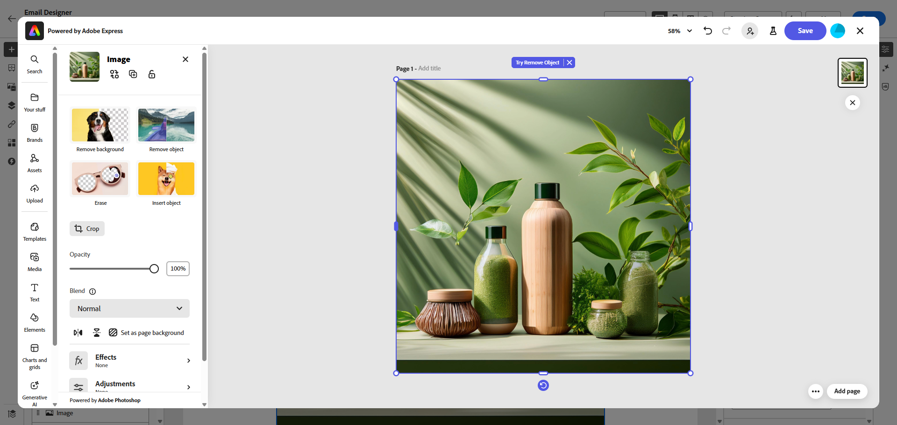
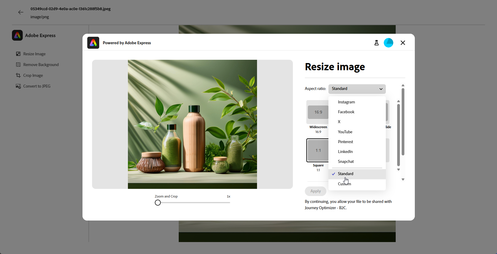
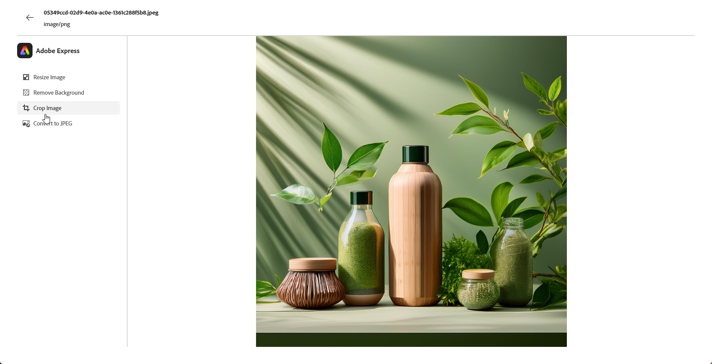
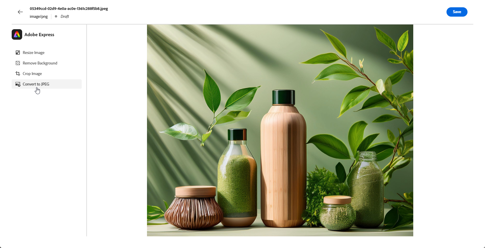
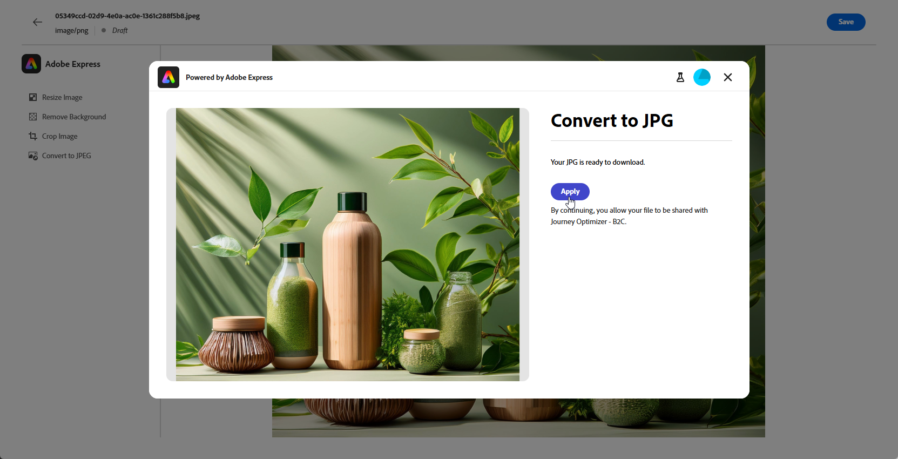
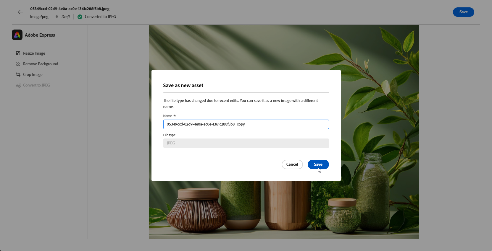

# Editar recursos con [!DNL Adobe Express]{#express}

>[!CONTEXTUALHELP]
>id="ajo_express_menu"
>title="Integración de Adobe Express"
>abstract="Comience a personalizar sus recursos con la integración de Adobe Express. Esta función le permite cambiar el tamaño de las imágenes, quitar fondos, recortar elementos visuales y convertir recursos a JPEG o PNG."

>[!IMPORTANT]
>
>Al utilizar la integración de Adobe Express, los datos abandonarán Journey Optimizer. No utilice esta integración con PHI u otros datos de salud.

La integración de Adobe Express en Adobe Journey Optimizer le permite acceder fácilmente a las potentes herramientas de edición de Adobe Express a la hora de crear contenido. Esta integración le permite cambiar el tamaño de las imágenes, quitar fondos, recortar elementos visuales y convertir recursos a JPEG o PNG sin necesidad de cambiar entre soluciones.

Para obtener más información sobre Adobe Express, consulte [esta documentación](https://helpx.adobe.com/es/express/user-guide.html).

Para acceder al menú **[!DNL Adobe Express]**, accede a tu **configuración de imagen** desde el Designer de correo electrónico y haz clic en **[!UICONTROL Editar en Adobe Express]**.

➡️ [Descubra esta funcionalidad en vídeo](#video)

## Uso de Adobe Express con una licencia empresarial {#licence}

Los usuarios sin licencia de Adobe Express Enterprise pueden acceder a las funciones detalladas en las secciones siguientes.

Con una licencia Enterprise, los usuarios tienen acceso completo al editor web de Adobe Express, lo que les permite ajustar la configuración de los recursos, generar contenido con Firefly, agregar texto y aplicar personalizaciones adicionales.

Para obtener más información sobre los casos de uso disponibles para los usuarios con una licencia Enterprise para Adobe Express, consulte [Documentación web de Adobe Express](https://helpx.adobe.com/es/express/web.html).

## Uso de Adobe Express sin una licencia empresarial  {#edit}

Sin una licencia Enterprise, los usuarios tienen acceso a los siguientes casos de uso disponibles con Adobe Express:

* [Redimensionar imagen](#resize)
* [Quitar fondo](#background)
* [Recortar imagen](#crop-image)
* [Convertir a JPEG o PNG](#convert)

### Redimensionar imagen {#resize}

1. En el menú Adobe Express, seleccione **[!UICONTROL Cambiar tamaño de imagen]**.

   

1. Seleccione la **[!UICONTROL proporción de aspecto]** que mejor se ajuste a las proporciones del recurso.

   

1. Utilice el control deslizante para hacer zoom y recortar el recurso, y arrastre para desplazarse y ajustar el área visible.

   

1. Haga clic en **[!UICONTROL Restablecer]** para restaurar el recurso a su estado original.

1. Haga clic en **[!UICONTROL Aplicar]** una vez que el cambio de tamaño de la imagen satisfaga sus necesidades. A continuación, **[!UICONTROL guarde]** el recurso modificado.

1. En la ventana **[!UICONTROL Cargar imagen]**, haga clic en **[!UICONTROL Siguiente]** y seleccione una carpeta para almacenar el recurso modificado.

   A continuación, haga clic en **[!UICONTROL Importar]**.

La imagen ya está lista para utilizarse en el contenido.

### Quitar fondo {#background}

1. En el menú Adobe Express, seleccione **[!UICONTROL Quitar fondo]**.

   

1. El recurso se muestra automáticamente sin su fondo.

   Haz clic en **[!UICONTROL Aplicar]** para usar esto en tu contenido.

   

1. Haga clic en **[!UICONTROL Guardar]**.

1. En la ventana **[!UICONTROL Cargar imagen]**, haga clic en **[!UICONTROL Siguiente]** y seleccione una carpeta para almacenar el recurso modificado.

   A continuación, haga clic en **[!UICONTROL Importar]**.

La imagen ya está lista para utilizarse en el contenido.

### Recortar imagen {#crop-image}

1. En el menú Adobe Express, seleccione **[!UICONTROL Recortar imagen]**.

   

1. Arrastre los controladores de las esquinas para ajustar y recortar la imagen según sea necesario.

   

1. Haz clic en **[!UICONTROL Aplicar]** para usar esto en tu contenido. A continuación, **[!UICONTROL guarde]** el recurso modificado.

1. En la ventana **[!UICONTROL Cargar imagen]**, haga clic en **[!UICONTROL Siguiente]** y seleccione una carpeta para almacenar el recurso modificado.

   A continuación, haga clic en **[!UICONTROL Importar]**.

La imagen ya está lista para utilizarse en el contenido.

### Convertir a JPEG o PNG {#convert}

1. En el menú Adobe Express, seleccione **[!UICONTROL Convertir a JPEG]** o **[!UICONTROL Convertir a PNG]** según el formato original de la imagen.

   

1. Haga clic en **[!UICONTROL Aplicar]** para iniciar la conversión.

   

1. Haga clic en **[!UICONTROL Guardar]**.

1. Con el cambio de formato, puede guardarlo como una nueva imagen con un nombre diferente. Actualice **[!UICONTROL Name]** y haga clic en **[!UICONTROL Guardar]**.

   

1. En la ventana **[!UICONTROL Cargar imagen]**, haga clic en **[!UICONTROL Siguiente]** y seleccione una carpeta para almacenar el recurso modificado.

   A continuación, haga clic en **[!UICONTROL Importar]**.

La imagen ya está lista para utilizarse en el contenido.

## Vídeo práctico {#video}

Obtenga información sobre cómo editar los recursos en Adobe Journey Optimizer con las herramientas de Adobe Express.

>[!VIDEO](https://video.tv.adobe.com/v/3455523/?quality=12)

