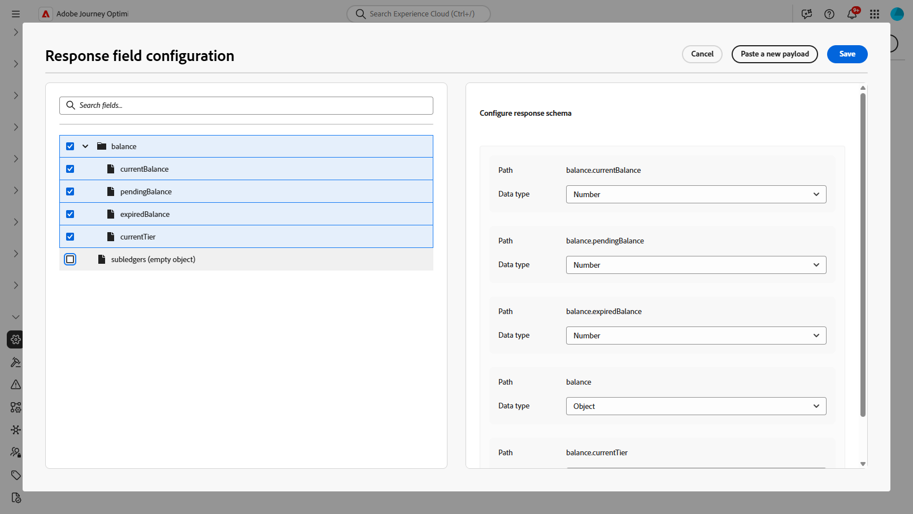

# Trabajo con integraciones {#external-sources}

## Información general

La característica **Integraciones** permite la integración perfecta de fuentes de datos de terceros en Adobe Journey Optimizer. Esta función optimiza la integración de fuentes de contenido y datos externos en las campañas, lo que le permite ofrecer mensajes dinámicos y altamente personalizados en varios canales.

Puede utilizar esta función para acceder a datos externos y extraer contenido de herramientas de terceros, como:

* **Puntos de recompensa** de sistemas de fidelidad.
* **Información de precio** para productos.
* **Recomendaciones de productos** de motores de recomendación.
* A **Actualizaciones de logística** les gusta el estado de entrega.

## Configuración de la integración {#configure}

Como administrador, puede configurar integraciones externas siguiendo estos pasos:

1. Vaya a la sección **[!UICONTROL Configuraciones]** del menú de la izquierda y haga clic en **[!UICONTROL Administrar]** desde la tarjeta **[!UICONTROL Integraciones]**.

   A continuación, haga clic en **[!UICONTROL Crear integración]** para iniciar una nueva configuración.

   

1. Proporcione un **[!UICONTROL Nombre]** y una **[!UICONTROL Descripción]** para su integración.

   >[!NOTE]
   >
   >Estos campos no pueden contener espacios.

1. Escriba el extremo de API **[!UICONTROL URL]**, que puede incluir parámetros de ruta de acceso con variables que se pueden definir mediante etiquetas y valores predeterminados.

1. Configure la **[!UICONTROL plantilla de ruta]** con **[!UICONTROL Nombre]** y **[!UICONTROL Valor predeterminado]**.

   

1. Seleccione el **[!UICONTROL método HTTP]** entre GET y POST.

1. Haga clic en **[!UICONTROL Agregar encabezado]** o en **[!UICONTROL Agregar parámetros de consulta]** según sea necesario para la integración. Proporcione los siguientes detalles para cada parámetro:

   * **[!UICONTROL Parámetro]**:: Identificador único usado internamente para hacer referencia al parámetro.

   * **[!UICONTROL Nombre]**: El nombre real del parámetro según lo esperado por la API.

   * **[!UICONTROL Tipo]**: elige **Constante** para un valor fijo o **Variable** para entrada dinámica.

   * **[!UICONTROL Valor]**: escriba el valor directamente para las constantes o seleccione una asignación de variables.

   * **[!UICONTROL Obligatorio]**: especifique si este parámetro es necesario.

   

1. Elija un **[!UICONTROL tipo de autenticación]**:

   * **[!UICONTROL Sin autenticación]**: Para las API abiertas que no requieren credenciales.

   * **[!UICONTROL clave de API]**: autentique solicitudes con una clave de API estática. Escriba su **[!UICONTROL Nombre de clave API]**, **[!UICONTROL Valor de clave API]** y especifique su **[!UICONTROL ubicación]**.

   * **[!UICONTROL Autenticación básica]**: use la autenticación básica estándar de HTTP. Escriba **[!UICONTROL Nombre de usuario]** y **[!UICONTROL Contraseña]**.

   * **[!UICONTROL OAuth 2.0]**: realice la autenticación mediante el protocolo OAuth 2.0. Haga clic en el icono  para configurar o actualizar la **[!UICONTROL carga útil]**.

   

1. Establezca la **[!UICONTROL configuración de directiva]**, como el período de **[!UICONTROL tiempo de espera]** para las solicitudes de API, y elija habilitar la restricción, la caché o reintentar.

1. Con el campo **[!UICONTROL Carga de respuesta]**, puede decidir qué campos de la salida de ejemplo se deben utilizar para la personalización de mensajes.

   Haga clic en el icono  y pegue una carga útil de respuesta JSON de muestra para detectar automáticamente los tipos de datos.

1. Elija los campos que desea exponer para la personalización y especifique sus tipos de datos correspondientes.

   

1. Use **[!UICONTROL Enviar conexión de prueba]** para validar la integración.

   Una vez validado, haga clic en **[!UICONTROL Activar]**.

## Uso de integraciones externas para la personalización {#personalization}

Como experto en marketing, puede utilizar integraciones configuradas para personalizar el contenido. Siga estos pasos:

1. Acceda al contenido de su campaña y haga clic en **[!UICONTROL Agregar personalización]** desde su **[!UICONTROL Componentes]** de texto o HTML.

[Más información sobre los componentes](../email/content-components.md)

   

1. Vaya a la sección **[!UICONTROL Integraciones]** y haga clic en **[!UICONTROL Abrir integraciones]** para ver todas las integraciones activas.

   

1. Seleccione una integración y haga clic en **[!UICONTROL Guardar]**.

   

1. Habilite el modo **[!UICONTROL Pills]** para desbloquear el menú de integración avanzada.

   

1. Para completar la configuración de la integración, defina los atributos de la integración, que se especificaron anteriormente durante [configuración](#configure).

   Puede asignar valores a estos atributos mediante valores estáticos, que permanecen constantes, o atributos de perfil, que extraen información de forma dinámica de los perfiles de usuario.

   

1. Una vez definidos los atributos de integración, ahora puede usar los campos de integración en el contenido para mensajes personalizados haciendo clic en el icono .

   

1. Haga clic en **[!UICONTROL Guardar]**.

La personalización de la integración ahora se aplica correctamente al contenido, lo que garantiza que cada destinatario reciba una experiencia relevante y adaptada en función de los atributos que haya configurado.

