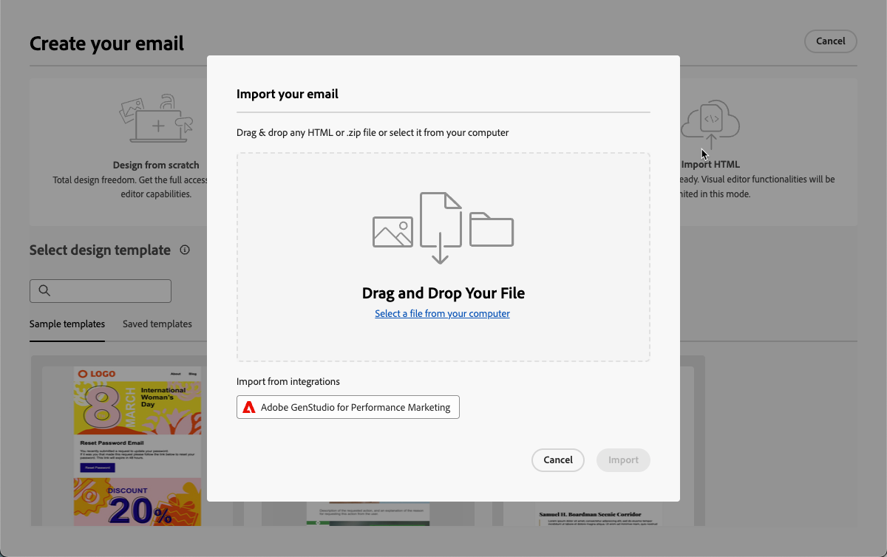

# Trabajar con GenStudio for Performance Marketing {#ajo-genstudio}

>[!CONTEXTUALHELP]
>id="ajo_genstudio_button"
>title="Uso de una plantilla creada con GenStudio"
>abstract="Gracias a la integración perfecta con Adobe GenStudio for Performance Marketing, puede importar fácilmente una plantilla de GenStudio mejorada con la tecnología de IA de Adobe."

## Introducción a GenStudio {#gs-genstudio}

[Adobe GenStudio for Performance Marketing](https://experienceleague.adobe.com/es/docs/genstudio-for-performance-marketing/user-guide/home){target="_blank"} es una aplicación generativa con prioridad de IA que permite a los equipos de marketing crear sus propios anuncios y correos electrónicos para impulsar campañas de marketing personalizadas e impactantes que se ajusten a los estándares de su marca y a las políticas de su empresa. Al aprovechar la tecnología de IA de Adobe, proporciona un conjunto completo de herramientas que simplifican las complejidades de la creación y administración de contenido para que los creativos puedan centrarse en la innovación.

>[!AVAILABILITY]
>
>* La integración de GenStudio en [!DNL Adobe Journey Optimizer] no está disponible actualmente para su uso con las ofertas de complementos de **Healthcare Shield** o **Privacy and Security Shield**.
>
>* Esta funcionalidad solo está disponible para el canal de correo electrónico.

Para mejorar la eficacia del marketing y mantener la coherencia de la marca, puedes integrar sin problemas las experiencias de [!DNL **GenStudio for Performance Marketing**] con [!DNL **Adobe Journey Optimizer**]. Esto le permite aprovechar la creación de contenido con potencia de IA de [!DNL GenStudio] junto con las capacidades de orquestación avanzadas de [!DNL Journey Optimizer].

>[!INFO]
>
>Para ir más lejos, mira esta [descripción general](https://business.adobe.com/es/products/genstudio-for-performance-marketing.html#watch-overview){target="_blank"} y una [demostración](https://business.adobe.com/es/products/genstudio-for-performance-marketing.html#demo){target="_blank"} de [!DNL Adobe GenStudio for Performance Marketing].

➡️ [Descubra esta funcionalidad en vídeo](#video)

<!--To access the GenStudio integration in [!DNL Adobe Journey Optimizer] feature, users need to be granted the **xxx** permission. [Learn more](../administration/permissions.md)

>[!IMPORTANT]
>
>* Before starting using this capability, read out related [Guardrails and Limitations](#generative-guardrails).-->

<!--Guardrails and limitations {#genstudio-guardrails}

General guidelines for using the GenStudio integration in [!DNL Adobe Journey Optimizer] for email generation are listed below:

See if guidelines/limitations such as the ones listed [here](gs-generative.md#generative-guardrails) for AI Assistant can apply.

The following limitations apply to GenStudio integration in [!DNL Adobe Journey Optimizer]:-->

## Uso de las funcionalidades de GenStudio en Journey Optimizer {#use-genstudio}

La integración de [!DNL GenStudio for Performance Marketing] y [!DNL Journey Optimizer] le permite hacer que los especialistas en marketing de su compañía trabajen mejor juntos para optimizar los procesos.

Por ejemplo, un experto en marketing técnico, que usa [!DNL Journey Optimizer] para desarrollar y automatizar campañas por correo electrónico, puede colaborar con un especialista en marketing que crea contenido mediante [!DNL GenStudio].

Con esta integración, ambos pueden trabajar juntos para integrar fácilmente el contenido de marca de [!DNL GenStudio] en [!DNL Journey Optimizer], lo que proporciona correos electrónicos atractivos dirigidos a segmentos específicos de clientes e impulsa las ventas.

### Exportación de una plantilla de HTML de Journey Optimizer a GenStudio {#export-from-ajo-to-genstudio}

Primero, puede exportar una plantilla de HTML [!DNL Journey Optimizer] que incluya las directrices de su marca a [!DNL GenStudio for Performance Marketing]. Siga los pasos a continuación.

1. En [!DNL Journey Optimizer], acceda al contenido de su correo electrónico en un recorrido o campaña. [Descubra cómo](../email/get-started-email-design.md#key-steps)

1. En Email Designer, seleccione **[!UICONTROL Exportar HTML]** del botón **[!UICONTROL Más]**.

   {zoomable="yes"}

1. Cargar esta plantilla exportada de HTML en [!DNL GenStudio for Performance Marketing]. <!--Make sure you detect the fields that the generative AI uses to insert content in order to create an actionable template.-->

   >[!NOTE]
   >
   >Aprenda a cargar una plantilla de HTML en [!DNL GenStudio] en la sección [Guía del usuario de Adobe GenStudio for Performance Marketing](https://experienceleague.adobe.com/es/docs/genstudio-for-performance-marketing/user-guide/content/templates/use-templates#templates-from-ajo-and-marketo){target="_blank"} dedicada.

1. En GenStudio, utilice esta plantilla para crear varias variaciones de correo electrónico con peticiones de datos de IA y guardarlas.

   >[!NOTE]
   >
   >Aprenda a crear experiencias de correo electrónico en la [sección](https://experienceleague.adobe.com/es/docs/genstudio-for-performance-marketing/user-guide/create/create-email-experience){target="_blank"} de GenStudio.

### Aprovechamiento de las experiencias de GenStudio en Journey Optimizer {#leverage-genstudio-experiences}

Para aprovechar las [!DNL GenStudio] variaciones de correo electrónico que acaba de crear importándolas a [!DNL Journey Optimizer], siga los pasos a continuación.

1. En [!DNL Journey Optimizer], [agregue un correo electrónico](../email/create-email.md) a una campaña.

1. Desde la pantalla de configuración de la campaña, ve a través de [Editar pantalla de contenido](../email/create-email.md#define-email-content) y haz clic en **[!UICONTROL Editar cuerpo del correo electrónico]** para abrir el Designer de correo electrónico. [Descubra cómo](../email/get-started-email-design.md#key-steps)

1. En la página de inicio de Designer de correo electrónico, seleccione **[!UICONTROL Importar HTML]** y haga clic en el botón **[!UICONTROL Adobe GenStudio for Performance Marketing]**.

   {zoomable="yes"}

1. Examine las experiencias de GenStudio para empezar a crear contenido. Puede filtrar las experiencias según varios criterios, como productos, personalidades, marcas o incluso colores.

   <!--{zoomable="yes"}-->

1. Seleccione una experiencia y haga clic en **[!UICONTROL Usar]**.

   {zoomable="yes"}

1. Seleccione la carpeta donde desea importar la experiencia de GenStudio.

   {zoomable="yes"}

1. El contenido seleccionado se muestra en el Designer de correo electrónico.

   {zoomable="yes"}

   >[!NOTE]
   >
   >Las experiencias de GenStudio [creadas a partir de una [!DNL Journey Optimizer] plantilla](#export-from-ajo-to-genstudio) se importan directamente en el Designer de correo electrónico. Las experiencias de GenStudio creadas sin una plantilla [!DNL Journey Optimizer] se importan en [modo de compatibilidad](../email/existing-content.md).

   Use las [herramientas de edición de contenido de correo electrónico](../email/content-from-scratch.md) y los [campos de personalización](../personalization/personalize.md) para editar su correo electrónico como desee. Guarde el contenido.

1. Vuelva a la página de resumen de la campaña y haga clic en **[!UICONTROL Crear experimento]** para usar la experimentación. [Aprenda a crear un experimento de contenido](../content-management/content-experiment.md)

   <!--{zoomable="yes"}-->

1. Cree varios tratamientos y repita los pasos anteriores para importar y aprovechar rápidamente las demás variaciones de experiencia de correo electrónico que creó en [!DNL GenStudio].

   {zoomable="yes"}

1. Guarde los cambios y [active](../campaigns/review-activate-campaign.md) la campaña.

Después de ejecutar el experimento, realiza un seguimiento del rendimiento de los tratamientos de campaña con el [informe de campaña de experimentación](../reports/campaign-global-report-cja-experimentation.md). A continuación, puede interpretar los resultados del experimento. [Descubra cómo](../content-management/get-started-experiment.md#interpret-results)

## Vídeo práctico {#video}

Descubra el proceso de exportar una plantilla de correo electrónico de Journey Optimizer a GenStudio for Performance Marketing, crear correos electrónicos compatibles con la marca mediante la plantilla en GenStudio y volver a importarlos sin problemas en Journey Optimizer.

>[!VIDEO](https://video.tv.adobe.com/v/3456052/?captions=spa&quality=12)