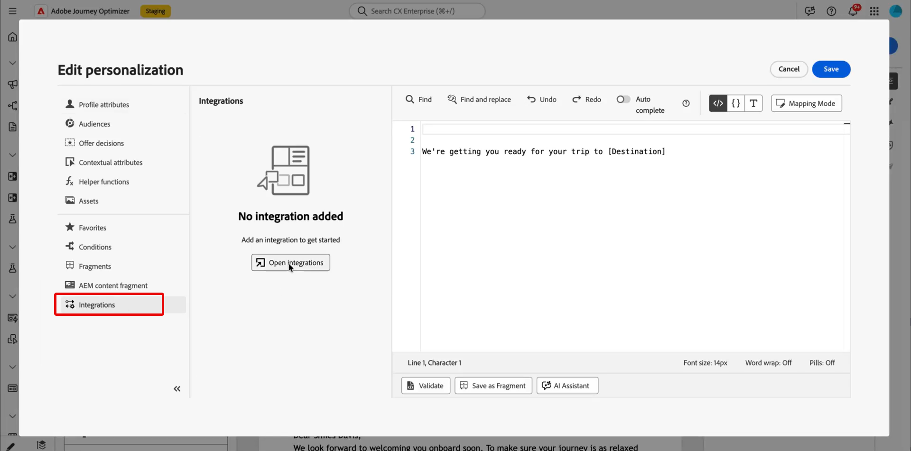
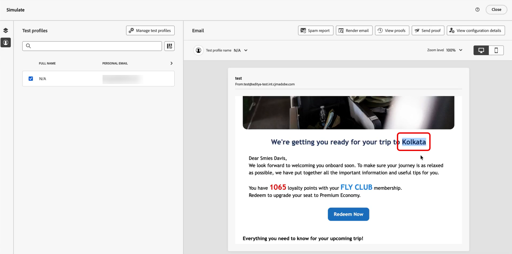

# Uso de integraciones externas para la personalización {#integrations-personalization}

Antes de usar integraciones externas en el contenido, confirme que un administrador ha **configurado y activado** cada integración (extremo, autenticación, directivas, carga de respuesta y activación) como se describe en [Trabajar con integraciones](integrations.md).

Puede agregar hasta **3** integraciones por **[!UICONTROL fragmento]** y hasta **5** en el mensaje. Las integraciones que solo provienen de fragmentos no se contabilizan en **5**.

## Aplicación de la personalización de la integración al contenido {#apply-integration-personalization}

Como experto en marketing, puede utilizar integraciones configuradas para personalizar el contenido. Siga estos pasos:

1. Acceda al contenido de su campaña y haga clic en **[!UICONTROL Agregar personalización]** desde su **[!UICONTROL Componentes]** de texto o HTML.

   [Más información sobre los componentes](../email/content-components.md)

   

1. Vaya a la sección **[!UICONTROL Integraciones]** y haga clic en **[!UICONTROL Abrir integraciones]** para ver todas las integraciones activas.

   Tenga en cuenta que **los fragmentos de Journey Optimizer** están disponibles con las integraciones, pero solo admiten canales salientes. Una vez publicado un fragmento, la adición y el guardado de nuevas integraciones están desactivados para evitar el impacto en los recorridos y campañas existentes.

   

1. Seleccione una integración y haga clic en **[!UICONTROL Guardar]**.

   

1. Habilite el modo **[!UICONTROL Pills]** para desbloquear el menú de integración avanzada.

   

1. Al crear la personalización de la integración, el asistente de integraciones incluye un campo **`required`** que define cómo interactúan los errores o la falta de datos con el contenido predeterminado:

   * **`required=true`** (predeterminado): se detiene el procesamiento de ese mensaje. El envío se excluye con **`ExternalDataLookupExclusion`** y esa exclusión se registra en el **conjunto de datos de comentarios del mensaje**.
   * **`required=false`**: la variable de resultado se establece en **`null`** y el procesamiento continúa. Utilice texto predeterminado, reserva o lógica condicional en la plantilla para que los perfiles no reciban contenido vacío cuando la integración no devuelva datos.

     

1. Para completar la configuración de la integración, defina los atributos de la integración, que se especificaron anteriormente durante [configuración](integrations.md#configure).

   Puede asignar valores a estos atributos mediante valores estáticos, que permanecen constantes, o atributos de perfil, que extraen información de forma dinámica de los perfiles de usuario.

   

1. Una vez definidos los atributos de integración, ahora puede usar los campos de integración en el contenido para mensajes personalizados haciendo clic en el icono .

   

   >[!NOTE]
   >
   >Los tokens de la plantilla solo deben utilizar campos que el administrador exponga en la configuración de la integración. Por ejemplo, `{{weatherResponse.temperature}}` es válido cuando se expone `temperature`; `{{weatherResponse.humidity}}` se rechaza en el editor si `humidity` no se expuso.

1. Haga clic en **[!UICONTROL Guardar]**.

La personalización de la integración ahora se aplica correctamente al contenido, lo que garantiza que cada destinatario reciba una experiencia relevante y adaptada en función de los atributos que haya configurado.

## Asignación de una llamada de API a otra {#map-integration-chain}

Puede encadenar integraciones para que los resultados de una llamada alimenten los siguientes, por ejemplo, segmentos de ruta, encabezados o parámetros de consulta. Las llamadas se ejecutan en orden en el mismo mensaje, lo que admite una personalización más completa sin código personalizado.

Antes de empezar, asegúrese de que:

* Un administrador ha configurado y activado todas las integraciones que necesita. Consulte [Configurar su integración](integrations.md).
* Los marcadores de posición de rutas de variables, los encabezados y los parámetros de consulta se configuran en la configuración de integración con etiquetas de orientación para expertos en marketing.
* El administrador expuso los campos de respuesta que necesita en la **[!UICONTROL carga de respuesta]** de cada integración para que aparezcan durante la creación.

El ejemplo siguiente utiliza una integración de reserva que devuelve un número de vuelo de la reserva del perfil y, a continuación, una integración de información de vuelo que utiliza ese número para el estado activo (retrasos, destino). Las entradas de la segunda integración se asignan a la respuesta de la primera llamada.

1. Abra el mensaje o el fragmento y abra el editor de personalización.

   

1. En **[!UICONTROL Integraciones]**, haga clic en **[!UICONTROL Abrir integraciones]**.

   

1. Añada la integración cuya respuesta alimente la siguiente llamada, por ejemplo, datos de reserva o reserva que incluyan el identificador de vuelo.

   

1. (Opcional) Abra el menú **[!UICONTROL Función de ayuda]** y agregue un asistente, por ejemplo, la función `Let`, si desea enlazar una variable con nombre a la respuesta de reserva.

   >[!NOTE]
   >
   > Solo están disponibles los campos expuestos en la **[!UICONTROL carga de respuesta]** definida por el administrador. No puede hacer referencia a propiedades que no se expusieron en la configuración.

1. Si utiliza una variable de ayuda, asigne esa variable al campo que devuelve la integración de reservas para su uso descendente, por ejemplo, el número de vuelo en la carga útil de reserva o pasajero.

   

1. En el menú **[!UICONTROL Abrir integraciones]**, agregue la segunda integración, por ejemplo, el estado de vuelo.

   

1. En la segunda integración, abra **[!UICONTROL Atributos de integración]**. Para cada entrada que debe reutilizar datos de la primera llamada, como una variable de ruta, un encabezado o un parámetro de consulta, seleccione un origen de asignación en la primera respuesta de integración.

   En la experiencia **[!UICONTROL Pills]**, puede asignar el resultado de la primera llamada directamente a la entrada de la segunda llamada sin una instrucción `Let`. Si utilizó `Let`, puede asignar a través de esa variable en su lugar.

   

1. Inserte tokens de la segunda integración en el contenido con el control , por ejemplo, el destino de la respuesta de información de vuelo.

   

1. Guarde el contenido.

En **[!UICONTROL Simulation]** o envío, Journey Optimizer ejecuta las integraciones en orden: la primera llamada utiliza el contexto de perfil configurado y el resultado genera la segunda solicitud. La ejecución de una integración determinada en el momento de la simulación o del envío depende de la configuración y del canal.

## Vídeo práctico {#video}

Este vídeo muestra cómo **Integraciones** conectan Adobe Journey Optimizer a API externas para que pueda extraer datos y contenido en directo en **canales salientes**, correo electrónico, SMS y push para una personalización más relevante.

>[!VIDEO](https://video.tv.adobe.com/v/3484118/?learn=on)
