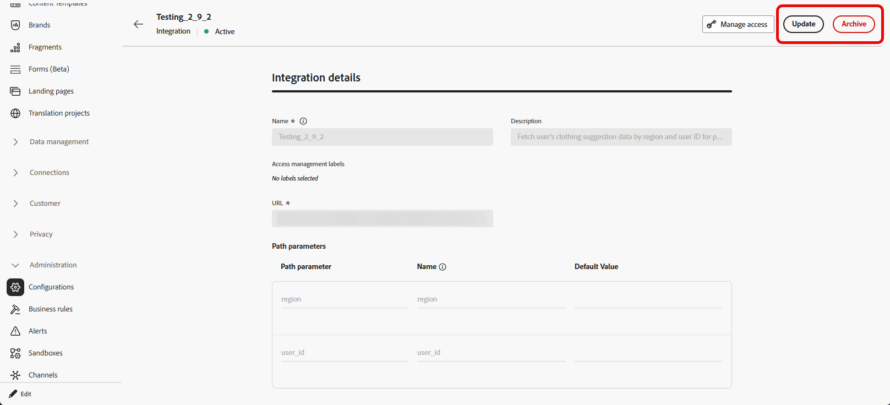

# Trabajo con integraciones {#external-sources}

>[!BEGINSHADEBOX]

**En esta página:** Descubra cómo los administradores configuran, prueban y activan integraciones externas que conectan Adobe Journey Optimizer a API de terceros para contenido dinámico y personalizado en canales salientes.

>[!ENDSHADEBOX]

## Información general

La característica **Integraciones** vincula Adobe Journey Optimizer con sistemas de terceros cuyos datos y contenido maquetable ya administra en otro sitio. Puede que aparezca ese material durante la creación y en el momento de envío, lo que admite experiencias más adaptables y personalizadas en los canales que utiliza en Journey Optimizer.

Puede utilizar esta función para acceder a datos externos y extraer contenido de herramientas de terceros, como:

* **Puntos de recompensa** de sistemas de fidelidad.
* **Información de precio** para productos.
* **Recomendaciones de productos** de motores de recomendación.
* A **Actualizaciones de logística** les gusta el estado de entrega.

Para empezar a usar integraciones, los usuarios deben tener los permisos **[!UICONTROL Administrar configuración de integración de AJO]** y **[!UICONTROL Ver configuración de integración de AJO]**. [Más información sobre los permisos](../administration/permissions.md)

+++ Obtenga información sobre cómo asignar permisos relacionados con integraciones

1. En el producto **[!UICONTROL Permisos]**, vaya a la pestaña **[!UICONTROL Funciones]** y seleccione la **[!UICONTROL Función]** que desee.

1. Haga clic en **[!UICONTROL Editar]** para modificar los permisos.

1. Agregue el recurso **[!UICONTROL Configuración de la integración de AJO]** y, a continuación, seleccione los permisos de integraciones correspondientes en el menú desplegable.

   

1. Haga clic en **[!UICONTROL Guardar]** para aplicar los cambios.

   Los permisos de los usuarios que ya estén asignados a esta función se actualizarán automáticamente.

1. Para asignar esta función a nuevos usuarios, vaya a la pestaña **[!UICONTROL Usuarios]** en el panel de control **[!UICONTROL Funciones]** y haga clic en **[!UICONTROL Añadir usuario]**.

1. Introduzca el nombre del usuario y su dirección de correo electrónico, o selecciónelo en la lista, y haga clic en **[!UICONTROL Guardar]**.

Si el usuario no se creó anteriormente, consulte [esta documentación](https://experienceleague.adobe.com/es/docs/experience-platform/access-control/abac/permissions-ui/users).

+++

## Configuración de la integración {#configure}

>[!AVAILABILITY]
>
> Esta función de integración está restringida a canales salientes (correo electrónico, SMS y push) y admite la extracción de JSON o HTML.

Como administrador, puede configurar integraciones externas siguiendo estos pasos:

1. Vaya a la sección **[!UICONTROL Configuraciones]** del menú de la izquierda y haga clic en **[!UICONTROL Administrar]** desde la tarjeta **[!UICONTROL Integraciones]**.

   A continuación, haga clic en **[!UICONTROL Crear integración]** para iniciar una nueva configuración.

   

1. Opcionalmente, pegue un comando **cURL** para rellenar automáticamente la dirección URL, el método HTTP, los encabezados y los parámetros de consulta.

1. Proporcione un **[!UICONTROL Nombre]** y una **[!UICONTROL Descripción]** para su integración.

   >[!NOTE]
   >
   >El campo **[!UICONTROL Nombre]** no puede contener espacios.

1. Escriba el extremo de API **[!UICONTROL URL]**.

   Para las variables de ruta de acceso, ajuste una etiqueta entre llaves dobles en la dirección URL, por ejemplo, `https://api.example.com/v1/products/{{productId}}`, y después establezca cada marcador de posición en **[!UICONTROL Plantilla de ruta de acceso]**.

1. Configure la **[!UICONTROL Plantilla de ruta]** con **[!UICONTROL Nombre]** y **[!UICONTROL Valor predeterminado]** para cada marcador de posición que agregó en la dirección URL.

   Tenga en cuenta que **[!UICONTROL Name]** es una etiqueta orientada al especialista en marketing solo en el editor; no se envía en la solicitud de API.

   

1. Seleccione el **[!UICONTROL método HTTP]** entre GET y POST.

1. Haga clic en **[!UICONTROL Agregar encabezado]** o en **[!UICONTROL Agregar parámetros de consulta]** según sea necesario para la integración. Proporcione los siguientes detalles para cada parámetro:

   * **[!UICONTROL Parámetro]**: El nombre real del encabezado o del parámetro de consulta que espera la API.

   * **[!UICONTROL Name]**: una etiqueta compatible con el especialista en marketing para este parámetro, los autores la seleccionan al asignar valores en las campañas.

   * **[!UICONTROL Tipo]**: elige **Constante** para un valor fijo o **Variable** para entrada dinámica.

   * **[!UICONTROL Valor]**: escriba el valor directamente para las constantes o seleccione una asignación de variables.

   * **[!UICONTROL Obligatorio]**: especifique si este parámetro es necesario. Para los parámetros **[!UICONTROL Variable]** obligatorios, si no se resuelve ningún valor en tiempo de ejecución y no se proporciona ningún valor predeterminado, la generación de solicitudes falla con un error y no se realiza la llamada de API saliente.

   

1. Elija un **[!UICONTROL tipo de autenticación]**:

   * **[!UICONTROL Sin autenticación]**: Para las API abiertas que no requieren credenciales.

   * **[!UICONTROL clave de API]**: autentique solicitudes con una clave de API estática. Escriba su **[!UICONTROL Nombre de clave API]**, **[!UICONTROL Valor de clave API]** y especifique su **[!UICONTROL ubicación]**.

   * **[!UICONTROL Autenticación básica]**: use la autenticación básica estándar de HTTP. Escriba **[!UICONTROL Nombre de usuario]** y **[!UICONTROL Contraseña]**.

   * **[!UICONTROL OAuth 2.0]**: realice la autenticación mediante el protocolo OAuth 2.0. Haga clic en el icono  para configurar o actualizar la **[!UICONTROL carga útil]**.

   

1. Establezca la **[!UICONTROL configuración de directiva]**, como el período de **[!UICONTROL tiempo de espera]** para las solicitudes de API, y elija habilitar la restricción, la caché o reintentar.

   >[!NOTE]
   >
   >Con la restricción habilitada, las tasas admitidas son de 50 a 5000 TPS. Los límites se aplican a la **integración**, no a cada extremo de API.
   >
   >Con el reintento habilitado, otros errores se reintentarán **tres** veces de forma predeterminada, con **200 ms**, **400 ms** y **800 ms** entre intentos.

1. Con el campo **[!UICONTROL Carga de respuesta]**, puede decidir qué campos de la salida de ejemplo se deben utilizar para la personalización de mensajes.

   Haga clic en el icono  y pegue una carga útil de respuesta JSON de muestra para detectar automáticamente los tipos de datos.

1. Elija los campos que desea exponer para la personalización y especifique sus tipos de datos correspondientes.

   

   >[!NOTE]
   >
   >La configuración **[!UICONTROL Carga de respuesta]** define la respuesta esperada para la creación, incluido cualquier esquema aplicado en ese paso. Los especialistas en marketing solo pueden hacer referencia a campos expuestos, los tokens de otras rutas no superan la validación en el editor.

1. Use **[!UICONTROL Enviar conexión de prueba]** para validar la integración. [Más información sobre cómo probar tu conexión](#connection)

   Una vez validado, haga clic en **[!UICONTROL Activar]**.

1. Acceda a la integración recién creada para:

   * **Actualización**: cambia los detalles de **Autenticación** y la **configuración de directiva** solamente. Las actualizaciones se aplican a recorridos en directo y campañas. Antes de guardar los cambios, usa el menú **[!UICONTROL Explorar referencias]** para confirmar dónde se usa la integración.
   * **Archivo**: Archive una configuración de integración.

   

Después de la activación, haz clic en el icono  para acceder al menú **[!UICONTROL Explorar referencias]** y revisar el uso de esta configuración, incluidos los recorridos y las campañas que dependen de ella.

### Límites y comportamiento del tiempo de envío {#configure-send-time}

En el momento del envío, las respuestas de la API externa pueden ser de hasta **4 MB** de forma predeterminada. Cualquier elemento de mayor tamaño se trata como un error de integración y no se intentan **reintentos** cuando el error se debe al tamaño de la respuesta.

Las llamadas respetan la tasa de regulación **throttling** que configuró: las programaciones de Journey Optimizer intentan alcanzar ese límite incluso cuando el sistema externo está inactivo o devuelve errores. Si **cache** está habilitado, solo se almacenan y reutilizan **las respuestas correctas** hasta que la caché **TTL** que definió caduque; las respuestas con errores nunca se almacenan en caché.

Cada mensaje en cola también lleva un período de validez (TTL). Si el procesamiento se retrasa y un mensaje pasa por esa ventana, el sistema **lo descarta** y emite un evento **`MessageValidityExclusion`**, de modo que el trabajo obsoleto se borra de la cola y los recursos permanecen disponibles.

## Prueba de la conexión {#connection}

**[!UICONTROL Enviar conexión de prueba]** valida la dirección URL del extremo, la autenticación y la estructura de solicitudes con la API de destino antes de la activación, lo que reduce el riesgo de errores de tiempo de ejecución durante el procesamiento de mensajes.

1. Cuando se definan la dirección URL, el método HTTP, los encabezados y los parámetros de consulta, haga clic en **[!UICONTROL Enviar conexión de prueba]** para ejecutar una prueba de conectividad y confirmar la configuración.

1. En el cuadro de diálogo **[!UICONTROL Enviar conexión de prueba]**, escriba valores predeterminados para cualquier marcador de posición de **[!UICONTROL Variable]** en la ruta de acceso de la dirección URL, los encabezados y los parámetros de consulta.

   Estos valores se incluyen en la solicitud de prueba. Journey Optimizer invoca el extremo e informa de si la conexión se realizó correctamente o no.

   

1. Si la prueba devuelve una respuesta correcta, seleccione **[!UICONTROL Usar como carga útil de respuesta]** para copiar el cuerpo de respuesta en el campo **[!UICONTROL Carga útil de respuesta]**; consulte el paso 10 en [Configurar la integración](#configure), donde se pueden detectar tipos de datos y se pueden seleccionar campos para la personalización.

   

1. Si la prueba no se realiza correctamente, expanda la lista desplegable **[!UICONTROL Error]** para revisar los detalles del error, actualice la configuración de la integración según sea necesario y ejecute **[!UICONTROL Enviar conexión de prueba]** de nuevo.

   

Una vez que la prueba se haya realizado correctamente, seleccione **[!UICONTROL Activar]** en la configuración de la integración. Consulte [Configurar su integración](#configure).

