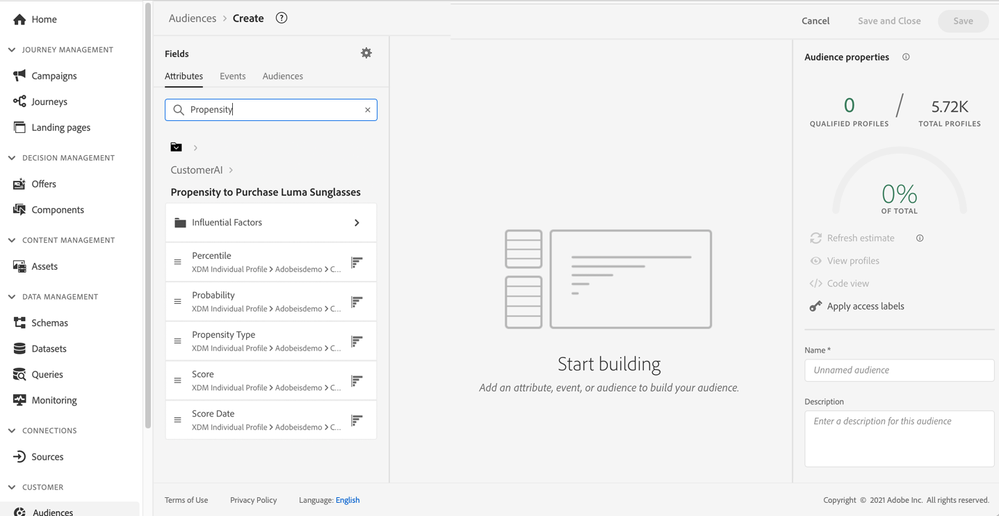

# Integración con servicios inteligentes {#ai-overview}

>[!BEGINSHADEBOX]

**En esta página:** Aprenda a integrar los servicios inteligentes de Adobe y las predicciones de inteligencia artificial aplicada al cliente con Journey Optimizer para utilizar las puntuaciones de pérdida y conversión como atributos de perfil para la toma de decisiones, las acciones y la creación de segmentos.

>[!ENDSHADEBOX]

La integración con **[!DNL Adobe Intelligent Services]** le permite aprovechar la inteligencia artificial y el aprendizaje automático para casos prácticos de experiencias del cliente. Esto permite a los analistas de marketing formular predicciones adaptadas a las necesidades de una empresa mediante configuraciones empresariales sin necesidad de tener conocimientos de ciencia de datos.

[!DNL Intelligent Services], creado en [!DNL Adobe Experience Platform], proporciona IA como servicio para los equipos de experiencia del cliente. Ayuda a predecir el comportamiento de los clientes, medir el impacto de las campañas y mejorar la rentabilidad de la inversión. Para obtener más información, consulte la [[!DNL Adobe Experience Platform] documentación](https://experienceleague.adobe.com/docs/experience-platform/intelligent-services/home.html){target="_blank"}.

La integración entre [!DNL Journey Optimizer] y [!DNL Intelligent Services] le permite aprovechar las predicciones de los clientes.

Inteligencia artificial aplicada al cliente, un componente de [!DNL Adobe Intelligent Services], predice las acciones probables del cliente. Consulte la [[!DNL Adobe Experience Platform] documentación](https://experienceleague.adobe.com/docs/experience-platform/intelligent-services/customer-ai/overview.html){target="_blank"}.

La inteligencia artificial aplicada al cliente permite a las marcas crear puntuaciones de aprendizaje automático de pérdida o conversión. Estas puntuaciones están disponibles como atributos de perfil en perfiles [!DNL Adobe Experience Platform] (Perfil del cliente en tiempo real).

Como resultado, estos atributos se pueden utilizar como cualquier otro atributo de perfil en Journey Optimizer. Utilícelos en condiciones para la toma de decisiones, acciones o creación de segmentos.

+++ Referencia de conocimientos de AI

Esta sección contiene conocimientos estructurados destinados a apoyar la interpretación, la recuperación y la respuesta a preguntas relacionadas con este tema.

Para una comprensión completa, esta información debe combinarse con la documentación de esta página. Ninguna de las fuentes pretende ser independiente; la página describe la función, mientras que esta sección proporciona contexto adicional que ayuda a desambiguar la terminología, la intención, la aplicabilidad y las restricciones.

- **TL;DR:** En esta página se explica cómo Journey Optimizer se integra con los servicios inteligentes de Adobe, específicamente la inteligencia artificial aplicada al cliente, para aprovechar las puntuaciones de tendencia basadas en el aprendizaje automático como atributos de perfil en recorrido.

**Intenciones:**
- Comprender cómo Adobe Intelligent Services se integra con Journey Optimizer
- Uso de puntuaciones de tendencia de inteligencia artificial aplicada al cliente como atributos de perfil en acciones o condiciones de recorrido
- Habilite predicciones impulsadas por IA para la pérdida o conversión sin requerir experiencia en ciencia de datos
- Aplicar puntuaciones de aprendizaje automático a la creación de segmentos en Journey Optimizer

**Glosario:**
- **Servicios inteligentes de Adobe**: Un conjunto de servicios de inteligencia artificial y aprendizaje automático basados en Adobe Experience Platform que permiten predecir la experiencia del cliente sin necesidad de tener conocimientos de ciencia de datos *(específicos del producto)*
- **Inteligencia artificial aplicada al cliente**: componente de Adobe Intelligent Services que genera puntuaciones de tendencia a la pérdida o conversión basadas en aprendizaje automático para los perfiles de cliente *(específicos del producto)*
- **Puntuación de tendencia**: una puntuación basada en aprendizaje automático que representa la probabilidad de que un cliente realice una acción específica (por ejemplo, una pérdida o conversión), almacenada como un atributo de perfil *(específico del producto)*

**Protecciones:**
- No se requiere experiencia en ciencia de datos, pero los analistas de marketing deben completar la configuración de nivel empresarial
- Las puntuaciones de inteligencia artificial aplicada al cliente deben configurarse primero en Adobe Experience Platform antes de que estén disponibles como atributos de perfil en Journey Optimizer

**Terminología:**
- Nombre canónico: Adobe Intelligent Services — Acrónimo: none — variantes: Intelligent Services, AI services
- Nombre canónico: Customer AI — Acrónimo: none — variantes: puntuaciones de Customer AI, puntuaciones de tendencia
- Sinónimos: &quot;puntuación de pérdida&quot; = &quot;tendencia de pérdida&quot; ; &quot;puntuación de conversión&quot; = &quot;tendencia de conversión&quot;
- No confunda: &quot;Adobe Intelligent Services&quot; ≠ &quot;AI Assistant&quot; (Intelligent Services es una plataforma ML predictiva; AI Assistant es una interfaz conversacional)

**PREGUNTAS MÁS FRECUENTES:**
- **Q: ¿Qué es la inteligencia artificial aplicada al cliente en el contexto de Journey Optimizer?** — Inteligencia artificial aplicada al cliente es un componente de servicios inteligentes de Adobe que crea puntuaciones de pérdida o conversión basadas en aprendizaje automático, que están disponibles como atributos de perfil utilizables en condiciones, acciones y creación de segmentos de Journey Optimizer.
- **Q: ¿Necesito habilidades en ciencia de datos para usar Adobe Intelligent Services?** — No, los analistas de marketing pueden configurar predicciones mediante configuraciones de nivel empresarial sin requerir experiencia en ciencia de datos.
- **Q: ¿Dónde se almacenan las puntuaciones de inteligencia artificial aplicada al cliente?** — Se almacenan como atributos de perfil en el Perfil del cliente en tiempo real de Adobe Experience Platform, lo que hace que sean accesibles como cualquier otro atributo de perfil de Journey Optimizer.
- **Q: ¿Cómo puedo usar las puntuaciones de inteligencia artificial aplicada al cliente en un recorrido?** — Una vez disponibles como atributos de perfil, las puntuaciones se pueden utilizar en condiciones para la toma de decisiones, en configuraciones de acción o para crear segmentos de audiencia.

+++
