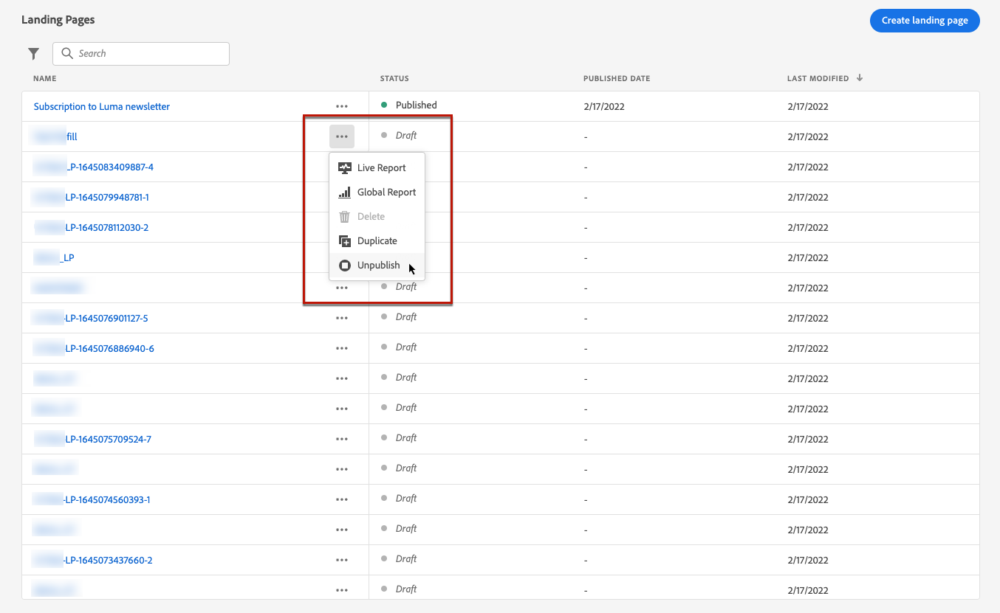
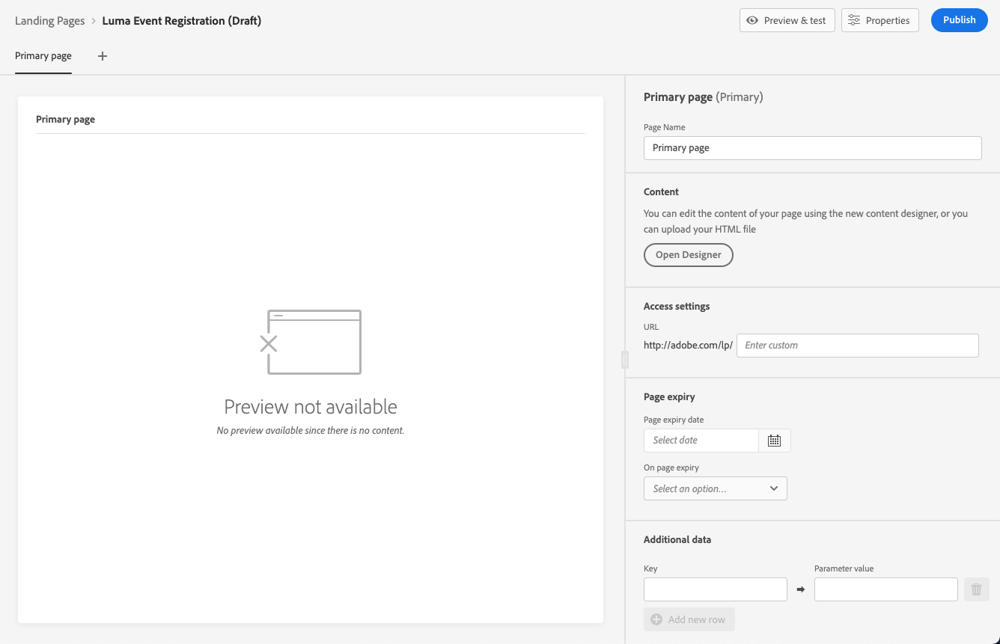
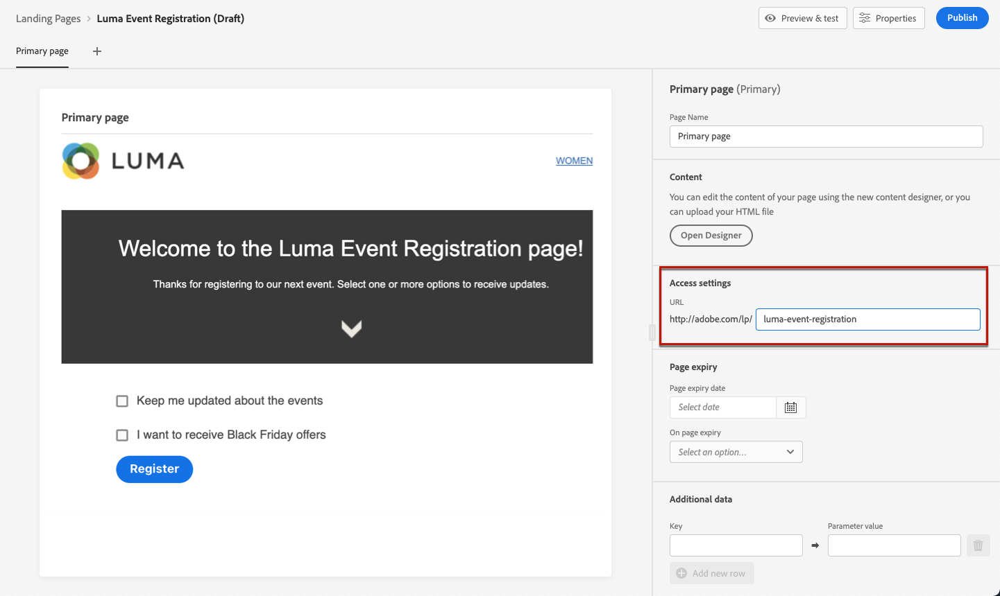
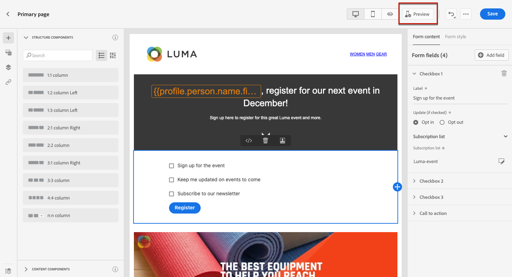

# Creación y publicación de páginas de aterrizaje {#create-lp}

## Acceso a las páginas de aterrizaje {#access-landing-pages}

Para acceder a la lista de páginas de aterrizaje, seleccione **[!UICONTROL Journey Management]** > **[!UICONTROL Landing pages]** en el menú de la izquierda.

La variable **[!UICONTROL Landing Pages]** muestra todos los elementos creados. Puede filtrarlos en función de su estado o fecha de modificación.

Desde esta lista puede acceder a la [informes de página de aterrizaje](lp-report.md) para elementos publicados.

También puede eliminar, duplicar y cancelar la publicación de una página de aterrizaje.

>[!CAUTION]
>
>Si cancela la publicación de una página de aterrizaje a la que se hace referencia en un mensaje sin publicar, el mensaje no se podrá publicar hasta que se vuelva a publicar la página de aterrizaje. Si el mensaje ya se ha publicado, el vínculo a la página de aterrizaje se romperá y se mostrará una página de error.

Haga clic en los tres puntos junto a una página de aterrizaje para seleccionar la acción que desee.

>[!NOTE]
>
>No puede eliminar una página de aterrizaje publicada. Para eliminarlo, primero debe cancelar la publicación.

## Creación de una página de destino {#create-landing-page}

Los pasos para crear una página de aterrizaje son los siguientes:

1. En la lista de páginas de aterrizaje, haga clic en **[!UICONTROL Create landing page]**.

   

1. Añada un título. Puede agregar una descripción si es necesario.

   

1. Seleccione un ajuste preestablecido. Aprenda a crear ajustes preestablecidos de página de aterrizaje en [esta sección](../configuration/lp-configuration.md#lp-create-preset).

   

1. Haga clic en **[!UICONTROL Create]**.

1. Se muestra la página principal y sus propiedades. Obtenga información sobre cómo configurar la configuración de la página principal [here](#configure-primary-page).

   

1. Haga clic en el icono + para añadir una subpágina. Obtenga información sobre cómo configurar las opciones de subpágina [here](#configure-subpages).

   

Una vez que haya configurado y diseñado el [página principal](#configure-primary-page)y [subpáginas](#configure-subpages) si hay alguno, puede [prueba](#test-landing-page) y [publicar](#publish-landing-page) su página de aterrizaje.

## Configuración de la página principal {#configure-primary-page}

La página principal es la página que se muestra inmediatamente a los usuarios después de hacer clic en el vínculo de la página de aterrizaje, por ejemplo, desde un correo electrónico o un sitio web.

Para definir la configuración de la página principal, siga los pasos a continuación.

1. Puede cambiar el nombre de la página, que es **[!UICONTROL Primary page]** de forma predeterminada.

1. Edite el contenido de la página con el diseñador de contenido. Obtenga información sobre cómo definir el contenido de una página de aterrizaje [here](design-lp.md).

   

1. Defina la dirección URL de la página de aterrizaje. La primera parte de la dirección URL requiere que haya configurado previamente un subdominio de página de aterrizaje. [Más información](../configuration/lp-configuration.md#lp-subdomains)

   >[!CAUTION]
   >
   >La dirección URL de la página de aterrizaje debe ser única.

   

1. Puede definir una fecha de caducidad para la página. En ese caso, debe seleccionar una acción al expirar la página:

   * **[!UICONTROL Redirect URL]**: Introduzca la dirección URL de la página a la que se redirigirá a los usuarios cuando caduque la página.
   * **[!UICONTROL Custom page]**: [Configurar una subpágina](#configure-subpages) y selecciónela en la lista desplegable que se muestra.
   * **[!UICONTROL Browser error]**: Escriba el texto del error que se mostrará en lugar de la página.

   

   <!--1. In the **[!UICONTROL Additional data]** section, define a **[!UICONTROL Key]** and the corresponding **[!UICONTROL Parameter value]**. // you can define how the data entered in the landing page is managed once it has been submitted by a user??-->

1. Si ha seleccionado una o varias listas de suscripción al [diseño de la página principal](design-lp.md), se muestran en el **[!UICONTROL Subscription list]** para obtener más información.

   

1. Desde la página de aterrizaje, puede [crear un recorrido](../building-journeys/journey-gs.md#jo-build) que enviará un mensaje de confirmación a los usuarios cuando envíen el formulario. Aprenda a crear un recorrido de este tipo al final de esto [caso de uso](lp-use-cases.md#subscription-to-a-service).

   

   Haga clic en **[!UICONTROL Create journey]** para ser redirigido a la función **[!UICONTROL Journey Management]** > **[!UICONTROL Journeys]** lista.

## Configurar subpáginas {#configure-subpages}

Se pueden agregar hasta dos subpáginas. Por ejemplo, puede crear una página de agradecimiento que se mostrará una vez que los usuarios envíen el formulario, y puede definir una página de error a la que se llamará si se produce un problema con la página de aterrizaje.

Para definir la configuración de la subpágina, siga los pasos a continuación.

1. Puede cambiar el nombre de la página, que es **[!UICONTROL Subpage 1]** de forma predeterminada.

1. Edite el contenido de la página con el diseñador de contenido. Obtenga información sobre cómo definir el contenido de una página de aterrizaje [here](design-lp.md).

1. Defina la dirección URL de la página de aterrizaje. La primera parte de la dirección URL requiere que se realice la delegación de dominios. Está precargada y no se puede editar a través de la interfaz de usuario. Para configurarlo, póngase en contacto con su representante de cuentas de Adobe o con el [Equipo de asistencia al servicio de atención al cliente de Adobe](https://helpx.adobe.com/es/enterprise/admin-guide.html/enterprise/using/support-for-experience-cloud.ug.html){target=&quot;_blank&quot;}.

   >[!CAUTION]
   >
   >La dirección URL de la página de aterrizaje debe ser única.

## Prueba de la página de aterrizaje {#test-landing-page}

Una vez que se hayan definido la configuración y el contenido de la página de aterrizaje, puede utilizar perfiles de prueba para previsualizarlos. Si ha insertado [contenido personalizado](../personalization/personalize.md), podrá comprobar cómo se muestra este contenido en la página de aterrizaje, aprovechando los datos de perfil de prueba.

>[!CAUTION]
>
>Debe tener perfiles de prueba disponibles para poder previsualizar los mensajes y enviar pruebas. Obtenga información sobre cómo [crear perfiles de prueba](../building-journeys/creating-test-profiles.md).

1. En la interfaz de la página de aterrizaje, haga clic en el **[!UICONTROL Preview & test]** para acceder a la selección de perfil de prueba.

   

   >[!NOTE]
   >
   >La variable **[!UICONTROL Preview]** también es accesible desde el diseñador de contenido.

1. En el **[!UICONTROL Preview & test]** seleccione uno o varios perfiles de prueba.

   

   Los pasos para seleccionar perfiles de prueba son los mismos que al probar un mensaje. Se detallan en [esta sección](../messages/preview.md#select-test-profiles).

1. Seleccione el **[!UICONTROL Preview]** y haga clic en **[!UICONTROL Open preview]** para probar la página de aterrizaje.

   

1. La vista previa de la página de aterrizaje se abre en una pestaña nueva. Los elementos personalizados se sustituyen por los datos de perfil de prueba seleccionados.

   

1. Seleccione otros perfiles de prueba para previsualizar la renderización de cada variante de la página de aterrizaje.

## Comprobación de alertas {#check-alerts}

Mientras crea la página de aterrizaje, las alertas le avisan cuando necesita realizar acciones importantes antes de publicarla.

Las alertas se muestran en la parte superior derecha de la pantalla, como se muestra a continuación:

>[!NOTE]
>
>Si no ve este botón, no se ha detectado ninguna alerta.

Pueden producirse dos tipos de alertas:

* **Advertencias** consulte recomendaciones y prácticas recomendadas. <!--For example, a message will display if -->

* **Errores** impida la publicación del mensaje mientras no se resuelvan. Por ejemplo, recibirá una advertencia si falta la dirección URL de la página principal.

<!--All possible warnings and errors are detailed [below](#alerts-and-warnings).-->

>[!CAUTION]
>
> Debe resolver todo **error** alertas antes de la publicación.

<!--The settings and elements checked by the system are listed below. You will also find information on how to adapt your configuration to resolve the corresponding issues.

**Warnings**:

* 

**Errors**:

* 

>[!CAUTION]
>
> To be able to publish your message, you need to resolve all **error** alerts.
-->

## Publicación de la página de aterrizaje {#publish-landing-page}

Una vez que la página de aterrizaje esté lista, puede publicarla para que esté disponible para su uso en un mensaje.

>[!CAUTION]
>
>Antes de publicar, compruebe y resuelva las alertas. [Más información](#check-alerts)

Una vez publicada la página de aterrizaje, se añade a la lista de páginas de aterrizaje con la variable **[!UICONTROL Published]** estado.

Ahora está activo y listo para utilizarse en un [!DNL Journey Optimizer] [message](../messages/create-message.md) que se enviará a través de un [recorrido](../building-journeys/journey.md).

>[!NOTE]
>
>Puede controlar el impacto de la página de aterrizaje mediante informes específicos. [Más información](lp-report.md)

