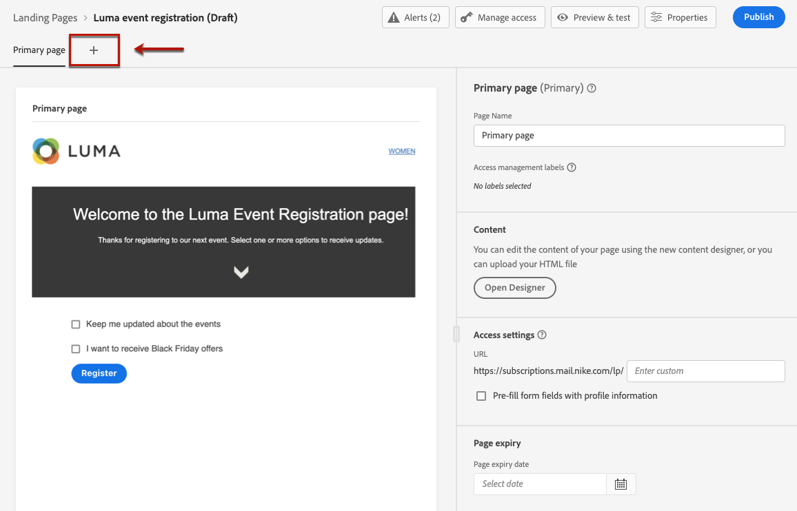
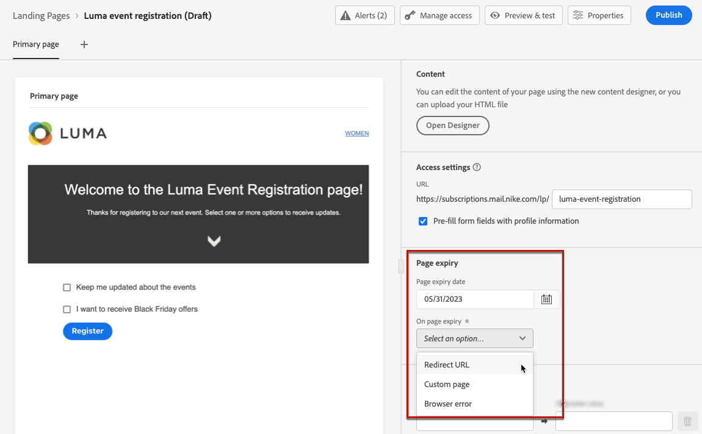

# Creación y publicación de páginas de aterrizaje {#create-lp}

## Acceso a las páginas de aterrizaje {#access-landing-pages}

Para acceder a la lista de páginas de aterrizaje, seleccione **[!UICONTROL Administración de recorridos]** > **[!UICONTROL Páginas de aterrizaje]** en el menú de la izquierda.

La variable **[!UICONTROL Páginas de aterrizaje]** muestra todos los elementos creados. Puede filtrarlos en función de su estado o fecha de modificación.

Desde esta lista puede acceder a la [informe de lanzamiento de la página de aterrizaje](../reports/lp-report-live.md) o [Informe global de la página de aterrizaje](../reports/lp-report-global.md) para elementos publicados.

También puede eliminar, duplicar y cancelar la publicación de una página de aterrizaje.

>[!CAUTION]
>
>Si cancela la publicación de una página de aterrizaje a la que se hace referencia en un mensaje, el vínculo a la página de aterrizaje se romperá y se mostrará una página de error.

Haga clic en los tres puntos junto a una página de aterrizaje para seleccionar la acción que desee.

>[!NOTE]
>
>No se puede eliminar un [publicado](#publish-landing-page) página de aterrizaje. Para eliminarlo, primero debe cancelar la publicación.

## Creación de una página de aterrizaje {#create-landing-page}

>[!CONTEXTUALHELP]
>id="ajo_lp_create"
>title="Definir y configurar la página de aterrizaje"
>abstract="Para crear una página de aterrizaje, debe seleccionar un ajuste preestablecido, configurar la página principal y las subpáginas y, por último, probar la página antes de publicarla."
>additional-url="https://experienceleague.adobe.com/docs/journey-optimizer/using/configuration/lp-configuration/lp-presets.html#lp-create-preset" text="Crear ajustes preestablecidos de página de aterrizaje"
>additional-url="https://experienceleague.adobe.com/docs/journey-optimizer/using/landing-pages/create-lp.html#publish-landing-page" text="Publicación de la página de aterrizaje"

>[!CONTEXTUALHELP]
>id="ajo_lp_access_management_labels"
>title="Asignar etiquetas a la página de aterrizaje"
>abstract="Para proteger los recursos digitales confidenciales, puede definir autorizaciones para administrar el acceso a los datos a la página de aterrizaje mediante etiquetas."
>additional-url="https://experienceleague.adobe.com/docs/journey-optimizer/using/access-control/object-based-access.html" text="Crear ajustes preestablecidos de página de aterrizaje"

Los pasos para crear una página de aterrizaje son los siguientes:

1. En la lista de páginas de aterrizaje, haga clic en **[!UICONTROL Crear página de aterrizaje]**.

   

1. Añada un título. Puede agregar una descripción si es necesario.

   

1. Para asignar etiquetas de uso de datos principales o personalizadas a la página de aterrizaje, seleccione **[!UICONTROL Administrar acceso]**. [Más información sobre Control de acceso a nivel de objeto (OLAC)](../administration/object-based-access.md)

   <!--You can add a tag. See AEP documentation?-->

1. Seleccione un ajuste preestablecido. Aprenda a crear ajustes preestablecidos de página de aterrizaje en [esta sección](../configuration/lp-presets.md#lp-create-preset).

   

1. Haga clic en **[!UICONTROL Crear]**.

1. Se muestra la página principal y sus propiedades. Obtenga información sobre cómo configurar la configuración de la página principal [here](#configure-primary-page).

   

1. Haga clic en el icono + para añadir una subpágina. Obtenga información sobre cómo configurar las opciones de subpágina [here](#configure-subpages).

   

Una vez que haya configurado y diseñado el [página principal](#configure-primary-page)y [subpáginas](#configure-subpages) si hay alguno, puede [prueba](#test-landing-page) y [publicar](#publish-landing-page) su página de aterrizaje.

## Configuración de la página principal {#configure-primary-page}

>[!CONTEXTUALHELP]
>id="ajo_lp_primary_page"
>title="Definir la configuración de la página principal"
>abstract="La página principal se muestra inmediatamente a los usuarios después de hacer clic en el vínculo a la página de aterrizaje, por ejemplo, desde un correo electrónico o un sitio web."
>additional-url="https://experienceleague.adobe.com/docs/journey-optimizer/using/landing-pages/landing-pages-design/design-lp.html" text="Diseño del contenido de la página de aterrizaje"

>[!CONTEXTUALHELP]
>id="ajo_lp_access_settings"
>title="Definir la dirección URL de la página de aterrizaje"
>abstract="En esta sección, defina una dirección URL de página de aterrizaje única. La primera parte de la dirección URL requiere que haya configurado previamente un subdominio de página de aterrizaje como parte del ajuste preestablecido que ha seleccionado."
>additional-url="https://experienceleague.adobe.com/docs/journey-optimizer/using/configuration/lp-configuration/lp-subdomains.html" text="Configurar subdominios de página de aterrizaje"
>additional-url="https://experienceleague.adobe.com/docs/journey-optimizer/using/configuration/lp-configuration/lp-presets.html#lp-create-preset" text="Crear ajustes preestablecidos de página de aterrizaje"

La página principal es la página que se muestra inmediatamente a los usuarios después de hacer clic en el vínculo de la página de aterrizaje, por ejemplo, desde un correo electrónico o un sitio web.

Para definir la configuración de la página principal, siga los pasos a continuación.

1. Puede cambiar el nombre de la página, que es **[!UICONTROL Página principal]** de forma predeterminada.

1. Edite el contenido de la página con el diseñador de contenido. Obtenga información sobre cómo definir el contenido de una página de aterrizaje [here](design-lp.md).

   

1. Defina la dirección URL de la página de aterrizaje. La primera parte de la dirección URL requiere que haya configurado previamente un subdominio de página de aterrizaje como parte del [ajuste preestablecido](../configuration/lp-presets.md#lp-create-preset) ha seleccionado. [Más información](../configuration/lp-subdomains.md)

   >[!CAUTION]
   >
   >La dirección URL de la página de aterrizaje debe ser única.

   

   >[!NOTE]
   >
   >No puede acceder a la página de aterrizaje simplemente copiando y pegando esta dirección URL en un navegador web, aunque se publique. En su lugar, puede probarlo con la función de vista previa como se describe en [esta sección](#test-landing-page).

1. Si desea que la página de aterrizaje precargue los datos del formulario que ya están disponibles, seleccione la opción **[!UICONTROL Rellenar previamente los campos del formulario con información de perfil]**.

   

   Cuando esta opción está habilitada, si un perfil ya ha elegido entrar o salir o ya se ha agregado a una lista de suscripción, sus opciones se reflejarán al mostrar la página de aterrizaje.

   Por ejemplo, si un perfil ha elegido recibir comunicaciones sobre eventos futuros, la próxima vez que se muestre la página de aterrizaje en ese perfil se seleccionará la casilla correspondiente.

   

1. Puede definir una fecha de caducidad para la página. En ese caso, debe seleccionar una acción al expirar la página:

   * **[!UICONTROL Dirección URL de redireccionamiento]**: Introduzca la dirección URL de la página a la que se redirigirá a los usuarios cuando caduque la página.
   * **[!UICONTROL Página personalizada]**: [Configurar una subpágina](#configure-subpages) y selecciónela en la lista desplegable que se muestra.
   * **[!UICONTROL Error del explorador]**: Escriba el texto del error que se mostrará en lugar de la página.

   

1. En el **[!UICONTROL Datos adicionales]** , defina una o más claves y sus correspondientes valores de parámetro. Podrá aprovechar estas claves en el contenido de su página principal y de las subpáginas mediante el uso de [Editor de expresiones](../personalization/personalization-build-expressions.md). Obtenga más información en [esta sección](lp-content.md#use-form-component#use-additional-data).

   

1. Si ha seleccionado una o varias listas de suscripción al [diseño de la página principal](design-lp.md), se muestran en el **[!UICONTROL Lista de suscripciones]** para obtener más información.

   

1. Desde la página de aterrizaje, puede [crear un recorrido](../building-journeys/journey-gs.md#jo-build) que enviará un mensaje de confirmación a los usuarios cuando envíen el formulario. Aprenda a crear un recorrido de este tipo al final de esto [caso de uso](lp-use-cases.md#subscription-to-a-service).

   

   Haga clic en **[!UICONTROL Crear recorrido]** para ser redirigido a la función **[!UICONTROL Administración de recorridos]** > **[!UICONTROL Recorridos]** lista.

## Configurar subpáginas {#configure-subpages}

>[!CONTEXTUALHELP]
>id="ajo_lp_subpage"
>title="Definir la configuración de la subpágina"
>abstract="Se pueden agregar hasta dos subpáginas. Por ejemplo, puede crear una página de agradecimiento que se mostrará una vez que los usuarios envíen el formulario, y puede definir una página de error a la que se llamará si se produce un problema con la página de aterrizaje."
>additional-url="https://experienceleague.adobe.com/docs/journey-optimizer/using/landing-pages/landing-pages-design/design-lp.html" text="Diseño del contenido de la página de aterrizaje"

>[!CONTEXTUALHELP]
>id="ajo_lp_access_settings-subpage"
>title="Definir la dirección URL de la página de aterrizaje"
>abstract="En esta sección, defina una dirección URL de página de aterrizaje única. La primera parte de la dirección URL requiere que haya configurado previamente un subdominio de página de aterrizaje como parte del ajuste preestablecido que ha seleccionado."
>additional-url="https://experienceleague.adobe.com/docs/journey-optimizer/using/configuration/lp-configuration/lp-subdomains.html" text="Configurar subdominios de página de aterrizaje"
>additional-url="https://experienceleague.adobe.com/docs/journey-optimizer/using/configuration/lp-configuration/lp-presets.html#lp-create-preset" text="Crear ajustes preestablecidos de página de aterrizaje"

Se pueden agregar hasta dos subpáginas. Por ejemplo, puede crear una página de agradecimiento que se mostrará una vez que los usuarios envíen el formulario, y puede definir una página de error a la que se llamará si se produce un problema con la página de aterrizaje.

Para definir la configuración de la subpágina, siga los pasos a continuación.

1. Puede cambiar el nombre de la página, que es **[!UICONTROL Subpágina 1]** de forma predeterminada.

1. Edite el contenido de la página con el diseñador de contenido. Obtenga información sobre cómo definir el contenido de una página de aterrizaje [here](design-lp.md).

   >[!NOTE]
   >
   >Puede insertar un vínculo a la página principal desde cualquier subpágina de la misma página de aterrizaje. Por ejemplo, para redirigir a los usuarios que cometieron un error y que desean suscribirse de nuevo, puede agregar un vínculo desde la subpágina de confirmación a la página principal de suscripción. Obtenga información sobre cómo insertar vínculos en [esta sección](../email/message-tracking.md#insert-links).

1. Defina la dirección URL de la página de aterrizaje. La primera parte de la dirección URL requiere que haya configurado previamente un subdominio de página de aterrizaje. [Más información](../configuration/lp-subdomains.md)

   >[!CAUTION]
   >
   >La dirección URL de la página de aterrizaje debe ser única.

## Prueba de la página de aterrizaje {#test-landing-page}

Una vez que se hayan definido la configuración y el contenido de la página de aterrizaje, puede utilizar perfiles de prueba para previsualizarlos. Si ha insertado [contenido personalizado](../personalization/personalize.md), podrá comprobar cómo se muestra este contenido en la página de aterrizaje mediante los datos de perfil de prueba.

>[!CAUTION]
>
>Debe tener perfiles de prueba disponibles para poder previsualizar los mensajes y enviar pruebas. Obtenga información sobre cómo [crear perfiles de prueba](../segment/creating-test-profiles.md).

1. En la interfaz de la página de aterrizaje, haga clic en el **[!UICONTROL Vista previa y prueba]** para acceder a la selección de perfil de prueba.

   

   >[!NOTE]
   >
   >La variable **[!UICONTROL Vista previa]** también es accesible desde el diseñador de contenido.

1. En el **[!UICONTROL Vista previa y prueba]** seleccione uno o varios perfiles de prueba.

   

   Los pasos para seleccionar perfiles de prueba son los mismos que al probar un mensaje. Se detallan en [esta sección](../email/preview.md#select-test-profiles).

1. Seleccione el **[!UICONTROL Vista previa]** y haga clic en **[!UICONTROL Abrir previsualización]** para probar la página de aterrizaje.

   

1. La vista previa de la página de aterrizaje se abre en una pestaña nueva. Los elementos personalizados se sustituyen por los datos de perfil de prueba seleccionados.

   

1. Seleccione otros perfiles de prueba para previsualizar la renderización de cada variante de la página de aterrizaje.

## Comprobación de alertas {#check-alerts}

Mientras crea la página de aterrizaje, las alertas le avisan cuando debe realizar acciones importantes antes de publicarla.

Las alertas se muestran en la parte superior derecha de la pantalla, como se muestra a continuación:

>[!NOTE]
>
>Si no ve este botón, no se ha detectado ninguna alerta.

Pueden producirse dos tipos de alertas:

* **Advertencias** consulte recomendaciones y prácticas recomendadas. <!--For example, a message will display if -->

* **Errores** impida la publicación de la página de aterrizaje siempre que no se resuelvan. Por ejemplo, recibirá una advertencia si falta la dirección URL de la página principal.

<!--All possible warnings and errors are detailed [below](#alerts-and-warnings).-->

>[!CAUTION]
>
> Debe resolver todo **error** alertas antes de la publicación.

<!--The settings and elements checked by the system are listed below. You will also find information on how to adapt your configuration to resolve the corresponding issues.

**Warnings**:

* 

**Errors**:

* 

>[!CAUTION]
>
> To be able to publish your message, you must resolve all **error** alerts.
-->

## Publicación de la página de aterrizaje {#publish-landing-page}

Una vez que la página de aterrizaje esté lista, puede publicarla para que esté disponible para su uso en un mensaje.

>[!CAUTION]
>
>Antes de publicar, compruebe y resuelva las alertas. [Más información](#check-alerts)

Una vez publicada la página de aterrizaje, se añade a la lista de páginas de aterrizaje con la variable **[!UICONTROL Publicado]** estado.

Ahora está activo y listo para utilizarse en un [!DNL Journey Optimizer] mensaje que se enviará a través de un [recorrido](../building-journeys/journey.md).

>[!NOTE]
>
>Puede controlar el impacto de la página de aterrizaje mediante informes específicos. [Más información](../reports/lp-report-live.md)

