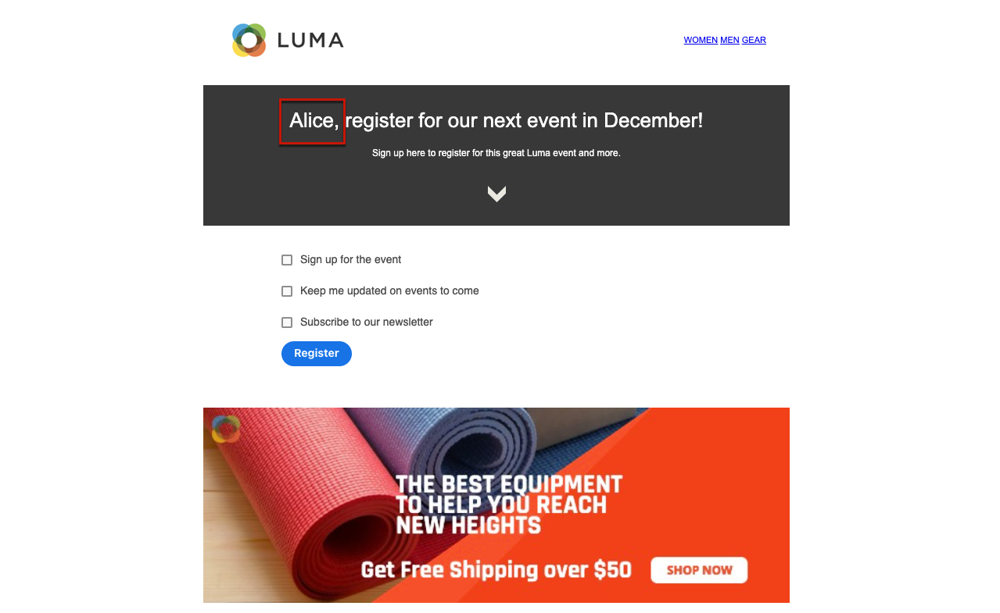

# Creación y publicación de páginas de destino {#create-lp}

Para dirigir a los clientes a una página web definida que desee mostrar cuando hagan clic en un vínculo específico, cree una página de aterrizaje en [!DNL Journey Optimizer], configure la página principal y las subpáginas, pruébela y publíquela.

Los pasos principales para crear páginas de aterrizaje son los siguientes:

## Creación de una página de aterrizaje {#create-landing-page}

>[!CONTEXTUALHELP]
>id="ajo_lp_create"
>title="Definir y configurar la página de aterrizaje"
>abstract="Para crear una página de aterrizaje, debe seleccionar un ajuste preestablecido, configurar la página principal y las subpáginas y, por último, probar la página antes de publicarla."

>[!CONTEXTUALHELP]
>id="ajo_lp_access_management_labels"
>title="Asignar etiquetas a la página de aterrizaje"
>abstract="Para proteger los recursos digitales confidenciales, puede definir autorizaciones para administrar el acceso a los datos en la página de aterrizaje mediante etiquetas."
>additional-url="https://experienceleague.adobe.com/docs/journey-optimizer/using/access-control/object-based-access.html?lang=es" text="Control de acceso de nivel de objeto"

Para crear una página de aterrizaje, debe seleccionar un ajuste preestablecido, configurar la página principal y las subpáginas y, finalmente, probar la página antes de publicarla. Estos pasos se detallan a continuación:

1. Vaya a **[!UICONTROL Administración de contenido]** > **[!UICONTROL Páginas de aterrizaje]** desde el menú de la izquierda.

1. En la lista de páginas de aterrizaje, haga clic en **[!UICONTROL Crear página de aterrizaje]**.

   

1. Añada un título. Puede agregar una descripción si es necesario.

   

1. Para asignar etiquetas de uso de datos principales o personalizadas a la página de aterrizaje, seleccione **[!UICONTROL Administrar acceso]**. [Más información acerca del Control de acceso de nivel de objeto (OLAC)](../administration/object-based-access.md)

1. Seleccione o cree etiquetas Adobe Experience Platform en el campo **[!UICONTROL Etiquetas]** para categorizar la página de aterrizaje y mejorar la búsqueda. [Más información](../start/search-filter-categorize.md#tags)

1. Seleccione un ajuste preestablecido. Aprenda a crear ajustes preestablecidos de página de aterrizaje en [esta sección](../landing-pages/lp-presets.md#lp-create-preset).

   

1. Haga clic en **[!UICONTROL Crear]**.

1. Se muestra la página principal y sus propiedades. Aprenda a configurar la configuración de la página principal [aquí](#configure-primary-page).

   

1. Haga clic en el icono + para añadir una subpágina. Aprenda a configurar la configuración de subpágina [aquí](#configure-subpages).

   

Una vez que hayas configurado y diseñado la [página principal](#configure-primary-page) y las [subpáginas](#configure-subpages), si las hay, puedes [probar](#test-landing-page) y [publicar](#publish-landing-page) tu página de aterrizaje.

>[!CAUTION]
>
>No puede acceder a la página de aterrizaje simplemente copiando y pegando la URL definida en un explorador web, incluso si se ha publicado. En su lugar, puede probarlo con la función de vista previa como se describe en [esta sección](#test-landing-page).

## Configuración de la página principal {#configure-primary-page}

>[!CONTEXTUALHELP]
>id="ajo_lp_primary_page"
>title="Definir la configuración de la página principal"
>abstract="La página principal se muestra inmediatamente a los usuarios después de hacer clic en el vínculo a la página de aterrizaje, por ejemplo, desde un correo electrónico o un sitio web."
<!--
>additional-url="https://experienceleague.adobe.com/docs/journey-optimizer/using/landing-pages/landing-pages-design/design-lp.html" text="Design the landing page content"-->

>[!CONTEXTUALHELP]
>id="ajo_lp_access_settings"
>title="Definir la dirección URL de la página de aterrizaje"
>abstract="En esta sección, defina una dirección URL de página de aterrizaje única. La primera parte de la dirección URL requiere que haya configurado previamente un subdominio de página de aterrizaje como parte del ajuste preestablecido que ha seleccionado."
>additional-url="https://experienceleague.adobe.com/es/docs/journey-optimizer/using/content-management/landing-pages/lp-configuration/lp-subdomains" text="Configurar subdominios de página de aterrizaje"
>additional-url="https://experienceleague.adobe.com/es/docs/journey-optimizer/using/content-management/landing-pages/lp-configuration/lp-presets#lp-create-preset" text="Crear ajustes preestablecidos de la página de aterrizaje"

La página principal es la página que se muestra inmediatamente a los usuarios después de hacer clic en el vínculo a la página de aterrizaje, como desde un correo electrónico o un sitio web.

Para definir la configuración de la página principal, siga los pasos a continuación.

1. Puede cambiar el nombre de la página, que es **[!UICONTROL Página principal]** de forma predeterminada.

1. Edite el contenido de la página con el diseñador de contenido. Aprenda a definir el contenido de la página de aterrizaje [aquí](design-lp.md).

   

1. Defina la dirección URL de la página de aterrizaje. La primera parte de la URL requiere que hayas configurado previamente un subdominio de página de aterrizaje como parte del [ajuste preestablecido](../landing-pages/lp-presets.md#lp-create-preset) que seleccionaste. [Más información](../landing-pages/lp-subdomains.md)

   >[!CAUTION]
   >
   >La dirección URL de la página de aterrizaje debe ser única.
   >
   >No puede acceder a la página de aterrizaje simplemente copiando y pegando esta URL en un explorador web, aunque esté publicada. En su lugar, puede probarlo con la función de vista previa como se describe en [esta sección](#test-landing-page).

   

1. Si desea que la página de aterrizaje precargue los datos del formulario que ya están disponibles, seleccione **[!UICONTROL Rellenar previamente campos de formulario con información de perfil]**.

   

   Cuando esta opción está habilitada, si un perfil ya se ha incluido o excluido de una lista de suscripción, sus opciones se reflejarán al mostrar la página de aterrizaje.

   Por ejemplo, si un perfil se ha suscrito para recibir comunicaciones sobre eventos futuros, la casilla de verificación correspondiente ya estará seleccionada la próxima vez que se muestre la página de aterrizaje a ese perfil.

   

1. Puede definir una fecha de caducidad para la página. En ese caso, debe seleccionar una acción al expirar la página:

   * **[!UICONTROL URL de redireccionamiento]**: escriba la dirección URL de la página a la que se redirigirá a los usuarios cuando la página caduque.
   * **[!UICONTROL Página personalizada]**: [Configure una subpágina](#configure-subpages) y selecciónela en la lista desplegable que se muestra.
   * **[!UICONTROL Error del explorador]**: escriba el texto de error que se mostrará en lugar de la página.

   

<!--1. In the **[!UICONTROL Additional data]** section, define one or more keys and their corresponding parameter values. You will be able to leverage these keys in the content of your primary page and subpages using the [personalization editor](../personalization/personalization-build-expressions.md). Learn more in [this section](lp-content.md#use-form-component#use-additional-data).

    -->

1. Si seleccionó una o más listas de suscripción al [diseñar la página principal](design-lp.md), se mostrarán en la sección **[!UICONTROL Lista de suscripción]**.

   

1. Desde la página de aterrizaje, puede [crear directamente un recorrido](../building-journeys/journey-gs.md#jo-build) que enviará un mensaje de confirmación a los usuarios cuando envíen el formulario. Aprenda a crear un recorrido de este tipo al final de este [caso de uso](lp-use-cases.md#subscription-to-a-service).

   

   Haga clic en **[!UICONTROL Crear recorrido]** para que se le redirija a la lista **[!UICONTROL Administración de Recorrido]** > **[!UICONTROL Recorridos]**.

## Configuración de subpáginas {#configure-subpages}

>[!CONTEXTUALHELP]
>id="ajo_lp_subpage"
>title="Definir la configuración de la subpágina"
>abstract="Se pueden añadir hasta dos subpáginas. Por ejemplo, puede crear una página de agradecimiento que se mostrará una vez que los usuarios envíen el formulario, y puede definir una página de error a la que se llamará si se produce un problema con la página de aterrizaje."
>additional-url="https://experienceleague.adobe.com/es/docs/journey-optimizer/using/content-management/landing-pages/landing-pages-design/design-lp" text="Diseñar el contenido de la página de aterrizaje"

>[!CONTEXTUALHELP]
>id="ajo_lp_access_settings-subpage"
>title="Definir la dirección URL de la página de aterrizaje"
>abstract="En esta sección, defina una dirección URL de página de aterrizaje única. La primera parte de la dirección URL requiere que haya configurado previamente un subdominio de página de aterrizaje como parte del ajuste preestablecido que ha seleccionado."
>additional-url="https://experienceleague.adobe.com/es/docs/journey-optimizer/using/content-management/landing-pages/lp-configuration/lp-subdomains" text="Configurar subdominios de página de aterrizaje"
>additional-url="https://experienceleague.adobe.com/es/docs/journey-optimizer/using/content-management/landing-pages/lp-configuration/lp-presets#lp-create-preset" text="Crear ajustes preestablecidos de la página de aterrizaje"

Se pueden añadir hasta dos subpáginas. Por ejemplo, puede crear una página de agradecimiento que se mostrará una vez que los usuarios envíen el formulario, y puede definir una página de error a la que se llamará si se produce un problema con la página de aterrizaje.

Para definir la configuración de la subpágina, siga los pasos a continuación.

1. Puede cambiar el nombre de página, que es **[!UICONTROL Subpágina 1]** de forma predeterminada.

1. Edite el contenido de la página con el diseñador de contenido. Aprenda a definir el contenido de la página de aterrizaje [aquí](design-lp.md).

   >[!NOTE]
   >
   >Puede insertar un vínculo a la página principal desde cualquier subpágina de la misma página de aterrizaje. Por ejemplo, para redirigir a los usuarios que cometieron un error y desean suscribirse de nuevo, puede agregar un vínculo de la subpágina de confirmación a la página principal de suscripción. Aprenda a insertar vínculos en [esta sección](../email/message-tracking.md#insert-links).

1. Defina la dirección URL de la página de aterrizaje. La primera parte de la URL requiere que haya configurado previamente un subdominio de página de aterrizaje. [Más información](../landing-pages/lp-subdomains.md)

   >[!CAUTION]
   >
   >La dirección URL de la página de aterrizaje debe ser única.
   >
   >No puede acceder a la subpágina simplemente copiando y pegando esta URL en un explorador web, aunque esté publicada. En su lugar, puede probarlo con la función de vista previa como se describe en [esta sección](#test-landing-page).

## Prueba de la página de aterrizaje {#test-landing-page}

>[!CONTEXTUALHELP]
>id="ac_preview_lp_profiles"
>title="Previsualizar y probar la página de aterrizaje"
>abstract="Una vez que haya definido la configuración y el contenido de la página de aterrizaje, puede utilizar perfiles de prueba para previsualizarlos."
>additional-url="https://experienceleague.adobe.com/docs/journey-optimizer/using/audiences-profiles-identities/profiles/creating-test-profiles.html?lang=es" text="Seleccionar perfiles de prueba"

Una vez definida la configuración y el contenido de la página de aterrizaje, puede utilizar perfiles de prueba para previsualizarlo. Si ha insertado [contenido personalizado](../personalization/personalize.md), podrá comprobar cómo se muestra este contenido en la página de aterrizaje mediante los datos del perfil de prueba.

>[!CAUTION]
>
>Para poder probar las páginas de aterrizaje, debe tener el permiso **[!UICONTROL Publicar mensajes]**.
>
>Debe tener perfiles de prueba disponibles para poder previsualizar los mensajes y enviar pruebas. Aprenda a [crear perfiles de prueba](../audience/creating-test-profiles.md).

1. En la interfaz de la página de aterrizaje, haga clic en el botón **[!UICONTROL Simular contenido]** para acceder a la selección del perfil de prueba.

   

   >[!NOTE]
   >
   >También se puede acceder al botón **[!UICONTROL Simular contenido]** desde el diseñador de contenido.

1. En la pantalla **[!UICONTROL Simular]**, seleccione uno o más perfiles de prueba.

   

   Los pasos para seleccionar perfiles de prueba son los mismos que al probar un mensaje. Se detallan en la sección [Administración de contenido](../content-management/test-profiles.md).

1. Seleccione **[!UICONTROL Abrir vista previa]** para probar la página de aterrizaje.

   

1. La vista previa de la página de aterrizaje se abrirá en una nueva pestaña. Los elementos personalizados se sustituyen por los datos de perfil de prueba seleccionados.

   <!---->

1. Seleccione otros perfiles de prueba para previsualizar el procesamiento de cada variante de la página de aterrizaje.

## Comprobación de alertas {#check-alerts}

Mientras crea la página de aterrizaje, las alertas le avisan cuando debe realizar acciones importantes antes de publicar.

Las alertas se muestran en la parte superior derecha de la pantalla, como se muestra a continuación:

>[!NOTE]
>
>Si no ve este botón, no se ha detectado ninguna alerta.

Pueden producirse dos tipos de alertas:

* **Advertencias** se refieren a recomendaciones y prácticas recomendadas. <!--For example, a message will display if -->

* **Los errores** le impiden publicar la página de aterrizaje siempre y cuando no se resuelvan. Por ejemplo, recibirá una advertencia si falta la dirección URL de la página principal.

<!--All possible warnings and errors are detailed [below](#alerts-and-warnings).-->

>[!CAUTION]
>
> Debe resolver todas las alertas de **error** antes de la publicación.

<!--The settings and elements checked by the system are listed below. You will also find information on how to adapt your configuration to resolve the corresponding issues.

**Warnings**:

* 

**Errors**:

-->

## Publicar la página de aterrizaje {#publish-landing-page}

>[!CAUTION]
>
>Para publicar páginas de aterrizaje, los usuarios deben tener el permiso **[!UICONTROL Publicar mensajes]**.

Una vez que la página de aterrizaje esté lista, puede publicarla para que esté disponible para usarla en un mensaje.

>[!CAUTION]
>
>Antes de publicar, compruebe y resuelva las alertas. [Más información](#check-alerts)

Una vez publicada la página de aterrizaje, se agregará a la lista de páginas de aterrizaje con el estado **[!UICONTROL Publicado]**.

Ahora está activo y listo para usarse en un mensaje de [!DNL Journey Optimizer] que se enviará mediante un [recorrido](../building-journeys/journey.md).

>[!NOTE]
>
>No puede acceder a la página de aterrizaje simplemente copiando y pegando en un explorador web la URL definida al [crear la página](#create-landing-page), aunque esté publicada. En su lugar, puede probarlo con la función de vista previa como se describe en [esta sección](#test-landing-page).

Puede monitorizar el impacto de su página de aterrizaje a través de informes específicos. [Más información](../reports/lp-report-live.md)
